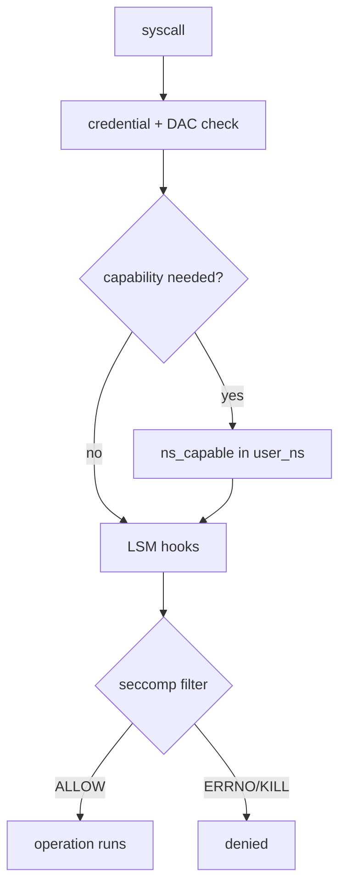

# Linux Security & Confinement

> **Goal:** understand Linux security as a stack of kernel decisions, not as a
> checklist. Credentials answer "who are you?", DAC answers "what does the
> inode allow?", capabilities split root, namespaces change the view, cgroups
> meter resources, seccomp cuts syscalls, and LSMs inject policy into security
> hooks.

## The security path

Every sensitive operation eventually reaches a kernel decision point. There is
no single Linux security mechanism — there is a pipeline, and each stage can
say no:

```text
process
  ↓ syscall
kernel object lookup
  ↓
credential checks       (struct cred: uid/gid/caps)
  ↓
DAC permissions         (inode mode bits, ACLs)
  ↓
capability checks       (ns_capable, per-user-namespace)
  ↓
LSM hooks               (SELinux/AppArmor/Landlock/BPF)
  ↓
operation allowed or denied
```

For `openat("/etc/shadow", O_RDONLY)`, the VFS resolves the path component by
component, checks `MAY_EXEC` on each directory and `MAY_READ` on the final
inode, evaluates capabilities such as `CAP_DAC_OVERRIDE`, then calls LSM hooks
that SELinux, AppArmor, Landlock, BPF LSM, or another module may implement.
The syscall boundary itself — how a userspace `open` becomes kernel work — is
covered in [Kernel, User Space & Syscalls](#/kernel-vs-userspace).

For `mount()`, DAC is barely the point. The kernel asks whether the caller has
`CAP_SYS_ADMIN` in the relevant [user namespace](#/namespaces), whether the
filesystem type is allowed there, whether LSM policy permits it, and whether
the operation crosses namespace boundaries in a dangerous way.

Two different questions, two different sets of gates. Learning Linux security
is mostly learning *which* gate answers *which* question.

## Credentials: identity as a kernel object

A task's security identity lives in `struct cred` (`include/linux/cred.h`).
Every `struct task_struct` points at two of them: `real_cred` (the "objective"
identity others use when acting *on* this task, e.g. sending a signal) and
`cred` (the "subjective" identity used when this task acts on the world). They
are usually the same object; they diverge only during specific privileged
transitions.

The fields that matter:

```text
struct cred
├── uid, gid                  real identity
├── euid, egid                effective identity used for most access checks
├── suid, sgid                saved IDs for privilege transitions
├── fsuid, fsgid              filesystem permission identity (usually == euid)
├── cap_permitted             caps the task MAY make effective
├── cap_effective             caps currently active for checks
├── cap_inheritable           caps that may survive exec via file caps
├── cap_bset                  bounding set: a ceiling caps can never exceed
├── cap_ambient               caps preserved across exec of non-setuid binaries
├── user_ns                   user namespace where these caps are interpreted
├── group_info                supplementary groups
└── security                  LSM-specific blob (SELinux label, etc.)
```

Each capability field is a `kernel_cap_t` — a 64-bit mask, one bit per
capability (there are 41 defined as of 6.12, up to `CAP_CHECKPOINT_RESTORE`).

The important subtlety: **credentials are effectively immutable once
committed**. A live `cred` referenced by a running task is never edited in
place. Instead the kernel calls
[prepare_creds()](https://elixir.bootlin.com/linux/v6.12/C/ident/prepare_creds)
to get a private, writable copy, mutates the copy, then publishes it with
[commit_creds()](https://elixir.bootlin.com/linux/v6.12/C/ident/commit_creds),
which swaps the `task_struct` pointer under RCU.

That copy-and-replace discipline (the same RCU idea from
[Kernel Synchronization](#/kernel-sync)) means another CPU reading credentials
never observes a half-mutated identity — it sees either the whole old cred or
the whole new one. Kernel code that needs to act briefly as another identity
uses [override_creds()](https://elixir.bootlin.com/linux/v6.12/C/ident/override_creds)
/ `revert_creds()` around the critical section.

Inspect your current credential surface:

```bash
grep -E 'Uid|Gid|Groups|Cap|NoNewPrivs|Seccomp' /proc/self/status
```

Those hex capability masks are not decoration. `CapEff` is `cap_effective`;
`CapBnd` is the bounding set. Decode them:

```bash
capsh --decode=$(grep CapEff /proc/self/status | awk '{print $2}')
```

The masks are often the difference between "root can do it" and "this process
is root-looking but defanged".

## DAC: classic Unix permissions

Discretionary Access Control is the familiar layer, and in the kernel it is
mostly one function. Every inode carries `i_uid`, `i_gid`, and `i_mode` (type
bits plus the 12 permission bits: `rwxrwxrwx` plus setuid/setgid/sticky).
Access checks funnel through
[inode_permission()](https://elixir.bootlin.com/linux/v6.12/C/ident/inode_permission),
which after a few early checks calls
[generic_permission()](https://elixir.bootlin.com/linux/v6.12/C/ident/generic_permission):

1. If `fsuid` matches the inode owner, use the owner triad (`rwx`).
2. Else if a POSIX ACL exists, consult it.
3. Else if `fsgid` (or a supplementary group) matches, use the group triad.
4. Else use the "other" triad.
5. If the mode bits deny, fall back to capabilities: `CAP_DAC_OVERRIDE`
   bypasses the check entirely, `CAP_DAC_READ_SEARCH` grants read/execute.

For directories the execute bit means "may traverse" (`MAY_EXEC` during path
walk), not "may run". Write on a directory means "may create/delete names
inside it"; deleting a file is a permission on the *parent directory entry*,
not on the file's contents. This explains old-looking but still lethal
details:

```bash
chmod 1777 /tmp        # the leading 1 is the sticky bit
```

The sticky bit on a world-writable directory means many users may create files
there, but only the owner of a file, the directory owner, or a `CAP_FOWNER`
holder may remove or rename that entry. Without it, `/tmp` would be a deletion
party. See [Files, Filesystems & the VFS](#/filesystems) for how the inode and
dentry cache back these checks.

DAC is necessary but not sufficient for modern confinement. If a service is
compromised and runs as a UID that can read its own secrets, DAC says "yes".
LSMs and seccomp exist because "same UID" is too coarse a boundary.

## Capabilities: root split into bits

Historically UID 0 bypassed everything. Linux capabilities (since 2.2) split
that monolithic power into ~40 independent privileges checked at their
specific use sites:

| Capability | Allows |
|---|---|
| `CAP_NET_BIND_SERVICE` | bind low ports (< 1024) like 80/443 |
| `CAP_NET_ADMIN` | configure interfaces, routing, firewalling |
| `CAP_SYS_ADMIN` | huge bucket: mounts, many namespaces, admin operations |
| `CAP_SYS_PTRACE` | inspect/control other processes ([ptrace](#/observability)) |
| `CAP_DAC_OVERRIDE` | bypass file permission checks |
| `CAP_SYS_MODULE` | load/unload kernel modules ([Devices & Modules](#/devices-modules)) |
| `CAP_BPF` | privileged BPF operations (split out from `CAP_SYS_ADMIN` in 5.8) |
| `CAP_PERFMON` | privileged performance monitoring ([perf](#/perf-methodology)) |
| `CAP_CHECKPOINT_RESTORE` | checkpoint/restore powers (added 5.9) |

The five capability sets encode a small state machine per task:

```text
Permitted    the superset the task MAY make effective
Effective    what is active RIGHT NOW for kernel checks
Inheritable   what may pass to a new program via file caps
Bounding      ceiling; caps outside it can never be gained, even via setuid-root
Ambient       caps preserved across exec for NON-setuid programs (since 4.3)
```

Ambient capabilities closed a real gap: before 4.3, a non-root service manager
could not hand a specific capability to a plain (non-setuid, no-file-caps)
binary without making it root. Now systemd's `AmbientCapabilities=` does
exactly that.

Container runtimes lean hard on the **bounding set**: start root-like inside
the container, drop dangerous host-level capabilities from `cap_bset` so they
can never be regained, then exec the workload. See
[Docker, containerd, runc](#/container-runtimes) for where runc writes this.

The uncomfortable truth is `CAP_SYS_ADMIN`. It gates so many unrelated
operations — mounts, `pivot_root`, most namespace creation, `setns`, various
`ioctl`s — that people call it "the new root". A container with
`CAP_SYS_ADMIN` plus writable sensitive mounts is often no longer meaningfully
confined.

## setuid, file capabilities, and `no_new_privs`

Privilege can *enter* a process through executable metadata at `execve()`
time. The setuid bit is the blunt instrument:

```bash
ls -l /usr/bin/passwd
# -rwsr-xr-x 1 root root ... /usr/bin/passwd     (the 's' is setuid)
```

The setuid bit makes the executed program run with the file owner's effective
UID, which is how `passwd` edits the shadow database while invoked by an
ordinary user. In the kernel, [bprm_fill_uid()](https://elixir.bootlin.com/linux/v6.12/C/ident/bprm_fill_uid)
computes the new `euid`/`egid` during exec setup.

File capabilities are the surgical alternative — stored in the
`security.capability` extended attribute, not a mode bit:

```bash
getcap /usr/bin/ping
# /usr/bin/ping cap_net_raw=ep
```

Instead of making `ping` root, grant only raw-socket power (`cap_net_raw`),
permitted and effective (`=ep`). [cap_bprm_creds_from_file()](https://elixir.bootlin.com/linux/v6.12/C/ident/cap_bprm_creds_from_file)
in `security/commoncap.c` turns that xattr into the new cred's capability sets.

`no_new_privs` is the brake on all of this:

```bash
grep NoNewPrivs /proc/self/status
prctl -n            # or set it: PR_SET_NO_NEW_PRIVS
```

Once set (via `prctl(PR_SET_NO_NEW_PRIVS)`), it is inherited across `fork` and
`exec` and can never be cleared. `execve` then refuses to grant new privilege
through setuid or file capabilities — a setuid-root binary runs with your
UID, not root's. Seccomp filters *require* `no_new_privs` for unprivileged
installation, because otherwise a process could install a restrictive filter,
exec a privileged setuid binary, and trick that trusted binary into running
under hostile syscall constraints.

## Namespaces: isolate the meaning of global names

Namespaces do not primarily restrict resource usage — they change what global
names *mean*. Full mechanics are in [Namespaces](#/namespaces); the security
summary:

| Namespace | Isolates |
|---|---|
| Mount | filesystem mount tree |
| PID | process ID space |
| Network | interfaces, routes, ports, conntrack view |
| UTS | hostname / domainname |
| IPC | System V IPC and POSIX message queues |
| Cgroup | cgroup path visibility |
| Time | offsets for monotonic/boottime clocks (since 5.6) |
| User | UID/GID and **capability** interpretation |

The user namespace is the conceptual hinge. A task's `struct cred` carries a
`user_ns` pointer, and **capabilities are always evaluated relative to a user
namespace**. [ns_capable()](https://elixir.bootlin.com/linux/v6.12/C/ident/ns_capable)
asks "does this task hold this capability *in this namespace*?" A process can
be UID 0 with `CAP_SYS_ADMIN` inside its own user namespace and hold none of
that against the host:

```text
inside userns:  uid 0    (root, full caps in this userns)
UID map:        0 → 100000  (uid_map / gid_map)
on the host:    uid 100000  (ordinary unprivileged user, zero host caps)
```

That mapping (`/proc/PID/uid_map`) is what makes rootless containers possible:
`CAP_SYS_ADMIN` inside the namespace lets the process create nested
namespaces, mount certain filesystems, etc., but every host-level check runs
[cap_capable()](https://elixir.bootlin.com/linux/v6.12/C/ident/cap_capable),
which walks the `user_ns` chain and only grants the capability if the target
object lives in a namespace the task actually owns.

But user namespaces are not a magic sandbox. They expose complex kernel code
paths — filesystem mounting, networking setup — to unprivileged users who
could not reach them before. Historically this has been a rich source of local
privilege-escalation CVEs, which is why some distros gate user-namespace
creation behind a sysctl (`kernel.unprivileged_userns_clone` on Debian/Ubuntu)
or, since 6.1, an optional `CAP_SYS_ADMIN` requirement.

## cgroups: security by resource containment

cgroups are not access control, but they belong in a security discussion
because **resource exhaustion is an attack**. Full details in
[Control Groups (cgroup v2)](#/cgroups); the hardening-relevant controllers:

| Controller | Security angle |
|---|---|
| `pids.max` | fork-bomb containment (checked at `fork()` time) |
| `memory.max` | memory-exhaustion boundary, cgroup-local OOM kill |
| `cpu.max` | CPU-abuse cap |
| `io.max` | disk-pressure containment |
| BPF device policy | which device nodes a group may open |

A production sandbox without `pids.max` is incomplete. A process that cannot
escape the filesystem but can spawn 500,000 threads can still take down service
availability — and the `cgroup.kill` file (since 5.14) is the only race-free
way to reap a subtree that forks faster than you can signal it.

**Container link:** cgroup v2 is the default on every modern distro, and a
container gets both a cgroup *namespace* (to hide the host tree) and cgroup
*limits* (to enforce ceilings). Namespaces hide, cgroups enforce.

## seccomp: shrink the syscall ABI

seccomp-BPF filters system calls. A process installs a classic-BPF program via
`prctl(PR_SET_SECCOMP, SECCOMP_MODE_FILTER, ...)` or the `seccomp()` syscall;
every future syscall is then screened. The program sees a
`struct seccomp_data` — syscall number, architecture, instruction pointer, and
the six register arguments — and returns an action:

```text
SECCOMP_RET_KILL_PROCESS   kill the whole thread group (since 4.14)
SECCOMP_RET_KILL_THREAD    kill just this thread (the classic KILL)
SECCOMP_RET_TRAP           deliver SIGSYS synchronously
SECCOMP_RET_ERRNO          fail the syscall with a chosen errno, don't run it
SECCOMP_RET_USER_NOTIF     hand the syscall to a userspace supervisor (5.0)
SECCOMP_RET_TRACE          defer to an attached ptracer
SECCOMP_RET_LOG            allow, but log
SECCOMP_RET_ALLOW          run the syscall normally
```

Filters stack: install several and every one runs on every syscall; the
**most restrictive** action wins (`KILL` > `TRAP` > `ERRNO` > ... > `ALLOW`),
so a child can only ever narrow, never widen, what its parents allowed. That
monotonicity is why seccomp is safe to inherit across exec.

```text
workload
  ↓ syscall nr + args  →  struct seccomp_data
seccomp filters (run in order, worst action wins)
  ├── ALLOW:      continue into the syscall implementation
  ├── ERRNO:      return e.g. -EPERM, syscall never executes
  ├── USER_NOTIF: block; supervisor in another process decides
  └── KILL:       SIGSYS, task/thread-group dies
```

Docker's default profile blocks ~40 dangerous or rarely-needed syscalls
(`mount`, `reboot`, `kexec_load`, `bpf`, adding kernel modules, etc.) while
allowing the ~300 a normal program needs. High-security sandboxes go further:
trace the workload's actual syscall set (`strace -qcf`, or the seccomp-notify
tooling), generate an allowlist, deny everything else.

`SECCOMP_RET_USER_NOTIF` deserves its own note: instead of allowing or
denying, seccomp can *suspend* the syscall and hand a file descriptor to a
supervisor, which inspects the arguments and either performs the action on the
target's behalf or injects a return value. This is how modern runtimes emulate
otherwise-forbidden syscalls (e.g. a controlled `mount`) without granting the
real capability — a userspace policy engine bolted onto the syscall boundary.

The deep point: seccomp restricts the **kernel API surface**, not filesystem
paths or network destinations. It answers "may this process call `mount()`?"
not "may it mount *this particular directory*?" For object-aware policy,
combine it with LSMs and namespaces.

## LSM: policy at kernel security hooks

The Linux Security Module framework places ~250 hooks at security-sensitive
points throughout the kernel. Wherever the VFS, networking, or IPC code is
about to do something that policy might care about, it calls a hook:

```text
security_inode_permission()     about to check inode access
security_file_open()            about to return an open fd
security_bprm_check()           about to exec a new program image
security_task_kill()            about to deliver a signal to a task
security_socket_connect()       about to connect a socket
security_ptrace_access_check()  about to let one task ptrace another
security_mmap_file()            about to map a file into memory
```

Each `security_*()` wrapper (in `security/security.c`) invokes the registered
modules. As of 6.12 the dispatch uses **static calls** rather than the old
`security_hook_heads` linked lists — a measurable win, since these hooks sit on
hot paths like every `open`. A hook that no LSM registers compiles down to
almost nothing.

Different LSMs implement different policy models:

| LSM | Model |
|---|---|
| SELinux | label-based mandatory access control (type enforcement) |
| AppArmor | pathname/profile-oriented confinement |
| Smack | label-based MAC, simpler model |
| Landlock | unprivileged, process-managed sandboxing (see below) |
| Yama | extra ptrace restrictions |
| BPF LSM | policy hooks written as BPF programs ([eBPF Internals](#/ebpf-internals)) |
| lockdown, integrity (IMA) | kernel-integrity LSMs |

Modern kernels **stack** LSMs: the "minor" modules (capabilities, Yama,
lockdown, BPF LSM, Landlock) always compose, and since 5.1 you can even run
one "major" label-based module alongside them, selected at boot with
`lsm=...` on the kernel command line.

DAC asks "does this UID/mode combination allow the operation?" LSMs can ask
"*even if DAC allows it*, does this domain/profile/label/policy allow it?" That
difference is what matters after a compromise. A web server needs read access
to its site files; if exploited, DAC still allows those reads. A tight LSM
profile allows reads under `/srv/www` but denies `/home`, `/etc/ssh`, and
`/var/lib/other-service` — even though Unix permissions would have permitted
them. IMA and lockdown extend into
[Trusted Computing](#/trusted-computing) territory: proving *what ran*, not
just gating access.

## Landlock: unprivileged self-confinement

Landlock (stable since 5.13, filesystem + network rules maturing through 6.x)
matters because it changes *who* can create a sandbox. Traditional MAC is
administrator-defined; Landlock lets an **unprivileged** process restrict
itself and its future children — no root, no policy file, no `CAP_MAC_ADMIN`.

The model is additive restriction over a `struct landlock_ruleset`:

```text
process starts with normal rights
  ↓  landlock_create_ruleset()   define which action types are handled
  ↓  landlock_add_rule()         allow specific actions on specific paths/ports
  ↓  landlock_restrict_self()    enforce; needs PR_SET_NO_NEW_PRIVS first
future actions are limited even where DAC would allow them, and every
child inherits the restriction (it can only add more)
```

A build tool, plugin runner, editor-extension host, or test harness can say:
"from now on this child may read the project tree and write only the build
directory, and open no network sockets." That is a strong primitive precisely
because the sandbox is applied by the program that understands intent, not by
global admin policy. The three syscalls are unprivileged; the only precondition
is `no_new_privs`, for the same reason seccomp needs it.

## Container confinement: what actually protects the host

A container is not protected by one feature. A serious runtime composes
several — see [What a Container Actually Is](#/containers-overview) and
[Build a Container by Hand](#/build-a-container):

```text
namespaces       isolated views
cgroups          resource ceilings and accounting
cap drop         reduced root power (shrink cap_bset)
seccomp          reduced syscall surface
LSM profile      object-aware policy (SELinux/AppArmor)
readonly mounts  fewer writable host-adjacent paths
userns           root remapped away from host root
no_new_privs     no privilege gain across exec
```

Common dangerous shapes:

| Configuration | Why it is dangerous |
|---|---|
| `--privileged` | disables seccomp, drops no caps, exposes devices — near-hostroot |
| host PID namespace | process visibility/control over the host expands sharply |
| host network namespace | firewall, sniffing, and bind surface change |
| writable Docker socket | container creation = host root, trivially |
| broad hostPath / bind mounts | path escape becomes host compromise |
| `CAP_SYS_ADMIN` | access to a vast admin syscall surface |
| no seccomp profile | full kernel syscall attack surface |

"Root in a container" is safe only to the extent that root's kernel powers
were removed (`cap_bset`), mapped away (userns), or gated (seccomp/LSM). The
UID string is not the security boundary.

## Kernel lockdown and the trusted boot chain

On systems using UEFI Secure Boot or stricter integrity modes, Linux may run
with the **lockdown** LSM enabled in `integrity` or `confidentiality` mode.
Lockdown restricts operations that let even root modify or inspect kernel
memory in ways that would break the trust chain: loading unsigned modules,
`/dev/mem` and `/dev/kmem` access, `kexec` of unsigned images, writing to MSRs,
certain `perf`/`kprobe` and BPF features, and hibernation to unencrypted swap.

This is a different *kind* of boundary: not "protect users from each other" but
"protect kernel integrity from a compromised root account". It is the runtime
half of the story [Trusted Computing](#/trusted-computing) tells about Secure
Boot, TPM measurement, and IMA — especially relevant on laptops, regulated
fleets, and systems relying on measured boot or remote attestation.

## Hardening as a design discipline

Useful hardening is not a pile of flags. It is reducing authority along every
dimension at once:

```text
identity      run as a dedicated UID, not shared service users
filesystem    readonly root, narrow writable dirs, no sensitive mounts
syscalls      seccomp allowlist or a strong default profile
kernel caps   drop all, add back only the exact capabilities needed
resources     pids/memory/cpu/io boundaries (cgroups)
network       explicit egress/ingress policy
LSM           profile object access (SELinux/AppArmor/Landlock)
exec          no_new_privs, minimal PATH, controlled interpreters
observability log denials and pressure BEFORE outages
```

systemd exposes most of this declaratively — `User=`, `ProtectSystem=strict`,
`SystemCallFilter=`, `CapabilityBoundingSet=`, `MemoryMax=`,
`NoNewPrivileges=yes` — so a hardened unit file is often more effective and
more auditable than a bespoke wrapper.

The best signal that confinement is real: when the workload is compromised, the
attacker keeps hitting different walls. They cannot see host processes, cannot
mount, cannot ptrace, cannot load BPF, cannot create unlimited children, cannot
read arbitrary host paths, cannot call surprising syscalls, and cannot gain
privilege through exec.



## Follow the code (kernel v6.12)

Two traces: how a file open is gated, and how seccomp screens a syscall.

### Trace 1: `openat("/etc/shadow", O_RDONLY)` as a non-root user

1. The syscall lands in
   [do_sys_openat2()](https://elixir.bootlin.com/linux/v6.12/C/ident/do_sys_openat2)
   → [do_filp_open()](https://elixir.bootlin.com/linux/v6.12/C/ident/do_filp_open)
   → `path_openat()`, the VFS path-walk-and-open engine.
2. The walk resolves the path one component at a time. To descend through each
   directory (`/`, `/etc`) it needs `MAY_EXEC`, checked via
   [inode_permission()](https://elixir.bootlin.com/linux/v6.12/C/ident/inode_permission)
   → [generic_permission()](https://elixir.bootlin.com/linux/v6.12/C/ident/generic_permission).
   generic_permission compares `fsuid`/`fsgid` against the inode's `i_uid` /
   `i_gid` and applies the owner/group/other triad of `i_mode`.
3. If the mode bits deny, the kernel does *not* stop — it asks whether a
   capability rescues the access.
   [capable_wrt_inode_uidgid()](https://elixir.bootlin.com/linux/v6.12/C/ident/capable_wrt_inode_uidgid)
   checks `CAP_DAC_OVERRIDE` (and `CAP_DAC_READ_SEARCH` for read/traverse) in
   the inode's user namespace via `ns_capable`. A normal user holds neither, so
   the deny stands.
4. Even when DAC would allow it, `inode_permission()` calls the LSM hook
   [security_inode_permission()](https://elixir.bootlin.com/linux/v6.12/C/ident/security_inode_permission).
   SELinux checks the process domain against the file's type; AppArmor matches
   the path against the profile; Landlock consults the task's ruleset. Any one
   can return `-EACCES`.
5. If the walk reaches the final inode,
   [may_open()](https://elixir.bootlin.com/linux/v6.12/C/ident/may_open)
   re-checks access for the requested mode (`MAY_READ` here) and then
   [security_file_open()](https://elixir.bootlin.com/linux/v6.12/C/ident/security_file_open)
   gets the last word before a `struct file` is handed back.

So a single `open` passes through DAC, capabilities, *and* two distinct LSM
hooks — and for `/etc/shadow` (mode `0640 root:shadow`) an ordinary user is
stopped at step 2/3 by the mode bits, with the LSM as a second independent
line of defense.

### Trace 2: seccomp screens a syscall

1. On x86-64, `do_syscall_64()` checks the thread's work flags on entry. If
   `TIF_SECCOMP` is set, the entry path calls
   [__secure_computing()](https://elixir.bootlin.com/linux/v6.12/C/ident/__secure_computing)
   *before* the syscall's real handler runs.
2. __secure_computing populates a `struct seccomp_data` (syscall nr, arch, IP,
   6 args) and calls
   [seccomp_run_filters()](https://elixir.bootlin.com/linux/v6.12/C/ident/seccomp_run_filters),
   which walks the task's `struct seccomp_filter` chain (`task_struct->seccomp.filter`),
   runs each classic-BPF program over the seccomp_data, and keeps the **lowest**
   (most restrictive) return action.
3. The action is dispatched:
   - `SECCOMP_RET_ALLOW` — return and let the syscall proceed.
   - `SECCOMP_RET_ERRNO` — skip the syscall, set the return register to the
     encoded `-errno` (e.g. `-EPERM`); userspace sees a failed call it never
     actually made.
   - `SECCOMP_RET_USER_NOTIF` — the task blocks; the pending event is queued on
     the notify fd for a supervisor to read, decide, and respond.
   - `SECCOMP_RET_KILL_THREAD` / `KILL_PROCESS` — a `SIGSYS` is forced and the
     thread (or whole thread group) dies; the offending syscall number shows in
     the coredump's `si_syscall`.
4. Because filters can only ever be *added* and the worst action wins, a
   process can tighten its own ABI but never loosen it — and combined with
   `no_new_privs`, exec cannot escape the filter either.

## Check your understanding

1. A process is UID 0 inside a user namespace. Which namespace decides whether
   its `CAP_SYS_ADMIN` is meaningful for mounting a filesystem?

<details><summary>Show answer</summary>

The user namespace that *owns the target object* (here, the mount namespace /
filesystem instance). `ns_capable()` → `cap_capable()` walks the `user_ns`
chain and only grants the capability if the object lives in a namespace the
task actually holds power over. Root in a nested userns can mount things
*created within that userns*, but not host filesystems.

</details>

2. Which layer blocks an entire syscall like `mount()`, and which layer blocks
   opening one specific path even when Unix permissions allow it?

<details><summary>Show answer</summary>

seccomp blocks the syscall as a whole (it sees the syscall number, not the
resolved object). An LSM (SELinux/AppArmor/Landlock) blocks a specific path via
hooks like `security_inode_permission()` / `security_file_open()`, which run
even after DAC says yes.

</details>

3. Why can't a live `struct cred` be edited in place, and what does the kernel
   do instead?

<details><summary>Show answer</summary>

Another CPU could be reading it concurrently and would observe a half-mutated
identity. The kernel calls `prepare_creds()` for a private writable copy,
mutates that, then `commit_creds()` swaps the `task_struct` pointer under RCU —
readers see either the whole old cred or the whole new one, never a mix.

</details>

4. Why does installing an unprivileged seccomp filter require `no_new_privs`?

<details><summary>Show answer</summary>

Without it, a process could install a hostile filter, then `execve` a
setuid-root binary and run that trusted program under crippling syscall
constraints — a privilege-escalation vector. `no_new_privs` guarantees exec
grants no new privilege, so the filter can only ever restrict the *same*
identity.

</details>

5. What does `cap_bset` (the bounding set) guarantee that dropping effective
   capabilities does not?

<details><summary>Show answer</summary>

The bounding set is a permanent ceiling: a capability removed from `cap_bset`
can never be regained by that task or its descendants — not through
setuid-root exec, not through file capabilities. Dropping only the effective
set is reversible if the capability is still permitted or inheritable.

</details>

6. After a web server is exploited, DAC still lets it read its own site files.
   How does an LSM profile add protection DAC cannot?

<details><summary>Show answer</summary>

LSM hooks fire *after* DAC and enforce object-scoped policy independent of
UID/mode. A profile can allow reads under `/srv/www` while denying `/home`,
`/etc/ssh`, and other services' data — even though the process's UID would pass
the Unix permission check on those paths.

</details>

7. What makes Landlock different from SELinux or AppArmor as a confinement
   tool?

<details><summary>Show answer</summary>

Landlock is *unprivileged* and *self-applied*: any process (given
`no_new_privs`) can build a ruleset and call `landlock_restrict_self()` to
sandbox itself and its children, with no root, no admin policy file, and no
`CAP_MAC_ADMIN`. SELinux/AppArmor policy is defined by the administrator and
loaded system-wide.

</details>

## Sources & further reading

- [capabilities(7)](https://man7.org/linux/man-pages/man7/capabilities.7.html) — the definitive list of capabilities and the five sets, including ambient rules.
- [credentials(7)](https://man7.org/linux/man-pages/man7/credentials.7.html) — UIDs/GIDs, saved/fs IDs, and the transitions between them.
- [seccomp(2)](https://man7.org/linux/man-pages/man2/seccomp.2.html) and [seccomp_unotify(2)](https://man7.org/linux/man-pages/man2/seccomp_unotify.2.html) — filter modes, return actions, and the user-notification protocol.
- [user_namespaces(7)](https://man7.org/linux/man-pages/man7/user_namespaces.7.html) — UID/GID maps and how capabilities are scoped to a namespace.
- [Landlock — kernel userspace documentation](https://docs.kernel.org/userspace-api/landlock.html) — the ruleset lifecycle and worked examples.
- [Linux Security Modules — kernel documentation](https://docs.kernel.org/admin-guide/LSM/index.html) — the hook framework, stacking, and per-module notes.
- [Kernel lockdown documentation](https://man7.org/linux/man-pages/man7/kernel_lockdown.7.html) — what `integrity` vs `confidentiality` mode restricts.
- [security/ in v6.12](https://elixir.bootlin.com/linux/v6.12/source/security) — `commoncap.c`, `security.c`, `landlock/`, `selinux/`, `apparmor/`.

---

**Next:** security isn't just about blocking attacks — it's about being able to *prove* what ran. [Trusted Computing](#/trusted-computing): Secure Boot verifies signatures, the TPM measures every boot stage into tamper-proof hardware, and IMA extends measurement into runtime. The plumbing beneath confidential computing.
