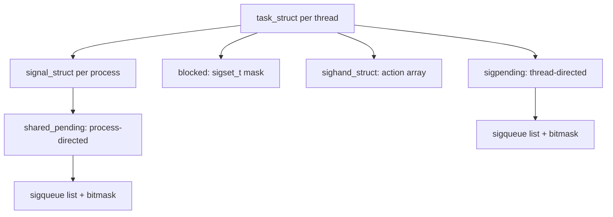
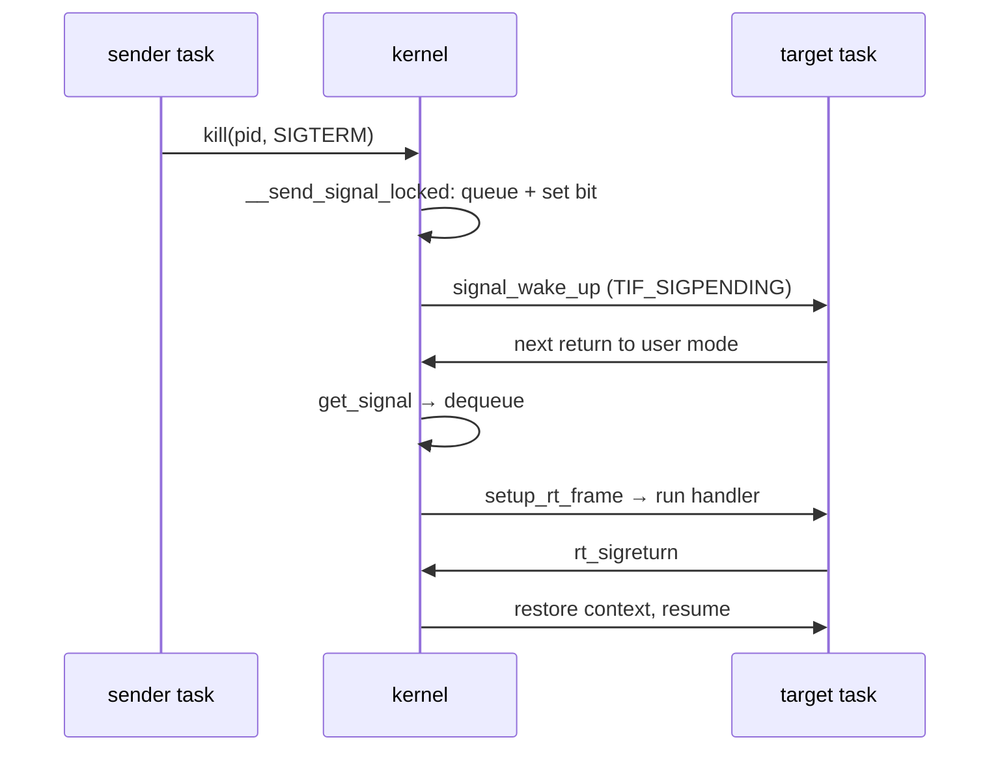

# Signals: The Kernel's Asynchronous Notifications

> **Goal:** master Linux signals — the kernel's mechanism for asynchronously
> notifying a process of events. Understand delivery, blocking, handlers, the
> special status of SIGKILL and SIGSTOP, job control, core dumps, and why
> signals explain almost all the weirdness of container lifecycle.

## What a signal actually is

A signal is a **small number** (1–64 on Linux). The kernel delivers it to a
process by setting a bit in a pending bitmask attached to the target's
`task_struct` and — this is the part most explanations skip — usually also
appending a small `struct sigqueue` entry carrying a `siginfo_t` payload
(who sent it, why, and for faults, the faulting address).

On the next return from kernel to user space (after any
[syscall](#/kernel-vs-userspace), page fault, or timer
[interrupt](#/interrupts)), the kernel checks the mask and, if a deliverable
bit is set, *handles* it: default action, handler, or ignore.

The single most useful mental model is to separate two verbs that people
routinely conflate:

- **Generation** happens on the *sender's* side, synchronously with the
  `kill()` syscall (or the fault, or the timer): the kernel decides the
  signal is legitimate, sets the pending bit, and queues the payload. This is
  cheap and immediate.
- **Delivery** happens on the *receiver's* side, at a moment the sender does
  not control: the next time that thread crosses from kernel mode back to
  user mode. Everything about blocking, coalescing, and "why didn't my signal
  do anything yet" lives in the gap between these two verbs.

```text
sender                         target process
  │                                │
  │ kill(pid, SIGTERM)             │ (running or sleeping)
  │    │                           │
  │    ▼                           │
  │ kernel sets bit 15 in          │
  │   the pending sigset_t,        │
  │   queues a sigqueue entry,     │
  │   makes process RUNNABLE       │ ← if it was sleeping interruptibly
  │                                │
  │                                ▼
  │                          next return from kernel:
  │                          check pending mask
  │                          SIGTERM is pending →
  │                             default: terminate
  │                             or: call the handler
```

Key properties:
- **Blockable** — a process can mask (block) most signals; they stay pending
  until unblocked. Think: "I'll deal with this after the critical section."
- **Coalescing by default** — for the standard signals (1–31), if the same
  signal arrives while it's already pending, the second is dropped: there is
  only one bit per signal number, and the kernel explicitly refuses to queue
  a duplicate. POSIX real-time signals (34–64 as seen by glibc) are queued
  and don't have this problem.
- **Default action** — every signal has a default: terminate, terminate+core,
  stop, continue, or ignore. Processes can override most with a handler.
- **Sent by the kernel too** — not just `kill(1)`. SIGSEGV on bad memory
  access (see [Virtual Memory](#/memory) for what the MMU actually trapped),
  SIGPIPE on write to a broken [pipe](#/ipc-pipes), SIGCHLD on child exit,
  SIGALRM from a [timer](#/timers). The kernel is the actual sender in all
  these cases, and `siginfo_t.si_code` tells you so (`SI_KERNEL` vs
  `SI_USER`).

There is no ordering guarantee among different pending standard signals, and
delivery is not instantaneous: a signal becomes visible only when the target
next transitions from kernel mode to user mode.

If the target is sleeping interruptibly, the sender's kernel wakes it (a
normal [scheduler](#/scheduling) wakeup), so on an idle machine the handler
runs within tens of microseconds. If the target is pinned on another CPU in a
long user-space loop, the kernel kicks that CPU with a rescheduling IPI so
the check happens promptly — on a busy machine you are otherwise at the mercy
of the target's next scheduler tick (typically 1–10 ms, depending on
`CONFIG_HZ`; see [Timers & Time](#/timers)).

## The kernel's bookkeeping: four structs

Everything signals do is bookkeeping across four structures (all in
[include/linux/sched/signal.h](https://elixir.bootlin.com/linux/v6.12/source/include/linux/sched/signal.h)
and `sched.h`):

1. **`struct task_struct`** — one per thread. The fields that matter:
   - `pending` — a `struct sigpending` for *thread-directed* signals
     (sent with `tgkill()`/`pthread_kill()`).
   - `blocked` — the thread's signal mask, a `sigset_t` (one 64-bit word on
     x86-64: `_NSIG` is 64).
   - `sighand` — pointer to the shared handler table.
   - `signal` — pointer to the shared `signal_struct`.
   - The `TIF_SIGPENDING` thread flag — the cheap "something is pending"
     bit the exit-to-user-mode path tests on every kernel exit.

2. **`struct signal_struct`** — one per *process* (thread group), shared by
   all threads. Holds `shared_pending` (process-directed signals, the kind
   `kill(2)` sends), the group exit code, and `flags` including
   `SIGNAL_GROUP_EXIT` (we're dying) and `SIGNAL_UNKILLABLE` (this is an
   init process — see below). It also holds the job-control bookkeeping:
   `group_stop_count` (how many threads still need to stop) and the current
   stop state.

3. **`struct sighand_struct`** — the handler table: `action[64]`, an array of
   `struct k_sigaction` (handler pointer, `sa_mask`, `sa_flags`), protected
   by `siglock`, the busiest spinlock in the signal code. Shared between
   threads of a process; also shared across `fork()` only with
   `CLONE_SIGHAND`.

4. **`struct sigpending`** — a 64-bit `signal` bitmask **plus** a linked
   list of `struct sigqueue` entries, each holding a `kernel_siginfo_t`.
   The bitmask answers "is signal N pending?" in one AND instruction; the
   list preserves payloads and, for real-time signals, multiple instances.



The thread/process split matters daily: `kill(pid, sig)` lands in
`shared_pending`, and the kernel then picks **one** thread that hasn't
blocked the signal to deliver it to (the main thread gets first refusal —
see `wants_signal()` in the code walk below). This is why "which of my 40
threads gets SIGTERM?" has the answer "any one that didn't block it," and
why the standard multithreaded pattern is: block everything in every thread,
dedicate one thread to `sigwaitinfo()`.

There is a deliberate cheat in the layout worth naming. A thread's *effective*
pending set is the union of its private `pending` and the process-wide
`shared_pending`, minus `blocked`. The kernel does not recompute that union
constantly; it caches the "do I have anything to deliver?" answer in the
single `TIF_SIGPENDING` bit and only recomputes via
[recalc_sigpending()](https://elixir.bootlin.com/linux/v6.12/C/ident/recalc_sigpending)
when the pending sets or the mask change.

That one bit is what the hot kernel-exit path tests billions of times a
second, so it has to be a single flag test, not a set-union.

**Container link:** `/proc/PID/status` exposes exactly this split —
`SigPnd` is the per-thread pending set, `ShdPnd` the process-wide one.
When a containerized JVM "ignores" your signal, this is the first place
to look.

## The signal list that matters daily

Numbers below are x86-64/arm64 numbering (a few differ on other
architectures — SPARC and Alpha renumber several; `kill -l` on the box is
the truth):

| Signal | Number | Default | Kernel sends when… |
|---|---|---|---|
| `SIGHUP` | 1 | Terminate | Terminal hangup (daemons repurpose it for "reload config") |
| `SIGINT` | 2 | Terminate | Ctrl+C (the TTY layer sends it to the foreground process group) |
| `SIGQUIT` | 3 | Core dump | Ctrl+\ |
| `SIGKILL` | 9 | Terminate (uncatchable) | You ask the kernel to destroy the process. Not *sent to* — *enforced on*. |
| `SIGSEGV` | 11 | Core dump | Invalid memory access (the MMU trapped it) |
| `SIGPIPE` | 13 | Terminate | Write to a pipe/socket with no reader |
| `SIGALRM` | 14 | Terminate | `alarm()` timer expired |
| `SIGTERM` | 15 | Terminate | Polite "please exit" (default for `kill` and `docker stop`) |
| `SIGCHLD` | 17 | Ignore | Child process exited, stopped, or continued |
| `SIGCONT` | 18 | Continue | Resume after a stop |
| `SIGSTOP` | 19 | Stop (uncatchable) | `kill -STOP`, job control |
| `SIGTSTP` | 20 | Stop | Ctrl+Z (catchable, unlike SIGSTOP) |
| `SIGBUS` | 7 | Core dump | Hardware memory error, misaligned access, truncated `mmap` file |
| `SIGUSR1/2` | 10, 12 | Terminate | User-defined (daemon reload, custom IPC) |

Two footnotes worth internalizing:

- For **synchronous** fault signals (SIGSEGV, SIGBUS, SIGILL, SIGFPE) the
  kernel uses [force_sig_fault()](https://elixir.bootlin.com/linux/v6.12/C/ident/force_sig_fault):
  if the process has blocked or ignored the signal, the kernel *unblocks it
  and resets the disposition to default* first. You cannot "ignore" your own
  segfault into nonexistence; you can only catch it. (Even catching it is a
  trap for the unwary: if your handler returns normally, the faulting
  instruction re-executes, re-faults, and you loop forever — which is why
  SIGSEGV handlers almost always `siglongjmp()` out or `_exit()`.)
- The shell convention **exit code = 128 + signal number** is how you
  autopsy a death: 137 = SIGKILL, 139 = SIGSEGV, 143 = SIGTERM.

## The two uncatchable signals

**SIGKILL** and **SIGSTOP** cannot be caught, blocked, or ignored. This is
enforced at three separate places in the kernel, not one:

1. `sigaction(2)` returns `EINVAL` if you try to install a handler for
   either — the `action[]` slot can never change.
2. `sigprocmask(2)` silently deletes both from any mask you install —
   `blocked` can never contain them.
3. On the sending side, [complete_signal()](https://elixir.bootlin.com/linux/v6.12/C/ident/complete_signal)
   has a fast path for fatal, unhandleable signals: it sets
   `SIGNAL_GROUP_EXIT` and puts SIGKILL in *every* thread's pending set at
   once, so the whole thread group dies without each thread having to
   dequeue and interpret anything.

The one genuine exception: a process in **uninterruptible sleep** (`D` in
`ps`) is waiting inside the kernel — typically on disk I/O in the
[storage stack](#/storage-stack) or a hung NFS server — and does not pass
through the "check pending signals" gate until the wait completes. SIGKILL
is *pending* but not *acted on*. Since kernel 2.6.25 many long waits use
`TASK_KILLABLE` instead, a hybrid state that ignores everything *except*
fatal signals, which is why fewer processes get permanently stuck in D
state on modern kernels than folklore suggests.

The second exception is **init**. Any process whose `signal->flags` has
`SIGNAL_UNKILLABLE` (PID 1 in each [PID namespace](#/namespaces)) gets
special treatment in `sig_task_ignored()`: signals for which it has *not*
installed a handler are discarded at send time, even SIGKILL — when the
sender lives in the same namespace. From an **ancestor** namespace, SIGKILL
and SIGSTOP punch through. That asymmetry is the whole story of container
PID 1 behaviour, and we'll use it below.

This is also why `docker stop` has a grace period then SIGKILL: it first
sends SIGTERM (a chance to clean up), waits 10 seconds by default, then
SIGKILL (kernel-guaranteed death).

```bash
# Watch the dance:
docker stop --time 30 my-container  # 30-second grace period
# Internally: SIGTERM → wait 30s → SIGKILL
```

## Job control, terminals, and the stop/continue dance

Signals are how a shell manages foreground and background jobs, and the
machinery is more interesting than "Ctrl+Z pauses things." When you press
Ctrl+C, Ctrl+\, or Ctrl+Z, it is not the shell that acts — it is the
terminal's **line discipline** (`N_TTY` in the kernel) noticing the special
character and sending a signal to the terminal's **foreground process group**:

- Ctrl+C → **SIGINT** (terminate)
- Ctrl+\ → **SIGQUIT** (terminate + core)
- Ctrl+Z → **SIGTSTP** (stop)

Two more terminal signals are subtler. A background process that tries to
*read* from the controlling terminal gets **SIGTTIN**; one that tries to
*write* (when `stty tostop` is set) gets **SIGTTOU**. Both default to
stopping the process. This is why a backgrounded editor freezes the instant
it wants keyboard input — the kernel stopped it rather than let two jobs
fight over the terminal.

The stop states themselves live in `task_struct->__state`. A stopped task is
in `TASK_STOPPED`; the group stop is coordinated through
[do_signal_stop()](https://elixir.bootlin.com/linux/v6.12/C/ident/do_signal_stop),
which uses `signal->group_stop_count` so that *every* thread in the process
stops before the process is considered stopped — a partial stop would be
incoherent.

SIGCONT reverses it, and here the kernel enforces a mutual exclusion you can
see in
[prepare_signal()](https://elixir.bootlin.com/linux/v6.12/C/ident/prepare_signal):
sending SIGCONT immediately flushes any pending stop signals (SIGSTOP,
SIGTSTP, SIGTTIN, SIGTTOU) out of the pending set, and sending a stop signal
flushes a pending SIGCONT. A process cannot be simultaneously "about to stop"
and "about to continue."

Every stop and continue also generates a **SIGCHLD** to the parent, with
`si_code` set to `CLD_STOPPED` or `CLD_CONTINUED` (not just `CLD_EXITED`).
That is how your shell knows to print `[1]+ Stopped` without polling — it is
`wait()`-ing with `WUNTRACED`/`WCONTINUED` and reading the `siginfo`. The
parent/child reaping side of this is the [processes chapter](#/processes)'s
territory; signals are the notification layer riding on top.

```bash
# Watch job control drive the state machine:
sleep 300 &          # background job
kill -STOP %1        # -> state T (stopped) in ps
ps -o pid,stat,cmd -p $!    # STAT shows T
kill -CONT %1        # -> back to S (sleeping)
# SIGTTOU in action: background write to the terminal
stty tostop; (sleep 1; echo hi) & ; wait   # the echo stops the job
stty -tostop         # undo
```

## Core dumps: when a signal writes your process to disk

Five default actions were listed above; the "terminate + core" one deserves
its own treatment because it is how you debug crashes. The signals that dump
core by default are **SIGQUIT, SIGILL, SIGABRT, SIGFPE, SIGSEGV, SIGBUS,
SIGTRAP, SIGSYS**, and a few others. When `get_signal()` hits one of these
with a default disposition, it calls
[do_coredump()](https://elixir.bootlin.com/linux/v6.12/C/ident/do_coredump)
*before* tearing the process down.

Three knobs govern what actually happens:

- **`RLIMIT_CORE`** (`ulimit -c`) caps the dump size. Its default on most
  distros is **0** — meaning "no core file at all," which is why a fresh
  crash often leaves nothing behind. Set `ulimit -c unlimited` to get one.
- **`/proc/sys/kernel/core_pattern`** decides *where* the dump goes. If it
  starts with `|`, the kernel does not write a file at all — it pipes the
  core straight into a program's stdin. On any systemd distro this is
  `|/usr/lib/systemd/systemd-coredump ...`, and you retrieve dumps with
  `coredumpctl` instead of hunting for a `core` file.
- **`/proc/sys/kernel/core_pipe_limit`** and the `%`-escapes in
  `core_pattern` (`%p` PID, `%e` exe name, `%s` signal, `%t` timestamp)
  control the naming and concurrency of piped dumps.

For a multithreaded process, `do_coredump()` first stops *all* threads (via
the same group-stop machinery as SIGSTOP), because the core must be a
consistent snapshot — you cannot dump a memory image that other threads are
still mutating. The resulting ELF core file contains one `NT_PRSTATUS` note
per thread plus the writable memory mappings, which is what lets `gdb` show
you every thread's backtrace after the fact.

```bash
# Force a core dump and inspect it
ulimit -c unlimited
sleep 100 & kill -QUIT $!        # SIGQUIT -> core
cat /proc/sys/kernel/core_pattern
coredumpctl list                 # on systemd systems
coredumpctl gdb                  # open the newest dump in gdb
```

## Handlers: catching signals

A process installs a handler with `signal()` (legacy, avoid) or
`sigaction()` (modern):

```c
#include <signal.h>

void handle_sigterm(int sig) {
    // clean up, close fds, write checkpoint...
    _exit(0);  // safe: limited set of async-signal-safe functions
}
int main() {
    struct sigaction sa = { .sa_handler = handle_sigterm };
    sigaction(SIGTERM, &sa, NULL);  // install handler
    // ... work ...
}
```

### What "calling the handler" mechanically means

The kernel cannot simply call a user function — it's in kernel mode, the
handler is user code. Instead, on the return path to user space it performs
a controlled hijack:

1. It saves the *entire* interrupted user context — every general-purpose
   register, plus the FPU/SIMD state — into a **signal frame**
   (`struct rt_sigframe` on x86-64) pushed onto the process's own user
   stack (or an alternate stack if `sigaltstack()` was configured, which is
   how programs survive handling SIGSEGV caused by stack overflow).
2. It rewrites the saved user instruction pointer to the handler's address
   and the saved stack pointer to just below the frame.
3. It sets the return address to a **trampoline** (glibc's
   `__restore_rt`), so that when the handler returns, the trampoline
   executes the `rt_sigreturn(2)` syscall.
4. `rt_sigreturn` copies the saved context back into the registers — the
   process resumes exactly where it was interrupted, unaware.

Concrete numbers: the x86-64 frame is not small. With AVX-512, the XSAVE
area for FPU/vector state alone is over 2 KiB, and the full frame exceeds
3 KiB — more than the historical `MINSIGSTKSZ` constant of 2,048 bytes.
That's why the kernel (since 5.14 on x86) exports the real minimum via the
`AT_MINSIGSTKSZ` auxiliary-vector entry, and glibc ≥ 2.34 made
`MINSIGSTKSZ`/`SIGSTKSZ` dynamic. Hard-coded tiny alternate stacks are a
real-world crash source on AVX-512 machines.

While the handler runs, the kernel also blocks the signal being handled
(so a SIGTERM handler is not re-entered by another SIGTERM) plus any signals
listed in that handler's `sa_mask`. Unless you set `SA_NODEFER`, this
non-reentrancy is automatic and per-signal — a SIGUSR1 handler *can* still be
interrupted by SIGUSR2. The set of blocked signals is saved in the
`ucontext` on the frame and restored by `rt_sigreturn`, so it evaporates the
moment the handler returns.

### Async-signal-safety

The handler runs asynchronously — potentially while the process was in the
middle of `malloc()`, `printf()`, or holding a lock. If the handler calls
`malloc()` too, it can re-enter the allocator's lock → deadlock. The rule:
handlers may only call **async-signal-safe** functions (`write`, `_exit`,
`close`, … — the full list is `man 7 signal-safety`). The idiomatic safe
handler sets a `volatile sig_atomic_t` flag or writes one byte to a
self-pipe, and the main loop does the real work.

Or skip handlers entirely with `signalfd()` — receive signals as readable
structs on a file descriptor and add it to your epoll loop (the signals
must be *blocked* first, or they'll be delivered the normal way instead):

```c
// The modern, safe pattern: receive signals via fd
sigprocmask(SIG_BLOCK, &mask, NULL); // mandatory: block them first
int sfd = signalfd(-1, &mask, 0);    // read signals from this fd
struct signalfd_siginfo si;
read(sfd, &si, sizeof(si));          // blocks until a signal arrives
if (si.ssi_signo == SIGTERM) { cleanup(); }
```

### The EINTR tax

A handler firing while the process is blocked in a slow syscall (`read` on
a socket, `nanosleep`, `wait`) interrupts that syscall. Without
`SA_RESTART` in `sa_flags`, the syscall returns `-EINTR` and *your code*
must retry. With `SA_RESTART`, the kernel transparently restarts most —
but not all — syscalls (`select`, `poll`, and sleep-type calls are never
restarted; `man 7 signal` has the full matrix). Half of all "works on my
machine" network bugs involving signals are missing EINTR handling.

The kernel implements restart by having the syscall return the internal
error `-ERESTARTSYS`; the signal-delivery path then either converts it to
`-EINTR` (no `SA_RESTART`) or rewinds the user instruction pointer to
re-issue the same syscall (`SA_RESTART`). You never see `ERESTARTSYS` from
user space — it exists purely so this decision can be made *after* the
handler's disposition is known.

## Blocking, pending, and the signal mask

Every thread has a **signal mask** (`task_struct->blocked`). If a signal
is blocked, the kernel marks it pending but doesn't deliver it until
unblocked. Inheritance rules that bite people:

- The mask is inherited across `fork()` and **preserved across
  `execve()`**. A daemon manager that blocks SIGTERM and forgets to
  unblock before exec produces children that mysteriously ignore
  `kill`.
- Handler *dispositions* are reset to default on exec (the handler code no
  longer exists in the new program) — **except** `SIG_IGN`, which
  survives. `nohup` works by setting SIGHUP to `SIG_IGN` and exec'ing you.
- Pending signals are inherited across neither fork nor exec... except
  they *do* survive exec in the same process. Fork gives the child an
  empty pending set.

```c
sigset_t set;
sigemptyset(&set);
sigaddset(&set, SIGTERM);
sigprocmask(SIG_BLOCK, &set, NULL);   // block SIGTERM during critical work
// ... do something that must not be interrupted ...
sigprocmask(SIG_UNBLOCK, &set, NULL); // SIGTERM delivered here if pending
```

A classic race lurks here: if you unblock a signal, then call `pause()` or
`select()` to wait for it, the signal can arrive *in the gap* between the two
calls and you sleep forever. The fixes are `sigsuspend()` (atomically set the
mask and sleep) or, in a modern event loop, `pselect()`/`ppoll()`/`epoll_pwait()`,
all of which take a signal mask and apply it atomically for the duration of
the wait. `signalfd()` sidesteps the race entirely by turning the signal into
a readable fd you can poll like any other.

```bash
# Shell equivalent (this *ignores* SIGINT rather than blocking it —
# the shell has no direct sigprocmask, trap '' sets SIG_IGN):
trap '' INT     # ignore Ctrl+C
trap - INT      # restore default
```

Check your signals live:

```bash
grep -E 'SigPnd|ShdPnd|SigBlk|SigIgn|SigCgt' /proc/$$/status
# SigPnd: per-thread pending   ShdPnd: process-wide pending
# SigBlk: blocked   SigIgn: ignored   SigCgt: caught (handler installed)
kill -l         # list all signal numbers on this architecture
```

Each of those is a 64-bit hex mask; bit *N−1* corresponds to signal *N*.
`SigCgt: 0000000000004002` means handlers exist for signal 2 (SIGINT) and
signal 15 (SIGTERM) — bits 1 and 14.

## Signals under ptrace: how strace sees them

Every signal delivered to a traced process passes through a checkpoint the
tracer controls. Inside `get_signal()`, if the task is being ptraced, it
calls [ptrace_signal()](https://elixir.bootlin.com/linux/v6.12/C/ident/ptrace_signal),
which freezes the target in **signal-delivery-stop** and notifies the tracer.

The tracer (`strace`, `gdb`) can then read the full `siginfo` with
`PTRACE_GETSIGINFO`, decide whether to *inject* the signal, *suppress* it,
or *replace* it with a different one, and resume the target with
`PTRACE_CONT` / `PTRACE_syscall`.

This is precisely why `strace -e signal` can show you exactly which signal
hit a process and where — the tracee is literally paused mid-delivery, in the
kernel, waiting for the tracer's verdict.

The one signal that skips this checkpoint is, again, **SIGKILL** — a tracer
cannot suppress a kill, and a stopped-under-ptrace task still dies to it.
More on the tooling in [/proc, strace, perf & eBPF](#/observability).

## Signals and containers: the production story

Everything in this chapter explains
[container lifecycle](#/containers-overview) behaviour:

### `docker stop` internals

```
docker stop my-container
  → dockerd sends STOPSIGNAL (default SIGTERM) to PID 1 inside the container
  → wait for process to exit (timeout = 10s, configurable with -t)
  → if still alive: send SIGKILL (kernel-enforced death)
  → exit code 143 = 128 + SIGTERM(15)   ← clean shutdown
  → exit code 137 = 128 + SIGKILL(9)    ← forced kill
```

If your process does NOT handle SIGTERM, and it's PID 1 in the container,
the signal is **discarded entirely** — that's the `SIGNAL_UNKILLABLE` rule
from above, not a mere default action. The same binary that dies instantly
to `kill -TERM` on your laptop shrugs it off as container PID 1.

This is the #1 "my container takes exactly 10 seconds to stop" bug: nothing
happens for the full grace period, then the SIGKILL from the ancestor
namespace (which is allowed through) does the job. The `STOPSIGNAL` Dockerfile
instruction exists precisely so images can declare what they actually
listen to (nginx wants SIGQUIT for graceful drain, for example).

### PID 1 signal specialness

The [processes chapter](#/processes) noted that PID 1 is special.
Consequence inside containers: if your entrypoint is a shell script
(`#!/bin/sh`) and you run `docker stop`, the shell — even if it dies —
often *doesn't* forward SIGTERM to the server it launched. You need:

```bash
# entrypoint.sh — good pattern
my-server &                         # start server in background
trap 'kill -TERM $! && wait' TERM   # forward SIGTERM to the child
wait                                # wait for children
```

Better: `exec my-server` as the last line, making the server itself PID 1
(with its own SIGTERM handler). Or use `docker run --init`, which inserts
`tini` as PID 1 — a ~50 KB init that installs handlers for everything,
forwards signals to its child, and reaps zombies (orphaned children
reparent to PID 1 *of the namespace*, and if nobody calls `wait()`, they
accumulate as zombies — again the [processes](#/processes) chapter's
machinery). Kubernetes solves the same problem with `shareProcessNamespace`
and by running a real init, but the underlying kernel rule is identical.

### SIGPIPE and the broken pipe

`curl ... | head` — curl writes a lot, head reads a little and exits. The
pipe breaks. On curl's next `write()`, the kernel sends SIGPIPE; default
action terminates curl. This is by design: it lets naive filters die
silently when their consumer leaves, instead of looping on write errors.
Network daemons almost always set SIGPIPE to `SIG_IGN` and handle the
`EPIPE` errno instead. Details on the pipe side live in
[Pipes, FIFOs & Unix Sockets](#/ipc-pipes).

## Signals vs other notification mechanisms

| Mechanism | When to use |
|---|---|
| Signals | System events (child died, segfault, shutdown request) — asynchronous |
| `signalfd()` | Same events, but integrated into a poll/epoll event loop |
| `eventfd()` | User-space notification between threads/processes |
| `pidfd_send_signal()` | Signal a process via a pidfd — immune to PID-reuse races (since 5.1) |
| `pidfd` + `waitid()`/poll | Monitor a specific child without SIGCHLD races |
| `timerfd()` | [Timer](#/timers) notifications as readable fds |

The PID-reuse race is worth spelling out: `kill(1234, SIGKILL)` kills
*whoever is PID 1234 right now*. If your target died and the PID was
recycled, you just killed a stranger.

The window is real: the kernel's compile-time default `pid_max` is only
**32,768** (`PID_MAX_DEFAULT`), so a busy box wraps the PID space in minutes,
though most modern distros raise it toward the 64-bit maximum of
**4,194,304** (`cat /proc/sys/kernel/pid_max`).

A pidfd is a stable handle to one specific process incarnation — obtained
from `pidfd_open()`, `clone(CLONE_PIDFD)`, or `/proc/PID` — so
`pidfd_send_signal()` either signals exactly the intended process or fails
with `ESRCH`, never a stranger. systemd and container runtimes have moved to
it wholesale.

## Real-time signals

POSIX real-time signals occupy numbers 32–64 kernel-side; glibc steals the
first two (32, 33) for its own thread implementation, so user code sees
`SIGRTMIN` = 34 through `SIGRTMAX` = 64. Three differences from standard
signals:

1. **Queued** — every send allocates its own `struct sigqueue`; multiple
   deliveries are never merged. The queue depth is capped per user by
   `RLIMIT_SIGPENDING` (`ulimit -i`; the default scales with RAM, typically
   tens of thousands on a desktop). When the cap is hit, `sigqueue(3)`
   fails with `EAGAIN` — a queued-signal flood is a classic local DoS
   vector, which is why the limit exists.
2. **Ordered** — among pending real-time signals, lower numbers are
   delivered first, and multiple instances of the same signal arrive in
   send order.
3. **Carry a value** — `sigqueue(pid, signo, value)` attaches a
   `union sigval` (an int or a pointer), retrievable in the handler via
   `SA_SIGINFO` and `si_value`.

Glibc's POSIX timers and AIO use real-time signals internally. For your
own applications, standard signals + `signalfd()`/pidfd is usually cleaner
than RT queues.

## Follow the code (kernel v6.12)

Two paths through [kernel/signal.c](https://elixir.bootlin.com/linux/v6.12/source/kernel/signal.c):
sending a signal, and delivering one.

### Path 1: `kill(pid, SIGTERM)` — the sender's side

1. The syscall handler builds a `kernel_siginfo_t` (`si_code = SI_USER`,
   sender's PID and UID) and resolves the target. For a positive PID it
   ends up in [kill_pid_info()](https://elixir.bootlin.com/linux/v6.12/C/ident/kill_pid_info),
   which looks up the `task_struct` from the `struct pid` under RCU.
2. [group_send_sig_info()](https://elixir.bootlin.com/linux/v6.12/C/ident/group_send_sig_info)
   runs the permission check (`check_kill_permission`: your credentials vs
   the target's, plus LSM hooks — see [Security](#/security-hardening)),
   then calls [do_send_sig_info()](https://elixir.bootlin.com/linux/v6.12/C/ident/do_send_sig_info),
   which takes `sighand->siglock` and enters
   [send_signal_locked()](https://elixir.bootlin.com/linux/v6.12/C/ident/send_signal_locked).
3. Its workhorse [__send_signal_locked()](https://elixir.bootlin.com/linux/v6.12/C/ident/__send_signal_locked)
   does the actual bookkeeping:
   - [prepare_signal()](https://elixir.bootlin.com/linux/v6.12/C/ident/prepare_signal)
     handles the stop/continue dance (a SIGCONT flushes pending stop
     signals and vice versa) and calls `sig_task_ignored()` — this is
     where a signal to an unprotected-by-handler init/PID 1 silently
     evaporates, and where an ignored signal is dropped without ever
     becoming pending.
   - A `legacy_queue` check drops duplicate standard signals (the
     coalescing rule).
   - Otherwise it allocates a `struct sigqueue` via
     [__sigqueue_alloc()](https://elixir.bootlin.com/linux/v6.12/C/ident/__sigqueue_alloc)
     (charged against `RLIMIT_SIGPENDING`), appends it to
     `shared_pending.list` (process-directed) or `pending.list`
     (thread-directed), and sets the bit in the matching `sigset_t`.
4. [complete_signal()](https://elixir.bootlin.com/linux/v6.12/C/ident/complete_signal)
   picks a victim thread using
   [wants_signal()](https://elixir.bootlin.com/linux/v6.12/C/ident/wants_signal)
   — the main thread first, then round-robin among threads that haven't
   blocked the signal. For an unhandled fatal signal it short-circuits:
   SIGKILL goes into *every* thread's pending set and the group is marked
   exiting.
5. [signal_wake_up()](https://elixir.bootlin.com/linux/v6.12/C/ident/signal_wake_up)
   sets the chosen thread's `TIF_SIGPENDING` flag and wakes it if it's in
   an interruptible sleep — or, if it's currently *running* on another
   CPU, kicks that CPU with an IPI via
   [kick_process()](https://elixir.bootlin.com/linux/v6.12/C/ident/kick_process)
   so it re-enters the kernel and notices.

### Path 2: delivery — the receiver's side

1. On every return to user space,
   [exit_to_user_mode_loop()](https://elixir.bootlin.com/linux/v6.12/C/ident/exit_to_user_mode_loop)
   (in [kernel/entry/common.c](https://elixir.bootlin.com/linux/v6.12/source/kernel/entry/common.c))
   tests `TIF_SIGPENDING` and calls the architecture's
   [arch_do_signal_or_restart()](https://elixir.bootlin.com/linux/v6.12/C/ident/arch_do_signal_or_restart).
2. [get_signal()](https://elixir.bootlin.com/linux/v6.12/C/ident/get_signal)
   is the brain: under `siglock` it loops
   [dequeue_signal()](https://elixir.bootlin.com/linux/v6.12/C/ident/dequeue_signal)
   (thread-directed set first, then shared), consulting
   `sighand->action[sig]`:
   - `SIG_IGN` → discard, loop again.
   - `SIG_DFL` + default-ignore (SIGCHLD, SIGURG…) → discard.
   - `SIG_DFL` + stop → job-control stop via `do_signal_stop()`.
   - `SIG_DFL` + fatal → [do_group_exit()](https://elixir.bootlin.com/linux/v6.12/C/ident/do_group_exit)
     (or [do_coredump()](https://elixir.bootlin.com/linux/v6.12/C/ident/do_coredump)
     first for the core-dump signals). The thread never returns to user
     space. This — not some magic "unkillable check" — is why SIGKILL is
     final: no handler can exist for it, so this branch always runs.
   - A real handler → return it to the arch code. (If the task is
     ptraced, `ptrace_signal()` freezes it in signal-delivery-stop first
     so `strace` can show you the signal — see
     [Observability](#/observability).)
3. On x86-64, `handle_signal()` in
   [arch/x86/kernel/signal.c](https://elixir.bootlin.com/linux/v6.12/source/arch/x86/kernel/signal.c)
   calls [setup_rt_frame()](https://elixir.bootlin.com/linux/v6.12/C/ident/setup_rt_frame)
   → [x64_setup_rt_frame()](https://elixir.bootlin.com/linux/v6.12/C/ident/x64_setup_rt_frame),
   which builds the `rt_sigframe` on the user stack — `siginfo`,
   `ucontext` with all registers, the XSAVE area — points the saved RIP at
   the handler, and per `sa_mask` blocks further signals for the handler's
   duration.
4. The handler runs in user space. Its return lands in the glibc
   trampoline, which issues `rt_sigreturn(2)`; the kernel side calls
   [restore_sigcontext()](https://elixir.bootlin.com/linux/v6.12/C/ident/restore_sigcontext)
   and [restore_altstack()](https://elixir.bootlin.com/linux/v6.12/C/ident/restore_altstack)
   to put every register back, and the original code resumes as if nothing
   happened.



## Try it yourself

```bash
# Catch Ctrl+C in a subshell
bash -c 'trap "echo caught" INT; sleep 5; echo done'   # press Ctrl+C
# SIGTERM vs SIGKILL
sleep 100 & kill -TERM $!; sleep 1; ps -p $!           # terminated
sleep 100 & kill -KILL $!; sleep 1; ps -p $!           # gone instantly
# See your shell's signal dispositions (hex masks, bit N-1 = signal N):
grep Sig /proc/$$/status
# Decode a mask: which signals does your shell catch?
kill -l                          # map numbers to names
# Watch signal delivery live with strace:
sleep 30 & strace -e 'trace=!all' -e signal ps > /dev/null; kill -TERM %1
# Job control: stop and continue a job, watch the state change
sleep 300 & kill -STOP %1; ps -o stat -p $!; kill -CONT %1
# Force a core dump and open it
ulimit -c unlimited; sleep 60 & kill -QUIT $!; coredumpctl list
# Watch a container's signal story:
docker run -d --name sigtest alpine sleep 100
docker stop -t 5 sigtest; docker inspect -f '{{.State.ExitCode}}' sigtest
# → 137 (128+9): alpine's `sleep` is PID 1 with no handler, SIGTERM was
#   discarded, SIGKILL from the host namespace finished the job after 5 s
docker rm sigtest
# Prove the coalescing rule: send SIGUSR1 five times while blocked —
# the handler fires once:
bash -c 'trap "echo got USR1" USR1; kill -STOP $$' &
p=$!; sleep 0.2; for i in 1 2 3 4 5; do kill -USR1 $p; done
kill -CONT $p; wait $p
```

## Check your understanding

1. Why is SIGKILL uncatchable — what, mechanically, does the kernel do
   differently?

<details><summary>Show answer</summary>

Three enforcement points: `sigaction()` returns `EINVAL` for SIGKILL, so no
handler can ever exist in `sighand->action[]`; `sigprocmask()` strips it
from any blocked set; and on the sending side `complete_signal()` treats an
unhandled fatal signal specially, marking the group exiting and putting
SIGKILL into every thread's pending set. When `get_signal()` dequeues it,
the disposition is necessarily `SIG_DFL` + fatal, so `do_group_exit()` runs
and the process never returns to user space.

</details>

2. A process blocks SIGTERM for a critical section. SIGTERM arrives during
   that section. What happens, and when?

<details><summary>Show answer</summary>

`__send_signal_locked()` still sets the pending bit and queues the
`sigqueue` entry — blocking affects *delivery*, not *generation*. Because
the bit is in the blocked mask, `get_signal()` won't dequeue it. The moment
the process calls `sigprocmask(SIG_UNBLOCK, ...)`, `recalc_sigpending()`
sets `TIF_SIGPENDING` again and the signal is delivered on the return from
that very syscall. If SIGTERM arrived five times meanwhile, the handler
runs once — standard signals coalesce.

</details>

3. `docker stop` takes exactly 10 seconds every time, then the container
   dies with exit code 137. What's wrong with the container's PID 1?

<details><summary>Show answer</summary>

PID 1 in a PID namespace carries `SIGNAL_UNKILLABLE`: signals from inside
its own namespace for which it has no handler installed are discarded at
send time, and even the default terminate action doesn't apply. The
process either never installed a SIGTERM handler, or it's a shell script
that doesn't forward the signal to its real workload. Nothing happens for
the whole grace period; then dockerd sends SIGKILL, which ancestor
namespaces are allowed to force through, hence 128 + 9 = 137. Fix: handle
SIGTERM, `exec` the real server, or run with `--init`.

</details>

4. Why is calling `printf()` inside a signal handler dangerous, and what are
   the two safe alternatives?

<details><summary>Show answer</summary>

The handler may interrupt the main program mid-`printf()` while it holds
stdio's internal lock; if the handler calls `printf()` too, it deadlocks on
that lock (or corrupts the buffer). Safe options: (1) only call
async-signal-safe functions — `write(2, msg, len)` instead of `printf` —
or just set a `volatile sig_atomic_t` flag; (2) avoid handlers entirely:
block the signal and receive it via `signalfd()` or `sigwaitinfo()` in
your normal control flow.

</details>

5. Your process sends `kill(pid, SIGUSR1)` to a process with 8 threads.
   Which thread runs the handler?

<details><summary>Show answer</summary>

Process-directed signals land in the shared `signal_struct->shared_pending`;
`complete_signal()` then picks *one* thread that hasn't blocked SIGUSR1 —
the main thread gets first preference via `wants_signal()`, otherwise any
eligible thread. It's deliberately unspecified. That's why multithreaded
programs block all signals in every thread and dedicate one thread to
`sigwaitinfo()`, or use `signalfd()`.

</details>

6. `kill -9` on a process does nothing — `ps` shows it in state `D`.
   Why, and what's the modern kernel mitigation?

<details><summary>Show answer</summary>

State `D` is `TASK_UNINTERRUPTIBLE`: the task is blocked inside the kernel
(usually on I/O) and never passes through the pending-signal check, so
SIGKILL sits pending until the wait completes — which may be never if the
storage or NFS server is gone. Since 2.6.25, many such waits use
`TASK_KILLABLE`, which stays deaf to ordinary signals but wakes for fatal
ones, so SIGKILL works in far more of these situations on modern kernels.

</details>

7. Why did systemd and container runtimes move from `kill(pid, ...)` to
   pidfds?

<details><summary>Show answer</summary>

A PID is a name that gets recycled: after the target dies, the same number
can be handed to an unrelated new process, and your `kill()` hits the wrong
victim. The default `pid_max` of 32,768 makes this a matter of minutes on a
busy box. A pidfd (from `pidfd_open()` or `clone(CLONE_PIDFD)`) references
one specific process incarnation, so `pidfd_send_signal()` (since 5.1)
either signals exactly the intended process or fails with `ESRCH` — never a
stranger.

</details>

8. Pressing Ctrl+Z stops your foreground job, and your shell prints
   `[1]+ Stopped` immediately without polling. How does the shell find out?

<details><summary>Show answer</summary>

The TTY line discipline sends SIGTSTP to the foreground process group,
which stops via `do_signal_stop()`. The stop *also* generates a SIGCHLD to
the parent shell with `si_code = CLD_STOPPED`. The shell is `wait()`-ing
with `WUNTRACED`, so it wakes, reads the `siginfo`, sees the stop, and
prints the job-control message — event-driven, no polling.

</details>

## Sources & further reading

- [signal(7) — overview of signals](https://man7.org/linux/man-pages/man7/signal.7.html) — dispositions, the syscall-restart matrix, standard vs real-time.
- [sigaction(2)](https://man7.org/linux/man-pages/man2/sigaction.2.html) — `sa_flags`, `SA_SIGINFO`, `siginfo_t` field semantics.
- [signal-safety(7)](https://man7.org/linux/man-pages/man7/signal-safety.7.html) — the authoritative async-signal-safe function list.
- [signalfd(2)](https://man7.org/linux/man-pages/man2/signalfd.2.html) — signals as file descriptors, and its caveats.
- [core(5)](https://man7.org/linux/man-pages/man5/core.5.html) — `core_pattern`, `RLIMIT_CORE`, and how core dumps are named and piped.
- [pid_namespaces(7)](https://man7.org/linux/man-pages/man7/pid_namespaces.7.html) — the init/SIGNAL_UNKILLABLE rules that govern container PID 1.
- [kernel/signal.c in v6.12](https://elixir.bootlin.com/linux/v6.12/source/kernel/signal.c) — the whole generic implementation is one readable file.
- Michael Kerrisk, *The Linux Programming Interface*, chapters 20–22 — the most thorough user-space treatment of signals in print.

---

**Next:** the glue between processes — [pipes, FIFOs, and Unix domain
sockets](#/ipc-pipes). How the kernel creates byte-streams between processes
that let the shell's pipe operator work, and how systemd, Docker, and
PostgreSQL use them under the hood.
