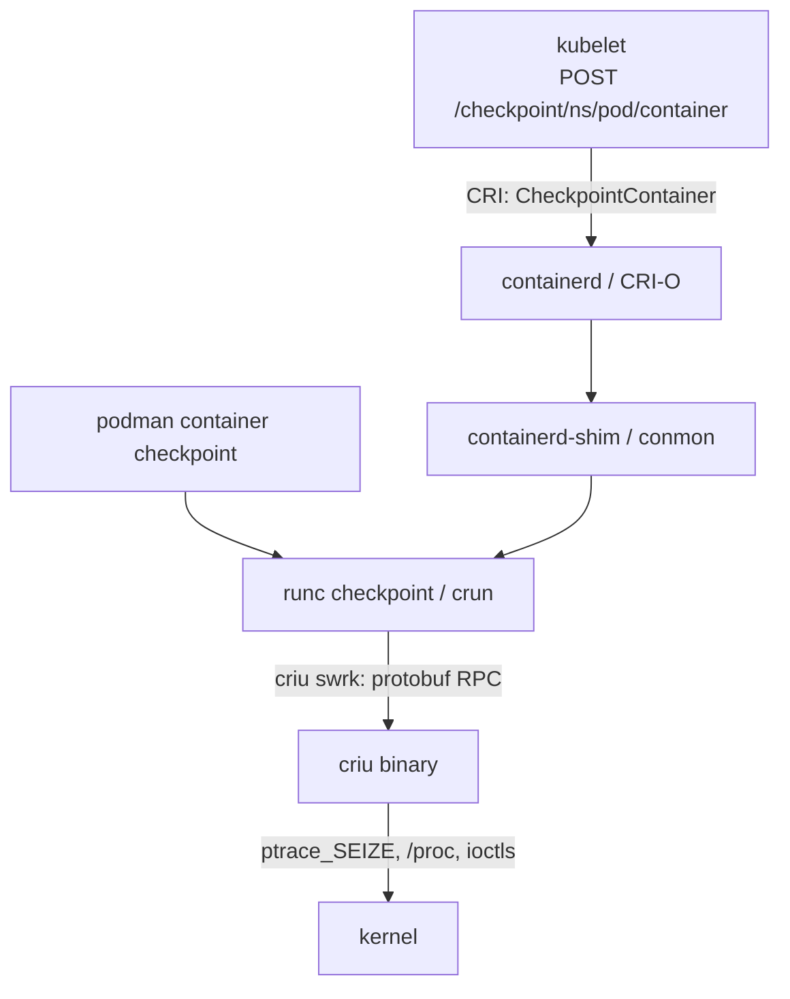

# The Snapshot Taxonomy: CRIU, gVisor & microVMs

> **Goal:** two things. First, trace how checkpoint/restore plugs into the real
> container stack, from `runc checkpoint` up to the kubelet API. Second, build
> the comparative mental model of the field: every snapshot system in the
> industry captures state at one of **four levels**, and once you can place a
> system in that taxonomy, you can predict its failure modes before reading
> its documentation.

The last three chapters dissected one snapshot technology — CRIU — down to the
syscall. This chapter zooms out twice. First to the *software stack*: CRIU is
a low-level tool nobody calls directly in production; container engines wrap
it, and Kubernetes wraps the engines. Second to the *design space*: CRIU's way
of freezing a workload — serialize the kernel objects of a process tree from
userspace — is only one of four fundamentally different places to draw the
snapshot boundary. gVisor draws it higher. Firecracker draws it lower. vLLM
draws it inside the application itself. Each choice buys and costs something
specific, and the trade-offs are not incremental — they are categorical.

## The integration chain

Recall the stack from [Docker, containerd, runc](#/container-runtimes): CLI →
engine → containerd/CRI-O → shim → runc → kernel. Checkpointing threads
through the same chain, because only the bottom layer talks to CRIU, and only
the top layers know what a "container" is.



### runc: the layer that actually shells out

`runc checkpoint <id>` and `runc restore <id>` are the OCI-runtime face of
CRIU. runc does **not** reimplement any of the dump logic from
[CRIU: Dumping a Live Process](#/criu-dump) — libcontainer, runc's engine,
launches the `criu` binary in **swrk mode** (`criu swrk`, "service worker")
and speaks protobuf RPC to it over a socket pair. No CLI output parsing, no
version-string scraping; requests and responses are typed messages.

The integration lives in three files of runc's libcontainer:
`criu_linux.go` (the RPC conversation), `criu_opts_linux.go` (the `CriuOpts`
struct), and the checkpoint/restore entry points on the container object.
`CriuOpts` reads like a checklist of everything the previous chapters taught
you can go wrong:

```text
ImagesDirectory        where the dump images go
WorkDirectory          CRIU's scratch space and logs
LeaveRunning           dump without killing (the copy, not the move)
TcpEstablished         allow TCP_REPAIR-mode connection dumps
ExternalUnixConnections / FileLocks / ShellJob    the classic CRIU footguns
PreDump / ParentImage  iterative pre-copy (memory deltas between dumps)
PageServer             stream pages to a remote host during dump
ManageCgroupsMode      how cgroup state is restored
```

Every one of these maps to a flag you met in
[Live Migration: Iterative, Lazy & TCP Repair](#/live-migration). runc adds
the *container-shaped* work around the process dump: it tells CRIU which
mounts are **external** (bind mounts owned by the engine, not the container),
dumps and restores the [cgroup](#/cgroups) configuration, and re-creates the
[namespaces](#/namespaces) — or tells CRIU to join existing ones, which is how
a restored container lands back in a pod's shared network namespace.

**crun**, the C runtime, does the same dance through **libcriu**, CRIU's C
client library — same protobuf RPC underneath, no Go in the path. Docker
exposes the runc plumbing as the perpetually-experimental
`docker checkpoint create`; containerd can checkpoint tasks via
`ctr tasks checkpoint`. But the porcelain that made checkpointing usable came
from elsewhere.

### podman: the mature porcelain

podman (largely through the work of Adrian Reber, who is also a CRIU
maintainer) has the most complete checkpoint UX of any engine:

```bash
# Checkpoint a running container into a portable archive:
sudo podman container checkpoint --compress=gzip --export=/tmp/ckpt.tar.gz web

# On a destination host where that container identity is free:
sudo podman container restore --import=/tmp/ckpt.tar.gz
```

```text
$ sudo podman container checkpoint --compress=gzip --export=/tmp/ckpt.tar.gz web
4f2e8b1c9a7d...        ← container ID; the container is now STOPPED
$ scp /tmp/ckpt.tar.gz otherhost:
$ ssh otherhost sudo podman container restore --import=/tmp/ckpt.tar.gz
4f2e8b1c9a7d...        ← same execution state — different machine
```

The flags mirror `CriuOpts` almost one-to-one, which tells you how thin the
layers really are: `--leave-running` (copy instead of move),
`--tcp-established` (dump live TCP connections via `TCP_REPAIR`),
`--keep` (preserve CRIU's logs for debugging), and the iterative-migration
pair — `--pre-checkpoint` to take a memory-only pre-dump while the container
keeps running, then a final checkpoint `--with-previous` that dumps only the
pages dirtied since. That is the pre-copy loop from
[Live Migration](#/live-migration), driven from a one-word CLI.

The `--export` archive is the key artifact: it bundles the CRIU image files
*plus* the container's writable layer and configuration into one tarball,
packaging the runtime-owned portion of a cross-host migration. Compatible host
features, referenced volumes/files and network identity still have to exist on
the destination. Podman's current default
compression is zstd; the example requests gzip explicitly so the `.tar.gz`
suffix tells the truth. Established TCP connections additionally require
`--tcp-established` and preservation of the relevant network identity.

### Kubernetes: KEP-2008, "Forensic Container Checkpointing"

Kubernetes grew a checkpoint API through KEP-2008, introduced as **alpha in
v1.25** (feature gate `ContainerCheckpoint`) and **beta in v1.30**, where the
kubelet endpoint is enabled by default. It is deliberately narrow: a
**node-local kubelet API**, not a `kubectl` verb, not an object in the API
server:

```bash
curl -X POST "https://localhost:10250/checkpoint/default/counters/counter" \
  --insecure --cert admin.crt --key admin.key
```

```text
{"items":["/var/lib/kubelet/checkpoints/checkpoint-counters_default-counter-2026-07-17T10:33:41Z.tar"]}
```

The kubelet forwards this over CRI (`CheckpointContainer`) to the runtime.
The runtime must actually implement the RPC and have the required CRIU support;
otherwise the endpoint returns an error. Current examples include CRI-O and
containerd 2.x deployments with CRIU installed. The result is a root-readable
tar archive under `/var/lib/kubelet/checkpoints/`, named
`checkpoint-<pod>_<namespace>-<container>-<timestamp>.tar`; **its members are
runtime-dependent**, not specified by the kubelet API.

The name — *forensic* checkpointing — encodes the intended use: freeze a
suspicious container's full state for offline analysis without tipping off
the workload (the container keeps running; the dump uses CRIU's
leave-running mode). But note the **asymmetry**, because it is the single
most misunderstood fact about this API: **there is no kubelet restore
endpoint.** A documented CRI-O workflow converts its archive into a specially
annotated OCI image with `buildah`, pushes it, then creates a new container;
CRI-O recognizes the annotation and selects its restore path. That is a
runtime-specific extension, not a portable Kubernetes restore contract and
not a promise that every CRI archive can become an OCI image. Kubernetes
standardizes the checkpoint request; restoration and live migration still
require runtime/orchestrator-specific machinery.

## What a container checkpoint contains (beyond the process)

The CRIU chapters covered the process tree: memory pages, fd table, socket
state, credentials, timers. A *container* checkpoint needs strictly more,
and enumerating the delta explains why the engines — not CRIU — are the
natural orchestrators:

- **The writable layer.** The container's rootfs is overlay upperdir + lower
  image layers (see [Images & OverlayFS](#/overlayfs)). The lower layers are
  content-addressed and pullable on any host; only the **upperdir diff** needs
  to travel. Podman's `--export` includes rootfs changes unless asked to ignore
  them. A kubelet-requested archive may include equivalent data, but that is a
  CRI implementation choice because the API explicitly leaves archive contents
  to the runtime. CRIU knows nothing about overlayfs stacking — it just sees
  mounts. Only the engine knows which mounts are reconstructable from a
  registry and which are precious.
- **The mount configuration.** Bind mounts, volumes, tmpfs mounts, the
  masked `/proc` entries — all engine-supplied at create time, all needed
  again at restore. runc marks them "external" so CRIU dumps a reference,
  not the content.
- **The network identity.** The veth, the IP allocation, the port mappings,
  the DNS config: none of it lives in the process. The engine re-runs its
  network setup (CNI, pasta, bridge plumbing) and CRIU restores the socket
  *state* into the re-created [net namespace](#/namespaces) — the division of
  labor from [Live Migration](#/live-migration).
- **The metadata.** Image reference, environment, labels, restart policy —
  the engine's bookkeeping, so the restored container is manageable, not an
  orphan process tree.

A process checkpoint is a kernel problem. A container checkpoint is a
kernel problem *plus a supply-chain problem* — and the second half is why
the engines own the workflow.

## The taxonomy: four places to draw the boundary

Now the second job of this chapter. Strip away the products and every
snapshot system answers one question: **at which interface do you capture
state?** There are exactly four defensible answers, because there are four
stable interfaces in the stack: the kernel ABI under a process, the syscall
ABI under a guest kernel, the virtual hardware under a whole VM, and the
application's own semantics.

```text
 Level 4: APPLICATION      │ app saves what IT knows matters (vLLM sleep)
   boundary: app semantics │ ← smallest possible state, app must cooperate
 ──────────────────────────┼──────────────────────────────────────────────
 Level 1: PROCESS (CRIU)   │ serialize kernel objects of one process tree
   boundary: kernel ABI    │ ← finest generic granularity, fragile surface
 ──────────────────────────┼──────────────────────────────────────────────
 Level 2: USERSPACE KERNEL │ serialize the Sentry's Go heap (gVisor)
   boundary: syscall ABI   │ ← state already lives in one process's objects
 ──────────────────────────┼──────────────────────────────────────────────
 Level 3: VIRTUAL MACHINE  │ guest RAM file + vCPU/device state (Firecracker)
   boundary: virtual HW    │ ← cleanest boundary, biggest blob
```

The ordering top-to-bottom is *where the boundary sits in the stack*; we will
walk them in the order the industry discovered them.

### Level 1 — the process: CRIU

Everything from [CRIU: Dumping a Live Process](#/criu-dump) and
[CRIU: The Restore](#/criu-restore). The boundary is the **kernel ABI**: CRIU
freezes a process tree with `PTRACE_SEIZE`, then reconstructs every kernel
object the tree owns — VMAs, fds, sockets, pipes, timers, credentials,
namespaces — by reading `/proc`, injecting a parasite for what `/proc` won't
say, and replaying `clone`/`mmap`/`open`/`connect` at restore.

What it needs: **deep, ongoing kernel cooperation.** CRIU only works because
the kernel grew dozens of introspection and re-creation interfaces on its
behalf — `/proc/<pid>/pagemap`, `kcmp()`, `TCP_REPAIR`,
`PTRACE_PEEKSIGINFO`, `MAP_FIXED_NOREPLACE` restore tricks, clone3's
`set_tid`, the [time namespace](#/namespaces), and a dedicated capability,
`CAP_CHECKPOINT_RESTORE` (kernel 5.9,
[include/uapi/linux/capability.h](https://elixir.bootlin.com/linux/v6.12/source/include/uapi/linux/capability.h)).
Each kernel release can add object types CRIU has never seen.

The fragile surface is exactly what you'd predict from that: **any fd whose
state the kernel cannot export.** Device fds are the canonical wall — a
`/dev/nvidia*` fd's real state lives in the driver and on the hardware,
invisible to generic kernel interfaces (the next chapter,
[GPU Checkpointing](#/gpu-checkpoint), is entirely about that wall). Kernel
version drift is the second: restore on a different kernel works only within
the envelope of ABI compatibility CRIU can paper over.

The payoff is **granularity**: one process tree, and *only* its pages —
megabytes, not gigabytes. No guest kernel tags along; the restored process
runs at native speed on the host kernel, no interposition layer, forever.

### Level 2 — the userspace kernel: gVisor

gVisor's runtime `runsc` (you met it in
[Docker, containerd, runc](#/container-runtimes)) interposes the **Sentry** —
an application kernel written in Go — between the container and the host.
The application's syscall ABI terminates at the Sentry: it implements Linux
semantics for the sandboxed task, backed by a platform (**systrap** by default
since 2023, or KVM) that intercepts the syscall instruction. The Sentry still
uses host syscalls and host resources to implement memory, files and networking;
"interposed" does not mean the host kernel disappears.

Now the checkpointing insight, and it is beautiful: the Sentry *is* the
guest's kernel, so every task struct, every fd table, every socket buffer,
every futex queue of the sandboxed workload already exists as **ordinary Go
objects on one process's heap**. Where CRIU must beg the host kernel to
export dozens of opaque object types through purpose-built interfaces,
gVisor's checkpoint is — almost — *serialize your own data structures and
write them to a file*:

```bash
runsc checkpoint --image-path=/tmp/ckpt <container-id>
runsc restore    --image-path=/tmp/ckpt <container-id>
```

The machinery is gVisor's `pkg/state` package: a serializer for arbitrary Go
object graphs (cycles, intrusive pointers, interface types included), with
the on-disk format in `pkg/state/statefile`. Kernel subsystems across the
Sentry implement save/restore hooks in `save_restore.go` files. Because the
statefile's page contents can be mapped lazily, `runsc restore --background`
lets the workload resume as soon as kernel state is loaded, faulting memory
in on demand — the same lazy-restore trick as
[Live Migration](#/live-migration)'s post-copy, but implemented in Go
instead of via [userfaultfd](https://elixir.bootlin.com/linux/v6.12/source/fs/userfaultfd.c).

The core workload-visible kernel state is owned by the Sentry, so gVisor avoids
CRIU's task of extracting every object from an unrelated host kernel. That
does not make the snapshot closed over the universe: host-backed files,
network endpoints and other external resources still need save/restore logic
or reconstruction through gVisor's Gofer and host layers. The surface is more
controlled because gVisor designed both sides of the boundary.

This is **Modal's approach**. Their platform runs workloads under gVisor and
built **memory snapshots** on its checkpoint/restore (announced January
2025): a Python worker that took ~5 s to cold-start `import torch` restores
in ~1 s; a Stable Diffusion container went from ~13 s to ~3.5 s. Their **GPU
memory snapshots** (July 2025) extend the same statefile with GPU vRAM
contents and CUDA objects, cutting a vLLM cold start from ~45 s to ~5 s —
that story continues in [GPU Checkpointing](#/gpu-checkpoint).

The trade is permanent: **everything runs behind a syscall-interception
layer.** You pay the Sentry's compatibility gaps and per-syscall overhead
during the workload's entire life, not just at snapshot time. gVisor's
checkpoint elegance is not a feature bolted onto a sandbox; it is the
sandbox's architecture, amortized.

### Level 3 — the virtual machine: Firecracker & Kata

Drop the boundary all the way to **virtual hardware** and snapshotting
becomes philosophically trivial: a VM's complete state *is* its guest RAM
plus its vCPU registers plus its device model state. Nothing else exists.
[KVM](#/kvm-internals) already has ioctls to read and write every piece of
vCPU state (that's how live migration of VMs has worked for two decades);
the VMM just has to write it all down.

Firecracker itself creates two snapshot files: a **memory file** (the guest's
RAM contents) and a **microVM state file** (vCPU state + emulated device
state). A restorable deployment also needs zero or more user-managed disk
backing files and must recreate host resources such as TAP interfaces and
vsock backing sockets. Firecracker does not package or manage that bundle for
you. The API dance:

```bash
# Pause, snapshot, resume — against Firecracker's API socket:
curl --unix-socket /tmp/fc.sock -X PATCH 'http://localhost/vm' \
     -d '{"state":"Paused"}'
curl --unix-socket /tmp/fc.sock -X PUT 'http://localhost/snapshot/create' \
     -d '{"snapshot_type":"Full","snapshot_path":"vmstate","mem_file_path":"mem"}'
# Continue the source VM after taking the snapshot (omit this for a move):
curl --unix-socket /tmp/fc.sock -X PATCH 'http://localhost/vm' \
     -d '{"state":"Resumed"}'
# Later, with compatible CPU/GIC and snapshot-format support, plus host resources:
curl --unix-socket /tmp/fc2.sock -X PUT 'http://localhost/snapshot/load' \
     -d '{"snapshot_path":"vmstate","mem_backend":{"backend_type":"File","backend_path":"mem"},"resume_vm":true}'
```

Three properties fall out of the boundary choice:

- **Workload-agnostic, guest-kernel included.** The snapshot doesn't know or
  care what runs inside — any process tree, any device fd *as seen by the
  guest*, any guest kernel version. The guest kernel is *part of the
  snapshot*, so host kernel-object replay is not the compatibility boundary:
  the guest kernel that owned the state is the one that wakes up with it.
  Compatibility moves to the Firecracker snapshot format, CPU template or
  ARM GIC version, KVM capabilities and reconstructed host resources.
- **The blob is the biggest of any level** — all of guest RAM, kernel
  included, typically hundreds of MiB to GiB. Mitigations: **diff
  snapshots** (dirty-page tracking writes only pages touched since the last
  snapshot, as a sparse file — still developer-preview in Firecracker), and
  lazy loading at restore: `/snapshot/load` maps the memory file
  `MAP_PRIVATE`, so pages fault in on demand, or a **uffd backend** hands
  page faults to a userspace process for full post-copy control — the
  kernel mechanism you'll drive by hand in
  [Lab: userfaultfd](#/lab-userfaultfd).
- **Load avoids a guest boot.** Firecracker maps the memory file privately and
  pages arrive on demand, so API load can be small while working-set faults
  dominate later latency. Actual resume time depends on RAM/vCPU/device count,
  storage and the working set. This is the same broad **cold-start
  elimination** pattern used by products such as AWS Lambda SnapStart, without
  asserting that their private implementation is this exact API sequence.

Kata Containers sits in the same box: each pod in a microVM (QEMU, Cloud
Hypervisor, or Firecracker underneath), so VM-level snapshot/restore
techniques apply to "containers" that are secretly VMs.

One honesty note: the VM boundary is clean for *virtual* hardware only.
Pass through a real device — SR-IOV NIC, GPU — and the state escapes the
snapshot exactly as device fds escape CRIU. The wall moves; it doesn't fall.

### Level 4 — application lifecycle: vLLM sleep mode

The final level inverts the premise. Every generic layer must treat all
state as equally precious, because it cannot know better. The application
*can* know better. An LLM inference server's GPU memory is tens of GiB, but
semantically it is three very different things:

- **Model weights** — a *reloadable artifact*: bit-identical copies exist on
  disk and in object storage.
- **KV cache** — *recomputable*: derived from the conversation tokens, which
  are cheap to keep.
- **Actual irreplaceable state** — the request queue, counters, config:
  kilobytes.

So vLLM implements **sleep mode**: construct the engine with
`LLM(enable_sleep_mode=True)`, then `llm.sleep(level=1)` offloads the
weights to CPU RAM and *discards* the KV cache; `llm.sleep(level=2)`
discards the weights too (right choice when they're about to be replaced —
e.g. between RLHF training steps). `llm.wake_up()` reverses it, with
selective staging — `llm.wake_up(tags=["weights"])` — to avoid an OOM spike
when weights must be re-synced before the cache is reallocated. The server
exposes the same as `POST /sleep?level=1` / `POST /wake_up`.

Notice what this achieves that no generic level can: the "snapshot" of a
70 B-parameter server can be *approximately nothing* — free the GPU, keep a
few KiB, and reconstruct everything else from artifacts and recomputation.
An RLHF framework flips one GPU pool between training and inference in
seconds; nothing is serialized at all.

That last sentence is the categorical distinction: **vLLM sleep mode is not a
checkpoint/restore mechanism.** The server process remains alive and retains
its CPU-side control state; sleep only releases, offloads, or discards selected
GPU allocations. It belongs in the taxonomy as the application-cooperation
alternative to snapshotting, not as a portable image that can survive process
or host death.

The trade is equally categorical: **every application must implement its own
sleep**, correctly, forever, and the "snapshot" only covers what the
developers remembered is state. There are ongoing RFC discussions in the
vLLM tracker about deeper native checkpointing (serializing engine state
proper, not just dropping and rebuilding it) — the natural evolution, and
still app-specific by definition.

## The comparison table

| | **Process (CRIU)** | **Userspace kernel (gVisor)** | **Virtual machine (Firecracker/Kata)** | **Application (vLLM sleep)** |
|---|---|---|---|---|
| Boundary | kernel ABI | syscall ABI | virtual hardware | app semantics |
| What's captured | kernel objects of one process tree | the Sentry's Go heap (guest kernel + tasks) | guest RAM + vCPU + device model | nothing portable; the live server retains CPU-side state |
| Who must cooperate | the host kernel (dozens of dedicated APIs) | nobody extra — the sandbox already owns the state | nobody — guest is oblivious | every application, individually |
| Portability | compatible kernel/CRIU/runtime envelope, same arch | compatible runsc/state format plus reconstructable host resources | compatible Firecracker snapshot format + CPU/GIC/KVM; disks/TAP/vsock supplied externally | none as a snapshot; the same live engine wakes using reachable artifacts |
| GPU story | device fds opaque → driver/plugin help needed ([next chapter](#/gpu-checkpoint)) | Modal: GPU vRAM + CUDA objects folded into the statefile | passthrough GPU state escapes the snapshot | trivial by design — weights are artifacts, cache is recomputable |
| Restore latency drivers | object replay + resident pages | Sentry state load + lazy page faults | state load + storage-backed working-set faults | reload/recompute selected app state; ~0 serialized |
| Blob size | MBs–GBs (the tree's pages) | MBs–GBs (heap + guest pages) | **largest**: all guest RAM (diff snapshots help) | **smallest**: ~0–KBs |
| Examples | CRIU, podman, KEP-2008 | gVisor `runsc`, Modal snapshots | Firecracker, Lambda SnapStart, Kata | vLLM sleep mode (adjacent alternative), engine-native schemes |

The four-sentence placement drill, because this is the signature skill: *a
new snapshot system crosses your feed — (1) find the interface where it
captures state; (2) that tells you who must cooperate; (3) that tells you
what leaks (device fds at level 1, syscall compatibility at level 2,
passthrough hardware at level 3, developer diligence at level 4); (4) blob
size and restore latency follow from the boundary, not the marketing.* Try
it: "CRIU inside a Kata VM" — level 1 running inside level 3, inheriting the
fragilities of 1 and the isolation of 3. "Docker commit" — none of the
above: it snapshots the *filesystem* only, no execution state, which is why
it never appears in this table.

## The economics: why everyone benchmarks cold starts

Snapshots are not an academic convenience; they are how idle silicon becomes
sellable. The arithmetic is blunt: an H100 that sits allocated-but-idle
between requests costs the same dollars as one doing work. Without
snapshots, a platform faces a dilemma — keep models resident (pay for idle)
or cold-boot per request (pay 30–60 s of load time per invocation, which
users refuse). Snapshots dissolve the dilemma: **scale-to-zero** stops
paying for idle, because restore is fast enough to hide inside a request;
**model hot-swap** lets one GPU serve many models by sleeping one and waking
another; **bin-packing** improves because workloads can be paused, migrated
(see [Live Migration](#/live-migration)), and resumed to defragment a
fleet. This is why Modal publishes p50 restore latencies, why AWS built
SnapStart, and why vLLM grew a sleep API driven by RLHF users who refused to
dedicate separate GPU pools to training and inference. Cold-start latency is
the number that decides whether the economics close — and every point in
the taxonomy is, at bottom, a different answer to "how little can we pay to
bring this workload back?" The hardest version of that question — the one
where the state lives in 80 GB of vRAM behind a driver the kernel can't
introspect — is the [next chapter](#/gpu-checkpoint).

## Follow the code

This chapter's code lives above the kernel, in the integration layers:

- **runc / libcontainer CRIU integration** —
  [libcontainer/criu_linux.go](https://github.com/opencontainers/runc/blob/main/libcontainer/criu_linux.go)
  (the swrk RPC conversation: version negotiation, `CriuReq`/`CriuResp`
  protobuf messages, external-mount bookkeeping) and
  [libcontainer/criu_opts_linux.go](https://github.com/opencontainers/runc/blob/main/libcontainer/criu_opts_linux.go)
  (`CriuOpts` — map each field back to a chapter of this part). crun's
  equivalent is
  [src/libcrun/criu.c](https://github.com/containers/crun/blob/main/src/libcrun/criu.c),
  via libcriu.
- **gVisor state machinery** —
  [pkg/state](https://github.com/google/gvisor/tree/master/pkg/state)
  (Go object-graph serialization; read the README) and
  [pkg/state/statefile](https://github.com/google/gvisor/tree/master/pkg/state/statefile)
  (the chunked on-disk format); then grep the Sentry for `save_restore.go`
  to see per-subsystem hooks.
- **Firecracker snapshot docs & code** —
  [docs/snapshotting/snapshot-support.md](https://github.com/firecracker-microvm/firecracker/blob/main/docs/snapshotting/snapshot-support.md)
  (the two-file model, diff snapshots, uffd backend) and
  [docs/snapshotting/handling-page-faults-on-snapshot-resume.md](https://github.com/firecracker-microvm/firecracker/blob/main/docs/snapshotting/handling-page-faults-on-snapshot-resume.md).
- **Kernel touchpoints** — the KVM ioctls that make level 3 possible are the
  vCPU state accessors in
  [virt/kvm/kvm_main.c](https://elixir.bootlin.com/linux/v6.12/source/virt/kvm/kvm_main.c)
  and arch code (see [KVM & Virtualization Internals](#/kvm-internals));
  level 3's lazy restore is
  [fs/userfaultfd.c](https://elixir.bootlin.com/linux/v6.12/source/fs/userfaultfd.c);
  level 1's dedicated capability is `CAP_CHECKPOINT_RESTORE` in
  [include/uapi/linux/capability.h](https://elixir.bootlin.com/linux/v6.12/source/include/uapi/linux/capability.h).

---

## Check your understanding

1. `runc checkpoint` — what does runc itself contribute, given that CRIU does
   all the process dumping?

<details><summary>Show answer</summary>

runc drives CRIU over the swrk protobuf RPC (no CLI parsing) and supplies
the container-shaped context CRIU lacks: which mounts are external
engine-owned binds, the cgroup configuration to dump and re-apply, and the
namespaces to re-create or join at restore. Its `CriuOpts` struct is a
one-to-one surface over CRIU's knobs (`TcpEstablished`, `PreDump`,
`LeaveRunning`, …).

</details>

2. Why is the Kubernetes checkpoint API asymmetric — a checkpoint endpoint
   but no restore endpoint?

<details><summary>Show answer</summary>

KEP-2008 targeted *forensics* and standardized only the node-local checkpoint
request. Kubernetes has no corresponding kubelet restore endpoint. CRI-O
documents one extension: convert its archive into an annotated OCI image and
create a container that CRI-O restores. That explains the often-seen phrase
"restore is create", but it is runtime-specific rather than a Kubernetes-wide
contract; another CRI implementation may expose a different path or none.

</details>

3. What must a container checkpoint carry beyond the process-tree dump, and
   why does that make engines — not CRIU — the natural orchestrators?

<details><summary>Show answer</summary>

Depending on the runtime/export format: writable overlay changes, mount and
volume configuration or references, network identity, and engine metadata.
Podman export includes its rootfs delta by default; the kubelet API does not
prescribe archive members. CRIU sees mounts and processes, while the engine
knows which state is reconstructable from images/external resources and which
bytes or references must travel.

</details>

4. Why is checkpointing structurally *easier* for gVisor than for CRIU?

<details><summary>Show answer</summary>

CRIU must extract state that lives inside the host kernel, object type by
object type, through purpose-built kernel interfaces that must keep pace
with every kernel release. In gVisor, the Sentry *is* the workload's kernel,
so the core workload-visible task/fd/socket state is represented in structures
it owns; checkpoint can serialize that graph via `pkg/state`. Host-backed
files and network resources still need reconstruction logic. The price was
paid earlier and permanently: application syscalls run behind the interception
layer for the workload's whole life.

</details>

5. Why does a Firecracker snapshot avoid CRIU's host-kernel object-replay
   problem, and which compatibility/external-resource constraints replace it?

<details><summary>Show answer</summary>

The guest kernel and the state it owns travel inside guest RAM, so Firecracker
does not reconstruct host-kernel process objects one by one as CRIU does. The
constraints move downward: the loader must support the snapshot format, the
CPU template/features (or ARM GIC version) and KVM environment must be
compatible, and user-managed disks plus TAP/vsock backing resources must be
present at the expected paths. The price also includes a large memory artifact,
mitigated by diff snapshots and demand paging.

</details>

6. vLLM's sleep level 1 *discards* the KV cache instead of saving it. Why is
   that the right call, and what general principle of level 4 does it
   illustrate?

<details><summary>Show answer</summary>

The KV cache is derived state — recomputable from the conversation tokens,
which are tiny. Saving gigabytes of recomputable data would cost more than
regenerating it. Level 4's principle: the application can classify its state
(reloadable artifact / recomputable / irreplaceable) and persist only the
last category, which no generic snapshot layer can do because a generic
layer must treat every byte as equally precious.

</details>

7. Place this system in the taxonomy in four sentences: "CRIU running inside
   a Kata Containers pod."

<details><summary>Show answer</summary>

Level 1 nested inside level 3. The capture boundary is still the kernel ABI
— but the *guest* kernel's, inside the microVM, so CRIU needs its
cooperation features present in the guest kernel image. It inherits level
1's leaks (device fds, guest-kernel drift between dump and restore) and
level 3's isolation, while the VM around it could alternatively be
snapshotted whole at level 3 with none of CRIU's fragility and all of its
blob size. Which level you snapshot at is a choice even when both are
available — granularity versus robustness.

</details>

8. Why do serverless/GPU platforms publicly benchmark cold-start latency
   rather than, say, snapshot file size?

<details><summary>Show answer</summary>

Cold-start latency is the number the economics hinge on: it decides whether
restore can hide inside a request, which decides whether scale-to-zero is
viable, which decides whether the platform pays for idle accelerators.
Snapshot size matters only insofar as it drives restore latency (and demand
paging weakens even that link). Idle-but-allocated GPU time is the cost
being engineered away; latency is its proxy.

</details>

---

## Sources & further reading

- [KEP-2008: Forensic Container Checkpointing](https://github.com/kubernetes/enhancements/tree/master/keps/sig-node/2008-forensic-container-checkpointing) —
  the design document; alpha in v1.25, beta in v1.30.
- [Kubelet Checkpoint API](https://kubernetes.io/docs/reference/node/kubelet-checkpoint-api/) —
  the endpoint reference, and the
  [alpha announcement blog](https://kubernetes.io/blog/2022/12/05/forensic-container-checkpointing-alpha/)
  with the buildah-based restore walkthrough.
- [podman-container-checkpoint(1)](https://docs.podman.io/en/latest/markdown/podman-container-checkpoint.1.html)
  and [podman-container-restore(1)](https://docs.podman.io/en/latest/markdown/podman-container-restore.1.html) —
  the full flag surface; Adrian Reber's writeups on container live migration
  with podman ([criu.org/Podman](https://criu.org/Podman)) are the canonical
  guided tours.
- [gVisor checkpoint/restore guide](https://gvisor.dev/docs/user_guide/checkpoint_restore/)
  and the [pkg/state README](https://github.com/google/gvisor/blob/master/pkg/state/README.md) —
  the Sentry-serialization mechanism.
- Modal engineering blog:
  [Memory snapshots: checkpoint/restore for sub-second startup](https://modal.com/blog/mem-snapshots)
  (Jan 2025) and
  [GPU memory snapshots](https://modal.com/blog/gpu-mem-snapshots)
  (Jul 2025) — gVisor-based snapshots in production, with published latency
  numbers.
- [Firecracker snapshot support](https://github.com/firecracker-microvm/firecracker/blob/main/docs/snapshotting/snapshot-support.md) —
  the two-file model, diff snapshots, and the uffd restore backend;
  [AWS Lambda SnapStart docs](https://docs.aws.amazon.com/lambda/latest/dg/snapstart.html)
  for the productized version.
- [vLLM sleep mode docs](https://docs.vllm.ai/en/latest/features/sleep_mode.html) —
  `enable_sleep_mode`, sleep levels 1/2, tagged wake-up; the vLLM GitHub
  tracker's RFC discussions on sleep mode and engine checkpointing show
  level 4 evolving in public.

**Next:** the hardest fd in the taxonomy — 80 GB of state behind a driver
the kernel cannot introspect, and the plugin machinery that cracks it:
[GPU Checkpointing](#/gpu-checkpoint).
