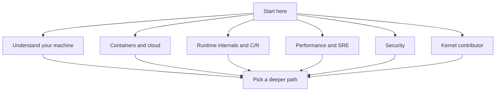

# How to Use This Book: Paths & Prerequisites

> **Goal:** understand what this book is, how it is organized, what the badges
> and features do, and — most usefully — which ordered path to follow for the
> kind of Linux understanding you actually want.

## What this book is

This is a field guide to how Linux works underneath the programs you run. Not
a distro tutorial, not a sysadmin cookbook, not API reference. The subject is
the **kernel** and the machinery around it: how a process becomes a running
thing, where your RAM went, what a container actually is, why a syscall is
expensive, how packets move, how the scheduler decides who runs next, and how
a live process can be frozen, serialized, migrated, and resumed — including
when part of its state lives on a GPU.

Every technical claim here was checked against **Linux kernel 6.12** — the
struct names, the function names, the default values, the sysctl knobs. Where a
fact changed across versions, it is pinned in the text ("since 6.6", "as of
6.12"), because "the kernel does X" is almost always a lie without a version
attached.

When you read a number like "the default page size is 4 KiB", assume it is
architecture-specific unless stated otherwise (that particular one is the
x86-64 default; arm64 kernels can be built for 4, 16, or 64 KiB pages).

The style is deliberately concrete. Instead of "the kernel tracks memory
regions," you get [`struct vm_area_struct`](https://elixir.bootlin.com/linux/v6.12/C/ident/vm_area_struct)
and the fields that matter. Instead of "you can inspect this," you get a
`Try it yourself` block with a real command whose output you can compare against
your own machine. The goal is that you finish a chapter able to *look*, not just
recall a paragraph.

## How it is organized

The book is split into parts that roughly climb in depth: the prerequisites
(what a CPU, a compiled program, and a C struct are — for readers who run Linux
commands daily but have never looked underneath them); what Linux is and how
it boots; the core kernel subsystems (processes, scheduling, memory, interrupts,
filesystems, networking); containers; checkpoint/restore and live migration;
hardware and virtualization; performance, observability, and security; and
finally the kernel's own development process.

You do not have to read them in order. The **paths** near the end of this
chapter are the recommended reading orders for specific goals — start there.

Two book-wide references live alongside the chapters. The [Glossary](#/glossary)
defines the terms that recur everywhere (page, PID, namespace, cgroup, RCU) so a
chapter can use a word without re-explaining it. And [What Is Linux, Really?](#/what-is-linux)
is the true starting line if you want the ground-level orientation before any
path.

One honest fork in the road before anything else: the main book assumes you can
read a hex address, a C struct, and a syscall signature without flinching. If
you administer Linux boxes competently but those three things are fog, **Part 0
— Prerequisites** exists precisely for you.

Start with [What This Book Assumes](#/prereq-overview): it lists the skills the
book expects but does *not* teach (terminal fluency, mostly), lets you
self-assess, and orders the four chapters that build everything else — the
machine, the compiled program, just-enough C, and how to read the book's
evidence. If you already own all that, skip Part 0 without guilt.

### The three level badges

Every chapter carries a **level badge** so you know how deep the water is before
you wade in:

- **fundamentals** (green) — concepts everyone using Linux benefits from, with
  no kernel-source spelunking required. All of Part 0,
  [What Is Linux, Really?](#/what-is-linux) and
  [From Power Button to Login](#/boot-process) are here.
- **mechanism** (amber) — how a subsystem actually works, including the key data
  structures and the paths through them. [Virtual Memory](#/memory) and
  [CPU Scheduling](#/scheduling) sit at this level. Most of the book does.
- **internals** (red) — deep dives that trace real kernel code and assume you are
  comfortable with the mechanism-level material. [Kernel Synchronization](#/kernel-sync)
  and [eBPF Internals](#/ebpf-internals) are red.

The badge is a difficulty signal, not a gate. Nothing stops you reading a red
chapter first — you will just get more from it after the amber ones it leans on.

A rough rule of thumb: green chapters you can read on a phone on the bus; amber
chapters reward a terminal open next to them so you can run the commands; red
chapters reward a terminal *and* the kernel source in another window, because
they name functions you may want to go read. The paths below are built so that
by the time a red chapter shows up, its amber prerequisites are already behind
you.

### The "requires:" line

Right under each chapter's badge you will see a **`requires:`** line listing the
chapters it assumes you have read. [Virtual Memory](#/memory) requires
[Processes & Threads](#/processes), because a page table only makes sense once
you know what an address space belongs to. This chapter's `requires:` line is
empty — it is the front door. Treat `requires:` as honest prerequisites, not
bureaucracy: skipping them usually means hitting a term the chapter expected you
to already own.

## Features you should actually use

This is a static site rendered in your browser, and it has a few tools worth
knowing about:

- **Search** — press <kbd>/</kbd> anywhere to jump to the search box. It indexes
  chapter titles and headings, so searching `oom` or `congestion` gets you
  straight there. This is faster than scrolling the table of contents once the
  book gets big.
- **Quizzes with hidden answers** — most chapters end with a *Check your
  understanding* section. Each question hides its answer inside a collapsible
  *Show answer* toggle. The toggle only helps if you use it honestly: form your
  answer *first*, out loud or on paper, *then* reveal. Retrieving an answer from
  memory is what makes it stick; reading the answer and nodding does almost
  nothing.
- **Hands-on labs** — chapters whose title starts with *Lab:* are guided
  exercises where you make the kernel do something observable: fill the page
  cache, get a process killed by the OOM killer, throttle a task with a cgroup,
  checkpoint and resurrect a process, serve page faults from userspace, or load
  a kernel module you compiled. They are the difference between knowing and
  having seen.
- **Reading-progress checkmarks** — the table of contents remembers which
  chapters you have finished and shows a checkmark. It is a private progress
  tracker, nothing more, but it is genuinely useful across a book this size when
  you return after a week away.

## Set up a safe playground first

Read this part before you run any lab.

The labs poke the kernel on purpose. You will trigger the out-of-memory killer,
push the machine into swap, load unsigned modules, and change kernel tunables. On
your daily-driver machine that ranges from *annoying* (a killed browser) to
*genuinely bad* (a wedged system, a panic from a buggy module). **Do the labs in
a throwaway environment**, not on the laptop you need for the rest of your day.

Two good options:

1. **A disposable Linux VM.** Fast to stand up, fully isolated, and you can
   snapshot before a risky lab and roll back after. On any host,
   [Multipass](https://multipass.run) gives you an Ubuntu VM in one command; on
   Apple Silicon, [UTM](https://mac.getutm.app) runs arm64 Linux nicely; on
   x86 desktops, VirtualBox is the classic choice.

   ```bash
   # One throwaway Ubuntu VM with Multipass
   multipass launch --name lab --cpus 2 --memory 4G --disk 20G
   multipass shell lab
   # ...break things...
   multipass delete lab && multipass purge   # gone without a trace
   ```

2. **A privileged distro container.** Lighter than a VM and fine for many labs,
   though it shares the host kernel — so anything that changes *kernel-global*
   state (loading a module, tweaking a boot-time sysctl) still affects the host.
   Prefer a VM for the module and OOM labs; a container is fine for cgroup and
   page-cache work.

   ```bash
   # Rootful, throwaway Fedora container (podman or docker)
   podman run --rm -it --privileged fedora:latest bash
   ```

Whichever you pick, the rule is the same: **assume the playground can die, and
make sure losing it costs you nothing.** Snapshot before the scary labs.

> **Container link:** the fact that a privileged container shares the host kernel
> — and therefore that some "container" changes are really host changes — is not
> a footnote, it is the whole story of what a container is. [What a Container
> Actually Is](#/containers-overview) unpacks it.

## Six guided paths

Here are ordered reading lists for six common goals. Each ends with a
**capstone lab** so you finish by doing, not just reading. Pick the one that
matches why you are here; you can always run another path afterward.

Every path below assumes the Part 0 material. If you have not read
[What This Book Assumes](#/prereq-overview) and its self-assessment yet, spend
ten minutes there first — it will either wave you through or save you from
bouncing off chapter three of whichever path you pick.

### 1. Understand your machine — foundations for everyone

The baseline mental model of a Linux system. If you only ever read one path,
read this one.

1. [What Is Linux, Really?](#/what-is-linux)
2. [From Power Button to Login](#/boot-process)
3. [Kernel, User Space & Syscalls](#/kernel-vs-userspace)
4. [Processes & Threads](#/processes)
5. [Virtual Memory](#/memory)
6. [Files, Filesystems & the VFS](#/filesystems)
7. [The Networking Stack](#/networking)

**Capstone:** [Lab: Watch the Page Cache Work](#/lab-page-cache) — see the memory
and filesystem material become visible numbers on your own machine.

### 2. Containers & cloud

What Docker and Kubernetes are actually built out of, from the kernel primitives
up to real runtimes.

1. [Kernel, User Space & Syscalls](#/kernel-vs-userspace)
2. [Processes & Threads](#/processes)
3. [What a Container Actually Is](#/containers-overview)
4. [Namespaces](#/namespaces)
5. [Control Groups (cgroup v2)](#/cgroups)
6. [Images & OverlayFS](#/overlayfs)
7. [Build a Container by Hand](#/build-a-container)
8. [Docker, containerd, runc](#/container-runtimes)
9. [Container Networking](#/container-networking)

**Capstone:** [Lab: Throttle a Process with cgroup v2](#/lab-cgroup-limits) — put
a real resource limit on a real process and watch it bite.

### 3. Runtime internals, checkpoint/restore & GPU

The specialist track: start with the Linux objects a checkpointer must
reconstruct, climb through container isolation and runtimes, then study CRIU
from dump to restore before reaching live migration and GPU state. The order is
deliberate — if a frontier chapter feels mysterious, descend one phase and fill
the missing mechanism instead of memorizing around it.

**Phase A — the process as kernel state**

1. [Kernel, User Space & Syscalls](#/kernel-vs-userspace)
2. [Processes & Threads](#/processes)
3. [CPU Scheduling](#/scheduling)
4. [Virtual Memory](#/memory)
5. [Files, Filesystems & the VFS](#/filesystems)
6. [Pipes, FIFOs & Unix Sockets](#/ipc-pipes)
7. [Interrupts, Exceptions & Softirqs](#/interrupts)
8. [The Networking Stack](#/networking)

**Phase B — the container as assembled isolation**

9. [What a Container Actually Is](#/containers-overview)
10. [Namespaces](#/namespaces)
11. [Control Groups (cgroup v2)](#/cgroups)
12. [Images & OverlayFS](#/overlayfs)
13. [Build a Container by Hand](#/build-a-container)
14. [Docker, containerd, runc](#/container-runtimes)
15. [Container Networking](#/container-networking)

**Phase C — checkpoint/restore, then the frontier**

16. [The Anatomy of Process State](#/process-state)
17. [CRIU: Dumping a Live Process](#/criu-dump)
18. [CRIU: The Restore](#/criu-restore)

**Milestone 1:** [Lab: Checkpoint & Restore a Real Process](#/lab-criu).
Do it now, while the dump and restore image families are fresh.

19. [Live Migration: Iterative, Lazy & TCP Repair](#/live-migration)

**Milestone 2:** [Lab: Serve Page Faults from Userspace](#/lab-userfaultfd).
It turns lazy restore's central mechanism into a program you can trace.

20. [The Snapshot Taxonomy: CRIU, gVisor & microVMs](#/snapshot-taxonomy)
21. [Devices, Drivers & Modules](#/devices-modules)
22. [GPU Checkpointing: cuda-checkpoint & CRIU Plugins](#/gpu-checkpoint)

The first milestone makes CRIU's images tangible; the second makes lazy
migration's page-fault path yours. Learn
[/proc, strace, perf & eBPF](#/observability) and [eBPF
Internals](#/ebpf-internals) in parallel once Phase A is comfortable: they are
the instruments you will use to measure every later phase.

### 4. Performance & SRE

For the people who get paged. Build the subsystem models first, then the
methodology that turns them into diagnoses.

1. [CPU Scheduling](#/scheduling)
2. [Virtual Memory](#/memory)
3. [The Linux Storage Stack](#/storage-stack)
4. [The Networking Stack](#/networking)
5. [/proc, strace, perf & eBPF](#/observability)
6. [Performance Analysis Methodology](#/perf-methodology)

**Capstones (do both):** [Lab: Watch the Page Cache Work](#/lab-page-cache) and
[Lab: Trigger & Autopsy the OOM Killer](#/lab-oom-killer) — the two memory
behaviours behind a large share of production incidents.

### 5. Security

How Linux draws its trust boundaries, and where they hold or leak — from the
syscall boundary down to CPU silicon.

1. [Kernel, User Space & Syscalls](#/kernel-vs-userspace)
2. [Namespaces](#/namespaces)
3. [Linux Security & Confinement](#/security-hardening)
4. [Trusted Computing: Secure Boot, TPM & IMA](#/trusted-computing)
5. [CPU Vulnerability Mitigations](#/cpu-mitigations)

**Capstone:** revisit [Lab: Throttle a Process with cgroup v2](#/lab-cgroup-limits)
with a confinement mindset — resource limits are a denial-of-service boundary as
much as a fairness one.

### 6. Future kernel contributor

If the goal is to send a patch someday, learn how the kernel keeps itself
correct, how it is governed, and how to build and modify it.

1. [Kernel Synchronization: Locks, Atomics & RCU](#/kernel-sync)
2. [How the Kernel Is Made: Process & Governance](#/kernel-governance)
3. [Reading & Building the Kernel](#/kernel-dev)

**Capstone:** [Lab: Write, Build & Load a Kernel Module](#/lab-kernel-module) —
your first real code running in kernel space. (Do this one in a VM.)



## How to read a chapter well

Three habits make the rest of the book pay off:

1. **Run the commands.** Every `Try it yourself` block is meant to be typed into
   your playground. Compare the output to the text; when it differs, you have
   learned something specific about *your* kernel.
2. **Answer the quiz before revealing.** It feels slower and it is not.
3. **Follow the prerequisites when a chapter stops making sense.** A confusing
   paragraph is usually a missing `requires:` chapter, not a hard concept.

That is the whole manual. Set up a VM, pick a path, and start with
[What This Book Assumes](#/prereq-overview) if the machinery below the shell is
new to you — or dive straight into [What Is Linux, Really?](#/what-is-linux).
