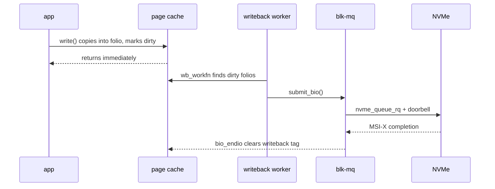

# The Linux Storage Stack

> **Goal:** follow an I/O request from `write()` to spinning rust (or flash), understanding every layer in between: the page cache, the bio, the block layer with blk-mq, the I/O scheduler, and the device mapper — and learn why each exists, how to inspect them, and how they shape real-world performance.

## Why a stack?

Applications call `write()`. The kernel needs to turn that into commands the disk controller understands. Between the two sits a pile of abstractions that exist for hard-learned reasons:

```
write() / read()
     ▼
  page cache         ← absorb, delay, coalesce, deduplicate
     ▼
  filesystem (ext4/xfs/btrfs)  ← map file offset → block number
     ▼
  bio layer          ← compose I/O requests as (device, sector, len, pages)
     ▼
  block layer / blk-mq   ← queue, merge, schedule, dispatch
     ▼
  I/O scheduler      ← reorder for rotational/throughput
     ▼
  device driver      ← talk to the hardware
     ▼
  disk / SSD
```

Every layer exists because someone ran a workload, measured, and found a bottleneck. Understanding the stack means understanding *why* each layer is there. The [VFS layer above it](#/filesystems) decides *which* blocks a file maps to; this chapter is about everything that happens after that decision. And the numbers explain the design: a 7200 RPM disk needs ~4 ms average seek plus ~4.2 ms average rotational latency per random access (call it 8 ms, ~125 random IOPS), a SATA SSD answers in 50–200 µs, and a decent NVMe drive in 10–100 µs while sustaining over a million IOPS. A stack designed around hiding 8 ms had to be rebuilt when the device started answering in 10 µs.

## The page cache: where writes begin

Every buffered `write()` lands in the **page cache** first — file data cached in RAM, indexed per file by `(inode, page offset)`. The write returns to user space the instant the data is copied into the cache; the kernel writes it to disk later, asynchronously. On x86-64 the base page is 4 KiB (arm64 kernels can be built with 4, 16, or 64 KiB pages), and since roughly v5.16 the page cache is managed in **folios** — a `struct folio` is one or more physically contiguous pages handled as a unit, which lets ext4/XFS cache and write back in chunks larger than 4 KiB.

The core data structure is `struct address_space` (one per cached inode, `inode->i_mapping`), whose fields you'll meet constantly in mm and fs code:

```c
// simplified — include/linux/fs.h
struct address_space {
    struct inode            *host;      // owning inode
    struct xarray            i_pages;   // the cached folios, indexed by page offset
    const struct address_space_operations *a_ops; // writepages, read_folio, ...
    unsigned long             nrpages;  // how many pages are cached
    // ... locks, gfp mask, writeback tags
};
```

`i_pages` is an **XArray** (which replaced the radix tree in v4.20): a sparse array mapping page-offset → folio, with per-entry tags marking folios *dirty* or *under writeback* so the flusher can find them without scanning. Lookup is lockless under RCU — see [Kernel Synchronization](#/kernel-sync).

```bash
# How much RAM is page cache right now?
grep -E '^(Cached|Dirty|Writeback):' /proc/meminfo
# Cached:    16234568 kB   ← total page cache
# Dirty:         4872 kB   ← pages modified but not yet on disk
# Writeback:        0 kB   ← pages currently being written to disk
```

### Writeback: when dirty data hits disk

Dirty folios are flushed by per-device **writeback workers** — you'll see them as `[kworker/uNN:X-flush-8:0]` in `ps`. Each block device has a `struct backing_dev_info` (BDI) with one or more `struct bdi_writeback` instances holding lists of dirty inodes (`b_dirty`, `b_io`, `b_more_io`) plus bandwidth estimates. Writeback triggers when:

- A folio has been dirty longer than `/proc/sys/vm/dirty_expire_centisecs` (default 3000 = 30 s); the flusher wakes every `dirty_writeback_centisecs` (default 500 = 5 s) to check.
- Dirty memory exceeds `dirty_background_ratio` (default 10 % of available memory) — background writeback starts, writers don't block yet.
- Dirty memory approaches `dirty_ratio` (default 20 %) — now writers themselves are throttled in `balance_dirty_pages()`, which inserts sleeps sized to each task's measured dirtying rate so dirty memory converges smoothly instead of hitting a wall.
- `sync()`, `fsync()`, or `fdatasync()` is called.
- Memory reclaim needs the page frames — see [Virtual Memory](#/memory).

Since cgroup v2 (the default on modern distros), writeback is **cgroup-aware**: each cgroup gets its own `bdi_writeback` instance, and the memory and io controllers cooperate so dirty-page throttling in `balance_dirty_pages()` respects per-cgroup I/O limits. There is no separate "dirty limit" file — the coupling happens through `memory.max` (which bounds how many dirty pages a group can hold) and `io.max`/`io.cost` (which bound how fast they drain). Try it in [Lab: Throttle a Process with cgroup v2](#/lab-cgroup-limits).

This is the fundamental difference from `O_DIRECT` (`open(..., O_DIRECT)`): direct I/O bypasses the page cache entirely and DMAs straight between user buffers and the device — at the price of alignment requirements (buffer, offset and length aligned to the logical block size) and no kernel caching. Databases use it to manage their own buffer pools; almost everything else is better off buffered. Neither is universally faster. For the third option — asynchronous I/O with shared rings — see [Modern I/O & io_uring](#/modern-io).

```bash
# See page cache in flight
vmstat 1        # watch bi/bo (block in/out), si/so (swap in/out)
grep -E 'pgpgout|pgpgin|pgsteal|pgscan' /proc/vmstat
```

Want to watch the cache absorb and replay writes in real time? That's exactly [Lab: Watch the Page Cache Work](#/lab-page-cache).

## The bio: the kernel's I/O request

The filesystem translates a file offset to a **block number** on the device, then builds a `struct bio` — the fundamental unit of block I/O since 2.5. In v6.12 the fields that matter (`include/linux/blk_types.h`):

```c
struct bio {
    struct bio          *bi_next;    // chain of bios in a request
    struct block_device *bi_bdev;    // target (partition-aware) device
    blk_opf_t            bi_opf;     // op (REQ_OP_READ/WRITE/FLUSH/DISCARD) | flags (REQ_SYNC, REQ_FUA, ...)
    struct bvec_iter     bi_iter;    // bi_sector (512 B units!), bi_size (bytes), current index
    bio_end_io_t        *bi_end_io;  // completion callback
    void                *bi_private; // owner's cookie
    unsigned short       bi_vcnt;    // number of bio_vecs
    struct bio_vec      *bi_io_vec;  // the actual (page, len, offset) segments
    // ... refcount, flags, integrity, cgroup association
};
```

Two details worth internalizing. First, `bi_iter.bi_sector` is **always in 512-byte units**, no matter whether the device uses 512-byte or 4096-byte logical blocks — a permanent source of off-by-8 bugs. Second, the data itself is described by an array of `struct bio_vec` — `(page, offset, len)` triples — so one bio can cover physically scattered pages; the driver turns this into a hardware scatter-gather list.

A bio is a "do this I/O on these pages" command. The block layer **merges** bios targeting adjacent sectors aggressively, and **splits** a bio that exceeds the device's limits (`/sys/block/*/queue/max_sectors_kb`, `max_segments`).

```bash
# Watch merge effectiveness
cat /sys/block/sda/stat        # fields: reads, read_merges, read_sectors, ...
# high merge counts = the block layer is saving you real seeks
```

A critical optimization: **plugging**. When a task starts a batch of I/O, the kernel calls `blk_start_plug()`, which anchors a small list of pending requests on the *task itself* (`current->plug`). Bios accumulate there — cheap, lock-free, per-task — until `blk_finish_plug()` (or the task blocking) flushes them into the queues in one go. That gives merging and sorting a natural batch boundary, and on rotational disks it cuts seeks dramatically.

## blk-mq: the multi-queue block layer

Since Linux 3.13 (2014) the kernel has **blk-mq**, a multi-queue block layer designed for devices that do millions of IOPS; the legacy single-queue path was removed entirely in 5.0. The old model had one request queue with one spinlock — profiled on early NVMe hardware, that lock (plus cache-line ping-pong and forced IRQ affinity) capped the whole system at well under a million IOPS regardless of core count.

blk-mq splits queueing in two:

```
    CPU 0        CPU 1        CPU 2        CPU 3
      │            │            │            │
  software      software     software     software
  staging       staging      staging      staging
  queue         queue        queue        queue
      │            │            │            │
      └────────────┼────────────┼────────────┘
                   │
          hardware dispatch queue(s)
                   │
              ┌────┴────┐
           NVMe SQ0  NVMe SQ1
```

- Each CPU gets a **software staging queue** (`struct blk_mq_ctx`, per-CPU): submission touches only local data, no shared lock.
- Each hardware queue the device exposes gets a **hardware dispatch context** (`struct blk_mq_hw_ctx`): it owns the tag set, the dispatch list, and the mapping of which CPUs feed it. Its key fields: `sched_tags`/`tags` (the tag bitmaps), `dispatch` (requests ready for the driver), `cpumask` (which CPUs map here), and `queue_num`.

The unit flowing through these queues is `struct request` — one or more merged bios plus queueing state: `rq->bio`/`rq->biotail` (the bio chain), `rq->__sector`, `rq->tag` (the hardware command slot), `rq->mq_hctx`, and `rq->state`. **Tags** are the clever bit: a request's tag *is* its index into the driver's command table, allocated from a scalable bitmap (`sbitmap`), so command lookup on completion is an array index, not a search. When all tags are in use, submitters sleep until a completion frees one — that's your backpressure mechanism.

```bash
# See the queue topology
ls /sys/block/nvme0n1/mq/
# 0/  1/  2/  ...  ← one directory per hardware queue

cat /sys/block/nvme0n1/mq/0/cpu_list    # which CPUs feed queue 0
cat /sys/block/nvme0n1/mq/0/nr_tags     # max in-flight commands per queue
```

The NVMe *spec* allows up to 65,535 I/O queues of up to 65,536 entries each; in practice Linux asks for one queue per CPU (and the driver splits them into default/read/poll sets). Because each CPU submits to its own queue and completions interrupt the same CPU (MSI-X affinity — see [Interrupts, Exceptions & Softirqs](#/interrupts)), NVMe throughput scales almost linearly with core count. On NUMA machines the queue memory is allocated on the node of the CPUs it serves — one more reason [NUMA placement](#/numa-deep-dive) matters for I/O-heavy workloads.

## The I/O scheduler

Between the software queues and the hardware dispatch queues sits the I/O scheduler. On rotational disks it matters enormously; on fast SSDs it's mostly about fairness and latency guarantees. The kernel's default policy since 5.0: devices with a **single** hardware queue get `mq-deadline`, devices with **multiple** hardware queues (NVMe) get `none`.

```bash
cat /sys/block/sda/queue/scheduler
# [mq-deadline] kyber bfq none
```

| Scheduler | Best for | What it does |
|---|---|---|
| **mq-deadline** | General default for single-queue devices | Orders by sector (minimize seeks), enforces per-request deadlines (500 ms read, 5 s write). Simple and fast. |
| **kyber** | Low-latency multi-queue SSDs | Token-bucket per I/O class. Limits effective queue depth to hit latency targets, adapting from observed completions. |
| **bfq** | Desktop interactivity, rotational | Proportional-share *budget* (in sectors) per process/cgroup. Prevents one heavy writer from starving interactive reads. Highest CPU cost per I/O. |
| **none** | NVMe, virtual block devices | No reordering at all — requests go straight to dispatch. Right choice when the hardware itself handles queueing. |

```bash
for d in /sys/block/{sd,nvme,vd}*/queue/scheduler; do
    echo "$d: $(cat $d)"
done
# NVMe devices usually show [none] — that's correct, not a misconfiguration.
```

### mq-deadline in depth

Deadline keeps two structures per direction: a red-black tree sorted by sector (for seek-minimizing dispatch and front-merges) and a FIFO sorted by expiry. Each request gets a deadline on entry:

- Reads: 500 ms (`read_expire`)
- Writes: 5000 ms (`write_expire`)

Normally it dispatches in sector order for throughput; if the head of a FIFO has expired, it dispatches from the FIFO instead, guaranteeing bounded latency. Reads are preferred because a process *waits* on reads; `writes_starved` (default 2) says how many read batches may run before writes must get a turn.

```bash
cat /sys/block/sda/queue/iosched/read_expire      # 500
cat /sys/block/sda/queue/iosched/write_expire     # 5000
cat /sys/block/sda/queue/iosched/writes_starved   # 2
```

### Kyber: what "adaptive" means

Kyber splits I/O into classes (sync reads, sync writes, other) and gives each a token bucket that limits how many requests may be in flight. It samples completion latencies; if reads finish slower than the target (default 2 ms, `read_lat_nsec`), it shrinks the write budget so reads see a shorter device queue. Self-tuning — for most workloads there's nothing to configure:

```bash
cat /sys/block/nvme0n1/queue/iosched/read_lat_nsec    # 2000000
cat /sys/block/nvme0n1/queue/iosched/write_lat_nsec   # 10000000
```

Related but separate: **writeback throttling** (`wbt`, `/sys/block/*/queue/wbt_lat_usec`) rate-limits *background writeback* requests whenever they'd push foreground read latency past a target — it runs even under scheduler `none`.

## The device mapper (DM): stacking block devices

On top of the block layer sits the **device mapper** (`drivers/md/dm.c`), a framework that builds virtual block devices by stacking transformation layers. A DM device is defined by a **table**: rows of `(start_sector, length, target_type, target_args)`. Each target type implements a `map()` callback that takes an incoming bio and redirects, clones, splits, or transforms it before passing it down. Every DM device appears as `/dev/dm-N` plus a `/dev/mapper/<name>` symlink.

Core DM targets:

| Target | What it does |
|---|---|
| **linear** | Map a range of sectors to another device, possibly at an offset |
| **striped** | Distribute sectors across multiple devices (RAID-0 equivalent) |
| **mirror** | RAID-1: replicate writes to multiple devices |
| **snapshot** | Copy-on-write snapshot of another device |
| **thin-pool** | Allocate blocks on demand from a shared pool; metadata-only snapshots |
| **crypt** | dm-crypt: transparent block-level encryption |
| **cache** | Fast device (SSD) caches slow device (HDD); writeback or writethrough |
| **integrity** | Per-block checksums; detect silent corruption |
| **verity** | Read-only device verified by a per-block Merkle tree (Android/ChromeOS boot, see [Trusted Computing](#/trusted-computing)) |
| **multipath** | Aggregate multiple paths to the same SAN storage with failover |
| **raid** | RAID 0/1/4/5/6/10 via DM (wraps the md-raid engine) |

LVM2 is the user-space manager that orchestrates these targets. When you create a logical volume, LVM2 computes the appropriate DM table and loads it into the kernel via `ioctl` on `/dev/mapper/control`:

```bash
dmsetup table          # every active DM device and its target table
dmsetup info           # metadata: open count, event number
dmsetup ls             # device names
dmsetup status         # health: sync progress for mirrors, pool usage for thin
```

### dm-crypt in action

```bash
# The kernel sees the stack:
#   ext4 on /dev/mapper/cryptroot on /dev/dm-0 on /dev/sda3
dmsetup table cryptroot
# 0 976770064 crypt aes-xts-plain64 <key> 0 8:3 4096
# └── start len  target cipher       key iv-offset major:minor sector-offset
```

Every block written to `/dev/sda3` is encrypted, every block read is decrypted, transparently, by cloning each bio and running it through the kernel crypto API — which uses AES-NI (x86-64) or the ARMv8 crypto extensions when available, keeping overhead in the low single-digit percent range on modern CPUs.

### Thin provisioning

DM thin-pool allocates blocks on first write, in units of the pool's block size (64 KiB–1 GiB, commonly 64–512 KiB). You can carve hundreds of thin volumes from one pool, and snapshots are metadata-only: origin and snapshot share physical blocks until one side writes, at which point the block is copied. This is how cloud providers give you "instant" volume snapshots — no data moves at snapshot time.

```bash
dmsetup status pool0
# 0 209715200 thin-pool 1 406/32768 12345/1638400 - rw ...
#                         └ meta used/total  └ data used/total (blocks)
```

> **Container link:** thin-pool was the engine behind Docker's old `devicemapper` storage driver, long deprecated and removed in Docker 25.0 in favor of `overlay2` — see [Images & OverlayFS](#/overlayfs) for why file-level CoW won that fight. Thin-pool lives on everywhere else: LVM snapshots, Kubernetes CSI drivers, cloud block storage.

The failure mode you must respect: when a thin-pool's *data* space runs out, writes to every thin volume in it start failing with `-ENOSPC` and volumes are typically switched to read-only/error mode; if the *metadata* space fills, the whole pool needs offline repair. Monitor `dmsetup status` before it happens.

## md-raid: the older sibling

Before dm-raid, Linux had (and still has) the MD ("multiple devices") subsystem (`drivers/md/md.c`). Both coexist — dm-raid is actually a DM wrapper around the same md RAID engine, which is why LVM RAID and `mdadm` arrays behave so similarly.

```bash
cat /proc/mdstat                           # active arrays, status, rebuild progress
mdadm --detail /dev/md0                    # full configuration
echo check > /sys/block/md0/md/sync_action # trigger a consistency check
cat /sys/block/md0/md/sync_completed       # progress of rebuild/check
```

The critical concept in any parity RAID: the **write hole**. A RAID-5 stripe update touches multiple disks non-atomically; if power fails mid-stripe, some disks hold new data, some old, and the parity is inconsistent — a later disk failure then "reconstructs" garbage. Mitigations:

- Battery-backed write cache (hardware RAID controllers)
- md-raid **journal** on a separate fast device (all stripe writes logged first)
- **PPL** (partial parity log) — parity deltas logged into each disk's metadata area
- Copy-on-write filesystems (ZFS, btrfs) that never overwrite a live stripe

```bash
mdadm --detail /dev/md0 | grep -E 'Level|State|Journal|Consistency'
```

## The NVMe revolution

NVMe (Non-Volatile Memory Express) is a command protocol designed from scratch for flash attached over PCIe. Compare the queueing models: SATA/AHCI gives you **one** command queue, 32 entries deep, with heavyweight per-command register access. NVMe gives you up to 65,535 I/O queue pairs, 65,536 entries each, living in ordinary host RAM: the driver writes a 64-byte command into a **submission queue**, rings a doorbell register, and the controller DMAs the command, executes it (out of order, freely), and posts a 16-byte entry to the paired **completion queue**, raising an MSI-X interrupt.

The Linux driver (`drivers/nvme/host/pci.c`) creates one queue pair per CPU and registers them with blk-mq as hardware contexts — the two designs fit like they were made for each other (blk-mq was, in fact, designed on NVMe prototypes).

```bash
nvme list                          # all NVMe controllers
nvme id-ctrl /dev/nvme0            # controller capabilities
nvme id-ns /dev/nvme0n1            # namespace details (LBA format, capacity)

ls /sys/block/nvme0n1/mq/ | wc -l  # hardware queues in use
cat /sys/block/nvme0n1/queue/nr_requests
```

NVMe also brings:

- **Multiple namespaces**: one controller, several independent logical devices (`nvme0n1`, `nvme0n2`) — like partitions, but managed by the controller.
- **Native multipath**: one namespace reachable through multiple controllers; the kernel's NVMe multipath (default since 4.15 with `CONFIG_NVME_MULTIPATH`) handles failover without device-mapper.
- **PRP/SGL data descriptors**: scatter-gather without bounce buffers.
- **End-to-end data protection**: per-block guard/reference tags checked by the controller.
- **Polling queues**: for ultra-low latency, completions can be polled instead of interrupt-driven (`io_uring` with `IORING_SETUP_IOPOLL` — see [Modern I/O & io_uring](#/modern-io)), trading CPU for a few microseconds.

## I/O cgroups: who gets the disk?

On cgroup v2 (the default on all major distros since ~2021) the unified **io controller** limits and prioritizes block I/O per cgroup — the mechanics of cgroups themselves are in [Control Groups (cgroup v2)](#/cgroups).

```bash
# Hard limits (io.max) — throttling
cat /sys/fs/cgroup/system.slice/io.max
# 8:0 rbps=104857600 wbps=104857600 riops=max wiops=10000
#  │   └─ read B/s      └─ write B/s              └─ write IOPS cap
# major:minor of the block device

echo "8:0 wbps=52428800" > /sys/fs/cgroup/system.slice/myapp/io.max

# Actual usage
cat /sys/fs/cgroup/system.slice/io.stat
# 8:0 rbytes=12345678 wbytes=987654 rios=1000 wios=500 ...
```

Three distinct mechanisms hide behind that one controller, and choosing matters:

- **`io.max`** — hard ceilings (bytes/s, IOPS). Simple, brutal: once a group hits its cap, its bios sit in a throttle queue and the submitting task sleeps. No borrowing of idle capacity.
- **`io.weight` via iocost** — proportional sharing. The kernel builds a cost model of the device (`io.cost.model`, `io.cost.qos`) and grants each cgroup a share of its estimated capacity; idle capacity *is* redistributed. This is what systemd's `IOWeight=` uses.
- **`io.latency`** — protection: guarantee a latency target for one group by throttling its siblings when the target is violated.

Because writeback is cgroup-aware, these limits reach *buffered* writes too: a container that dirties pages faster than its `io.max` allows gets slowed down inside `balance_dirty_pages()` — the `write()` call itself starts blocking. That's the answer to "why does my throttled container hang in `write()` when it never calls `fsync()`": the throttle propagates backwards from the device, through writeback, into the syscall.

```bash
# Watch I/O pressure (PSI) — the honest "are we I/O bound?" signal
cat /proc/pressure/io
# some avg10=3.45 avg60=1.23 avg300=0.56 total=123456789
# full avg10=7.89 avg60=3.45 avg300=1.23 total=987654321
```

`some` = at least one task stalled on I/O; `full` = *all* non-idle tasks stalled simultaneously. Per-cgroup versions live in each group's `io.pressure`. For how to use PSI in a real investigation, see [Performance Analysis Methodology](#/perf-methodology).

## Follow the code (kernel v6.12)

Two paths cover most of what this chapter described. Function names below are real v6.12 identifiers — click through and read along.

### Path 1: buffered `write()` into the page cache

1. The syscall lands in [ksys_write()](https://elixir.bootlin.com/linux/v6.12/C/ident/ksys_write) (`fs/read_write.c`), which resolves the fd and calls [vfs_write()](https://elixir.bootlin.com/linux/v6.12/C/ident/vfs_write) — the [VFS](#/filesystems) dispatch point.
2. `vfs_write()` calls the filesystem's `->write_iter`; for ext4 that's [ext4_file_write_iter()](https://elixir.bootlin.com/linux/v6.12/C/ident/ext4_file_write_iter), which takes the inode lock and (for the buffered case) falls through to [generic_perform_write()](https://elixir.bootlin.com/linux/v6.12/C/ident/generic_perform_write) (`mm/filemap.c`).
3. `generic_perform_write()` loops: ask the filesystem for a folio at this offset (`->write_begin`), copy user bytes into it with [copy_folio_from_iter_atomic()](https://elixir.bootlin.com/linux/v6.12/C/ident/copy_folio_from_iter_atomic), then `->write_end` marks the folio dirty — which sets the dirty tag on the `address_space` XArray and accounts the page in `/proc/meminfo`'s `Dirty`.
4. Each iteration calls [balance_dirty_pages_ratelimited()](https://elixir.bootlin.com/linux/v6.12/C/ident/balance_dirty_pages_ratelimited); if system- or cgroup-level dirty thresholds are near, the inner [balance_dirty_pages()](https://elixir.bootlin.com/linux/v6.12/C/ident/balance_dirty_pages) puts the task to sleep for a computed interval. **The syscall returns here — nothing has touched the disk.**
5. Later, a writeback worker runs [wb_workfn()](https://elixir.bootlin.com/linux/v6.12/C/ident/wb_workfn) (`fs/fs-writeback.c`), walks the BDI's dirty-inode lists via [writeback_sb_inodes()](https://elixir.bootlin.com/linux/v6.12/C/ident/writeback_sb_inodes), and calls [do_writepages()](https://elixir.bootlin.com/linux/v6.12/C/ident/do_writepages) on each mapping — for ext4, [ext4_writepages()](https://elixir.bootlin.com/linux/v6.12/C/ident/ext4_writepages), which maps dirty folios to disk blocks and packages them into bios.

### Path 2: a bio through blk-mq to NVMe

1. Whoever built the bio calls [submit_bio()](https://elixir.bootlin.com/linux/v6.12/C/ident/submit_bio) (`block/blk-core.c`) → [submit_bio_noacct()](https://elixir.bootlin.com/linux/v6.12/C/ident/submit_bio_noacct), which validates the bio against queue limits and walks stacked devices (this is where a dm-crypt bio gets remapped to the underlying disk).
2. For a real blk-mq device it reaches [blk_mq_submit_bio()](https://elixir.bootlin.com/linux/v6.12/C/ident/blk_mq_submit_bio) (`block/blk-mq.c`): split the bio if it exceeds hardware limits, try to merge it into a request already sitting in `current->plug`, and otherwise allocate a `struct request` — blocking on the tag `sbitmap` if the device is saturated.
3. On `blk_finish_plug()`, requests flow through the scheduler (if any) into the hardware context's dispatch list; [blk_mq_run_hw_queue()](https://elixir.bootlin.com/linux/v6.12/C/ident/blk_mq_run_hw_queue) → [blk_mq_dispatch_rq_list()](https://elixir.bootlin.com/linux/v6.12/C/ident/blk_mq_dispatch_rq_list) hands each request to the driver's `->queue_rq`.
4. For NVMe that's [nvme_queue_rq()](https://elixir.bootlin.com/linux/v6.12/C/ident/nvme_queue_rq) (`drivers/nvme/host/pci.c`): translate the request into a 64-byte NVMe command (the request's *tag* becomes the command ID), map the data for DMA, copy the command into the submission queue, and write the doorbell.
5. The device executes and posts a completion; the MSI-X handler [nvme_irq()](https://elixir.bootlin.com/linux/v6.12/C/ident/nvme_irq) reaps completion-queue entries, looks up the request by tag, and completes it via [blk_mq_end_request()](https://elixir.bootlin.com/linux/v6.12/C/ident/blk_mq_end_request), which calls [bio_endio()](https://elixir.bootlin.com/linux/v6.12/C/ident/bio_endio) on every bio in the request — running each bio's `bi_end_io` callback, which clears the writeback tag on the folios and wakes anyone sleeping in `fsync()`.

Browse the whole layer at [block/](https://elixir.bootlin.com/linux/v6.12/source/block), [drivers/md/](https://elixir.bootlin.com/linux/v6.12/source/drivers/md), and [drivers/nvme/host/](https://elixir.bootlin.com/linux/v6.12/source/drivers/nvme/host).



## Try it yourself

```bash
# Trace bios through the block layer with tracepoints
echo 1 > /sys/kernel/debug/tracing/events/block/block_bio_queue/enable
echo 1 > /sys/kernel/debug/tracing/events/block/block_rq_issue/enable
echo 1 > /sys/kernel/debug/tracing/events/block/block_rq_complete/enable
cat /sys/kernel/debug/tracing/trace_pipe | head -20
# or, friendlier: biolatency / biosnoop from bcc-tools (see the observability chapter)

# Stack your own block device (ramdisk → crypt → fs)
modprobe brd rd_nr=1 rd_size=1048576              # 1 GiB RAM disk
cryptsetup luksFormat /dev/ram0                    # encrypt it
cryptsetup open /dev/ram0 crypt-rd
mkfs.ext4 /dev/mapper/crypt-rd
mount /dev/mapper/crypt-rd /mnt/test
echo "hello through the layers" > /mnt/test/msg

# See the full stack
lsblk /dev/ram0                    # tree: ram0 → crypt-rd → mount point
dmsetup table crypt-rd             # crypt target parameters

# Measure page cache vs direct I/O
dd if=/dev/zero of=/mnt/test/big bs=1M count=1000 oflag=direct
dd if=/dev/zero of=/mnt/test/big bs=1M count=1000
dd if=/dev/zero of=/mnt/test/big bs=1M count=1000 conv=fsync   # honest buffered number
```

The tracing tools above (`biolatency`, `biosnoop`, ftrace tracepoints) are covered in depth in [/proc, strace, perf & eBPF](#/observability).

## Check your understanding

1. Why does `dd if=/dev/zero of=test bs=1M count=1000` report blazing speed even on a slow disk?

<details><summary>Show answer</summary>

The data only reaches the page cache — `dd` finishes when the last byte is buffered in RAM, not when it hits disk. Writeback happens later, asynchronously. Add `conv=fsync` or `oflag=direct` to measure the device instead of your RAM.

</details>

2. An NVMe SSD exposes 4 hardware queues but the server has 64 CPUs. What happens to the other 60 CPUs' I/O?

<details><summary>Show answer</summary>

Nothing bad: blk-mq maps multiple per-CPU software staging queues onto each hardware queue (16 CPUs per hardware context here, tracked in `hctx->cpumask`). Submission stays lock-free and CPU-local; the sharing cost appears only at dispatch time, when requests from those 16 CPUs funnel into one tag set.

</details>

3. Why does mq-deadline prioritize reads (500 ms deadline) over writes (5000 ms)?

<details><summary>Show answer</summary>

A process *waits* on reads — someone opening a file is blocked until the data arrives — while writes usually complete into the page cache and are flushed in the background. Read latency is user-visible latency; write latency mostly isn't. `writes_starved` (default 2) still guarantees writes eventually get a turn.

</details>

4. `bi_iter.bi_sector` on a bio targeting a 4Kn drive (4096-byte logical blocks) reads 800. Which byte offset is that?

<details><summary>Show answer</summary>

Byte 409,600. `bi_sector` is *always* in 512-byte units regardless of the device's logical block size — 800 × 512 = 409,600, which is logical block 100 on that drive. Forgetting this convention is a classic block-layer bug.

</details>

5. A thin-pool runs out of data space. What happens to mounted thin volumes using that pool?

<details><summary>Show answer</summary>

New allocations fail: writes to unprovisioned blocks return `-ENOSPC` and the volumes are typically flipped to read-only or error mode (already-provisioned blocks may still be readable). If the *metadata* space also fills, the entire pool needs offline repair. This is why monitoring `dmsetup status` pool usage is non-negotiable.

</details>

6. You set a low `io.max` write limit on a container. The app inside starts hanging in plain buffered `write()` calls — it never calls `fsync()`. Why?

<details><summary>Show answer</summary>

cgroup v2 writeback is I/O-controller-aware. The container's dirty pages drain at the throttled rate, so its dirty budget stays full, and `balance_dirty_pages()` puts the writing task to sleep inside the `write()` syscall until writeback catches up. The throttle at the device propagates backwards into the syscall.

</details>

7. Your NVMe drive shows scheduler `[none]`. Should you "fix" it by enabling mq-deadline?

<details><summary>Show answer</summary>

Usually not. `none` is the deliberate kernel default for multi-queue devices: the drive's own controller reorders across 65 K-entry queues far better than software can, and any scheduler adds per-request CPU cost at millions of IOPS. Pick kyber or bfq only if you have a measured latency-fairness problem (e.g. one cgroup starving another).

</details>

## Sources & further reading

- [Block layer documentation](https://docs.kernel.org/block/index.html) — docs.kernel.org, including the blk-mq design document
- [Multi-Queue Block IO Queueing Mechanism (blk-mq)](https://docs.kernel.org/block/blk-mq.html) — docs.kernel.org
- [Device mapper documentation](https://docs.kernel.org/admin-guide/device-mapper/index.html) — every DM target's table format
- [Documentation for /proc/sys/vm/](https://docs.kernel.org/admin-guide/sysctl/vm.html) — dirty_ratio and friends, authoritative defaults
- [Control Group v2](https://docs.kernel.org/admin-guide/cgroup-v2.html) — the io controller: io.max, io.weight/iocost, io.latency
- [The multiqueue block layer](https://lwn.net/Articles/552904/) — Jonathan Corbet, LWN, 2013: why the single queue had to die
- [open(2)](https://man7.org/linux/man-pages/man2/open.2.html) — the fine print on `O_DIRECT` alignment, and [dmsetup(8)](https://man7.org/linux/man-pages/man8/dmsetup.8.html)
- Source: [block/](https://elixir.bootlin.com/linux/v6.12/source/block), [drivers/md/](https://elixir.bootlin.com/linux/v6.12/source/drivers/md), [drivers/nvme/host/](https://elixir.bootlin.com/linux/v6.12/source/drivers/nvme/host)
- *Systems Performance* (2nd ed.), Brendan Gregg — chapter 9 (Disks) for the measurement methodology side

---

**Next:** the storage stack sends I/O to devices — but what are those devices, really? How does the kernel represent hardware, load drivers on demand, and make every disk, GPU, and printer show up under `/dev`? On to [Devices, Drivers & Modules](#/devices-modules).
