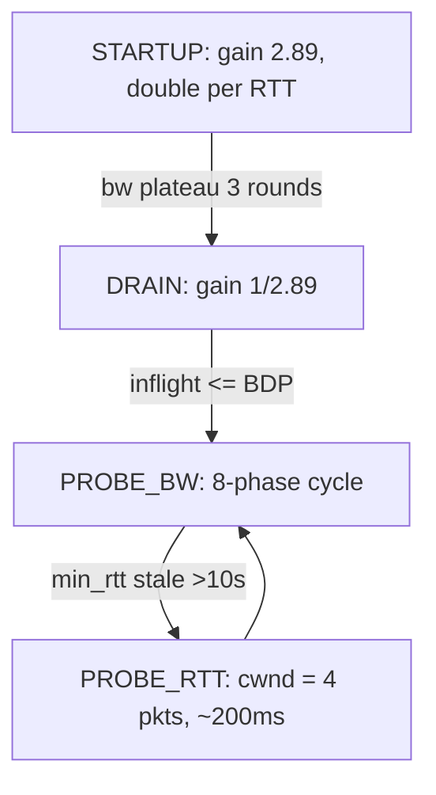

# TCP Congestion Control & Tuning

> **Goal:** understand what TCP congestion control actually does in the kernel — not just the algorithm names, but the pacing, the queues, the sysctl knobs, the interaction with packet scheduling, and why changing `tcp_congestion_control` can transform your workload's behavior from terrible to excellent.

This chapter builds directly on [The Networking Stack](#/networking): you should already know how a packet travels from `send()` through the socket layer, the qdisc, and the NIC driver. Here we zoom into the control loop that decides *how fast* those packets are allowed to leave.

## The problem congestion control solves

TCP reliably delivers a stream of bytes. But between the sender and receiver sits a network — a shared resource of unknown capacity. Send too fast, and intermediate routers drop packets. Send too slow, and you waste available bandwidth.

The kernel doesn't know the path capacity. It must **discover** it dynamically by probing, observing packet loss (or delay), and adjusting the **congestion window** (cwnd): a cap on the amount of unacknowledged data allowed in flight. Two windows constrain a sender at all times:

- **cwnd** — the sender's own estimate of what the *network* can absorb. In Linux it is counted in **segments**, not bytes: `tp->snd_cwnd` (read via the [tcp_snd_cwnd()](https://elixir.bootlin.com/linux/v6.12/C/ident/tcp_snd_cwnd) accessor since 5.19). A cwnd of 10 with a 1460-byte MSS means ~14.6 KB in flight.
- **rwnd** — the *receiver's* advertised window, what the peer's buffer can absorb. The effective window is `min(cwnd, rwnd)`.

The whole thing is a control loop clocked by ACKs. Each ACK is feedback from the network — it says "this much data got through" — and the algorithm reacts by nudging cwnd up or down. That "self-clocking" property (an ACK returns roughly every time a packet drains from the bottleneck) is what keeps a TCP flow from overrunning the path even before any explicit rate calculation. The delivered bytes pull new bytes out behind them.

### Slow start: exponential probing

Every new connection starts in **slow start** with an initial window of **10
segments** (IW10, the default since kernel 2.6.39; the value comes from
[TCP_INIT_CWND](https://elixir.bootlin.com/linux/v6.12/C/ident/TCP_INIT_CWND)).
With a 1460-byte MSS that is ~14.2 KB — enough to fit a small HTTP response in
the first burst without waiting for the window to open.

Each ACK during slow start grows cwnd by the number of newly acknowledged
segments, so the window roughly **doubles every RTT**: 10 → 20 → 40 → 80. The
growth is driven by
[tcp_slow_start()](https://elixir.bootlin.com/linux/v6.12/C/ident/tcp_slow_start),
which adds the acked count to cwnd and clamps at `snd_ssthresh`.

Slow start ends one of two ways: cwnd crosses `snd_ssthresh` (the slow-start threshold — initialized to effectively infinity, `TCP_INFINITE_SSTHRESH`, so a fresh connection stays in slow start until its *first* loss), or a loss is detected. Either way the connection switches to the algorithm's **congestion avoidance** mode, where growth becomes linear or curve-shaped instead of exponential.

Doubling every RTT is fast, and on a fat path it overshoots badly: the window can blow past the true BDP in a single RTT and dump a large burst into the bottleneck, causing a wave of loss. Linux mitigates this with **HyStart** (covered under CUBIC below), which tries to exit slow start on *delay* signals before that first loss.

### Congestion avoidance: linear probing

Once past ssthresh, classic (Reno) congestion avoidance grows cwnd by roughly **one segment per RTT** — additive increase. The kernel implements this in [tcp_cong_avoid_ai()](https://elixir.bootlin.com/linux/v6.12/C/ident/tcp_cong_avoid_ai), which uses a counter (`tp->snd_cwnd_cnt`) that accumulates acked segments and bumps cwnd by one only after a full window's worth of ACKs. Reno's response to loss is Multiplicative Decrease: halve cwnd. This "AIMD" (Additive Increase, Multiplicative Decrease) sawtooth is the archetype every other algorithm is measured against. CUBIC and BBR replace the increase rule (and CUBIC softens the decrease); the ACK-clock underneath is unchanged.

```text
sender                                    receiver
  │──── seq=1..1000 ─────────────────────→│
  │──── seq=1001..2000 ──────────────────→│
  │──── seq=2001..3000 ────X  (lost)      │
  │                                        │── ack=2001 (expecting 2001)
  │←── ack=2001 ────────────────────────│     "duplicate ack"
  │←── ack=2001 ────────────────────────│     "duplicate ack"
  │←── ack=2001 ────────────────────────│     "triple duplicate ack" = loss signal
  │──── seq=2001..3000 ──────────────────→│  (fast retransmit, cwnd reduced)
```

The diagram above shows the *classic* three-duplicate-ACK loss detector.
Modern Linux mostly doesn't wait for three dupacks: since 4.18 the default
loss detection is **RACK-TLP** (RFC 8985, `net.ipv4.tcp_recovery=1`), which
marks a segment lost when a segment sent *later* has been (S)ACKed and more
than a small reordering window has elapsed.

That window is adaptive — it starts around a quarter of the smoothed RTT
(`tp->srtt_us / 4`) and stretches when reordering is actually observed, so a
path that shuffles packets doesn't trigger spurious retransmits.

Time-based detection recovers from tail losses that dupack-counting never
sees: if the last segment of a response is dropped, there are no *later*
segments to generate dupacks, so classic Reno would sit until the
retransmission timeout.

The **Tail Loss Probe (TLP)** fires first, after ~2 sRTT, resending the last
segment (or sending a new one) to provoke a SACK instead of waiting out the
full RTO. The RTO itself has a 200 ms floor on Linux (`TCP_RTO_MIN`) and an
initial value of 1 s per RFC 6298.

The congestion window is not `socket.send_buffer_size`. It's a dynamic cap managed *per connection* by the kernel. Every ACK increases it slightly; every loss decreases it sharply. This loop is the entire game.

```bash
# What algorithm is your host using?
sysctl net.ipv4.tcp_congestion_control
# Available algorithms (loaded modules):
sysctl net.ipv4.tcp_available_congestion_control
# Algorithms unprivileged apps may select via setsockopt(TCP_CONGESTION):
sysctl net.ipv4.tcp_allowed_congestion_control

# Change it (takes effect for new connections)
sysctl -w net.ipv4.tcp_congestion_control=bbr
```

> **Container link:** `net.ipv4.tcp_congestion_control` is **per network namespace** since kernel 4.15. A container with its own netns (see [Namespaces](#/namespaces) and [Container Networking](#/container-networking)) can run BBR while the host runs CUBIC — no reboot, no global effect. Applications can also override it per socket with `setsockopt(fd, IPPROTO_TCP, TCP_CONGESTION, "bbr", 3)`.

## The data structures: where cwnd actually lives

Everything congestion control touches hangs off [struct tcp_sock](https://elixir.bootlin.com/linux/v6.12/C/ident/tcp_sock) (defined in `include/linux/tcp.h`), which embeds [struct inet_connection_sock](https://elixir.bootlin.com/linux/v6.12/C/ident/inet_connection_sock). The fields that matter:

| Field | Meaning |
|---|---|
| `tp->snd_cwnd` | congestion window, in segments |
| `tp->snd_ssthresh` | slow-start threshold, in segments |
| `tp->snd_una` | oldest unacknowledged sequence number (left edge of the window) |
| `tp->snd_nxt` | next sequence number to send |
| `tp->srtt_us` | smoothed RTT, stored as 8× the value in µs |
| `tp->rttvar_us` | RTT variance — feeds the RTO computation |
| `tp->packets_out` | segments currently in flight |
| `tp->sacked_out` / `tp->lost_out` / `tp->retrans_out` | segments SACKed, marked lost, and retransmitted |
| `tp->delivered` / `tp->delivered_ce` | cumulative delivered segments (and ECN-marked ones) — the basis of BBR's rate samples |
| `icsk->icsk_ca_state` | recovery state machine: `Open`, `Disorder`, `CWR`, `Recovery`, `Loss` |
| `icsk->icsk_ca_ops` | pointer to the active algorithm's ops table |
| `sk->sk_pacing_rate` | bytes/sec the socket is allowed to release (enforced by FQ or internal pacing) |

The quantity the sender actually cares about is *in-flight*: `packets_out - (sacked_out + lost_out) + retrans_out`, computed by [tcp_packets_in_flight()](https://elixir.bootlin.com/linux/v6.12/C/ident/tcp_packets_in_flight). A new segment may leave only while in-flight is below cwnd. That single comparison is where the congestion window bites.

Congestion control algorithms are pluggable modules implementing [struct tcp_congestion_ops](https://elixir.bootlin.com/linux/v6.12/C/ident/tcp_congestion_ops) (`include/net/tcp.h`). The key callbacks:

- `.ssthresh` — what to set ssthresh to after loss (CUBIC: `0.7 × cwnd`; Reno: `0.5 × cwnd`)
- `.cong_avoid` — grow cwnd per ACK (the classic hook; CUBIC uses this)
- `.cong_control` — full takeover of cwnd *and* pacing rate on every ACK (BBR uses this instead)
- `.undo_cwnd` — restore cwnd when a loss turns out to be spurious (detected via DSACK or timestamps)
- `.pkts_acked`, `.set_state`, `.cwnd_event` — notifications the algorithm can observe
- `.init` / `.release` — allocate and tear down the algorithm's per-socket state

Modules register themselves with [tcp_register_congestion_control()](https://elixir.bootlin.com/linux/v6.12/C/ident/tcp_register_congestion_control) in `net/ipv4/tcp_cong.c`. That's the whole plugin API — CUBIC, BBR, DCTCP, Vegas and a dozen others are just modules filling in this table. Each algorithm gets `ICSK_CA_PRIV_SIZE` (currently 168 bytes in 6.12) of per-socket private scratch space in `icsk->icsk_ca_priv[]`, cast to the algorithm's own state struct — CUBIC stores its `struct bictcp` there, BBR its `struct bbr`. Since kernel 5.6 you can even write a congestion control algorithm in eBPF and load it without a module, using the struct_ops mechanism (see [eBPF Internals](#/ebpf-internals)).

The five `icsk_ca_state` values drive recovery: `Open` is normal operation;
`Disorder` means SACKs/dupacks arrived but nothing is marked lost yet; `CWR`
(Congestion Window Reduced) means the window is being reduced in response to
ECN or local congestion, via
[tcp_enter_cwr()](https://elixir.bootlin.com/linux/v6.12/C/ident/tcp_enter_cwr);
`Recovery` means fast retransmit is in progress (entered via
[tcp_fastretrans_alert()](https://elixir.bootlin.com/linux/v6.12/C/ident/tcp_fastretrans_alert));
`Loss` means an RTO fired and cwnd collapsed to 1 segment
([tcp_enter_loss()](https://elixir.bootlin.com/linux/v6.12/C/ident/tcp_enter_loss)).

The reduction during `Recovery` is metered out gradually by **Proportional
Rate Reduction** (PRR, RFC 6937,
[tcp_cwnd_reduction()](https://elixir.bootlin.com/linux/v6.12/C/ident/tcp_cwnd_reduction))
rather than dropped in one step, so the flow keeps sending at roughly the
reduced rate instead of stalling and bursting.

## The classic: CUBIC

The default in Linux since kernel 2.6.19 (and still the most common default worldwide; standardized in RFC 9438). CUBIC's key insight: after a loss event, don't grow the window linearly (like classic Reno). Grow it as a **cubic function of wall-clock time** since the loss:

```text
W(t) = C·(t − K)³ + W_max      where K = ∛(W_max·β/C),  C = 0.4,  β = 0.3
```

`W_max` is the window where the last loss happened. The curve is concave below `W_max` (fast growth toward the old capacity, slowing as it approaches), flat around `W_max` (gentle probing near the estimated capacity), then convex above it (aggressive probing for newly freed bandwidth).

```text
window size
    │       ╱╲        ╱╲
    │      ╱  ╲      ╱  ╲      ← cubic probes aggressively in "concave" region
    │     ╱    ╲    ╱    ╲
    │────╱      ╲──╱      ╲─── ← plateaus near estimated capacity
    │   ╱        ╲╱        ╲
    │──╱─────────────────────╲──
    └────────────────────────────→ time
         loss     loss     loss
```

On loss, CUBIC multiplies cwnd by **0.7** (the `beta` module parameter,
717/1024) instead of Reno's 0.5 — a gentler backoff suited to large windows.

Because growth depends on *time* rather than on ACK arrivals, CUBIC is
RTT-fair: a connection with 200 ms RTT probes at the same clock-time rate as
one with 5 ms RTT. Reno grows per-ACK, so high-RTT connections grow painfully
slowly (the "RTT unfairness" problem).

CUBIC also runs a **Reno-friendly region**: it computes what a Reno flow's
window would be and uses the larger of the two, so on short-RTT paths where
cubic growth would be slower than Reno's, CUBIC doesn't lose ground to legacy
TCP.

Linux's CUBIC also ships **HyStart**: instead of slow-starting blindly until the first loss (overshooting badly on big-BDP paths), HyStart watches two signals — the spacing of ACK trains and a rise in the minimum RTT within a round — and exits slow start into congestion avoidance *before* the queue overflows. Kernel 5.11 refined this toward the standardized **HyStart++** heuristics (RFC 9406), which replace the fragile ACK-train detector with a more robust RTT-based trigger and add a "conservative slow start" ramp after the exit.

One correction to folklore: CUBIC's knobs are **module parameters**, not sysctls — there is no `net.ipv4.tcp_cubic_beta`:

```bash
# CUBIC-specific knobs live in /sys/module
grep -H . /sys/module/tcp_cubic/parameters/*
# beta:717               (multiply cwnd by 717/1024 ≈ 0.7 on loss)
# fast_convergence:1     (release bandwidth faster when flows leave)
# hystart:1              (exit slow start early on RTT/ACK-train signals)
# hystart_low_window:16  (only apply HyStart above this cwnd)
```

But CUBIC has a fundamental issue on modern links: it uses **packet loss** as the congestion signal. On shallow-buffered links, it must *induce* loss to find capacity. On deep-buffered links, it inflates queues before ever seeing loss — the "bufferbloat" problem — causing massive latency under load.

## BBR: model the pipe instead

BBR (Bottleneck Bandwidth and Round-trip propagation time), developed at Google and merged in kernel 4.9, rethinks the problem. Instead of probing for loss, BBR builds an explicit model of the path from two continuously updated measurements:

1. **BtlBw** — the bottleneck bandwidth, estimated as the **windowed maximum** delivery rate over the last ~10 round trips (computed from `tp->delivered` deltas by [tcp_rate_gen()](https://elixir.bootlin.com/linux/v6.12/C/ident/tcp_rate_gen), fed into BBR's max-filter)
2. **RTprop** — the propagation delay, estimated as the **windowed minimum** RTT over the last **10 seconds**
3. Target in-flight data = BtlBw × RTprop — exactly the **BDP** (bandwidth-delay product)

The insight is that BtlBw and RTprop can never be measured *simultaneously*: to see the true bottleneck bandwidth you must fill the pipe (which builds queue and inflates RTT), and to see the true propagation delay you must empty the pipe (which under-utilizes bandwidth). BBR times-shares — it spends most of its time measuring bandwidth and periodically drops the window low to re-measure RTT.

```text
CUBIC mental model:  "increase until loss, then back off"
BBR mental model:    "measure the pipe, then fill it exactly"

                                         BBR pacing rate
                                            ╭─────┴──────╮
         sender    │←───── BDP ─────→│   receiver
                   │  bandwidth × RTT │
                   │  worth of bytes  │
```

BBR sets `sk_pacing_rate = pacing_gain × BtlBw` and caps in-flight at `cwnd_gain × BDP` (cwnd_gain is 2, giving headroom for delayed/aggregated ACKs). It is a small state machine, and knowing it makes `ss -tin` output legible:



- **STARTUP** paces at gain 2/ln 2 ≈ 2.89 — doubling delivery rate each RTT like slow start — and exits when measured bandwidth stops growing by >25% for 3 consecutive rounds.
- **DRAIN** inverts the gain (1/2.89) to drain the queue STARTUP built, exiting once in-flight falls to the estimated BDP.
- **PROBE_BW** — where a steady connection spends almost its whole life — cycles through 8 pacing-gain phases `[1.25, 0.75, 1, 1, 1, 1, 1, 1]`, each lasting about one RTprop: one phase briefly probes for more bandwidth at 1.25×, the next drains the resulting queue at 0.75×, and the remaining six cruise at 1×.
- **PROBE_RTT** kicks in when the min-RTT sample is older than 10 s: cwnd drops to **4 segments** for max(200 ms, 1 round trip) so the queue empties and a true propagation-delay sample can be taken. This is the periodic throughput dip you see on long BBR transfers.

BBR doesn't need loss to back off, so it keeps the bottleneck queue small: high throughput **and** low latency simultaneously — the combination loss-based CUBIC structurally can't deliver. It also shrugs off *random* (non-congestion) loss, which is why it dramatically outperforms CUBIC on lossy WiFi and long lossy WAN paths where even a 0.1% loss rate caps CUBIC's window (Reno/CUBIC throughput scales as roughly `MSS / (RTT·√p)`, so loss rate `p` is a hard ceiling).

However, BBRv1 — which is what mainline ships as of 6.12 ([net/ipv4/tcp_bbr.c](https://elixir.bootlin.com/linux/v6.12/source/net/ipv4/tcp_bbr.c)) — has real fairness issues: it largely ignores loss and ECN, so at deep-buffered bottlenecks BBR flows can hold a persistent standing queue and starve CUBIC flows sharing the link, while at shallow-buffered bottlenecks multiple BBR flows can drive high retransmit rates. Google's BBRv2 and then **BBRv3** (2023) add loss- and ECN-responsiveness and gentler probing; as of kernel 6.12 they remain out-of-tree (maintained in Google's public BBR repository), so "BBR" on a stock kernel means v1.

```bash
# Enable BBR
modprobe tcp_bbr
sysctl -w net.ipv4.tcp_congestion_control=bbr

# Verify per-connection: look for "bbr" plus bw/mrtt/pacing_gain in the info line
ss -tin | grep -A1 bbr
```

### What "pacing" means

A crucial BBR innovation: **pacing**. Instead of bursting out a full cwnd when a window of ACKs arrives, the sender spaces packets evenly across the RTT at `sk->sk_pacing_rate` bytes/sec. Two mechanisms can enforce it:

- The **FQ qdisc** (`sch_fq`, kernel 3.12+): per-flow queues plus a per-flow release timestamp, honoring `sk_pacing_rate` with hrtimer precision (see [Timers & Time: jiffies, hrtimers & Tickless](#/timers)).
- **TCP internal pacing** (kernel 4.13+): if no FQ qdisc is present on the path out, TCP itself arms an hrtimer per socket and delays transmissions. It's automatic — there is no sysctl to switch it on; the kernel tracks which mechanism is active in `sk->sk_pacing_status` (`SK_PACING_FQ` vs `SK_PACING_NEEDED`). FQ is still preferred for BBR at scale because a single qdisc timer is cheaper than one hrtimer per socket.

Pacing isn't only for BBR: CUBIC connections are paced too when FQ is present, using the pacing-ratio sysctls:

```bash
sysctl net.ipv4.tcp_pacing_ss_ratio   # 200: pace at 2× current rate in slow start
sysctl net.ipv4.tcp_pacing_ca_ratio   # 120: pace at 1.2× in congestion avoidance
```

Loss-based algorithms don't set `sk_pacing_rate` themselves; the kernel derives it from `cwnd / srtt` scaled by these ratios (the 2× in slow start lets the window keep doubling; the 1.2× headroom in congestion avoidance covers ACK jitter). Without pacing, TCP bursts a cwnd's worth of data the instant a stretch ACK arrives, creating micro-queues at every bottleneck hop. Pacing smooths this into a near-constant-rate stream — measurably fewer drops and retransmits even for CUBIC.

## Congestion signals beyond loss

### ECN (Explicit Congestion Notification)

Instead of dropping packets, a bottleneck router marks them with the CE (Congestion Experienced) codepoint in the two ECN bits of the IP header. The receiver echoes this in ACKs (the ECE flag), and the sender reduces cwnd and enters the `CWR` state — **without any retransmission**.

```bash
sysctl net.ipv4.tcp_ecn     # 2 (default): accept ECN if peer requests, never request
                            # 1: request ECN on outgoing connections too
                            # 0: disabled
ss -tin | grep ecn          # connections that negotiated ECN show "ecn"
```

ECN avoids the retransmission penalty of loss-based signaling. For datacenter
workloads (small flows, shallow switch buffers), it can cut tail latency by
orders of magnitude. The catch: a small number of broken middleboxes strip or
mangle ECN bits — which is why the default (`tcp_ecn=2`) is passive. Note the
default is *accept-only*, not off.

Classic RFC 3168 ECN is also coarse — one mark per RTT triggers a full
back-off. **Accurate ECN** (AccECN, RFC 9768) fixes that by feeding back an
exact *count* of CE marks, which is what DCTCP and BBRv2/v3 want; Linux has
had experimental AccECN support gated behind `net.ipv4.tcp_ecn` mode bits.

### DCTCP: ECN as a proportional signal

**DCTCP** (Data Center TCP, mainline since 3.18) treats ECN marks not as a binary "back off" but as a *fraction*. It maintains a running estimate `α` of the proportion of the last window's packets that were CE-marked (an exponentially weighted moving average), and reduces cwnd proportionally: `cwnd ← cwnd × (1 − α/2)`. When almost everything is marked, `α → 1` and it behaves like Reno's halving; when only a few packets are marked, it barely backs off. With switches configured to mark early at a shallow single-packet threshold (K), DCTCP keeps queues a few packets deep while staying at full throughput. It is unsafe on the public internet — it interprets the standard one-mark-per-RTT signal far too gently and competes unfairly with normal TCP — so it is datacenter-only, as the name says.

### RTT-based signals (delay-based)

BBR, Vegas, and CDG use increasing RTT as an early congestion signal — the
queue is growing, so back off *before* it overflows. This is the fundamental
split in the design space: loss-based algorithms fill queues until they
overflow; delay/model-based algorithms try to never fill them at all.

The weakness of pure delay-based schemes is that they lose to loss-based ones
when sharing a link — a Vegas flow backs off on rising RTT while a CUBIC flow
keeps pushing, so CUBIC steals the capacity. BBR sidesteps this by not backing
off on delay alone; it paces to its bandwidth *model* and only visits low-RTT
territory briefly during PROBE_RTT.

## The complete sysctl landscape

TCP is the most configurable subsystem in Linux (full reference: the kernel's [ip-sysctl documentation](https://docs.kernel.org/networking/ip-sysctl.html)). The knobs that matter most, with 6.12 defaults:

```bash
# Buffers — the single biggest performance lever
sysctl net.ipv4.tcp_rmem           # 4096 131072 6291456  (min/default/max receive, bytes)
sysctl net.ipv4.tcp_wmem           # 4096 16384  4194304  (min/default/max send)
sysctl net.core.rmem_max           # hard cap on SO_RCVBUF set via setsockopt
sysctl net.core.wmem_max           # hard cap on SO_SNDBUF

# Auto-tuning (on since 2.6.17 — almost always keep enabled)
sysctl net.ipv4.tcp_moderate_rcvbuf  # 1: kernel grows rcvbuf to track the BDP

# Timestamps and windows
sysctl net.ipv4.tcp_window_scaling   # 1: window scaling (RFC 7323) — mandatory for >64 KB windows
sysctl net.ipv4.tcp_timestamps       # 1: RTT measurement + PAWS wrap protection

# Loss detection & recovery
sysctl net.ipv4.tcp_sack             # 1: selective ACKs (retransmit only what's lost)
sysctl net.ipv4.tcp_dsack            # 1: duplicate SACK (detect spurious retransmits)
sysctl net.ipv4.tcp_recovery         # 1: RACK time-based loss detection (default since 4.18)
sysctl net.ipv4.tcp_early_retrans    # 3: enable TLP (tail loss probe)
sysctl net.ipv4.tcp_fastopen         # 1: TFO for outgoing; 3 = client + server (saves 1 RTT)

# Connection lifecycle
sysctl net.ipv4.tcp_syn_retries      # 6: SYN retries (~127 s total) before giving up
sysctl net.ipv4.tcp_synack_retries   # 5: SYN-ACK retries for passive connections
sysctl net.ipv4.tcp_retries2         # 15: data retransmits before killing (~15–30 min)
sysctl net.ipv4.tcp_keepalive_time   # 7200: idle seconds before keepalive probes start
sysctl net.ipv4.tcp_tw_reuse         # 2: reuse TIME_WAIT for outgoing — loopback only by default
sysctl net.ipv4.tcp_fin_timeout      # 60: how long to hold FIN_WAIT_2 (NOT TIME_WAIT —
                                     #     TIME_WAIT is hardcoded to 60 s, TCP_TIMEWAIT_LEN)
sysctl net.ipv4.tcp_max_tw_buckets   # cap on simultaneous TIME_WAIT sockets

# Latency knobs
sysctl net.ipv4.tcp_notsent_lowat    # limit unsent bytes buffered in the socket;
                                     # lets the app make late decisions (HTTP/2 priority)
sysctl net.ipv4.tcp_slow_start_after_idle  # 1: reset cwnd after idle — hurts long-lived
                                           # request/response connections; CDNs often set 0
```

A common misreading fixed above: `tcp_fin_timeout` does **not** control TIME_WAIT. TIME_WAIT duration is a compile-time constant (`TCP_TIMEWAIT_LEN`, 60 s); `tcp_fin_timeout` bounds the orphaned FIN_WAIT_2 state. Another frequent trap: `tcp_tw_reuse=1` (or `2`, the loopback-only default) is about *reusing* a TIME_WAIT socket for a new **outbound** connection and is safe with timestamps on — it is not the dangerous `tcp_tw_recycle`, which was removed entirely in kernel 4.12 because it broke connections from clients behind NAT.

### Autotuning in action

Linux auto-tunes socket buffers per connection. The send buffer tracks roughly `2×` the in-flight data (via [tcp_sndbuf_expand()](https://elixir.bootlin.com/linux/v6.12/C/ident/tcp_sndbuf_expand), bounded by `tcp_wmem[2]`); the receive side uses **Dynamic Right-Sizing** ([tcp_rcv_space_adjust()](https://elixir.bootlin.com/linux/v6.12/C/ident/tcp_rcv_space_adjust)): the receiver estimates the sender's cwnd from how much data arrives per RTT, and grows the advertised window (up to `tcp_rmem[2]`) so the receive window never becomes the bottleneck.

```bash
ss -tim | head -5
# skmem:(r0,rb131072,t0,tb87040,f0,w0,o640,bl0,d0)
#           rb = receive buffer (auto-tuned upward as the sender speeds up)
#           tb = transmit buffer (auto-tuned from data in flight)
```

This is why manually setting `SO_RCVBUF` is usually a *pessimization*: it disables receive autotuning entirely and pins the buffer. Raise the `tcp_rmem`/`tcp_wmem` **max** values instead and let autotuning do its job. Note the buffer also carries `sk->sk_rcvbuf`-worth of overhead accounting — the kernel reserves part of the buffer for skb metadata (`skb->truesize`), which is why a "6 MB" receive buffer advertises noticeably less than 6 MB of window.

> **Container link:** memory for all these buffers is accounted to the socket's owning cgroup under `memory.stat`'s `sock` counter when [cgroup v2](#/cgroups) memory accounting is active — a pod doing bulk transfers on a fat pipe can "mysteriously" approach its memory limit purely from TCP buffers. cgroup v2 is the default hierarchy on modern distros (systemd's unified hierarchy).

## Bufferbloat and the FQ-CoDel remedy

**Bufferbloat** is what happens when oversized buffers (in routers, modems, WiFi drivers) absorb bursts instead of signaling congestion: throughput looks fine, but your ping goes from 10 ms to 2000 ms the moment a download starts, because every packet now waits behind a multi-second queue.

The kernel's answer is the **fq_codel** qdisc (since 3.5; systemd has set `net.core.default_qdisc=fq_codel` since v217, so it's the default on most modern distros), and **CAKE** (Common Applications Kept Enhanced, kernel 4.19+):

```bash
# Check current qdisc
tc qdisc show dev eth0
# fq_codel (default on modern distros)

# Switch to CAKE with shaping — ideal at the edge, below the modem's rate
tc qdisc replace dev eth0 root cake bandwidth 100mbit

# Shape a container's veth
tc qdisc add dev vethXXXX root cake bandwidth 10mbit
```

CoDel's algorithm in one sentence: track each packet's **sojourn time**
through the queue, and if it stays above the **target (5 ms)** for a full
**interval (100 ms)**, start dropping — at an increasing rate that grows with
the inverse square root of the number of drops — until sojourn time falls back
below target. Crucially CoDel measures *time in queue*, not queue *length* in
bytes, so it adapts automatically to any link rate without tuning.

`fq_codel` wraps that in stochastic fair queuing (1024 flow buckets by
default, hashed from the packet 5-tuple), so one bulk flow can't bloat the
queue for everyone else's SSH keystrokes, and it gives a small priority boost
to sparse (interactive) flows. It's "no knobs" by design.

Note the division of labor: **fq_codel** manages *queue delay* (great as a default everywhere); **fq** provides *pacing* for TCP (preferred on servers running BBR). On a busy BBR server the usual choice is `net.core.default_qdisc=fq`; at a network edge facing an uplink you don't control, CAKE with an explicit `bandwidth` shaper is what actually kills bufferbloat, because it moves the queue from the ISP's un-managed buffer into your CAKE-managed one.

## The interaction with the network stack

TCP congestion control doesn't operate in isolation. Three mechanisms below the socket keep the cwnd honest:

**TSQ (TCP Small Queues):** limits how many bytes each socket may have queued in the qdisc + driver at once — roughly 1 ms worth at the current pacing rate, bounded by `tcp_limit_output_bytes` (default 1 MiB as of 6.12). Without TSQ, a socket with a 10 MB cwnd would dump all of it into the qdisc instantly, defeating pacing and fq_codel alike. When the limit is hit, the skb destructor (freed on TX completion) reschedules transmission via the `tsq_tasklet` — a softirq-context callback (see [Interrupts, Exceptions & Softirqs](#/interrupts)).

```bash
cat /proc/sys/net/ipv4/tcp_limit_output_bytes   # 1048576
```

**Byte Queue Limits (BQL):** the same idea one layer down — limits bytes queued in the *driver's* TX ring, auto-tuned from completion rate, so packets wait in the qdisc (where fq_codel can manage them) rather than in dumb hardware FIFOs:

```bash
ls /sys/class/net/eth0/queues/tx-0/byte_queue_limits/
# hold_time  inflight  limit  limit_max  limit_min
cat /sys/class/net/eth0/queues/tx-0/byte_queue_limits/limit  # current auto-tuned cap
```

**GSO/TSO/GRO (offloads):** segmentation offload lets TCP hand the NIC one up-to-64 KB "super-segment"; the hardware slices it into MSS-sized packets on the wire. GRO is the receive-side mirror, coalescing arriving segments before they climb the stack. This slashes per-packet CPU cost — but a 64 KB TSO burst leaves the NIC back-to-back at line rate, which is exactly the burstiness pacing tries to avoid. The kernel resolves the tension by **sizing TSO chunks from the pacing rate** ([tcp_tso_autosize()](https://elixir.bootlin.com/linux/v6.12/C/ident/tcp_tso_autosize) targets ~1 ms of data per chunk, clamped by `tcp_min_tso_segs` and `sysctl_tcp_tso_win_divisor`), so paced flows send many smaller super-segments instead of one huge one.

```bash
ethtool -k eth0 | grep -E 'tso|gso|gro|sg'
```

## Practical tuning by workload

```bash
# ─── Public internet server (mixed RTT clients) ───
sysctl -w net.ipv4.tcp_congestion_control=bbr
sysctl -w net.core.default_qdisc=fq
sysctl -w net.ipv4.tcp_notsent_lowat=131072  # wake app sooner (low-latency responses)
sysctl -w net.ipv4.tcp_slow_start_after_idle=0  # keep cwnd across idle request gaps

# ─── Datacenter (homogeneous low-RTT, ECN-capable switches) ───
sysctl -w net.ipv4.tcp_congestion_control=dctcp
sysctl -w net.ipv4.tcp_ecn=1
# DCTCP reduces cwnd proportionally to the ECN-marked fraction —
# ideal for shallow-buffer DC switches; never expose it to the internet

# ─── Lossy networks (WiFi, mobile) ───
sysctl -w net.ipv4.tcp_congestion_control=bbr   # BBR ignores non-congestion loss
sysctl -w net.ipv4.tcp_mtu_probing=1            # recover from ICMP-black-holed paths

# ─── High-BDP (10 Gbps × 200 ms RTT) ───
# BDP = 10 Gbps × 0.2 s = 250 MB — default 6 MB rmem max caps you at ~240 Mbps!
sysctl -w net.core.rmem_max=268435456
sysctl -w net.core.wmem_max=268435456
sysctl -w net.ipv4.tcp_rmem="4096 131072 268435456"
sysctl -w net.ipv4.tcp_wmem="4096 65536 268435456"
sysctl -w net.ipv4.tcp_congestion_control=bbr
```

Before touching any of these in production, measure first — see [Performance Analysis Methodology](#/perf-methodology). The single most common real-world win is simply raising the buffer maxima on high-BDP paths; the second is `fq` + BBR on internet-facing egress. Resist the urge to paste a "TCP tuning" blog's entire sysctl block: many of those knobs (like manually inflating `tcp_mem` or disabling `tcp_slow_start_after_idle` blindly) either do nothing on a modern autotuning kernel or actively hurt.

## Follow the code (kernel v6.12)

Two code paths carry the whole story. All files are under [net/ipv4/](https://elixir.bootlin.com/linux/v6.12/source/net/ipv4).

### Path 1: an ACK arrives — the control loop ticks

1. The NIC interrupt and NAPI poll deliver the segment up through IP (see [The Networking Stack](#/networking)) to [tcp_v4_rcv()](https://elixir.bootlin.com/linux/v6.12/C/ident/tcp_v4_rcv), which looks up the socket and, for an established connection, calls [tcp_rcv_established()](https://elixir.bootlin.com/linux/v6.12/C/ident/tcp_rcv_established) in `net/ipv4/tcp_input.c`.
2. That calls [tcp_ack()](https://elixir.bootlin.com/linux/v6.12/C/ident/tcp_ack) — the heart of congestion control. It advances `tp->snd_una`, processes SACK blocks, and calls [tcp_clean_rtx_queue()](https://elixir.bootlin.com/linux/v6.12/C/ident/tcp_clean_rtx_queue) to free acknowledged skbs from the retransmit queue, taking RTT samples from timestamps as it goes and updating `tp->srtt_us`.
3. [tcp_rate_gen()](https://elixir.bootlin.com/linux/v6.12/C/ident/tcp_rate_gen) computes a delivery-rate sample for this ACK: how many segments (`tp->delivered` delta) were delivered over what time interval. This sample is what BBR's bandwidth max-filter consumes.
4. If SACKs or dupacks suggest trouble, [tcp_fastretrans_alert()](https://elixir.bootlin.com/linux/v6.12/C/ident/tcp_fastretrans_alert) runs the recovery state machine — moving `icsk_ca_state` between `Open`, `Disorder`, `Recovery` — and RACK ([tcp_rack_mark_lost()](https://elixir.bootlin.com/linux/v6.12/C/ident/tcp_rack_mark_lost) in `net/ipv4/tcp_recovery.c`) marks segments lost by send-time ordering.
5. Finally [tcp_cong_control()](https://elixir.bootlin.com/linux/v6.12/C/ident/tcp_cong_control) hands over to the pluggable algorithm: if the ops table has `.cong_control` (BBR's [bbr_main()](https://elixir.bootlin.com/linux/v6.12/C/ident/bbr_main)), it gets the raw rate sample and sets both `snd_cwnd` and `sk_pacing_rate` itself. Otherwise, in the normal case it calls `.cong_avoid` — for CUBIC, [cubictcp_cong_avoid()](https://elixir.bootlin.com/linux/v6.12/C/ident/cubictcp_cong_avoid) in `net/ipv4/tcp_cubic.c`, which computes the cubic curve and bumps `snd_cwnd`.
6. The freshly enlarged window may allow new transmissions, so the ACK path ends by kicking the output path below.

### Path 2: sending — where cwnd and pacing actually gate packets

1. `write()` on the socket enters [tcp_sendmsg()](https://elixir.bootlin.com/linux/v6.12/C/ident/tcp_sendmsg), which copies user data into skbs on the socket write queue and calls into [tcp_write_xmit()](https://elixir.bootlin.com/linux/v6.12/C/ident/tcp_write_xmit) (`net/ipv4/tcp_output.c`) — the transmit engine.
2. For each queued skb, `tcp_write_xmit()` runs the gauntlet: [tcp_cwnd_test()](https://elixir.bootlin.com/linux/v6.12/C/ident/tcp_cwnd_test) (is in-flight, from `tcp_packets_in_flight()`, still below `snd_cwnd`?), [tcp_snd_wnd_test()](https://elixir.bootlin.com/linux/v6.12/C/ident/tcp_snd_wnd_test) (within the receiver's window?), [tcp_pacing_check()](https://elixir.bootlin.com/linux/v6.12/C/ident/tcp_pacing_check) (has the internal-pacing hrtimer expired?), and [tcp_small_queue_check()](https://elixir.bootlin.com/linux/v6.12/C/ident/tcp_small_queue_check) (TSQ: too many bytes already in the qdisc?). Any failed test stops the loop — the skb stays queued.
3. Surviving skbs go to [__tcp_transmit_skb()](https://elixir.bootlin.com/linux/v6.12/C/ident/__tcp_transmit_skb), which builds the TCP header and hands the packet to IP, and ultimately to the qdisc — where `sch_fq` may hold it further to honor `sk_pacing_rate`.
4. When the NIC completes transmission, the skb destructor decrements the TSQ counter; if the socket was throttled, the `tsq_tasklet` re-enters `tcp_write_xmit()` from softirq context. The loop closes.

Read the two files side by side — [tcp_input.c](https://elixir.bootlin.com/linux/v6.12/source/net/ipv4/tcp_input.c) is "what ACKs teach us", [tcp_output.c](https://elixir.bootlin.com/linux/v6.12/source/net/ipv4/tcp_output.c) is "what we're allowed to send" — and congestion control stops being magic.

## The QUIC future

TCP runs in the kernel; QUIC runs in user space (over UDP). QUIC congestion
control is implemented in libraries (quiche, lsquic, msquic, Chromium) rather
than the kernel — the same CUBIC and BBR algorithms, reimplemented per
library.

It's an architectural shift: application developers can deploy custom
congestion algorithms without kernel patches, and QUIC's per-packet monotonic
numbering plus mandatory ACK-delay reporting make its loss and RTT signals
cleaner than TCP's. The cost is losing two decades of kernel-side tuning (TSQ,
autotuning, hardware offload maturity) and paying more CPU per byte in
userspace.

The kernel's UDP stack still decides QUIC performance: UDP GRO/GSO (`UDP_SEGMENT`), `SO_REUSEPORT` with an eBPF steering program (see [eBPF Internals](#/ebpf-internals)), busy polling, and receive buffer sizing. An in-kernel QUIC implementation has been proposed upstream, but as of 6.12 QUIC remains userspace.

## Try it yourself

```bash
# Visualize congestion control in action
ss -tin | head -20
# Look for: cwnd, ssthresh, rtt/rttvar, pacing_rate, delivery_rate, bytes_acked
curl -o /dev/null https://example.com/large-file &
watch -n0.5 'ss -tipn dst :443'    # watch cwnd grow, then stabilize

# Observe global TCP counters (retransmits, timeouts, ECN)
nstat -az | grep -Ei 'retrans|timeout|ecn'
cat /proc/net/snmp | grep Tcp

# Trace cwnd changes live with the tracepoint (root; needs BCC or bpftrace)
bpftrace -e 'tracepoint:tcp:tcp_probe { printf("cwnd=%u ssthresh=%u\n", args->snd_cwnd, args->ssthresh); }'

# Start a server, flood it, and observe
iperf3 -s &
iperf3 -c <host> -t 30    # note the Retr column = retransmits
ss -tin dst <host>

# Experiment with algorithms under simulated WAN conditions (use a netns or a
# spare interface — netem on lo affects everything local)
tc qdisc add dev lo root netem delay 50ms loss 0.5%
sysctl -w net.ipv4.tcp_congestion_control=cubic && iperf3 -c localhost -t 10
sysctl -w net.ipv4.tcp_congestion_control=bbr   && iperf3 -c localhost -t 10
tc qdisc del dev lo root                        # cleanup

# Per-socket algorithm without touching sysctls:
python3 -c "
import socket
s = socket.socket()
s.setsockopt(socket.IPPROTO_TCP, socket.TCP_CONGESTION, b'bbr')
print(s.getsockopt(socket.IPPROTO_TCP, socket.TCP_CONGESTION, 16))"
```

For deeper live observation — tracepoints like `tcp:tcp_probe`, `tcp:tcp_retransmit_skb`, and kprobes on `tcp_ack()` — see [/proc, strace, perf & eBPF](#/observability).

## Check your understanding

1. A CUBIC connection on a 1 Gbps path with 100 ms RTT achieves only 50 Mbps. What's the likely bottleneck?

<details><summary>Show answer</summary>

Almost certainly socket buffers, not congestion control. The BDP is 1 Gbps × 100 ms = 12.5 MB, but `tcp_rmem[2]` defaults to 6 MB (and `tcp_wmem[2]` to 4 MB), so autotuning can never open the window wide enough. Raise `net.core.rmem_max`/`wmem_max` and the `tcp_rmem`/`tcp_wmem` maxima above the BDP. Check with `ss -tim`: if `rb` is pinned at the max, that's your answer.

</details>

2. BBRv1 connections get 10× more throughput than CUBIC flows sharing the same bottleneck. Is this a BBR feature or a bug?

<details><summary>Show answer</summary>

A known fairness bug of BBRv1. At deep-buffered bottlenecks, CUBIC interprets the queue's eventual overflow as congestion and backs off repeatedly, while BBRv1 largely ignores loss and keeps flying at its measured bandwidth (holding a standing queue) — starving loss-based flows. BBRv2/v3 add loss- and ECN-responsiveness precisely to fix this, but mainline 6.12 still ships v1.

</details>

3. You enable `tcp_ecn=1` on your server and a small fraction of clients can no longer connect. What happened?

<details><summary>Show answer</summary>

A broken middlebox (old firewall, NAT, or load balancer) on the path drops or mangles packets carrying ECN bits — often dropping the SYN with ECE/CWR set, so the handshake never completes. This residual breakage is why Linux defaults to `tcp_ecn=2` (accept if the peer asks, never request).

</details>

4. Why does bufferbloat cause latency spikes *during* a download but not *after* it finishes?

<details><summary>Show answer</summary>

The latency is queuing delay: during the download, a loss-based sender fills the bottleneck's oversized buffer, and every packet — including your ping — waits behind megabytes of queued data. When the transfer ends, the queue drains within a few RTTs and latency returns to the propagation delay. fq_codel fixes it by dropping when sojourn time exceeds the 5 ms target for a 100 ms interval.

</details>

5. `ss -tin` shows a BBR connection whose throughput dips sharply for ~200 ms every 10 seconds. Is something broken?

<details><summary>Show answer</summary>

No — that's PROBE_RTT. BBR's min-RTT estimate expires after 10 s, so it deliberately drops cwnd to 4 segments for max(200 ms, one round trip) to drain the queue and re-measure the true propagation delay. It's the price of keeping the path model honest.

</details>

6. Your app sets `SO_RCVBUF` to 4 MB "for performance" and throughput on a high-BDP path gets *worse*. Why?

<details><summary>Show answer</summary>

Setting `SO_RCVBUF` explicitly disables receive-buffer autotuning for that socket and pins the buffer; the kernel also reserves part of the space for skb overhead accounting, so the usable window is smaller than 4 MB. If the path's BDP exceeds the pinned window, the receive window becomes the cap. Raise `tcp_rmem[2]` and let autotuning size the buffer instead.

</details>

7. Which kernel structure and field would you inspect (e.g. with bpftrace) to watch the congestion window of a live socket, and in what unit is it?

<details><summary>Show answer</summary>

`struct tcp_sock`'s `snd_cwnd` field (via the `tcp_snd_cwnd()` accessor since 5.19), measured in **segments** (MSS units), not bytes. The `tcp:tcp_probe` tracepoint exposes it directly as `snd_cwnd`, alongside `ssthresh` and `srtt`.

</details>

8. What does TCP Small Queues (TSQ) prevent, and where in the send path does it act?

<details><summary>Show answer</summary>

TSQ caps how many bytes one socket may hold in the qdisc and driver at once (~1 ms of data, bounded by `tcp_limit_output_bytes`, default 1 MiB). It stops a socket with a large cwnd from dumping its whole window into the qdisc at once, which would defeat pacing and fq_codel. It acts as `tcp_small_queue_check()` inside `tcp_write_xmit()`; when a transmitted skb is freed on TX completion, the `tsq_tasklet` re-enters the transmit loop from softirq context.

</details>

## Sources & further reading

- [ip-sysctl — kernel networking sysctl reference](https://docs.kernel.org/networking/ip-sysctl.html) — the authoritative list of every knob in this chapter.
- [tcp(7) man page](https://man7.org/linux/man-pages/man7/tcp.7.html) — socket options (`TCP_CONGESTION`, `TCP_NOTSENT_LOWAT`) and sysctl summaries.
- [net/ipv4 source, kernel v6.12](https://elixir.bootlin.com/linux/v6.12/source/net/ipv4) — `tcp_input.c`, `tcp_output.c`, `tcp_cong.c`, `tcp_cubic.c`, `tcp_bbr.c`, `tcp_recovery.c`.
- [RFC 9438 — CUBIC for Fast and Long-Distance Networks](https://www.rfc-editor.org/rfc/rfc9438.html) — the current CUBIC specification.
- [RFC 8985 — RACK-TLP loss detection](https://www.rfc-editor.org/rfc/rfc8985.html) — Linux's default loss detector since 4.18.
- "BBR: Congestion-Based Congestion Control" — Cardwell, Cheng, Gunn, Yeganeh, Jacobson; ACM Queue, 2016. The BBR design paper.
- [LWN: TCP small queues](https://lwn.net/Articles/507065/) — Jonathan Corbet on TSQ (2012).
- [bufferbloat.net](https://www.bufferbloat.net/) — the CoDel/fq_codel/CAKE project home, with measurement tools.

---

**Next:** Part III — a crucial piece missing from the picture. Processes are isolated, but they need to talk. [Signals](#/signals), [pipes, and Unix domain sockets](#/ipc-pipes) — the kernel's inter-process communication primitives that every shell pipeline and every daemon depends on.
