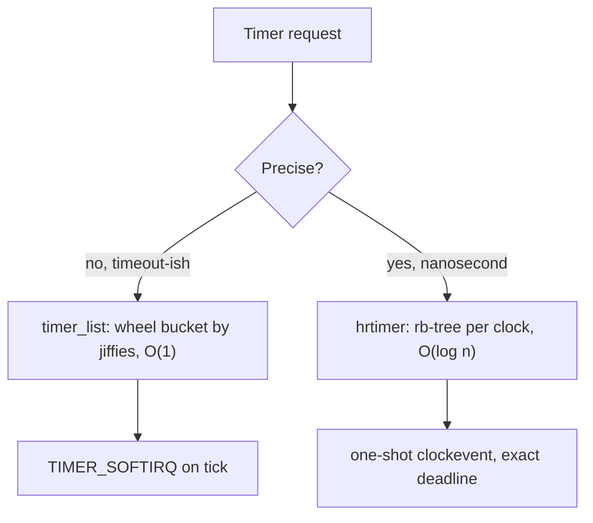

# Timers & Time: jiffies, hrtimers & Tickless

> **Goal:** understand how the kernel answers two very different questions —
> "what time is it?" and "wake me in 10 ms" — using clock sources, jiffies,
> two separate timer engines (the coarse timer wheel and nanosecond hrtimers),
> and how modern kernels stop the periodic tick entirely to save power and
> protect latency-critical CPUs.

## Two jobs that look like one

Everyone lumps "time" together, but the kernel keeps two jobs strictly apart,
and almost every confusion in this area comes from mixing them up:

1. **Timekeeping** — reading a monotonically advancing count so you can answer
   `gettimeofday()`, timestamp a packet, or measure how long a function ran.
   This is a *free-running counter you read*.
2. **Timer events** — arranging for code to run at, or after, some future
   moment: a TCP retransmit, a `nanosleep()`, the scheduler's next preemption
   check. This is a *hardware interrupt you program*.

Linux gives each job its own hardware abstraction: **clocksource** for reading
time, **clockevents** for programming interrupts. Same silicon underneath,
often the very same chip, but two different interfaces because the two jobs
have nothing to do with each other. Keep this split in your head and the rest
of the chapter falls into place.

## The hardware underneath

Timer hardware is a museum of accreted standards. On a modern x86-64 box the
kernel can choose from several:

- **PIT (8254)** — the original 1.19 MHz Programmable Interval Timer from the
  IBM PC. Ancient, slow to access (I/O port reads), still present as a
  fallback. Nobody uses it for real work anymore.
- **HPET** — the High Precision Event Timer, a ~14 MHz+ memory-mapped counter
  with several comparators. Replaced the PIT for a while; accessing it means a
  read across the memory bus (hundreds of nanoseconds), so it is a decent
  clocksource but a mediocre one by today's standards.
- **TSC** — the Time Stamp Counter, a 64-bit register incrementing every CPU
  clock. Reading it (`RDTSC`) costs a handful of cycles — no bus trip, no trap.
  This is the one you want. Historically it was unusable as a clock because it
  changed frequency with CPU throttling and drifted between cores. Modern CPUs
  advertise an **invariant TSC** (constant rate regardless of P-states, ticks
  in deep sleep, synchronized across cores) which makes it the default
  clocksource on essentially every current machine.
- **Local APIC timer** — a per-CPU countdown timer built into each core's
  interrupt controller. Because it is per-CPU and fast to program, it is the
  default **clockevent** device — the thing that actually fires the interrupt
  that drives the scheduler tick and hrtimers (interrupt delivery mechanics
  live in [Interrupts, Exceptions & Softirqs](#/interrupts)).

On arm64 the picture is cleaner: the **architected generic timer** provides
both a per-CPU counter (`CNTVCT_EL0`, readable from user space) and a per-CPU
comparator for events, standardized in the architecture itself. No museum.

```bash
cat /sys/devices/system/clocksource/clocksource0/current_clocksource
cat /sys/devices/system/clocksource/clocksource0/available_clocksource
```

Typical output: `tsc` current, with `tsc hpet acpi_pm` available. If you ever
see `hpet` or `acpi_pm` selected on an idle server, the kernel found the TSC
unreliable (marked it unstable) — worth investigating, because falling back to
HPET makes every timestamp 10–50× more expensive.

## clocksource and clockevents

A [`struct clocksource`](https://elixir.bootlin.com/linux/v6.12/C/ident/clocksource)
describes one readable counter. Its important fields:

- `read` — a function returning the current cycle count;
- `mask` — how many bits are valid (so the kernel handles wraparound);
- `mult`, `shift` — the fixed-point factors that turn raw cycles into
  nanoseconds without a division (`ns = (cycles * mult) >> shift`);
- `rating` — a quality score 0–499; the kernel picks the highest-rated usable
  source. TSC rates 300, HPET 250, the PIT-era `acpi_pm` 200.

A [`struct clock_event_device`](https://elixir.bootlin.com/linux/v6.12/C/ident/clock_event_device)
describes one programmable interrupt source. Its `set_next_event` arms the
hardware to fire after N cycles; `event_handler` is what the kernel calls when
it does. A clockevent runs in one of two modes: **periodic** (fires at a fixed
rate — the old-school tick) or **one-shot** (fires exactly once, then you
reprogram it). One-shot mode is what makes both high-resolution timers and the
tickless kernel possible: instead of a fixed drumbeat, the kernel computes the
*next* deadline and programs the timer for precisely that moment.

```bash
grep . /sys/devices/system/clocksource/clocksource0/*   # ratings, current source
# every clockevent device and its mode:
sudo grep -A4 'Clock Event Device' /proc/timer_list | head -40
```

## jiffies and CONFIG_HZ

Before high-resolution anything, the kernel counted time in **ticks**. A global
counter, [`jiffies`](https://elixir.bootlin.com/linux/v6.12/C/ident/jiffies)
(64-bit as `jiffies_64` internally), increments once per timer interrupt. The
tick rate is a compile-time constant, `CONFIG_HZ`:

| CONFIG_HZ | Tick period | Typical use |
|---|---|---|
| 100 | 10 ms | throughput servers, older defaults |
| 250 | 4 ms | common distro default (Debian/Ubuntu generic) |
| 300 | 3.33 ms | some desktop kernels (divides video frame rates) |
| 1000 | 1 ms | low-latency desktop / audio kernels |

```bash
grep 'CONFIG_HZ=' /boot/config-$(uname -r)
getconf CLK_TCK    # almost always 100 — this is the USER_HZ ABI constant, NOT CONFIG_HZ
```

That second command trips people up. `CLK_TCK` (aka `USER_HZ`) is frozen at 100
in the userspace ABI — the units used by `times()`, `/proc/stat`, and `getrusage`
— regardless of the kernel's real internal `CONFIG_HZ`. The kernel scales
between the two so old programs keep working.

`jiffies` is coarse (millisecond granularity), cheap to read, and wraps: on a
32-bit `jiffies` at 1000 Hz it wraps in ~49.7 days, which is why the kernel is
deliberately booted with `jiffies` set to wrap 5 minutes after boot — to smoke
out code that compares tick counts naively. Always use the
`time_after()`/`time_before()` macros, never `<`/`>`, on jiffies.

## The scheduler tick

The periodic timer interrupt is the kernel's heartbeat. On each tick,
[`update_process_times()`](https://elixir.bootlin.com/linux/v6.12/C/ident/update_process_times)
does the housekeeping that has to happen regularly:

- charge the running task's CPU time to user or system;
- run any expired low-resolution timers (the timer wheel, below);
- drive RCU's grace-period machinery (see [Kernel Synchronization](#/kernel-sync));
- call [`sched_tick()`](https://elixir.bootlin.com/linux/v6.12/C/ident/sched_tick)
  (renamed from `scheduler_tick()` in 6.10), which updates the running task's
  runtime, and — if its time slice is used up — sets the `TIF_NEED_RESCHED`
  flag so the scheduler preempts it at the next safe point (see
  [CPU Scheduling](#/scheduling)).

So the tick is *how a task gets kicked off the CPU* under the default scheduler.
At 250 Hz a CPU-bound task is interrupted 250 times a second even if nothing
else needs to run — cheap, but not free, and on a 128-core box that is 32,000
interrupts a second doing almost nothing. Tickless mode (below) exists to kill
those wasted interrupts.

## The timer wheel: coarse, cheap, timeout-oriented

Most kernel timers are not precise. A TCP retransmit timeout of 200 ms does not
care whether it fires at 200 or 205 ms; a filesystem's dirty-page writeback
deadline is fuzzy by design. These use
[`struct timer_list`](https://elixir.bootlin.com/linux/v6.12/C/ident/timer_list)
— the classic kernel timer, keyed on a `jiffies` deadline. You arm one with
[`mod_timer()`](https://elixir.bootlin.com/linux/v6.12/C/ident/mod_timer) and
cancel it with
[`timer_delete()`](https://elixir.bootlin.com/linux/v6.12/C/ident/timer_delete)
(the old `del_timer` name was retired in 6.2).

The data structure is the **timer wheel**: a set of hash buckets indexed by
expiry time. The genius and the catch are both in the indexing. There are
multiple *levels*, each covering a coarser time range with coarser granularity:
near-future timers land in fine-grained buckets, far-future timers in coarse
ones. Inserting or removing a timer is **O(1)** — just hash the deadline to a
bucket and add to that list. No tree, no sorting.

> A historical note worth getting right: the *original* timer wheel (pre-4.8)
> used **cascading** — as time advanced, timers in coarse buckets were
> re-hashed down into finer buckets, an O(n) batch operation that caused
> latency spikes. Thomas Gleixner's 2016 rework
> ([kernel/time/timer.c](https://elixir.bootlin.com/linux/v6.12/source/kernel/time/timer.c),
> the code you run today) **removed cascading entirely**. Instead, higher
> levels simply have coarser granularity, so a timer may fire slightly *late*
> — bounded by that level's granularity — but is never cascaded. The design
> trades a little precision for O(1) everything and a next-expiry that is cheap
> to compute, which the tickless code needs.

The wheel's imprecision is a feature: a timer set 8 seconds out might be placed
in a bucket with 512 ms granularity, so several unrelated timers naturally
**batch** into the same wakeup. That is free timer coalescing, and it is why
the wheel is the right home for the millions of forgiving timeouts a busy
kernel juggles.

## hrtimers: nanosecond deadlines, sorted

When you *do* need precision — `nanosleep(0.5 ms)`, a POSIX interval timer, an
audio deadline, the scheduler's own bandwidth enforcement — the timer wheel's
coarse buckets won't do. Those use **high-resolution timers**:
[`struct hrtimer`](https://elixir.bootlin.com/linux/v6.12/C/ident/hrtimer),
keyed on an absolute nanosecond time
([`ktime_t`](https://elixir.bootlin.com/linux/v6.12/C/ident/ktime_t)), not on
jiffies.

hrtimers need to answer "what is the single earliest deadline?" instantly, so
they are kept **sorted** in a per-CPU red-black tree (a
[`timerqueue`](https://elixir.bootlin.com/linux/v6.12/C/ident/timerqueue_head),
which wraps an `rb_root_cached` so the leftmost/earliest node is cached).
Insertion and removal are O(log n); finding the next deadline is O(1) via the
cached leftmost node.

Each CPU has an
[`struct hrtimer_cpu_base`](https://elixir.bootlin.com/linux/v6.12/C/ident/hrtimer_cpu_base)
holding several **clock bases** — one timerqueue per clock: `CLOCK_MONOTONIC`,
`CLOCK_REALTIME`, `CLOCK_BOOTTIME`, `CLOCK_TAI`. A timer on the REALTIME base
must be re-evaluated if someone steps the wall clock; a MONOTONIC timer never
is. Keeping separate trees per clock makes that bookkeeping clean.

The key architectural point: **hrtimers run in one-shot mode.** After servicing
the expired timers, the kernel looks at the earliest remaining deadline across
all bases and programs the clockevent device to fire at *exactly* that
nanosecond via
[`tick_program_event()`](https://elixir.bootlin.com/linux/v6.12/C/ident/tick_program_event).
No fixed tick rate — the hardware fires precisely when the next thing is due.
This same one-shot machinery is what the high-resolution tick and the tickless
kernel are built on.



```bash
# hrtimers and wheel timers per CPU, with absolute deadlines:
sudo cat /proc/timer_list | head -60
# who is arming the most timers?
sudo cat /proc/timer_stats 2>/dev/null   # older kernels; use bpftrace on 6.x
```

## Timekeeping: which clock, and NTP

Reading time is the clocksource's job, wrapped by
[`struct timekeeper`](https://elixir.bootlin.com/linux/v6.12/C/ident/timekeeper).
The kernel exposes several **clock IDs**, and choosing the right one matters:

| Clock | Behavior | Use for |
|---|---|---|
| `CLOCK_REALTIME` | Wall-clock time; **can jump** backward/forward (NTP steps, `settimeofday`, leap seconds) | Timestamps humans read; file mtimes |
| `CLOCK_MONOTONIC` | Seconds since boot, never steps; slewed by NTP but never jumps backward; **pauses during suspend** | Measuring elapsed time, timeouts |
| `CLOCK_BOOTTIME` | Like MONOTONIC but **includes** suspend time | Timers that should count real elapsed time across sleep |
| `CLOCK_TAI` | Like REALTIME but no leap-second discontinuities | Systems that hate leap seconds |

The classic bug: measuring a duration with `CLOCK_REALTIME`, then NTP steps the
clock mid-measurement and you get a negative interval. **Always use
`CLOCK_MONOTONIC` for durations.**

### NTP slewing vs stepping

When your clock is wrong, you can fix it two ways. **Stepping** jerks it
directly to the right value — fast, but time discontinuously jumps, which
breaks anything measuring intervals. **Slewing** speeds up or slows down the
clock slightly (say, 500 parts per million) until it converges — smooth, no
jumps, but slow. `ntpd`/`chronyd` step only large errors (default threshold
often 0.5 s) and slew the rest.

Slewing lives in the kernel, driven by
[`adjtimex()`](https://man7.org/linux/man-pages/man2/adjtimex.2.html). NTP tells
the kernel a frequency correction; the timekeeping code applies it by nudging
the clocksource's `mult` factor a hair up or down on each update, so the
cycles→nanoseconds conversion runs slightly fast or slow. That is the entire
trick: monotonic time never reverses because the *rate* changes, not the value.

```bash
chronyc tracking 2>/dev/null | grep -E 'Frequency|System time'
# is the kernel currently slewing? tai_offset, and the +/- freq adjustment:
grep -E 'clocksource|tsc' /var/log/dmesg 2>/dev/null | head
```

## Why gettimeofday is fast: the vDSO

`gettimeofday()` and `clock_gettime()` are among the most-called "syscalls" in
existence — profilers, tracing, every logging line with a timestamp. A real
syscall (mode switch into the kernel and back) costs hundreds of nanoseconds,
mostly wasted for something as simple as reading a counter (syscall entry cost
is covered in [Kernel, User Space & Syscalls](#/kernel-vs-userspace)).

So for these calls the kernel cheats with the **vDSO** (virtual dynamic shared
object) — a small shared library the kernel maps into every process (you saw
`[vdso]` in `/proc/self/maps` in [Virtual Memory](#/memory)). The kernel
publishes the current timekeeping state — the clocksource's `mult`/`shift`, the
base time, a seqlock — into a page shared read-only with user space. `glibc`'s
`clock_gettime()` calls the vDSO version, which, for a TSC clocksource, does the
whole job in user mode:

1. read the seqlock (retry if an update is in progress);
2. `RDTSC` to read cycles;
3. `ns = (cycles * mult) >> shift`, add the base;
4. done — **no kernel entry at all**.

This only works when the clocksource is user-readable (TSC on x86-64, the
generic timer on arm64). If the kernel falls back to HPET — which requires an
MMIO read only the kernel can do safely — the vDSO can't help and
`clock_gettime()` becomes a real syscall, tens of times slower. Yet another
reason a healthy TSC matters.

```bash
# ~20-30 ns each via vDSO; ~ hundreds of ns if it falls back to a syscall
perf bench syscall basic 2>/dev/null || \
  strace -c -e trace=clock_gettime true    # if you see NO clock_gettime calls, vDSO is working
```

## Tickless: NO_HZ

The periodic tick is wasteful in two opposite situations, and Linux has a mode
for each.

**NO_HZ_IDLE** (`CONFIG_NO_HZ_IDLE`, the default on virtually every distro).
When a CPU goes idle, waking it 250 times a second to discover there is still
nothing to do burns power and keeps it out of deep C-states (see
[Power Management](#/power-management)). In dynamic-tick idle mode, before
halting the CPU the kernel calls
[`tick_nohz_idle_enter()`](https://elixir.bootlin.com/linux/v6.12/C/ident/tick_nohz_idle_enter),
computes the next timer deadline with
[`get_next_timer_interrupt()`](https://elixir.bootlin.com/linux/v6.12/C/ident/get_next_timer_interrupt),
and programs the clockevent for *that* moment — possibly seconds away — instead
of the next tick. The CPU then sleeps undisturbed until real work or a real
timer arrives. This is why an idle laptop sips power.

**NO_HZ_FULL** (`CONFIG_NO_HZ_FULL`). More radical: stop the tick even on
*busy* CPUs, as long as exactly one runnable task is on them. If only one task
is runnable, there is no scheduling decision to make, so the tick is pure
overhead — and for latency-critical or high-frequency-trading or DPDK
workloads, each tick is an unwanted ~1 µs interruption and a cache-polluting
detour. Mark CPUs `nohz_full=` on the kernel command line and a lone task there
runs with essentially zero timer interrupts.

It is not free. One CPU (the "housekeeping" CPU) must keep ticking to do
global timekeeping and run unbound work. There is per-syscall overhead to
track the tick-off state. And it only helps the single-task-per-CPU case. This
is a specialist tool — the full setup (isolating CPUs, moving IRQs and RCU
callbacks off them) is its own chapter:
[CPU Isolation, NO_HZ & Real-Time](#/cpu-isolation).

> **Container link:** pinning a latency-sensitive container to `nohz_full`
> isolated CPUs (via cgroup `cpuset`, see [Control Groups](#/cgroups)) is a
> standard pattern for real-time workloads in Kubernetes — the container gets
> CPUs with no scheduler tick stealing microseconds.

```bash
cat /sys/devices/system/clocksource/clocksource0/current_clocksource
grep -o 'nohz_full=[^ ]*' /proc/cmdline   # which CPUs are tickless-when-busy
# per-CPU timer interrupt counts — watch idle CPUs barely tick:
grep -E 'LOC|Local timer' /proc/interrupts
```

## Sleeping and waiting on time

Userspace meets all of this through a handful of syscalls:

- **`nanosleep()` / `clock_nanosleep()`** — sleep for a relative or absolute
  duration. Internally this arms an hrtimer on the calling task and blocks;
  when the hrtimer fires it wakes the task. Precision is genuine
  (hrtimer-backed), though actual wakeup is subject to scheduling latency.
- **`timerfd_create()`** — a timer that delivers expirations through a *file
  descriptor* you `read()`. The whole point is that a fd can go into `epoll`
  alongside your sockets, so a single event loop waits on timers and I/O
  uniformly. Backed by hrtimers. See
  [timerfd_create(2)](https://man7.org/linux/man-pages/man2/timerfd_create.2.html).
- **`epoll_wait()` / `poll()` timeouts** — the `timeout` argument is itself an
  hrtimer the kernel arms so the wait returns even if no fd becomes ready. A
  timeout of 0 polls; -1 blocks forever with no timer armed at all.

The rule of thumb: if you are writing an event loop, do **not** sleep and poll.
Put a `timerfd` in your `epoll` set and let one `epoll_wait()` handle both your
network fds and your timers. This is the foundation modern async runtimes build
on (and it connects directly to [Modern I/O & io_uring](#/modern-io)).

```bash
# see a process's timers, including timerfd/hrtimer state:
sudo cat /proc/timer_list | grep -A6 "$(pgrep -n chronyd)" 2>/dev/null | head
```

## Timer coalescing and power

Every timer interrupt wakes a CPU, and a woken CPU cannot be in a deep,
power-saving C-state. So on battery and in the datacenter alike, *fewer, batched*
wakeups beat many scattered ones. The kernel and its interfaces coalesce timers
several ways:

- The **timer wheel's coarse buckets** naturally group nearby timeouts into one
  wakeup — the imprecision is deliberate power policy.
- hrtimers accept a **slack/range** (`hrtimer_start_range_ns`): the kernel may
  fire anywhere in `[deadline, deadline+slack]`, letting it align this wakeup
  with an already-scheduled one. Userspace sets per-process default slack via
  `PR_SET_TIMERSLACK` (default 50 µs); a value of 0 means "be precise, I'll pay
  the power cost."
- **NO_HZ_IDLE** turns a train of 4 ms ticks into one wakeup at the real next
  deadline.

```bash
cat /proc/$$/timerslack_ns        # this shell's default timer slack (nanoseconds)
# a batch job that doesn't care about precision can relax its slack to save power:
# echo 100000 > /proc/<pid>/timerslack_ns   # 100 µs
```

This is the same theme as [Power Management](#/power-management): idle quality
depends on *not* being woken, and timers are the main thing that does the
waking.

## Follow the code (kernel v6.12)

**Path 1: a wheel timer expires.** A network stack armed a 200 ms retransmit
timer with `mod_timer()`; 200 ms of jiffies later it must run.

1. The periodic (or one-shot high-res) tick fires and eventually raises
   `TIMER_SOFTIRQ`. When softirqs are processed, the handler
   [`run_timer_softirq()`](https://elixir.bootlin.com/linux/v6.12/C/ident/run_timer_softirq)
   runs (softirq context — see [Interrupts](#/interrupts)).
2. It calls
   [`__run_timers()`](https://elixir.bootlin.com/linux/v6.12/C/ident/__run_timers)
   on the CPU's
   [`struct timer_base`](https://elixir.bootlin.com/linux/v6.12/C/ident/timer_base).
   This loop advances the base's internal clock up to the current jiffies,
   collecting every bucket that has come due.
3. For each due bucket,
   [`expire_timers()`](https://elixir.bootlin.com/linux/v6.12/C/ident/expire_timers)
   walks the list and calls
   [`call_timer_fn()`](https://elixir.bootlin.com/linux/v6.12/C/ident/call_timer_fn),
   which invokes each timer's `function` callback with its `data`. The
   retransmit handler runs here, in softirq context, so it must not sleep.
4. Because the 2016 rework removed cascading, there is no re-hashing pass —
   `__run_timers()` just processes due buckets and returns. Cheap and bounded.

**Path 2: an hrtimer expires.** A `nanosleep(500 µs)` armed an hrtimer; the
clockevent was programmed to fire at that exact nanosecond.

1. The APIC timer fires its one-shot interrupt. The clockevent's
   `event_handler` (in high-resolution mode) is
   [`hrtimer_interrupt()`](https://elixir.bootlin.com/linux/v6.12/C/ident/hrtimer_interrupt)
   in
   [kernel/time/hrtimer.c](https://elixir.bootlin.com/linux/v6.12/source/kernel/time/hrtimer.c).
2. It reads the current time, then calls
   [`__hrtimer_run_queues()`](https://elixir.bootlin.com/linux/v6.12/C/ident/__hrtimer_run_queues),
   which walks each clock base's timerqueue from the cached leftmost (earliest)
   node, popping every hrtimer whose deadline has passed and calling
   [`__run_hrtimer()`](https://elixir.bootlin.com/linux/v6.12/C/ident/__run_hrtimer)
   on it. That fires the timer's `function`, which for our sleeper wakes the
   blocked task.
3. Back in `hrtimer_interrupt()`, it inspects the *new* earliest deadline
   across all bases and reprograms the clockevent via
   [`tick_program_event()`](https://elixir.bootlin.com/linux/v6.12/C/ident/tick_program_event)
   for that moment. One-shot in, one-shot out — the hardware is always set for
   precisely the next thing due, which is exactly what NO_HZ needs.

Note that a callback returning `HRTIMER_RESTART` (like a periodic interval
timer) is re-enqueued with its next deadline before the reprogram step, so
recurring hrtimers keep their rhythm without a fixed tick.

## Try it yourself

```bash
# which clock the machine reads time from, and its alternatives:
cat /sys/devices/system/clocksource/clocksource0/current_clocksource
cat /sys/devices/system/clocksource/clocksource0/available_clocksource

# the compiled tick rate vs the frozen userspace ABI rate:
grep 'CONFIG_HZ=' /boot/config-$(uname -r); getconf CLK_TCK

# every timer and clockevent on the box, with absolute deadlines:
sudo cat /proc/timer_list | head -80

# per-CPU local timer interrupt counts — run twice, 10 s apart, and diff.
# idle NO_HZ CPUs barely move; the housekeeping CPU climbs:
grep -E 'LOC|Local timer' /proc/interrupts

# is time being read from user space (vDSO) or via syscall?
strace -c -e trace=clock_gettime,gettimeofday date   # near-zero syscalls = vDSO works

# your shell's timer slack, and the NTP frequency correction:
cat /proc/$$/timerslack_ns
chronyc tracking 2>/dev/null | grep -E 'Frequency|System time'
```

## Check your understanding

1. Why does the kernel keep clocksource and clockevents as separate
   abstractions when they often use the same chip?

<details><summary>Show answer</summary>

They answer unrelated questions. A clocksource is a free-running counter you
*read* to know what time it is; a clockevent is a programmable device you *arm*
to fire an interrupt in the future. Reading time and scheduling an event have
nothing in common except the underlying silicon, so the kernel abstracts them
independently — e.g. the TSC as clocksource, the APIC timer as clockevent.

</details>

2. You measure how long a request takes with `CLOCK_REALTIME` and occasionally
   get a negative duration. Why, and what should you use?

<details><summary>Show answer</summary>

`CLOCK_REALTIME` is wall-clock time and can jump — an NTP step or
`settimeofday` between your two reads moves it backward, producing a negative
interval. Use `CLOCK_MONOTONIC`, which never steps backward (NTP only slews its
rate), for measuring any duration.

</details>

3. What is the practical difference between a `timer_list` (wheel) timer and an
   hrtimer, and when would you pick each?

<details><summary>Show answer</summary>

Wheel timers are keyed on jiffies, hashed into coarse buckets (O(1) insert, may
fire slightly late), and are ideal for forgiving timeouts like TCP retransmits
that also benefit from natural coalescing. hrtimers are keyed on absolute
nanoseconds, kept sorted in a per-CPU red-black tree (timerqueue), fire on a
one-shot clockevent at the exact deadline, and are used where precision
matters: `nanosleep`, POSIX timers, scheduler bandwidth.

</details>

4. Why is `clock_gettime()` usually not a real syscall, and when does it become
   one?

<details><summary>Show answer</summary>

The kernel maps a vDSO into every process plus a read-only page of timekeeping
state (mult/shift, base, seqlock). For a user-readable clocksource like the TSC,
the vDSO reads the counter and does the cycles→ns math entirely in user mode —
no kernel entry. It falls back to a real syscall when the clocksource isn't
user-readable (e.g. the kernel dropped to HPET, which needs an MMIO read), making
it tens of times slower.

</details>

5. On a 128-core idle server, what does NO_HZ_IDLE actually save, and how?

<details><summary>Show answer</summary>

Without it, every CPU takes a timer interrupt `CONFIG_HZ` times a second even
when idle, preventing deep C-states and wasting power. NO_HZ_IDLE computes the
next real timer deadline before idling (`get_next_timer_interrupt()`) and
programs the clockevent for that moment — possibly seconds out — so idle CPUs
sleep undisturbed until real work arrives.

</details>

6. The 2016 timer-wheel rework "removed cascading." What was cascading, and why
   was removing it a win?

<details><summary>Show answer</summary>

In the old wheel, as time advanced, timers sitting in coarse far-future buckets
were periodically re-hashed ("cascaded") down into finer near-future buckets — an
O(n) batch that caused latency spikes. The rework instead gives higher levels
permanently coarser granularity, so a timer may fire slightly late but is never
cascaded. Everything becomes O(1), and computing the next expiry is cheap, which
the tickless code depends on.

</details>

7. Your event loop needs to wait on sockets *and* a periodic timer. What's the
   idiomatic Linux way?

<details><summary>Show answer</summary>

Create a `timerfd` and add its file descriptor to your `epoll` set alongside the
sockets. A single `epoll_wait()` then returns for either a ready socket or a
timer expiration, unifying I/O and timing in one blocking point instead of
sleeping-and-polling. The timerfd is hrtimer-backed, so it's precise.

</details>

## Sources & further reading

- [Clock sources, Clock events, sched_clock() and delay timers](https://docs.kernel.org/timers/timekeeping.html) — the kernel's own description of the clocksource/clockevents split.
- [hrtimers - subsystem for high-resolution kernel timers](https://docs.kernel.org/timers/hrtimers.html) — design rationale for the nanosecond timer engine.
- [NO_HZ: Reducing Scheduling-Clock Ticks](https://docs.kernel.org/timers/no_hz.html) — the authoritative reference on idle and full dynticks.
- [clock_gettime(2)](https://man7.org/linux/man-pages/man2/clock_gettime.2.html) and [nanosleep(2)](https://man7.org/linux/man-pages/man2/nanosleep.2.html) — the userspace clock IDs and sleeping contract.
- [timerfd_create(2)](https://man7.org/linux/man-pages/man2/timerfd_create.2.html) — file-descriptor timers for event loops.
- [adjtimex(2)](https://man7.org/linux/man-pages/man2/adjtimex.2.html) — the NTP kernel interface behind slewing.
- Jonathan Corbet, [*The next steps for the timer wheel*](https://lwn.net/Articles/646950/) (LWN) — the 2016 rework that removed cascading, explained by its reporter.
- Browse the code: [kernel/time/](https://elixir.bootlin.com/linux/v6.12/source/kernel/time) — `timer.c`, `hrtimer.c`, `tick-sched.c`, `timekeeping.c`.

---

**Next:** how a pile of disk blocks becomes `/home/you/notes.txt` — [the VFS and filesystems](#/filesystems). Or jump to how the kernel decides *which* task the tick preempts, in [CPU Scheduling](#/scheduling).
