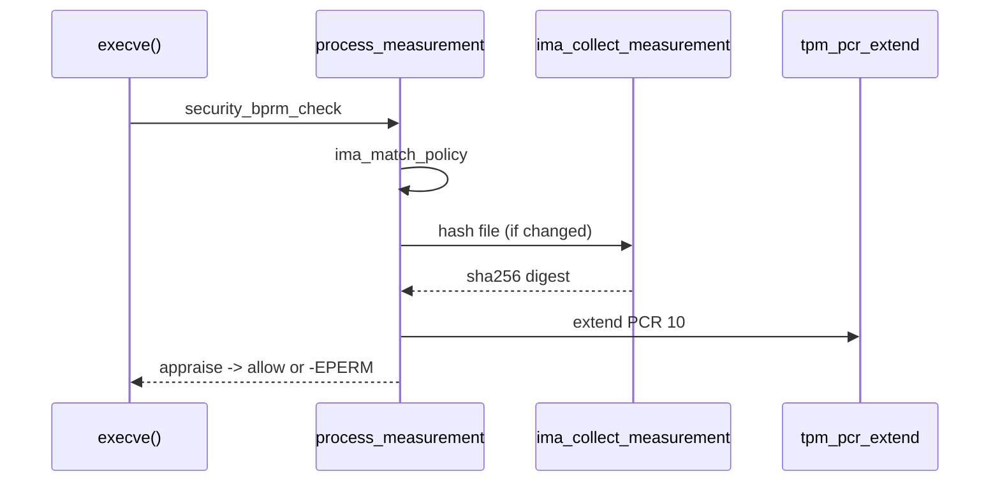

# Trusted Computing: Secure Boot, TPM & IMA

> **Goal:** understand the chain of trust from firmware to kernel to userspace — how the platform verifies what it boots, measures it into tamper-proof hardware, and uses those measurements to enforce runtime integrity. This is the plumbing beneath "trusted execution" and "confidential computing."

## The mental model

Every computing platform has a moment of faith: the first instruction executed after power-on must be trusted. There is no verification before that moment — the CPU can't verify the firmware image because the CPU hasn't yet loaded the verification code. On modern x86-64 that first code is the microcode-backed reset vector plus, on many platforms, an immutable **boot ROM** (Intel Boot Guard, AMD Platform Secure Boot) whose public-key hash is burned into on-die fuses. On arm64 it is BL1 in ROM per the Arm Trusted Firmware model. Either way, the very bottom of the stack is silicon you cannot rewrite.

The solution is **chains of trust**:

```
Hardware Root of Trust (immutable ROM, fused keys)
    ↓ verifies signature of
  Platform Firmware (UEFI)
    ↓ verifies signature of
  Bootloader (shim + GRUB)
    ↓ verifies signature of
  Linux Kernel
    ↓ verifies signature of
  Kernel Modules
    ↓ measures and enforces integrity of
  Userspace binaries, configuration, containers
```

Each link in the chain verifies the next link's cryptographic signature before passing control. But verification alone isn't enough — we also need **attestation**: proof to a third party that a specific platform booted a specific chain. That's where the TPM comes in.

Keep two verbs separate from the start, because the whole chapter turns on the distinction. **Verify** = check a signature and refuse to proceed if it fails (this is *enforcement*, local, happens now). **Measure** = hash the thing and record the hash somewhere append-only, then run it anyway (this is *evidence*, useful later, verified by someone else). Secure Boot verifies. The TPM measures. IMA does both, depending on policy. See [Linux Security & Confinement](#/security-hardening) for how these fit alongside LSMs, capabilities, and seccomp.

## Secure Boot: the first link

UEFI Secure Boot is the mechanism that prevents unauthorized code from running at boot. The Linux kernel participates in it as an EFI application via the EFI stub (`CONFIG_EFI_STUB`), which lets the firmware load `vmlinuz` directly as though it were any other signed EFI binary. The UEFI firmware contains a database of trusted signing keys held in authenticated NVRAM variables:

```bash
# UEFI Secure Boot variables (accessible from Linux via efivarfs)
ls /sys/firmware/efi/efivars/
# db  = authorized signature database (keys and hashes)
# dbx = forbidden signature database (blacklisted keys/hashes)
# KEK = Key Exchange Keys (authorize updates to db/dbx)
# PK  = Platform Key (one key, controls KEK updates)
```

These four variables form a strict hierarchy, each level authorizing writes to the level below it:

1. **PK** (OEM-controlled, exactly one key) signs updates to the **KEK**
2. **KEK** (usually the OEM key plus Microsoft's KEK) signs updates to **db/dbx**
3. **db** contains X.509 certificates and SHA-256 hashes of bootloaders allowed to execute; **dbx** is the revocation list
4. Firmware validates the bootloader's Authenticode signature against **db** (and checks it is *not* in **dbx**) before executing it

Setting a PK is what moves the firmware from "Setup Mode" (anyone can write the variables) into "User Mode" (writes must be signed). This is why enrolling your own keys always starts by clearing the PK. The signature format is PKCS#7 / Authenticode; the whole scheme is public-key crypto with the firmware as the verifier and physical presence at the UEFI menu as the ultimate override.

```bash
# Is Secure Boot active?
mokutil --sb-state                          # "SecureBoot enabled"
bootctl status | grep 'Secure Boot'         # systemd-boot alternative
dmesg | grep -i 'secure boot'               # kernel acknowledgement

# See the cert databases
mokutil --db                                    # authorized certs
mokutil --dbx | head                            # blacklisted (revoked bootkits)
openssl x509 -in <(mokutil --export-kek) -text  # examine a KEK cert
```

The `dbx` list is not academic. When the BootHole GRUB vulnerabilities (2020) and the BlackLotus bootkit (2023) broke Secure Boot's guarantees, the fix shipped as new hashes and certificate revocations pushed into `dbx` through firmware updates — which is also why a badly-timed `dbx` update can brick dual-boot setups whose old bootloaders suddenly fail validation.

### The shim: bridging Microsoft's signing to Linux

Getting every distro's bootloader signed by Microsoft's UEFI CA does not scale, so the community settled on one small, rarely-changing EFI binary that Microsoft *does* sign: the **shim**. The shim's job is to introduce a second, Linux-owned key database — **MOK** (Machine Owner Keys), stored in the boot-services-only variable `MokListRT` — and then verify and hand off to GRUB or directly to the EFI-stub kernel.

```bash
# MOK management (for locally-signed kernels or DKMS modules)
mokutil --list-enrolled       # MOK database contents
mokutil --import mykey.der    # add a key (requires reboot + UEFI confirmation)
mokutil --disable-validation  # disable signature checking (dangerous)
```

Why does this matter? DKMS rebuilds out-of-tree kernel modules (NVIDIA, VirtualBox, ZFS) against your running kernel. Under Secure Boot the kernel refuses unsigned modules, so DKMS has to sign each rebuilt `.ko` with a key the kernel trusts. The shim+MOK mechanism lets you enroll your own key: MokManager prompts you at the next reboot (physical presence again), and — since kernel 5.19 — the shim passes MOK certificates to the kernel's `.machine` keyring, so modules signed by your MOK load without further ceremony. This is covered from the driver side in [Devices, Drivers & Modules](#/devices-modules).

### Module signing (`CONFIG_MODULE_SIG`)

The kernel refuses to load unsigned or wrongly-signed modules when signature enforcement is on — always if `CONFIG_MODULE_SIG_FORCE=y`, and automatically when Secure Boot is detected because the kernel raises its **lockdown** level to `integrity`. A module signature is an appended PKCS#7 blob plus a fixed magic string `~Module signature appended~` at the very end of the file; the payload is verified against certificates in the kernel keyrings.

```bash
# Check module signature enforcement
cat /sys/kernel/security/lockdown            # [none] integrity confidentiality
cat /proc/sys/kernel/modules_disabled        # 1 = no new modules at all, ever

# Kernel module signing infrastructure
ls /lib/modules/$(uname -r)/build/certs/     # signing_key.pem, x509.genkey
modinfo usb_storage | grep sig_              # signature metadata
# sig_id:        PKCS#7
# signer:        Build time autogenerated kernel key
# sig_key:       4E:3C:...
# sig_hashalgo:  sha512
# signature:     ... (ASN.1 blob) ...

# Show trusted keys ring
cat /proc/keys | grep -i builtin_trusted     # kernel's keyring
keyctl list %:.builtin_trusted_keys          # same, via keyctl
```

There are three relevant kernel keyrings, and knowing which is which explains most "module won't load" mysteries:

- **`.builtin_trusted_keys`** — certificates compiled into the kernel image (`CONFIG_MODULE_SIG_KEY`, the distro build key). Immutable at runtime.
- **`.secondary_trusted_keys`** — runtime-loadable keys, each of which must itself be signed by a key already in `.builtin_trusted_keys` or `.secondary_trusted_keys`.
- **`.machine`** — MOK certificates imported via shim (since 5.19), optionally linked into `.secondary_trusted_keys` so MOK-signed modules are trusted.

`CONFIG_MODULE_SIG_ALL=y` signs every in-tree module automatically at build time; `sign-file` (in `scripts/`) signs individual out-of-tree modules with your key.

## The TPM: tamper-proof measurement

The Trusted Platform Module (TPM 2.0, standardized as ISO/IEC 11889) is a discrete chip on the LPC/SPI bus, or a firmware implementation running in a TEE — **fTPM** on AMD (inside PSP), **PTT** on Intel (inside ME). Linux talks to it through `struct tpm_chip` and exposes it at `/dev/tpm0` (direct) and `/dev/tpmrm0` (kernel-managed resource-manager context). It provides:

1. **PCRs** (Platform Configuration Registers): at least 24 register slots per bank that can only be *extended* (hashed into), never written or decremented. TPM 2.0 keeps multiple banks — typically SHA-1 (legacy) and SHA-256 — and can extend all banks in one operation.
2. **Sealed storage**: encrypt data so it can only be decrypted (unsealed) when the PCRs currently hold a specific value.
3. **Attestation**: sign a *quote* — a report of current PCR values plus a caller-supplied nonce — with an Attestation Key rooted in the TPM's Endorsement Key, proving to a remote verifier what software ran.

```text
PCR extension formula:
    PCR_new = hash( PCR_old || hash(measured_data) )

This is one-way: you can't "un-extend" PCRs.
You can only verify by replaying the expected sequence and comparing.
```

Because extension folds the old value into the new one, the final PCR value is a cryptographic commitment to the *entire ordered sequence* of measurements — reorder two events and the value changes. A PCR is 20 bytes (SHA-1) or 32 bytes (SHA-256); a discrete TPM extend costs on the order of a few to tens of milliseconds, which is why the kernel never does one on a hot path.

The boot process extends PCRs at every stage. The assignments below follow the TCG PC Client Platform Firmware Profile:

| PCR | What's measured | Typical contents |
|---|---|---|
| 0 | Platform firmware (BIOS/UEFI) binary | Hash of firmware code |
| 1 | Platform configuration | Firmware settings, SMBIOS |
| 2 | Option ROMs (PCIe cards) | Hashes of expansion card firmware |
| 3 | Option ROM configuration | Hash of card configuration |
| 4 | Boot manager code (shim/GRUB) | Hash of boot manager binary |
| 5 | Boot manager configuration | GPT, boot config |
| 6 | Platform-specific / power state | Sleep/wake transitions |
| 7 | Secure Boot policy | SB state, PK/KEK/db/dbx, which key authorized each binary |
| 8–9 | Bootloader-measured data (GRUB) | Kernel command line, kernel + initramfs |
| 10 | IMA runtime measurements | Log of every measured file |
| 11 | UKI / systemd-stub measurements | Kernel, initrd, cmdline, os-release (unified kernel images) |
| 14 | shim MOK certificates | MOK, vendor certs |

Note PCR 7 (Secure Boot **policy**) deliberately does *not* change when you install a new kernel that is still signed by a `db` key — it records *which key authorized the binary*, not the binary hash. That property is the whole reason TPM-backed disk encryption seals to PCR 7 rather than PCR 4: kernel updates keep working, but disabling Secure Boot or enrolling a rogue key breaks the seal.

The **Event Log** records *what* was extended into each PCR, so you can **replay** the log and compare the recomputed value against the live PCR. Firmware measurements land in `binary_bios_measurements`; IMA's own log is separate.

```bash
# TPM tools (tpm2-tools, talking to /dev/tpmrm0)
tpm2_pcrread                         # read all PCR values, all banks
tpm2_getrandom 32                    # hardware RNG (feeds the kernel's entropy pool)
tpm2_getcap properties-fixed         # manufacturer, firmware version
tpm2_getcap pcrs                     # which banks exist (sha1, sha256, ...)

# Event log (binary, then decoded)
cat /sys/kernel/security/tpm0/binary_bios_measurements > /tmp/bios_log
tpm2_eventlog /tmp/bios_log          # human-readable replay
```

**Try it yourself:** replay PCR 7 by hand. `tpm2_eventlog` prints each event's digest; fold them with `PCR = sha256(PCR || digest)` starting from all-zeros and you should land on exactly what `tpm2_pcrread sha256:7` reports. If they differ, the log has been tampered with — or, far more often, you forgot an event.

### Sealing: data locked to a boot state

The TPM can **seal** a secret (typically a disk-encryption key) to a chosen set of PCR values. If the PCRs don't match at unseal time — because someone modified the boot chain — the TPM refuses:

```bash
# Create a sealed object that only unseals if PCRs 0-7 match expected values
tpm2_createprimary -C o -c primary.ctx
tpm2_create -C primary.ctx -u obj.pub -r obj.priv \
    -i secret.bin -p "pcr:sha256:0,1,2,3,4,5,7"
tpm2_load -C primary.ctx -u obj.pub -r obj.priv -c obj.ctx
tpm2_unseal -c obj.ctx -p "pcr:sha256:0,1,2,3,4,5,7"  # fails if PCRs changed
```

This is the mechanism behind **systemd-cryptenroll + TPM2**. The LUKS2 volume key is sealed to a PCR set (PCR 7 by default). If someone boots a modified kernel that isn't signed by a trusted key, or disables Secure Boot, PCR 7 changes and the TPM won't release the key — the system falls back to the recovery passphrase.

```bash
# Bind LUKS to TPM (make sure you have a backup passphrase first!)
systemd-cryptenroll --tpm2-device=auto --tpm2-pcrs=7 /dev/sda3
```

A subtlety worth knowing: sealing to raw PCR values means every legitimate firmware or shim update re-breaks the seal, forcing a passphrase and a re-enroll. TPM 2.0's **authorized policy** (`PolicyAuthorize`) fixes this — you seal to a *signed policy* rather than to specific values, and the OS vendor can sign new valid PCR sets. This is what systemd's `--tpm2-public-key` / `PolicyAuthorizeNV` enrollment and the "signed PCR policy" work are for.

## IMA: Integrity Measurement Architecture

IMA (`CONFIG_IMA`) is the kernel subsystem that extends the chain of trust past the kernel into userspace, one file at a time. It lives in `security/integrity/ima/` and hooks the file-open and mmap paths through the LSM framework. Every file covered by policy is hashed and the hash is extended into **PCR 10** and appended to IMA's own measurement log.

```bash
# IMA status
cat /sys/kernel/security/ima/policy         # current IMA policy
cat /sys/kernel/security/ima/ascii_runtime_measurements  # measurement log

# Example entry:
# 10 sha256:abcd... ima-ng sha256:ef56... /usr/bin/bash
#  │  │             │      │             └── file path
#  │  │             │      └── file content hash
#  │  │             └── template name ("ima-ng" = next-gen)
#  │  └── template-data hash (extended into PCR 10)
#  └── PCR number
```

Internally, each measured inode gets an integrity record — `struct ima_iint_cache`, stored in the inode's LSM security blob since the 6.x integrity rework — holding the cached file hash, the measured/appraised flags, and the inode version (`i_version`) used to detect changes. When a file is modified, `i_version` bumps, the cache is invalidated, and the file is re-measured on next access. Each log entry is a `struct ima_template_entry` built from a `struct ima_template_desc` that names the fields (`d-ng` for the file digest, `n-ng` for the path, plus optional `sig`, `buf`, `modsig`).

IMA policy controls *what* to act on and *how*, using `func` (the hook), `mask` (the access), and conditions like `fsmagic`, `uid`, or `fowner`:

```text
# measure every file mapped executable and every module/firmware:
measure func=BPRM_CHECK
measure func=MMAP_CHECK mask=MAY_EXEC
measure func=MODULE_CHECK
# appraise (enforce a signature) before executing:
appraise func=BPRM_CHECK appraise_type=imasig
```

Two IMA modes, which combine freely:

| Mode | What it does |
|---|---|
| **measure** | Hash the file, log it, extend PCR 10. Evidence for remote attestation; never blocks. |
| **appraise** | Verify the file's `security.ima` signature (or hash) before allowing access. On mismatch or missing signature under `ima_appraise=enforce`, the access fails with `-EPERM`. |

```bash
# Enable measurement + enforced appraisal (kernel command line):
#   ima_policy=tcb ima_appraise=enforce ima_template=ima-ng

# Per-file IMA signature (stored as an xattr):
getfattr -m security.ima /usr/bin/ls
# security.ima=0s...  (packed hash or PKCS#7/asymmetric signature)
```

IMA appraisal signatures are verified against the `.ima` keyring, a sibling of the module keyrings. In `enforce` mode, an unsigned binary is a hard failure — which is exactly the guarantee immutable/appliance systems want, and exactly the footgun that locks you out if you forget to sign something. Test with `ima_appraise=log` first.

### EVM: protecting the metadata

IMA hashes file *content*. That leaves the metadata — owner, mode, and the `security.ima` xattr itself — as an attack surface: flip `/etc/shadow` to mode 0666 offline and IMA content-measurement wouldn't notice. **EVM** (Extended Verification Module) closes this by computing an HMAC (or a signature) over a file's security-relevant metadata, including `security.ima`, keyed by a secret that is itself typically sealed in the TPM or held as a trusted key.

```bash
cat /sys/kernel/security/evm             # bitmask: which EVM modes are active
getfattr -m security.evm /etc/shadow     # the security.evm HMAC/signature
```

Together, IMA+EVM give you content *and* metadata integrity anchored to a TPM-backed key: tampering offline invalidates the HMAC, and the file is rejected when the system boots.

## Follow the code (kernel v6.12)

Two short paths make the whole subsystem concrete. Both go through the LSM/integrity glue in `security/`.

### Path 1 — a kernel module signature is checked

When userspace calls `finit_module(2)` (or `init_module(2)`), the kernel copies the module image in and runs [load_module()](https://elixir.bootlin.com/linux/v6.12/C/ident/load_module). Before any relocation happens, it calls [module_sig_check()](https://elixir.bootlin.com/linux/v6.12/C/ident/module_sig_check):

1. **Detect the signature.** `module_sig_check()` looks for the trailing magic marker and the `struct module_signature` footer at the end of the file. If absent, it records the module as unsigned and consults lockdown/`sig_enforce`; under Secure Boot (`integrity` lockdown) an unsigned module is rejected with `-EKEYREJECTED`.
2. **Verify the PKCS#7 blob.** For a signed module it calls [mod_verify_sig()](https://elixir.bootlin.com/linux/v6.12/C/ident/mod_verify_sig), which unpacks the appended signature and hands it to [verify_pkcs7_signature()](https://elixir.bootlin.com/linux/v6.12/C/ident/verify_pkcs7_signature) against the `.builtin_trusted_keys` / `.secondary_trusted_keys` / `.machine` keyrings.
3. **Match a key.** The PKCS#7 code walks the trusted keyrings looking for a `struct key` whose certificate matches the signer and validates the SHA-512 digest of the module payload. A hit returns 0 and `load_module()` proceeds; a miss returns `-ENOKEY` and the load fails.

The `sig_enforce` flag (from `CONFIG_MODULE_SIG_FORCE` or the `module.sig_enforce=1` boot param) is what turns a soft "warn and taint" into a hard rejection. This is the enforcement half of the chain of trust, entirely local.

### Path 2 — a binary is measured and appraised on exec

When you `execve()` a program, the binary-format loader calls the LSM hook `security_bprm_check()`, which reaches IMA's [ima_bprm_check()](https://elixir.bootlin.com/linux/v6.12/C/ident/ima_bprm_check). Everything funnels into [process_measurement()](https://elixir.bootlin.com/linux/v6.12/C/ident/process_measurement):

1. **Policy match.** `process_measurement()` calls [ima_match_policy()](https://elixir.bootlin.com/linux/v6.12/C/ident/ima_match_policy) to decide, for this `func`/`mask`/uid/fsmagic, whether to measure, appraise, both, or ignore. No match means an immediate return — the common fast path.
2. **Fetch or create the inode record.** It looks up the per-inode `struct ima_iint_cache`. If `i_version` shows the file unchanged since the last measurement, the cached digest is reused and no hashing happens.
3. **Hash the file.** Otherwise [ima_collect_measurement()](https://elixir.bootlin.com/linux/v6.12/C/ident/ima_collect_measurement) reads the file and computes the digest with [ima_calc_file_hash()](https://elixir.bootlin.com/linux/v6.12/C/ident/ima_calc_file_hash) (SHA-256 by default).
4. **Log and extend.** [ima_store_measurement()](https://elixir.bootlin.com/linux/v6.12/C/ident/ima_store_measurement) builds a `struct ima_template_entry`, appends it to the in-kernel measurement list, and — via [ima_pcr_extend()](https://elixir.bootlin.com/linux/v6.12/C/ident/ima_pcr_extend) → [tpm_pcr_extend()](https://elixir.bootlin.com/linux/v6.12/C/ident/tpm_pcr_extend) — extends PCR 10 in every active bank on the `struct tpm_chip`.
5. **Appraise (if policy says so).** [ima_appraise_measurement()](https://elixir.bootlin.com/linux/v6.12/C/ident/ima_appraise_measurement) reads the `security.ima` xattr and verifies it against the `.ima` keyring. Under `ima_appraise=enforce`, a failure propagates back as `-EACCES`/`-EPERM` and `execve()` fails.

Note step 4 touches the TPM at most once per *distinct* file, and never again while `i_version` holds — that caching is the reason IMA's per-exec overhead is usually a hash of an already-cached file, not a millisecond-scale TPM round-trip. The TPM extend is deferred/batched relative to the measurement list, so the append-only log is the fast structure and the PCR is the slow, tamper-evident anchor.



## Measured Boot vs Secure Boot

| | Secure Boot | Measured Boot |
|---|---|---|
| **Goal** | Prevent unauthorized code from running | Prove what code ran |
| **Mechanism** | Signature verification → refuse to execute | Hash → extend PCR → attestation |
| **Enforcement** | Local (the machine refuses) | Remote (a verifier checks a PCR quote) |
| **TPM required?** | No (UEFI variable-based) | Yes |
| **Key use case** | Block bootkits on laptops | Prove cloud VMs are unmodified |

Both work together: Secure Boot verifies and blocks; measured boot records and proves. A modern attested deployment — say, a confidential-computing Kubernetes node — uses both, plus IMA to carry measurement past the kernel into userspace.

## Confidential computing: TEEs

Beyond measurement and attestation, modern CPUs offer **hardware-isolated execution environments** where neither the host kernel, the hypervisor, nor the cloud operator can read the workload's memory:

| Technology | Vendor | Mechanism |
|---|---|---|
| **Intel SGX** | Intel | User-space enclaves, encrypted pages (EPC), remote attestation |
| **Intel TDX** | Intel | Whole-VM confidentiality (a "trust domain"), attestation via TDREPORT/TDQUOTE |
| **AMD SEV** | AMD | Encrypted VM RAM (SEV), encrypted registers (SEV-ES), memory integrity + attestation (SEV-SNP) |
| **Arm CCA** | Arm | Realm VMs isolated from the host via the Granule Protection Table |
| **pKVM** | Android | Protected KVM: a minimal trusted hypervisor at EL2 shields guest memory from the host |

These technologies rely on the same three-step pattern the TPM established: (1) measure the TEE's initial state into a launch digest, (2) attest that digest to a remote verifier, (3) release secrets only after attestation passes. The mechanics of running these guests are the province of [KVM & Virtualization Internals](#/kvm-internals); the CPU-side isolation shares roots with the topics in [CPU Vulnerability Mitigations](#/cpu-mitigations).

```bash
# AMD SEV / SEV-SNP on the host
dmesg | grep -i sev
cat /sys/module/kvm_amd/parameters/sev          # Y = SEV enabled

# Intel TDX on the host
dmesg | grep -i tdx
cat /sys/module/kvm_intel/parameters/tdx        # Y = TDX available
```

## The LUKS2 + TPM2 stack in practice

Modern distributions increasingly ship TPM-bound disk encryption out of the box:

```bash
# Enroll TPM2 (systemd 248+). Seals a LUKS key to PCR 7 (Secure Boot policy)
systemd-cryptenroll --tpm2-device=auto --tpm2-pcrs=7 /dev/nvme0n1p2

# List enrolled unlock methods (password, TPM2, FIDO2, PKCS#11)
systemd-cryptenroll /dev/nvme0n1p2

# On next boot: no passphrase prompt if PCR 7 matches.
# If Secure Boot is off or a rogue key was enrolled -> PCR 7 differs -> passphrase fallback.
```

The sealed blob lives inside the LUKS2 header as a JSON token, not on the TPM. The TPM's private hierarchy key never leaves the chip; only the symmetric LUKS volume key is unsealed inside the TPM's shielded location and handed to the kernel's dm-crypt. Because unlock is unattended, add a `tpm2-pin` (a PIN combined with the PCR policy) if you want a second factor — otherwise possession of a booting, Secure-Boot-intact machine *is* the credential.

## Container integrity: IMA + container runtimes

**Container link:** containers change the game because the kernel — and therefore IMA and the TPM — is *shared*, while container images are independent of the host's policy. IMA operates on inodes, so a binary in an [OverlayFS](#/overlayfs) upper layer is measured by its on-disk content: Container A's `/usr/bin/python` and Container B's `python` produce different PCR-10 entries because they are different files in different layers. See [What a Container Actually Is](#/containers-overview) for why "the container's kernel" is a fiction.

Two complementary approaches:

1. **Host-side IMA** measures every binary executed on the host, including inside containers, into the one shared PCR 10 and log. This gives you a runtime record but doesn't know anything about image provenance.
2. **Image signing** (cosign/sigstore, Notary v2) has the registry sign images and the runtime — [Docker, containerd, runc](#/container-runtimes) — verify the signature at pull time. This proves provenance but does no runtime measurement.

Combine them and you get the full story: image signing proves *what was pulled*, IMA measures *what actually ran*, and TPM attestation proves *the whole chain* to a remote verifier. This is the model behind Confidential Containers (CoCo) and Kata-based confidential platforms.

```bash
# IMA measurements attributable to container runtimes
cat /sys/kernel/security/ima/ascii_runtime_measurements | \
    grep -E 'containerd|/run/containerd|overlay'

# Verify an image signature at the runtime boundary
cosign verify --key cosign.pub myregistry/myimage:latest
```

## Try it yourself

```bash
# Full Secure Boot status
mokutil --sb-state
bootctl status 2>/dev/null || true

# Explore the TPM
sudo tpm2_pcrread                        # all PCRs, all banks
sudo tpm2_getcap properties-fixed        # manufacturer / firmware

# Replay the firmware event log and eyeball PCR 7
sudo tpm2_eventlog /sys/kernel/security/tpm0/binary_bios_measurements | less

# Check IMA
dmesg | grep -i ima                      # IMA init + policy messages
ls /sys/kernel/security/ima/
sudo cat /sys/kernel/security/ima/ascii_runtime_measurements | tail -5

# Check EVM
cat /sys/kernel/security/evm             # 0 = disabled; nonzero = active modes

# Module trust
keyctl list %:.builtin_trusted_keys 2>/dev/null
cat /proc/sys/kernel/modules_disabled

# LUKS + TPM (systemd 248+): list TPMs without enrolling
sudo systemd-cryptenroll --tpm2-device=list

# Kernel lockdown level (should read "integrity" under Secure Boot)
cat /sys/kernel/security/lockdown
# [none] integrity confidentiality
```

## Check your understanding

1. Secure Boot verifies the bootloader's signature and blocks unsigned code. What prevents someone from replacing the Secure Boot database (`db`) with their own key?

<details><summary>Show answer</summary>

The variables are an authenticated hierarchy: `db`/`dbx` updates must be signed by a key in `KEK`, and `KEK` updates must be signed by the `PK`. Modifying `db` therefore requires a `KEK` private key — or physical presence at the UEFI menu, where an operator standing at the machine can clear keys or enroll new ones. Physical access is the deliberate escape hatch.

</details>

2. A PCR is extended 15 times during boot. How can you verify the final value is correct if you can't reverse the extensions?

<details><summary>Show answer</summary>

You replay the event log. Starting from the reset value (all zeros), fold each logged digest in order with `PCR = hash(PCR || digest)`, then compare the result to the value the TPM reports via `tpm2_pcrread`. A match proves the log is authentic and the measurement sequence wasn't altered; extension is one-way, but it's deterministic, so it's verifiable forward.

</details>

3. IMA appraisal is off, but IMA measurement is on and a container image was signed at build time (signature not checked at runtime). What is IMA actually verifying?

<details><summary>Show answer</summary>

Nothing, in the sense of *blocking* — measurement never denies access. IMA is producing evidence: the SHA-256 of each executed file, appended to the log and folded into PCR 10. That catches runtime tampering after the fact (e.g. a swapped `/usr/bin/sshd` shows a new hash) and feeds remote attestation, but it does not verify provenance and does not stop anything from running. Only `appraise` mode enforces.

</details>

4. A TPM unseal fails even though Secure Boot is still on and the kernel is unchanged. What common event could have changed the sealed PCRs?

<details><summary>Show answer</summary>

A firmware/UEFI update (changes PCR 0), a shim or bootloader update (PCR 4), a change to boot configuration or the kernel command line (PCR 5/8–9), inserting a device with a bootable option ROM (PCR 2), or a BIOS setting change. If you sealed to a broad PCR set like 0–7, any of these breaks it — which is why sealing to PCR 7 alone, or to a signed authorized policy, is the robust choice.

</details>

5. LUKS2 with TPM auto-unlock boots without a passphrase. So what actually protects the disk if the laptop is stolen?

<details><summary>Show answer</summary>

The TPM only releases the key when the PCR policy matches. A thief who tries to boot a modified kernel or disable Secure Boot changes PCR 7, so the TPM refuses to unseal and the system falls back to the recovery passphrase. Pulling the disk into another machine is useless — the volume key lives only in *that* TPM. The residual risk is that a fully-intact machine will auto-unlock for anyone, which is why a `tpm2-pin` adds a real second factor.

</details>

6. Under Secure Boot, why does a distro kernel update not break TPM-sealed disk encryption bound to PCR 7, but disabling Secure Boot does?

<details><summary>Show answer</summary>

PCR 7 records the Secure Boot *policy* and *which key authorized each binary*, not the binary's hash. A new kernel still signed by the same `db` key produces the same PCR 7. Disabling Secure Boot changes the measured policy state itself, so PCR 7 diverges and the seal fails.

</details>

7. Your module load fails with `-ENOKEY` even though you signed the `.ko` with a valid key and enrolled it via `mokutil`. What's the likely cause?

<details><summary>Show answer</summary>

The MOK certificate landed in the `.machine` keyring but that keyring isn't linked into the trust path the module verifier uses, or the kernel predates the shim/`.machine` integration (5.19+). Confirm with `keyctl list %:.machine` and check the signer with `modinfo <mod> | grep sig_key`; the key that signed the module must be reachable from `.builtin_trusted_keys`, `.secondary_trusted_keys`, or `.machine`.

</details>

## Sources & further reading

- Kernel documentation: [IMA/EVM](https://docs.kernel.org/security/index.html) and the integrity subsystem overview.
- Kernel documentation: [Kernel Lockdown / module signing](https://docs.kernel.org/admin-guide/module-signing.html).
- Source tree: [security/integrity/ima/](https://elixir.bootlin.com/linux/v6.12/source/security/integrity/ima) and [drivers/char/tpm/](https://elixir.bootlin.com/linux/v6.12/source/drivers/char/tpm).
- Trusted Computing Group, *TPM 2.0 Library Specification* and *PC Client Platform Firmware Profile* (defines the PCR assignments) — tcg spec, cited by title.
- UEFI Specification, chapter on Secure Boot and Authenticated Variables — uefi.org, cited by title.
- man pages: [systemd-cryptenroll(1)](https://man7.org/linux/man-pages/man1/systemd-cryptenroll.1.html) and [mokutil(1)](https://man7.org/linux/man-pages/man1/mokutil.1.html).
- LWN: "The IMA/EVM integrity subsystem" and coverage of the kernel lockdown mode and the `.machine` keyring — lwn.net, cited by title.

---

**Next:** back to the syscall boundary — but with modern eyes. The evolution from blocking I/O to readiness APIs (select/poll/epoll) to completion-based I/O, and why [Modern I/O & io_uring](#/modern-io) exists: the kernel's radical answer to a world where a million IOPS is normal.
