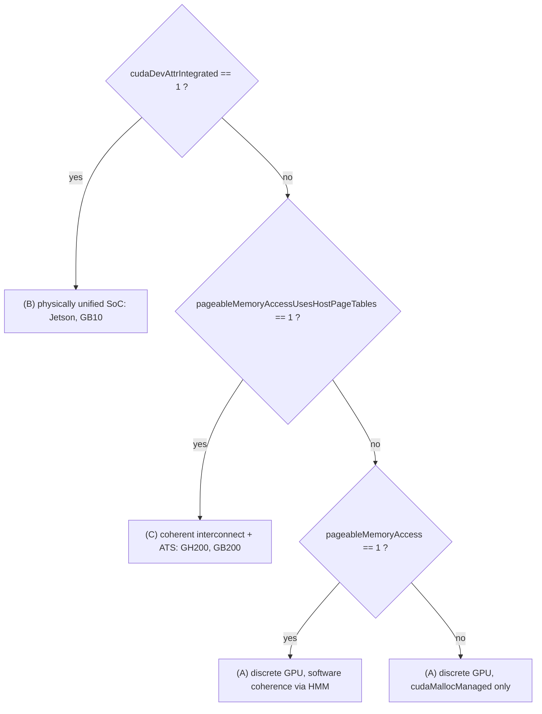
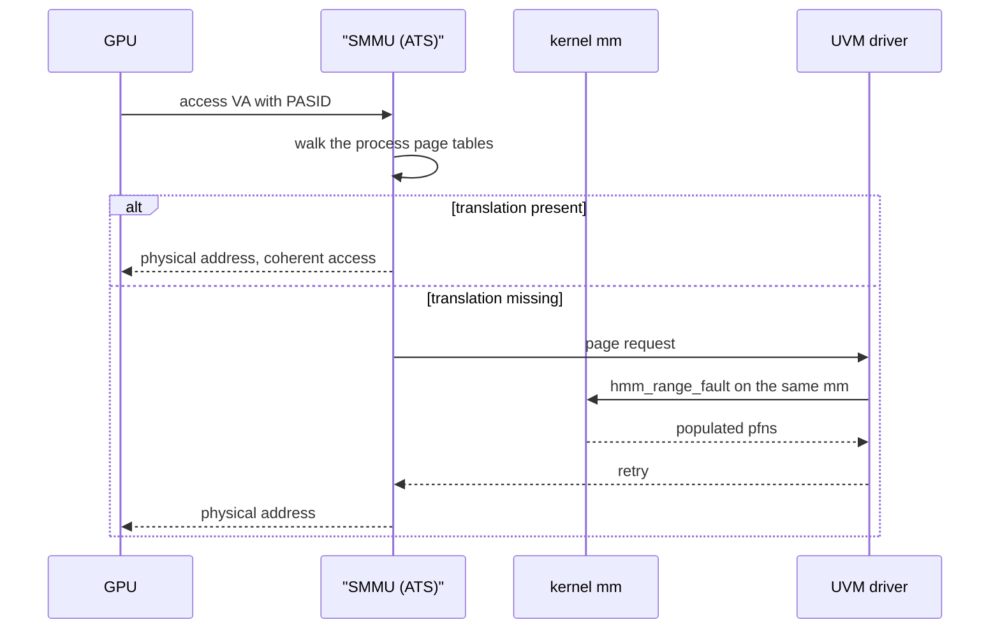

# Unified & Coherent Memory: UVM, Grace-Blackwell & GB10

> **Goal:** learn to tell apart the three different things the phrase "unified
> memory" names, work out which one your machine is, read a managed allocation
> in `/proc/<pid>/maps` and `/proc/<pid>/pagemap`, and reason from mechanism
> about why `cuda-checkpoint` refuses UVM Managed Memory — while keeping
> straight, sentence by sentence, what is documented, what is inference, and
> what nobody has published.

This chapter sits closer to the edge of the public record than any other in the
course. Read it with the labels on. Where I cite, the claim is **documented**;
where I say "this follows from", it is **inference** and I show the premises;
where I say "nobody has published", it is an **open question** you are invited
to close.

## Three different things called "unified memory"

The single most common error in this area is treating "unified memory" as one
thing. It is at least three, and they differ in the property that matters most
for checkpointing: **where the authoritative copy of a page physically is, and
who decides.**

**(A) CUDA Managed Memory on a discrete GPU.** You call `cudaMallocManaged()`
and get one virtual address that is valid on both the CPU and the GPU. Behind
it, physical pages live *either* in host RAM *or* in the card's VRAM, and the
UVM driver **migrates them on fault**: touch the range from the CPU while it is
resident on the device and you take a page fault that pulls it back. This is
unified to the programmer and emphatically not unified in hardware. There are
two physical pools and a PCIe bus between them.

**(B) Physically unified memory on an SoC.** Jetson, and the GB10 in DGX Spark.
The CPU and GPU are on one package and address the same DRAM. NVIDIA's Tegra
application note states it plainly: "both the CPU (Host) and the iGPU share SoC
DRAM memory", and consequently "device memory, host memory, and unified memory
are allocated on the same physical SoC DRAM". There is no migration because
there is nowhere to migrate *to*.

**(C) Coherent-interconnect platforms with separate pools.** Grace-Hopper
(GH200) and datacenter Grace-Blackwell (GB200) over NVLink-C2C. The CPU has its
own LPDDR5X and the GPU has its own HBM; they are *different* physical pools,
but the interconnect maintains **hardware cache coherence** and the platform
provides **Address Translation Services (ATS)**, so the GPU can walk the CPU's
page tables. The CUDA Programming Guide says of such systems that they have "a
logically combined page table for both CPUs and GPUs". Data still moves — but
it moves at cache-line granularity on demand, not as page-granular migration
driven by faults.

NVIDIA's own documentation enumerates four *unified memory paradigms* rather
than three: explicit managed allocations only; all allocations with **software**
coherence (Linux HMM); all allocations with **hardware** coherence (Grace
Hopper, NVLink-connected); and "limited" support (Windows, WSL, Tegra, compute
capability below 6.0). Note where Tegra lands in NVIDIA's own taxonomy: a
physically unified SoC is in the *limited* bucket. Physical unification and
programming-model unification are orthogonal axes, and this is the clearest
single proof of it.

One more trap, and it is a naming trap. **"Grace-Blackwell" names two very
different machines.** GB200 is the datacenter part: a Grace CPU with LPDDR5X
plus Blackwell GPUs with HBM — category (C). GB10, the chip in DGX Spark, is
category (B): NVIDIA's own spec sheet lists its memory as "128 GB LPDDR5x,
coherent unified system memory" — one pool — and its CPU as "20-core Arm, 10
Cortex-X925 + 10 Cortex-A725".

Be careful with the CPU here, because the naming misleads in both directions.
NVIDIA *does* call GB10's CPU a Grace CPU — the DGX Spark announcement says the
Blackwell GPU is "connected via NVLink-C2C … to a high-performance NVIDIA Grace
CPU, which includes 20 power-efficient cores built with the Arm architecture" —
and also says MediaTek "collaborated on the design of GB10". But those 20 cores
are Cortex-X925 and Cortex-A725, not the Neoverse-V2 cores of the datacenter
Grace in GH200 and GB200. "Grace" is a product name spanning two different CPU
designs; do not carry a GH200 mental model onto a Spark on the strength of it.
The DGX Spark porting guide describes the GPU as integrated into the SoC, with
"a dynamic unified memory architecture (UMA)" in which "both CPU and GPU share
the same physical memory space without a fixed carve-out". If you read
"Grace-Blackwell" and picture GH200's two coherent pools, you will predict the
wrong behaviour on a Spark, and vice versa.

## Which one am I on, and how do I check?

Do not guess from the marketing name. Ask the driver.

The decisive facts are **documented CUDA device attributes**, with these exact
names and values in the CUDA Runtime API reference:

| Attribute | Value | Meaning (NVIDIA's wording) |
|---|---|---|
| `cudaDevAttrIntegrated` | 18 | "Device is integrated with host memory" |
| `cudaDevAttrManagedMemory` | 83 | "Device can allocate managed memory on this system" |
| `cudaDevAttrHostNativeAtomicSupported` | 86 | "Link between the device and the host supports native atomic operations" |
| `cudaDevAttrPageableMemoryAccess` | 88 | "Device supports coherently accessing pageable memory without calling `cudaHostRegister` on it" |
| `cudaDevAttrConcurrentManagedAccess` | 89 | "Device can coherently access managed memory concurrently with the CPU" |
| `cudaDevAttrPageableMemoryAccessUsesHostPageTables` | 100 | "Device accesses pageable memory via the host's page tables." |
| `cudaDevAttrDirectManagedMemAccessFromHost` | 101 | "Host can directly access managed memory on the device without migration." |

Two of these carry almost all the signal. `cudaDevAttrIntegrated` separates (B)
from everything else. `cudaDevAttrPageableMemoryAccessUsesHostPageTables` says
the device goes through the *host's* page tables — which the Programming Guide
ties directly to ATS availability, present "on hardware such as Grace Hopper and
Grace Blackwell, where an NVIDIA CPU is used and the interconnect between the
CPU and GPU is NVLink Chip-to-Chip (C2C)". When all system memory is unified,
that attribute also distinguishes hardware coherence (1) from software
coherence (0).



From the Linux side, three cheap checks corroborate the answer:

```bash
# 1. Is GPU memory a NUMA node the kernel owns?
numactl -H                      # a CPU-less node with lots of memory ⇒ onlined device memory
lscpu | grep -i 'NUMA node'

# 2. What does nvidia-smi say about memory?
nvidia-smi --query-gpu=memory.total,memory.used --format=csv

# 3. Is the UVM driver even loaded, and with what?
lsmod | grep nvidia_uvm
ls -l /dev/nvidia-uvm /dev/nvidia-uvm-tools
```

Check (2) has a documented tell. The DGX Spark documentation states: "On iGPU
platforms, `nvidia-smi` will display 'Memory-Usage: Not Supported' even though
per-process GPU memory is listed." That NVIDIA calls DGX Spark an *iGPU
platform* in its own release notes is the cleanest documented confirmation that
GB10 is category (B). The same document tells you to stop asking
`cudaMemGetInfo` for the truth and read `/proc/meminfo` — `MemAvailable`,
`SwapFree`, hugepages — because on a shared pool the honest question is how much
memory the *system* has left, not how much the *GPU* has left.

Check (1) is subtler than it looks, and section
["Two ways to be coherent"](#/unified-memory@two-ways-to-be-coherent) below
explains why a coherent platform may show no GPU NUMA node at all.

## The UVM driver: a char device and 65 ioctls

Everything about managed memory on Linux passes through one kernel module,
`nvidia-uvm`, and two character devices. Both are created by the same module:
[`uvm.c`](https://github.com/NVIDIA/open-gpu-kernel-modules/blob/main/kernel-open/nvidia-uvm/uvm.c)
calls `alloc_chrdev_region()` for `NVIDIA_UVM_NUM_MINOR_DEVICES` and adds one
`cdev` at `NVIDIA_UVM_PRIMARY_MINOR_NUMBER`; `uvm_tools_init()` in
[`uvm_tools.c`](https://github.com/NVIDIA/open-gpu-kernel-modules/blob/main/kernel-open/nvidia-uvm/uvm_tools.c)
adds a second `cdev` at `NVIDIA_UVM_TOOLS_MINOR_NUMBER`. Those constants are
`0` and `1` in `uvm_common.h`. So `/dev/nvidia-uvm` and `/dev/nvidia-uvm-tools`
are minor 0 and minor 1 of a single dynamically allocated major — one module,
one major, two nodes. (Do not expect to see that major in `/proc/<pid>/maps`:
the device column there is the `st_dev` of the *filesystem* holding the node,
normally devtmpfs, not the character device's own number. Both nodes will show
the same value there, but for the boring reason, not this one.)

A correction worth making, because the sloppy version of this claim is
everywhere. **The UVM kernel module is open source.** It ships in
[`open-gpu-kernel-modules`](https://github.com/NVIDIA/open-gpu-kernel-modules)
under a dual MIT/GPL licence, and everything in this section is read directly
out of it (driver **610.43.03**, the tip of `main` when this was written — pin
your own reading to a version, because these interfaces move). What is closed is
the *user-mode* CUDA driver, `libcuda.so`, which is the only thing that issues
these ioctls, and the GSP firmware. What is *undocumented* is the ioctl ABI:
no man page, no stability promise, no user-facing specification. Open,
undocumented and unstable are three different properties, and only the last two
are what make the interface opaque in practice.

The surface is 63 commands defined in
[`uvm_ioctl.h`](https://github.com/NVIDIA/open-gpu-kernel-modules/blob/main/kernel-open/nvidia-uvm/uvm_ioctl.h)
(counting `#define UVM_… UVM_IOCTL_BASE(n)` lines), plus two more —
`UVM_INITIALIZE` and `UVM_DEINITIALIZE` — in `uvm_linux_ioctl.h`. Sixty-five in
total. The first one you must issue carries its own documentation, verbatim
from `uvm_linux_ioctl.h`:

```c
// This ioctl must be the first operation performed on the UVM file descriptor
// after opening it. Until this ioctl is made, the UVM file descriptor is
// inoperable: all other ioctls will return NV_ERR_ILLEGAL_ACTION and mmap will
// return EBADFD.
#define UVM_INITIALIZE                                                0x30000001
```

Four of the rest matter for this chapter:

- **`UVM_MIGRATE`** (51) — explicit migration of a range to a processor named by
  `destinationUuid`. *(Inference, not documented: this is the shape
  `cudaMemPrefetchAsync()` must land on. The mapping from CUDA API to UVM ioctl
  happens inside `libcuda.so`, which is closed; the header says nothing about
  prefetch. Confirm it with `strace` if it matters to you.)*
- **`UVM_SET_PREFERRED_LOCATION`** (42) and `UVM_SET_ACCESSED_BY` (46) — the
  *policy* attached to a range, distinct from its contents. Remember these; they
  are central to the checkpointing argument later.
- **`UVM_TOOLS_READ_PROCESS_MEMORY`** (62) and `UVM_TOOLS_WRITE_PROCESS_MEMORY`
  (63) — a `{buffer, size, targetVa}` read/write, with a `bytesRead` out, issued
  on the tools device against a target process. *(Inference: this is the natural
  primitive for a debugger to read a managed allocation without caring where it
  currently lives. NVIDIA documents no such mapping.)*
- **`UVM_QUERY_RESIDENCY`** (81) — takes `{base, length, samplingStride,
  isManagedMemory}` and returns a `NvProcessorUuid residency` and a
  `resident_nid`. Its parameter struct carries an array commented "Results from
  `move_pages()` call (userland passes these to kernel)" — i.e. userspace is
  expected to call `move_pages(2)` itself and hand the results down. Which is
  the useful part for us: on platforms where device memory is a NUMA node, that
  same syscall answers "which node is this page on" with no NVIDIA tooling in
  the path at all.

### The mmap contract

This is the part that explains what you see in `/proc`. `uvm_mmap()` enforces
three rules before it will map anything:

1. The fd must already have been through `UVM_INITIALIZE` (otherwise `-EBADFD`).
2. **The file offset must equal the virtual address.** The source comment is
   explicit — "UVM mappings are required to set offset == VA" — enforced by
   rejecting any mapping where `vma->vm_start != (vma->vm_pgoff << PAGE_SHIFT)`.
3. The mapping must be `MAP_SHARED` with both `PROT_READ` and `PROT_WRITE`, so
   the driver "get[s] all fault callbacks without the kernel doing COW behind
   our backs".

It then sets `VM_MIXEDMAP | VM_DONTEXPAND | VM_DONTCOPY` and installs its own
`vm_operations_struct`. Each flag is load-bearing:

- `VM_MIXEDMAP` because the driver inserts pages with `vm_insert_page()`.
- `VM_DONTEXPAND` so `mremap` cannot grow the VMA behind the driver's back and
  desynchronise its range bookkeeping from the kernel's.
- `VM_DONTCOPY` as the *default*, so a `fork()` does not duplicate managed
  mappings — the source says this avoids "the performance impact of removing CPU
  mappings in the parent on `fork()`+`exec()`", and that a child needing access
  must ask for it with `madvise(MADV_DOFORK)`.

Rule 2 gives you a **falsifiable prediction**, which is the best kind of thing
to get out of source code: on a real capture, a managed VMA backed by
`/dev/nvidia-uvm` must show a file-offset column *equal to its start address*.

## What the address space actually looks like

[GPU Checkpointing](#/gpu-checkpoint) showed a CUDA process's maps, including
this line:

```text
200000000-200200000000    ---p 00000000 00:00 0
```

A very large `---p` range, at a suspiciously round address, with no backing file
and no permissions at all. Here is what can and cannot be said about it.

**Documented:** nothing. NVIDIA publishes no description of this region.

**Inference, from three premises:** `---p` means `PROT_NONE` and private; the
absence of a device number and inode means it is anonymous, not a device
mapping; and the UVM driver's own `mmap` path refuses anything that is not
shared and read-write. Therefore this region was *not* created through
`/dev/nvidia-uvm`. It is an ordinary `mmap(PROT_NONE, MAP_ANONYMOUS)`
reservation made by the user-mode driver to claim a contiguous slab of the
address space — so that later managed allocations can be placed at fixed
addresses inside it, satisfying rule 2 above and keeping GPU and CPU virtual
addresses identical. The `uvm_ioctl.h` header does still define a legacy
`UVM_RESERVE_VA` command, but it is *not* routed in the ioctl dispatch table in
`uvm.c` at 610.43.03, so the reservation is not made that way today.

**Open question:** whether the base address (`0x200000000` in that capture) is
fixed, per-driver, or negotiated — and what happens to it across a restore into
a process whose address space is already differently populated.

An actual managed allocation should therefore appear as a *separate*, shared,
read-write VMA on the uvm device. Test the prediction on your own hardware:

```bash
PID=$(pgrep -n python)
awk '$6 ~ /nvidia-uvm$/ {split($1,a,"-"); printf "%s  off=%s  start=%s\n", $0, $3, a[1]}' \
    /proc/$PID/maps
```

If the `off=` column matches `start=`, the driver invariant holds and you are
looking at managed ranges. If it does not, that VMA is something else — a tools
mapping, a semaphore pool, a device-P2P range — and you should say so rather
than assume. This is the kind of check the rest of this chapter exists to let
you perform instead of trusting prose, including mine.

### What `pagemap` reports

Now go one level down, to [`/proc/<pid>/pagemap`](https://elixir.bootlin.com/linux/v6.12/source/Documentation/admin-guide/mm/pagemap.rst).
One 64-bit entry per virtual page; bit 63 is "page present", bit 62 is "page
swapped", bits 0–54 hold the PFN if present or a swap type/offset if swapped.
Since Linux 4.2 the PFN field is **zeroed unless you have `CAP_SYS_ADMIN`**, so
run these as root or expect zeros.

The interesting question is what a page currently resident on the *device*
reports. The answer is in
[`fs/proc/task_mmu.c`](https://elixir.bootlin.com/linux/v6.12/source/fs/proc/task_mmu.c)
at v6.12, in `pte_to_pagemap_entry()`. A device-private page is represented by a
special swap PTE, so it takes the `is_swap_pte()` branch: the entry comes back
with **bit 62 set and bit 63 clear** — indistinguishable at a glance from a page
that went out to swap. And because the entry is a PFN swap entry, the "swap
offset" field is filled from `swp_offset_pfn()`, i.e. it encodes the *device*
PFN, not a location in a swap file. A page resident in host RAM in the same
range reports present, with a normal PFN.

That is the whole of the [Device Memory in the Kernel](#/hmm-and-mmu-notifiers)
lesson made visible from userspace: device-private memory is modelled as
"swapped out to a place only the driver can reach". Coherent device memory
(`MEMORY_DEVICE_COHERENT`) should look different — **inference**, from the
type's own definition: those pages are CPU-addressable and live in ordinary
present PTEs, so pagemap ought to report them present with a real PFN. I have
not seen that capture published, which is why it appears again as open question
4 below rather than as a fact here.

The consequence for checkpointing is immediate and it is not a small one. CRIU
decides whether to dump a page in
[`criu/mem.c`](https://github.com/checkpoint-restore/criu/blob/criu-dev/criu/mem.c),
in `should_dump_page()`, with this test:

```c
if ((pme & (PME_PRESENT | PME_SWAP)) && !__page_is_zero(pme)) {
        page_info->softdirty = pme & PME_SOFT_DIRTY;
        page_info->next = vaddr;
        return 0;
}
```

(One caveat on that snippet, because it dates: `should_dump_page()` now has two
branches. The one quoted is the classic `/proc/<pid>/pagemap` path. Current
CRIU prefers a newer `pmc->regs` path built on the `PAGEMAP_SCAN` ioctl and its
`PAGE_IS_*` categories, and falls back to the pagemap-bit test above. The
reasoning below is about the pagemap branch; the `PAGEMAP_SCAN` branch would
need its own reading, which nobody has published either.)

A device-private page sets `PME_SWAP`. **Inference:** if CRIU ever walked such a
range, it would select the page for dumping, then read it out of the target's
address space — and that read is a CPU access to a device-private page, which by
construction faults and triggers the driver's `migrate_to_ram` callback. The act
of checkpointing would drag every resident device page back across the bus, one
fault at a time, at whatever rate the migration path sustains. Whether that
would even complete with the process frozen is an **open question**: nobody has
published a trace of it, because CRIU refuses the `/dev/nvidia-uvm` VMA long
before it gets there.

## Migration on fault: what the driver actually registers

The migrate-on-fault machinery is not mysterious, and you can read all of it.

For the discrete-GPU case, `devmem_alloc_pagemap()` in
[`uvm_devmem.c`](https://github.com/NVIDIA/open-gpu-kernel-modules/blob/main/kernel-open/nvidia-uvm/uvm_devmem.c)
carves a physical address range out of `iomem_resource` with
[`request_free_mem_region()`](https://elixir.bootlin.com/linux/v6.12/C/ident/request_free_mem_region)
— tagged, charmingly, `"nvidia-uvm-hmm"` — then fills a `struct dev_pagemap`:

```c
devmem->pagemap.type = MEMORY_DEVICE_PRIVATE;
devmem->pagemap.ops  = &uvm_devmem_ops;
ptr = memremap_pages(&devmem->pagemap, NUMA_NO_NODE);
```

and `uvm_devmem_ops` supplies exactly two callbacks: a `page_free` (or
`folio_free` on newer kernels) and `.migrate_to_ram = devmem_fault_entry`. That
`migrate_to_ram` is the hook the kernel calls when a CPU touches a device-private
page. [`memremap.h`](https://elixir.bootlin.com/linux/v6.12/source/include/linux/memremap.h)
at v6.12 describes the type it is registering for as "Device memory that is not
directly addressable by the CPU: CPU can neither read nor write private memory."

That is category (A), end to end: `struct page`s that exist so the kernel's
migration machinery has something to work with, PTEs that are special swap
entries, and a driver callback that pulls a page home when the CPU insists.

### Two ways to be coherent

Here is where it gets genuinely interesting, and where a fact I had not expected
falls out of the source. There are **two** distinct ways coherent GPU memory is
handled, and they look completely different from `/proc`.

The first: the platform onlines GPU memory as a **NUMA node**. `uvm_gpu.h`
documents the flag with a comment that is worth quoting exactly — the driver
tracks whether "the platform supports HW coherence and the GPU's memory is
exposed as a NUMA node to the kernel". On such a system the GPU's memory is
ordinary kernel-managed memory in a CPU-less node, `numactl -H` shows it, and
`move_pages(2)` will tell you what node each page is on.

The second is called **CDMM**, and the definition is in the same header:

```c
// Coherent Driver-based Memory Management (CDMM) is a mode that allows
// coherent GPU memory to be managed by the driver and not the OS. This
// is done by the driver not onlining the memory as NUMA nodes. CDMM as a
// property applies to the entire system.
bool cdmm_enabled;
```

In CDMM mode the driver keeps the coherent memory for itself, and registers it
as `MEMORY_DEVICE_COHERENT` ZONE_DEVICE memory instead:

```c
devmem->pagemap.type         = MEMORY_DEVICE_COHERENT;
devmem->pagemap.range.start  = parent_gpu->system_bus.memory_window_start;
devmem->pagemap.ops          = &uvm_device_coherent_pgmap_ops;
ptr = memremap_pages(&devmem->pagemap, NUMA_NO_NODE);
```

Note what is *missing* from `uvm_device_coherent_pgmap_ops` compared with the
device-private one: there is no `migrate_to_ram`. There does not need to be. The
CPU can read and write these pages directly; `memremap.h` defines the type as
"Device memory that is cache coherent from device and CPU point of view."

And it adds a constraint with sharp teeth for our purposes: "no one should be
allowed to pin such memory so that it can always be evicted."

**Inference:** anything that pins user pages — `get_user_pages()` for a DMA
target, an RDMA registration, a userfaultfd-based lazy-restore scheme — cannot
hold a `MEMORY_DEVICE_COHERENT` page. That is a structural constraint on any
future checkpoint implementation, not a bug to be fixed. The kernel's migration
selector reflects the same split: at v6.12,
[`migrate.h`](https://elixir.bootlin.com/linux/v6.12/source/include/linux/migrate.h)
defines `MIGRATE_VMA_SELECT_SYSTEM`, `MIGRATE_VMA_SELECT_DEVICE_PRIVATE` and
`MIGRATE_VMA_SELECT_DEVICE_COHERENT` as three separate flags.

So "is this machine coherent?" and "does `numactl -H` show a GPU node?" are
*different questions*. On a CDMM system the answer to the first is yes and the
second is no.

## Faults on a coherent platform: ATS, not migration

On category (C) hardware the CPU's page tables are authoritative, and the GPU
does not get its own copy — it walks the host's. The plumbing for that is
standard Linux SVA, and the NVIDIA driver uses the ordinary kernel API.

It happens in two steps, in
[`uvm_ats_sva.c`](https://github.com/NVIDIA/open-gpu-kernel-modules/blob/main/kernel-open/nvidia-uvm/uvm_ats_sva.c).
`uvm_ats_sva_bind_gpu()` takes the GPU's `struct pci_dev` and the process's
`struct mm_struct`, and calls
[`iommu_sva_bind_device()`](https://elixir.bootlin.com/linux/v6.12/C/ident/iommu_sva_bind_device)
on `{&pci_dev->dev, mm}`, keeping the returned `struct iommu_sva *` handle. A
separate function, `uvm_ats_sva_register_gpu_va_space()`, reads back a PASID
from that handle with
[`iommu_sva_get_pasid()`](https://elixir.bootlin.com/linux/v6.12/C/ident/iommu_sva_get_pasid)
and stores it in `gpu_va_space->ats.pasid`. The bind function's own comment
names the platform: "Multiple calls for the {same `pci_dev`, `mm`} pair are
refcounted by the ARM SMMU Layer." Both kernel functions are `EXPORT_SYMBOL_GPL` in
[`drivers/iommu/iommu-sva.c`](https://elixir.bootlin.com/linux/v6.12/source/drivers/iommu/iommu-sva.c)
at v6.12. The arm64 side of this — SMMUv3, stall-on-fault, ASIDs, the page-table
formats being walked — is [arm64 Memory Management](#/arm64-memory)'s territory.

With a PASID bound, a GPU memory access is translated by the SMMU against *the
process's own page tables*. There is no second set of page tables to keep in
sync, no migration to trigger, and no device-private PTE anywhere in the picture.
When translation fails, the fault is serviced against the same `mm`: the driver's
ATS fault path in
[`uvm_ats_faults.c`](https://github.com/NVIDIA/open-gpu-kernel-modules/blob/main/kernel-open/nvidia-uvm/uvm_ats_faults.c)
calls [`hmm_range_fault()`](https://elixir.bootlin.com/linux/v6.12/C/ident/hmm_range_fault)
to populate and snapshot the range, and registers an
[`mmu_interval_notifier`](https://elixir.bootlin.com/linux/v6.12/C/ident/mmu_interval_notifier_insert)
so that a concurrent invalidation is not missed. Both of those mechanisms belong
to [Device Memory in the Kernel](#/hmm-and-mmu-notifiers); the point here is only
that on a coherent platform they are used to *resolve* a fault in place, not to
*move* a page.



Contrast the migrate-on-fault model of category (A), where the equivalent
sequence *ends with a page in a different physical place* and a PTE rewritten to
say so. That difference — resolve versus relocate — is the whole reason the
checkpointing story differs between the categories.

What coherence buys you, then: no explicit copies, cache-line rather than page
granularity, host pointers valid inside kernels, and one page-table hierarchy of
record.

What it does **not** buy you, and this list is worth memorising:

- **Capacity isolation.** One pool means a GPU over-allocation is a *system*
  memory exhaustion. Community reports from DGX Spark users describe exactly
  that failure mode; treat the severity as anecdote, but the mechanism is not in
  doubt.
- **Bandwidth.** GB10's 273 GB/s is NVIDIA's published figure for the whole
  shared pool, not a per-consumer budget — a vendor spec, quoted as a vendor
  spec. So is the interconnect comparison: NVIDIA's DGX Spark announcement says
  GB10 "uses NVIDIA NVLink-C2C interconnect technology to deliver a CPU+GPU-coherent
  memory model with 5x the bandwidth of fifth-generation PCIe." That is a
  vendor claim about a specific chip against a specific PCIe generation, not a
  general property of NVLink-C2C, and it is not an independent measurement.
- **Programming-model concurrency.** On Tegra, NVIDIA documents that
  `cudaDeviceProp::concurrentManagedAccess` "can be 1 only on Thor or later Tegra
  devices running L4T". Physically shared memory, and yet on older Jetsons the
  CPU still may not freely touch managed memory while a kernel runs.
- **Familiar tooling.** `nvidia-smi` reporting "Memory-Usage: Not Supported" is
  documented behaviour, not a fault.

## Why `cuda-checkpoint` says no to managed memory

Now the intellectual core. Two sources agree and both are unambiguous.

**Documented.** The CRIU CUDA plugin README states that "NVIDIA UVM Managed
Memory, MIG (Multi Instance GPU), and MPS (Multi-Process Service) are currently
not supported for checkpointing." The `cuda-checkpoint` README independently
lists "UVM memory or IPC memory created with `cuMemExportToShareableHandle()`"
among what is not supported, and adds that these constraints "will be addressed
in subsequent display driver releases."

Everything after this point is **inference**. NVIDIA has published no rationale.
What follows is reasoning from the mechanisms above, and you should hold it to
the standard of an argument, not a citation.

Recall from [GPU Checkpointing](#/gpu-checkpoint) what makes the discrete path
work: `cuda-checkpoint`'s `checkpoint` action moves device contents into
**process-owned host allocations** and releases the GPU. Afterwards the process
is an ordinary Linux process, and stock CRIU dumps ordinary memory. The trick is
a *change of ownership*: memory the driver owned becomes memory the process owns,
described by VMAs `/proc` can enumerate.

Now ask what that trick would even mean for a managed allocation. Four
obstructions, in increasing order of how hard they are to remove:

**1. The mapping belongs to the driver, and its identity is structural.** A
managed range is not anonymous memory. It is a VMA on `/dev/nvidia-uvm` with
`vma->vm_ops` pointing at `uvm_vm_ops_managed`, carrying `VM_MIXEDMAP` and the
invariant `pgoff == vm_start`. CRIU cannot recreate that generically: restoring
it means reopening the uvm fd, re-issuing `UVM_INITIALIZE`, and `mmap`ing at
exactly the original address with exactly the original offset — which is the
driver's job, not CRIU's. Unlike the discrete case, moving the *bytes* does not
change the *kind* of VMA; the mapping stays a driver mapping.

**2. Authority over a page is per-page and moves.** In category (A) a single
managed range can be half-resident on the host and half on the device at the
instant you freeze it. There is no single authoritative copy of the range; there
is a per-page answer, held in driver bookkeeping. Serializing the range requires
either forcing a full migration to the host first, or teaching the serializer to
consult the driver page by page.

**3. The bytes are not the state.** A managed range carries *policy* that is not
in its contents: preferred location (`UVM_SET_PREFERRED_LOCATION`), the
accessed-by set (`UVM_SET_ACCESSED_BY`), read-duplication, and hardware access
counters that drive future migration decisions. A checkpoint that restores every
byte and none of the policy produces a process that is bit-identical and
performance-alien: correct output, different migration behaviour, no way for the
user to know. Byte-exactness is not state-exactness here.

**4. On coherent hardware, one of the two obvious implementations is
forbidden.** The natural way to serialize `MEMORY_DEVICE_COHERENT` pages would be
to pin them and read them. `memremap.h` says you may not: "no one should be
allowed to pin such memory so that it can always be evicted." So a coherent-memory
implementation must cooperate with eviction rather than resist it, which means
cooperating with the driver, which means the driver needs an interface.

Put the four together and the shape of the answer appears: **UVM is unsupported
not because the data is unreachable but because the ownership boundary is in the
wrong place.** For discrete `cudaMalloc` memory, the driver can hand everything
back and step out of the picture. For managed memory it cannot step out — the
mapping *is* the driver.

So what would have to become true? Three plausible routes, none announced by
anybody:

- **The AMD route.** An in-kernel checkpoint/restore ioctl family on
  `/dev/nvidia-uvm` analogous to `kfd_ioctl_criu`: enumerate managed ranges,
  serialize contents *and* policy, recreate them at restore. This is the design
  that already works in the mainline kernel for AMD; [GPU
  Checkpointing](#/gpu-checkpoint) walks it.
- **The CRIU-plugin route.** The CUDA plugin *would* have to register
  `CR_PLUGIN_HOOK__HANDLE_DEVICE_VMA` and `CR_PLUGIN_HOOK__UPDATE_VMA_MAP` — to
  claim uvm VMAs and drive whatever driver interface exists. It registers
  neither today: `plugins/cuda/cuda_plugin.c` registers exactly
  `PAUSE_DEVICES`, `CHECKPOINT_DEVICES` and `RESUME_DEVICES_LATE`. The AMD
  plugin, by contrast, already registers both of those VMA hooks — so the
  machinery exists in CRIU and is proven; what is missing is a driver interface
  for the CUDA side to drive.
- **The transformation route, and the closest to today's design.** The driver
  materializes managed ranges as ordinary anonymous memory across the toggle,
  lets CRIU dump them as plain pages, and re-adopts them into a rebuilt UVM
  address space on restore. This preserves the "become a plain Linux process"
  property that makes the current design work at all — at the cost of the driver
  having to re-establish the exact VA layout, which rule 2 of the mmap contract
  makes mandatory rather than optional.

Watch the `cuda-checkpoint` README's limitations section for movement. It is the
only public place any of this will show up first.

## The three meanings, side by side

| | **(A) Managed, discrete GPU** | **(B) Physically unified SoC** | **(C) Coherent interconnect** |
|---|---|---|---|
| **Examples** | any dGPU + `cudaMallocManaged` | Jetson, GB10 / DGX Spark | GH200, GB200 |
| **Physical pools** | two (host RAM, VRAM) | one | two, hardware-coherent |
| **Is there a copy on checkpoint?** *(inference — see note below)* | yes — device→host is the checkpoint | no device→host bus copy exists to make; the bytes are already in system DRAM | no *bus* copy needed for coherent ranges; a copy into image files still is |
| **Who owns the page?** | driver, per page; residency migrates | the kernel owns system DRAM; driver owns its allocations | either the kernel (memory onlined as a NUMA node) or the driver (CDMM, `MEMORY_DEVICE_COHERENT`) |
| **What `/proc/<pid>/maps` shows** | `rw-s` VMA on `/dev/nvidia-uvm`, `pgoff == start`, plus a large `---p` anonymous reservation | same uvm VMAs; the reservation is still there | same uvm VMAs; ATS ranges are ordinary anonymous/file VMAs the GPU reads directly |
| **What `pagemap` reports for a device-resident page** | bit 62 set, bit 63 clear — looks swapped; PFN field is a device PFN | present, normal PFN | present with a real PFN for coherent pages |
| **What breaks under `cuda-checkpoint`** | documented unsupported | documented unsupported (UVM is UVM regardless of platform) | documented unsupported |
| **Distinguishing attribute** | `Integrated == 0`, `pageableMemoryAccessUsesHostPageTables == 0` | `Integrated == 1` | `Integrated == 0`, `pageableMemoryAccessUsesHostPageTables == 1` |

Two notes on reading that table. The "is there a copy" row is **inference from
the physical layout, not a description of any working code path** — it says
what a checkpoint *would* have to move if one existed, and for managed memory
none does. [GPU Checkpointing](#/gpu-checkpoint) states the same thing as a
hypothesis and is right to: lower copy cost is a question to test after support
exists, not an expected present-day behaviour.

And the row that surprises people is the last-but-one. **The unsupported list is
written against UVM Managed Memory as an allocation type, not against a
hardware platform.** Nothing in either README conditions the restriction on the
GPU being discrete. Whether the restriction is *enforced* platform-independently
in the driver is something I could not verify — I have no access to the code path
in `libcuda.so` that raises it — and it is a five-minute experiment for anyone
holding a Spark.

## The open questions, stated so you can close them

Public measurements do not exist. [GPU Checkpointing](#/gpu-checkpoint) already
says so, and nothing in the research for this chapter contradicts it: as of
**2026-07** there are no published image sizes, toggle latencies, restore
latencies, or CRIT autopsies for CUDA checkpointing on unified-memory hardware.
That is a gap in the field, not in the searching.

Six questions, each with the observation that answers it:

1. **Does `cuda-checkpoint --toggle` fail on a managed allocation on a GB10?**
   Which error, at which action — `lock` or `checkpoint`? Answered by
   `--get-state` before and after a deliberate attempt.
2. **Does it fail differently for a process that uses *only* `cudaMalloc` on the
   same iGPU platform?** This separates "UVM is unsupported" from "unified-memory
   platforms are unsupported", which is exactly the ambiguity flagged above.
3. **What does the `---p` reservation look like on category (B) hardware —
   same base address, same size?** Answered by `grep -- '---p' /proc/<pid>/maps`
   on a CUDA process on a Spark and on a discrete-GPU box.
4. **What does `pagemap` say for a managed range on each of the three
   categories?** On (A) you should see bit 62 set for device-resident pages. On
   (B) and (C) the prediction from the source above is *present, real PFN*.
   Anyone can falsify that in ten minutes with root.
5. **Image size and restore latency, when it works at all.** Does the image
   contain the managed range once, twice, or not at all?
6. **Does `move_pages(2)` report a GPU NUMA node for managed pages?** If yes, you
   are on a NUMA-onlined coherent platform; if the memory is coherent but no node
   appears, you are looking at CDMM from the outside.

[Lab: Checkpoint a CUDA Process](#/lab-gpu-checkpoint) has the protocol for
running these safely on a disposable worker. Two rules carry over unchanged: use
a machine whose state you are willing to lose, and treat a rejection as a
*result* worth recording, not as a failure of the experiment.

## Follow the code (kernel v6.12)

The kernel side, all readable:

- [`memremap_pages()`](https://elixir.bootlin.com/linux/v6.12/C/ident/memremap_pages)
  and [`include/linux/memremap.h`](https://elixir.bootlin.com/linux/v6.12/source/include/linux/memremap.h)
  — `enum memory_type`, the `MEMORY_DEVICE_PRIVATE` vs `MEMORY_DEVICE_COHERENT`
  contract, and `struct dev_pagemap_ops` with its `migrate_to_ram` hook.
- [`request_free_mem_region()`](https://elixir.bootlin.com/linux/v6.12/C/ident/request_free_mem_region)
  — how a driver claims physical address space for device pages.
- [`is_device_private_page()`](https://elixir.bootlin.com/linux/v6.12/C/ident/is_device_private_page)
  and [`is_device_coherent_page()`](https://elixir.bootlin.com/linux/v6.12/C/ident/is_device_coherent_page)
  — the two predicates the whole distinction reduces to.
- [`include/linux/migrate.h`](https://elixir.bootlin.com/linux/v6.12/source/include/linux/migrate.h)
  and [`migrate_vma_setup()`](https://elixir.bootlin.com/linux/v6.12/C/ident/migrate_vma_setup)
  — `MIGRATE_VMA_SELECT_{SYSTEM,DEVICE_PRIVATE,DEVICE_COHERENT}`.
- [`hmm_range_fault()`](https://elixir.bootlin.com/linux/v6.12/C/ident/hmm_range_fault)
  and [`mmu_interval_notifier_insert()`](https://elixir.bootlin.com/linux/v6.12/C/ident/mmu_interval_notifier_insert)
  — the snapshot-and-invalidate pair used on the ATS path.
- [`iommu_sva_bind_device()`](https://elixir.bootlin.com/linux/v6.12/C/ident/iommu_sva_bind_device),
  [`iommu_sva_get_pasid()`](https://elixir.bootlin.com/linux/v6.12/C/ident/iommu_sva_get_pasid)
  in [`drivers/iommu/iommu-sva.c`](https://elixir.bootlin.com/linux/v6.12/source/drivers/iommu/iommu-sva.c)
  — the whole of the "GPU walks the CPU's page tables" mechanism, in one small file.
- [`fs/proc/task_mmu.c`](https://elixir.bootlin.com/linux/v6.12/source/fs/proc/task_mmu.c)
  — `pte_to_pagemap_entry()` and [`swp_offset_pfn()`](https://elixir.bootlin.com/linux/v6.12/C/ident/swp_offset_pfn),
  which is where "device-private looks swapped" is actually decided.

The NVIDIA side, at driver **610.43.03** (pin your own reading; these move):

- [`kernel-open/nvidia-uvm/uvm.c`](https://github.com/NVIDIA/open-gpu-kernel-modules/blob/main/kernel-open/nvidia-uvm/uvm.c)
  — char-device setup, `uvm_mmap()` and its three rules, the ioctl dispatch table.
- [`uvm_devmem.c`](https://github.com/NVIDIA/open-gpu-kernel-modules/blob/main/kernel-open/nvidia-uvm/uvm_devmem.c)
  — both `dev_pagemap` registration paths, private and coherent.
- [`uvm_gpu.h`](https://github.com/NVIDIA/open-gpu-kernel-modules/blob/main/kernel-open/nvidia-uvm/uvm_gpu.h)
  — the `mem_info.numa` flag and the `cdmm_enabled` comment that defines CDMM.
- [`uvm_ats_sva.c`](https://github.com/NVIDIA/open-gpu-kernel-modules/blob/main/kernel-open/nvidia-uvm/uvm_ats_sva.c)
  and [`uvm_ats_faults.c`](https://github.com/NVIDIA/open-gpu-kernel-modules/blob/main/kernel-open/nvidia-uvm/uvm_ats_faults.c)
  — PASID binding and ATS fault servicing.
- [`uvm_ioctl.h`](https://github.com/NVIDIA/open-gpu-kernel-modules/blob/main/kernel-open/nvidia-uvm/uvm_ioctl.h)
  — the full command list, including `UVM_QUERY_RESIDENCY` and the tools
  read/write pair.

## Try it yourself

Everything below runs on a discrete-GPU Linux box with the NVIDIA driver loaded.
The parts that need category (B) or (C) hardware are marked; without it, read the
source instead — that is what the "no hardware" fallback looks like in this
chapter.

```bash
# 1. The two char devices, one major, two minors.
ls -l /dev/nvidia-uvm /dev/nvidia-uvm-tools
#   crw-rw-rw- 1 root root 235, 0 ... /dev/nvidia-uvm        ← minor 0
#   crw-rw-rw- 1 root root 235, 1 ... /dev/nvidia-uvm-tools  ← minor 1

# 2. Which category is this machine? (needs the CUDA samples, or write 20 lines
#    of cudaDeviceGetAttribute yourself)
./deviceQuery | grep -Ei 'Integrated|Unified|Managed|host page tables'

# 3. The address space of a live CUDA process.
PID=$(pgrep -n python)
grep -E 'nvidia|---p' /proc/$PID/maps
awk '$6 ~ /nvidia-uvm$/ {split($1,a,"-"); print "off=" $3 "  start=" a[1]}' /proc/$PID/maps
#   off must equal start for managed ranges — that is the uvm_mmap invariant

# 4. pagemap for one page of a managed range (root required for the PFN).
#    bit 63 = present, bit 62 = swapped. Device-private reads as "swapped".
ADDR=0x200000000        # replace with a real managed address from step 3
sudo python3 - "$PID" "$ADDR" <<'PY'
import struct, sys
pid, addr = int(sys.argv[1]), int(sys.argv[2], 0)
with open(f"/proc/{pid}/pagemap", "rb") as f:
    f.seek((addr // 4096) * 8)
    e = struct.unpack("<Q", f.read(8))[0]
print(f"raw={e:#018x} present={bool(e >> 63)} swapped={bool(e >> 62 & 1)} "
      f"pfn_or_swap={e & ((1 << 55) - 1):#x}")
PY

# 5. Category (B)/(C) hardware only: is device memory a NUMA node?
numactl -H
grep -E 'MemTotal|MemAvailable' /proc/meminfo   # the honest number on one pool
nvidia-smi --query-gpu=memory.total --format=csv
```

If step 5 shows a CPU-less node with tens of gigabytes, the platform onlined
device memory as NUMA. If the platform is coherent and no such node appears, you
are almost certainly looking at CDMM — and `numactl` will never tell you,
because that is precisely what CDMM means.

## Check your understanding

1. A colleague says "our new box has unified memory, so checkpointing will be
   cheap — there's no VRAM to copy." Name the two distinct things they may have
   confused, and the one attribute that settles which machine they actually have.

<details><summary>Show answer</summary>

They have confused *physically unified SoC memory* (category B: Jetson, GB10 —
one DRAM pool, no migration possible because there is nowhere to migrate to)
with *CUDA Managed Memory on a discrete GPU* (category A: two pools, migration
on fault) — and possibly with a third, *coherent interconnect with separate
pools* (category C: GH200, GB200). `cudaDevAttrIntegrated` settles B versus
everything else in one query; `cudaDevAttrPageableMemoryAccessUsesHostPageTables`
then separates C from A. And the "cheap checkpoint" conclusion does not follow
on any of them, because UVM Managed Memory is documented as unsupported by
`cuda-checkpoint` regardless of platform.

</details>

2. `/proc/<pid>/pagemap` shows bit 62 set and bit 63 clear for a page in a
   managed range. The machine has no swap configured. What is going on?

<details><summary>Show answer</summary>

The page is resident on the device. A device-private page is represented in the
page tables by a special swap PTE, so `pte_to_pagemap_entry()` in v6.12 takes
its `is_swap_pte()` branch and sets `PM_SWAP` (bit 62) with `PM_PRESENT` (bit
63) clear. Because it is a PFN swap entry, the offset field is filled from
`swp_offset_pfn()` and encodes a *device* PFN, not a location in any swap file
— which is why the absence of swap is not a contradiction. This is the
userspace-visible signature of the `MEMORY_DEVICE_PRIVATE` model.

</details>

3. The UVM driver requires that `mmap` offset equal the mapped virtual address.
   What does that constraint buy the driver, and what does it cost a
   checkpoint/restore implementation?

<details><summary>Show answer</summary>

It buys address-space simplicity: with offset pinned to VA there is no aliasing
between different virtual addresses and the same file offset, and
`unmap_mapping_range()` becomes straightforward — the driver's own comment says
as much. What it costs a restore implementation is that the *virtual address is
part of the contract*. You cannot re-map a saved managed range wherever
convenient; it must land at exactly its original address, which is also why the
user-mode driver reserves a large `PROT_NONE` slab up front to place allocations
inside. Any future UVM checkpoint support has to guarantee that layout on
restore, not merely preserve the bytes.

</details>

4. Two machines are both "hardware coherent". On one, `numactl -H` shows a
   CPU-less node holding the GPU's memory. On the other it shows nothing of the
   kind. Neither is broken. Explain.

<details><summary>Show answer</summary>

They use the two different coherent modes the UVM driver implements. In the
first, the platform onlines GPU memory as a NUMA node — `uvm_gpu.h` tracks this
with a flag whose comment says the memory "is exposed as a NUMA node to the
kernel" — so it is ordinary kernel-managed memory and `numactl`/`move_pages(2)`
can see it. In the second, CDMM ("Coherent Driver-based Memory Management") is
in effect: the driver deliberately does *not* online the memory as NUMA nodes,
and instead registers it as `MEMORY_DEVICE_COHERENT` ZONE_DEVICE memory via
`memremap_pages()`. It is equally coherent and equally CPU-addressable; it is
just not the OS's to allocate. "Is it coherent?" and "does it show up in
`numactl`?" are different questions.

</details>

5. On a coherent ATS platform, a GPU access misses translation. Walk the
   resolution, and say what makes it structurally different from a
   migrate-on-fault resolution on a discrete GPU.

<details><summary>Show answer</summary>

The GPU issues the access tagged with a PASID that the driver obtained by
calling `iommu_sva_bind_device()` on `{pci_dev, mm}` and reading back
`iommu_sva_get_pasid()`. The SMMU walks *the process's own page tables*. On a
miss it raises a page request; the driver services it against the same `mm` —
`uvm_ats_faults.c` uses `hmm_range_fault()` to populate and snapshot the range,
with an `mmu_interval_notifier` guarding against concurrent invalidation — and
the access is retried. The structural difference: this sequence *resolves* a
translation and leaves the page where it is, whereas migrate-on-fault *relocates*
the page to the other pool and rewrites the PTE to say so. One ends with a valid
translation; the other ends with a moved page.

</details>

6. Reason out why `cuda-checkpoint`'s discrete-GPU trick — copy device memory
   into process-owned host allocations, then let stock CRIU dump an ordinary
   process — has no straightforward analogue for managed memory.

<details><summary>Show answer</summary>

The trick works because it changes *ownership*: memory the driver owned becomes
ordinary anonymous memory the process owns, described by VMAs CRIU already
knows how to dump. A managed allocation is already in the process's address
space, so there is nothing to move it *to* that changes its nature — the VMA is
still a `/dev/nvidia-uvm` mapping with the driver's `vm_ops`, `VM_MIXEDMAP`, and
the `pgoff == vm_start` invariant. Moving the bytes does not change the kind of
mapping, and CRIU cannot recreate that kind of mapping generically. Add that
authority over each page is per-page and mobile, and that a range carries policy
(preferred location, accessed-by, read duplication, access counters) that is not
in its bytes, and the conclusion is that the ownership boundary is in the wrong
place — not that the data is unreachable. This is inference from mechanism;
NVIDIA has published no rationale.

</details>

7. Someone proposes serializing `MEMORY_DEVICE_COHERENT` pages by pinning them
   with `get_user_pages()` and reading them out. Why is that ruled out, and by
   what?

<details><summary>Show answer</summary>

By the kernel's own definition of the type. `include/linux/memremap.h` at v6.12
says of `MEMORY_DEVICE_COHERENT` that "no one should be allowed to pin such
memory so that it can always be evicted." Pinning would defeat the eviction
guarantee the type exists to provide. Any checkpoint implementation for coherent
device memory therefore has to cooperate with eviction rather than block it —
which in practice means cooperating with the driver, which means the driver
needs a checkpoint interface. It is a structural constraint on the design space,
not a bug.

</details>

8. Classify each of these as documented, inferable, or open: (a) UVM Managed
   Memory is unsupported by `cuda-checkpoint`; (b) the large `---p` region in a
   CUDA process's maps is an anonymous `PROT_NONE` reservation made by the
   user-mode driver; (c) the restore latency of a checkpointed managed workload
   on GB10.

<details><summary>Show answer</summary>

(a) is **documented**, twice and independently: the CRIU CUDA plugin README
names "NVIDIA UVM Managed Memory, MIG ... and MPS ... not supported for
checkpointing", and the `cuda-checkpoint` README lists UVM memory among its
unsupported cases. (b) is **inferable**, not documented: `---p` means
`PROT_NONE` and private, the absence of a device number and inode means
anonymous, and the driver's `mmap` path rejects anything not shared and
read-write — so it cannot have come through `/dev/nvidia-uvm`; NVIDIA describes
this region nowhere. (c) is **open**: no image sizes, toggle latencies or
restore latencies for unified-memory CUDA checkpointing have been published as
of 2026-07. Keeping these three tiers apart is the entire discipline this
chapter is trying to teach.

</details>

---

## Sources & further reading

- [CUDA Programming Guide — Unified Memory](https://docs.nvidia.com/cuda/cuda-programming-guide/04-special-topics/unified-memory.html)
  — the four "unified memory paradigms", the software- vs hardware-coherence
  distinction, the "logically combined page table" statement for Grace Hopper,
  and section 4.1.3 "Unified Memory on Windows, WSL, and Tegra", which is where
  the *limited* bucket is defined.
- [CUDA Programming Guide — Unified and System Memory](https://docs.nvidia.com/cuda/cuda-programming-guide/02-basics/understanding-memory.html)
  — the definitions of managed memory, system-allocated memory, what changes on
  HMM/ATS systems, and (on this page, not the unified-memory page) the tie
  between ATS availability and NVLink Chip-to-Chip.
- [CUDA Runtime API — device attributes](https://docs.nvidia.com/cuda/cuda-runtime-api/group__CUDART__TYPES.html)
  — the authoritative names, numeric values and one-line meanings of
  `cudaDevAttrIntegrated`, `cudaDevAttrPageableMemoryAccessUsesHostPageTables`,
  `cudaDevAttrConcurrentManagedAccess` and the rest of the detection table above.
- [CUDA for Tegra application note](https://docs.nvidia.com/cuda/cuda-for-tegra-appnote/index.html)
  — "both the CPU (Host) and the iGPU share SoC DRAM memory", and the
  `concurrentManagedAccess` restriction to Thor-or-later Tegra devices.
- [NVIDIA/open-gpu-kernel-modules](https://github.com/NVIDIA/open-gpu-kernel-modules)
  — the UVM driver itself: char devices, the `mmap` invariants, both
  `dev_pagemap` registration paths, the CDMM definition, and PASID binding. Every
  driver-side claim in this chapter is read from here at 610.43.03.
- [NVIDIA DGX Spark product page](https://www.nvidia.com/en-us/products/workstations/dgx-spark/)
  and [DGX Spark hardware overview](https://docs.nvidia.com/dgx/dgx-spark/hardware.html)
  — vendor specification sheet: "128 GB LPDDR5x, coherent unified system memory",
  273 GB/s (256-bit interface, 4266 MHz), "20-core Arm, 10 Cortex-X925 + 10
  Cortex-A725". Vendor claims, attributed as such.
- [NVIDIA newsroom: DGX Spark and DGX Station announcement](https://nvidianews.nvidia.com/news/nvidia-announces-dgx-spark-and-dgx-station-personal-ai-computers)
  — NVIDIA calling GB10's CPU a "Grace CPU", the MediaTek co-design, and the
  "5x the bandwidth of fifth-generation PCIe" NVLink-C2C claim. All vendor
  marketing; quoted, not endorsed.
- [DGX Spark porting guide — system overview](https://docs.nvidia.com/dgx/dgx-spark-porting-guide/overview.html)
  and [DGX Spark known issues](https://docs.nvidia.com/dgx/dgx-spark/known-issues.html)
  — the integrated-GPU / UMA description, and the documented
  "Memory-Usage: Not Supported" behaviour with the `/proc/meminfo` guidance that
  replaces it.
- [NVIDIA/cuda-checkpoint](https://github.com/NVIDIA/cuda-checkpoint) and the
  [CRIU CUDA plugin README](https://github.com/checkpoint-restore/criu/blob/criu-dev/plugins/cuda/README.md)
  — the two independent statements that UVM managed memory is unsupported.
- [Documentation/mm/hmm.rst](https://elixir.bootlin.com/linux/v6.12/source/Documentation/mm/hmm.rst)
  and [include/linux/memremap.h](https://elixir.bootlin.com/linux/v6.12/source/include/linux/memremap.h)
  — the kernel's own definitions of device-private and device-coherent memory,
  including the no-pinning rule.
- [Documentation/admin-guide/mm/pagemap.rst](https://elixir.bootlin.com/linux/v6.12/source/Documentation/admin-guide/mm/pagemap.rst)
  — the bit layout this chapter's `pagemap` reading depends on, and the
  `CAP_SYS_ADMIN` rule for PFNs.
- [criu/mem.c](https://github.com/checkpoint-restore/criu/blob/criu-dev/criu/mem.c)
  — `should_dump_page()`, the `PME_PRESENT | PME_SWAP` test that decides what
  CRIU reads out of a target.

**Next:** take the reasoning here to real hardware in
[Lab: Checkpoint a CUDA Process](#/lab-gpu-checkpoint), or go back one level to
the kernel machinery it all rests on in
[Device Memory in the Kernel](#/hmm-and-mmu-notifiers).
