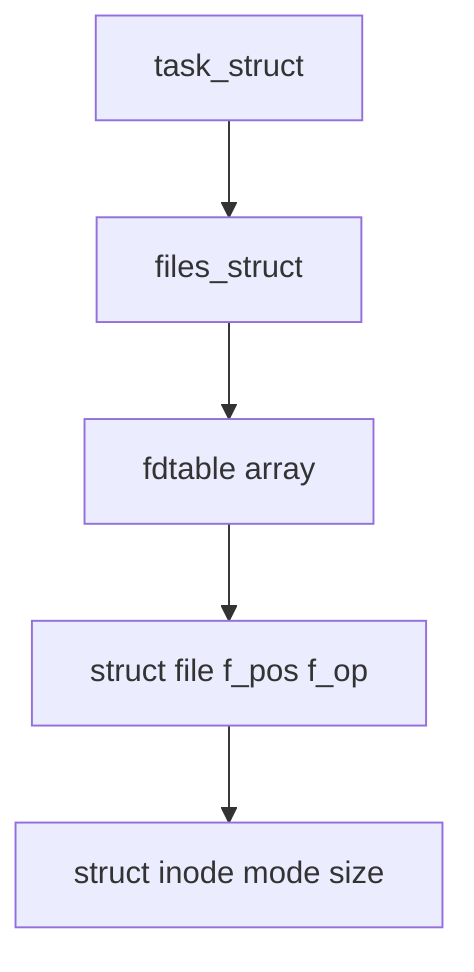
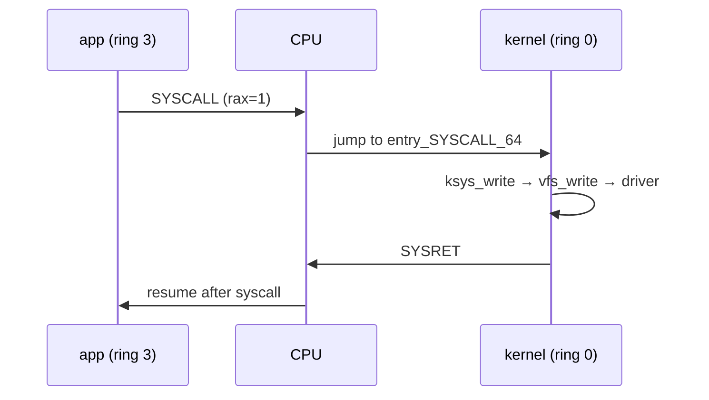

# What Is Linux, Really?

> **Goal of this chapter:** before touching any detail, build the correct mental
> model of what "Linux" is, what an operating system actually does, and how the
> pieces you hear about — kernel, shell, distro, GNU — fit together. By the end
> you'll know what the kernel binary actually contains, which data structures
> it uses to invent processes and files, how it talks to the hardware, and why
> the whole cloud runs on it.

Most people say "Linux" and mean a whole operating system: a desktop, a package
manager, a terminal. Technically, **Linux is only the kernel** — a single
program, booted by your firmware, that runs with total control over the
hardware and stays in charge until you power off.

Everything else — your shell, your editor, `ls`, Docker, Firefox — is just
**user-space programs** that politely ask the kernel for services across a
hardware-enforced boundary. That boundary gets its own chapter:
[Kernel, User Space & Syscalls](#/kernel-vs-userspace).

## What problem does a kernel solve?

Imagine a computer with no operating system. A program running on it would
have to:

- know the exact model of your disk controller to read a file,
- manage every byte of RAM by hand, hoping no other program touches it,
- own the whole CPU — no other program could run at the same time,
- speak raw Ethernet frames to use the network.

And nothing would stop a buggy program from overwriting another program's
memory, or the disk's partition table. Early personal computers (MS-DOS era)
worked almost exactly like this.

A kernel solves this with three big ideas: **abstraction**, **multiplexing**,
and **protection**. Each deserves a real look, because the rest of this book
is a tour of the machinery behind them.

### 1. Abstraction

The kernel hides messy hardware behind clean, uniform interfaces. You don't
read "sector 81,344 of the NVMe drive"; you read `/home/you/notes.txt`. You
don't program a network card; you open a *socket*. Thousands of different
devices, one stable API.

This is deeper than just "wrapping" hardware. The kernel invents entirely new
concepts the hardware doesn't know about:

- **Files and directories** — a disk is just a giant array of sectors; the
  kernel's [VFS layer](#/filesystems) gives you a tree of named files with
  permissions.
- **Processes** — the CPU has no built-in "process." The kernel creates this
  abstraction: a private address space, a PID, a state (running, sleeping,
  zombie), all tracked in a `struct task_struct`.
- **Pipes and sockets** — the hardware only knows about memory and network
  packets; the kernel invents byte streams between processes
  ([Pipes, FIFOs & Unix Sockets](#/ipc-pipes)).
- **Threads** — to the CPU, they're just instruction streams; the kernel
  schedules them and makes them share memory.

Every one of these abstractions is, concretely, a **C struct plus the code
that manipulates it**. It's worth meeting the three most important structs
right now, because you will see them in every chapter that follows:

**`struct task_struct`** (defined in `include/linux/sched.h`) — one per thread.
It's a big structure — several kilobytes with a typical config — but a handful
of fields carry most of the story:

| Field | What it holds |
|---|---|
| `pid` | the thread's kernel ID (what `gettid()` returns) |
| `comm[16]` | the short name you see in `ps` |
| `__state` | running / interruptible sleep / uninterruptible sleep / stopped |
| `mm` | pointer to `struct mm_struct` — the address space; threads of one process share it |
| `files` | pointer to the open file descriptor table |
| `nsproxy`, `cgroups` | which [namespaces](#/namespaces) and [cgroups](#/cgroups) this task lives in |

**`struct file`** — one per *open* file description. Its key field is `f_op`,
a pointer to a `struct file_operations`: a table of function pointers
(`read_iter`, `write_iter`, `mmap`, `poll`, …). This one indirection is how
`write()` on a terminal, a pipe, an ext4 file, and a TCP socket can all be the
same syscall dispatching to completely different code.

**`struct inode`** — one per filesystem object, holding the metadata: owner,
mode bits, size, timestamps. Many `struct file`s (many opens) can point at one
inode.

These three structs are wired into the object graph behind every open file
descriptor. The current task's `task_struct->files` points at a
`struct files_struct`, which owns the **fd table** (a `struct fdtable` wrapping
an array of `struct file *`). The integer `fd` you pass to `read()` is nothing
but an index into that array — `fd == 3` means "slot 3." Each `struct file`
carries `f_pos` (the per-open byte offset) and `f_inode`/`f_op`, so it points
at the shared `struct inode` while keeping its own cursor:



This graph explains three behaviors precisely. Two processes that each `open()`
the same path get two independent `struct file`s (independent `f_pos`) sharing
one `struct inode` — write from one and the other's offset doesn't move. A
`dup()`'d fd or a fork-inherited fd, by contrast, shares a *single*
`struct file`, so the offset is shared. And closing the last fd that references
a `struct file` frees it; freeing the last `struct file` that references an
inode lets the inode be evicted from the cache. Reference counts, not garbage
collection, keep the whole graph honest.

Each abstraction is a kernel subsystem, and Parts II through IV of this site
are a tour of them one by one: [Processes & Threads](#/processes),
[Virtual Memory](#/memory), [Files, Filesystems & the VFS](#/filesystems),
[The Networking Stack](#/networking).

### 2. Multiplexing (sharing)

You have 1 CPU (ok, maybe 8 cores) and hundreds of processes. The kernel slices
CPU time so each process *believes* it has the machine to itself. It does this
by **context switching**: the kernel saves one task's register file, stack
pointer, and program counter into its `task_struct`, then loads another's — and
the CPU resumes as if it never left. The switch itself (on x86-64, the
`__switch_to()` path) costs on the order of **1–2 microseconds** of direct
work, plus an indirect tax: the incoming task finds the CPU caches and TLB full
of the *previous* task's data. That indirect cost is why the scheduler doesn't
switch more often than it has to.

Who runs next is the scheduler's decision. Since **kernel 6.6 (late 2023)**,
the default scheduler for normal tasks is **EEVDF** (Earliest Eligible Virtual
Deadline First), which replaced CFS after 16 years. Tasks get
millisecond-scale slices, weighted by their nice value; the full mechanics are
in [CPU Scheduling](#/scheduling). Periodic scheduler ticks fire at
`CONFIG_HZ` — typically 250 or 1000 times per second on distro kernels, and
modern kernels can suppress the tick entirely on idle or isolated CPUs
([Timers & Time](#/timers)).

The same trick applies to memory: every process sees its own private address
space, even though they all share the same RAM. The hardware **MMU** (Memory
Management Unit) rewrites virtual addresses to physical ones on the fly,
page by page, under the kernel's control. A page is **4 KiB on x86-64** by
default; **arm64 can be built with 4, 16, or 64 KiB pages** (Apple Silicon
kernels use 16 KiB). Two processes can both store data at "address
0x7ffee000" — and each gets a different physical page, because the MMU walks a
different **page table** for each. This illusion is called **virtualization of
resources** — and as we'll see, [containers](#/containers-overview) are just
this idea pushed further, virtualizing PIDs, hostnames, and network stacks the
same way memory and CPU time already are.

> **Container link:** a container gets *no* new mechanism from the kernel. It
> is ordinary multiplexing — namespaces slice the kernel's object namespaces,
> cgroups slice CPU/memory/I/O — applied aggressively. Part III builds one by
> hand.

### 3. Protection

The CPU itself has privilege levels. The kernel runs in **privileged mode**
(ring 0 on x86, EL1 on arm64); normal programs run in **unprivileged mode**
(ring 3 / EL0). A user program physically *cannot* talk to hardware or touch
other processes' memory — the CPU forbids it. The enforcement is per-page:
every page table entry carries a **User/Supervisor bit**, and touching a
supervisor page from ring 3 raises a page fault. Modern x86 CPUs even protect
the *other* direction — **SMEP** and **SMAP** stop the kernel from
accidentally executing or dereferencing user-space memory, closing a whole
class of exploits.

If a user program touches memory it shouldn't, the CPU raises an exception,
the kernel's fault handler runs, finds no valid mapping, and delivers
**SIGSEGV** — usually killing the process ([Signals](#/signals),
[Interrupts, Exceptions & Softirqs](#/interrupts)). Every memory access, every
instruction executed in user mode is policed by this hardware-enforced wall.

The only way for user code to affect the world is to ask the kernel via a
**system call**. This transition is the single most important boundary in the
entire system, and [Kernel, User Space & Syscalls](#/kernel-vs-userspace) is
devoted to it.

## What is the kernel, concretely?

So far we've talked about what the kernel *does*. But what *is* it? If you
open `/boot`, you'll find it:

```bash
ls -lh /boot/vmlinuz-*
# -rw-r--r-- 1 root root 14M Mar 18 12:34 vmlinuz-6.12.0-generic
```

Let's be precise about what this file is, because the names confuse everyone:

- The kernel build first produces **`vmlinux`** — a genuine, statically linked
  **ELF binary** ("virtual memory Linux"). No libc, no dynamic linker, no
  external dependencies: everything the kernel needs is inside.
- That ELF is then stripped, compressed (gzip, xz, or zstd — zstd is common on
  modern distros), and wrapped with a small self-extracting stub. The result is
  **`vmlinuz`** (the `z` for "zipped"; on x86 the build target is called
  `bzImage`). With the EFI stub enabled, the outer file even carries a PE/COFF
  header so UEFI firmware can load it like a Windows executable.

A ~14 MiB `vmlinuz` unpacks to a kernel of several tens of MiB in memory.

The bootloader loads this file into RAM and jumps to its entry point. From
that moment until shutdown, the kernel **never exits**. It's not like a regular
program that starts, does work, and terminates. The kernel *is* the environment
in which all other programs exist. It initializes itself, then creates the
first user-space process (PID 1), and from there it's always running — either
servicing a system call, handling an interrupt, or sitting idle waiting for
the next event.

### What happens when the kernel boots

When the kernel takes control from the bootloader, it immediately:

1. **Decompresses itself** — the stub extracts the real kernel image into
   memory and jumps into it.
2. **Discovers the hardware** — enumerates CPUs and RAM from firmware tables
   (**ACPI** on PCs and servers, a **device tree** on most embedded arm64),
   then probes buses (PCIe, USB) and matches drivers to devices. It doesn't
   use BIOS calls for this; after early boot it talks to hardware directly.
3. **Initializes kernel subsystems** — sets up the final page tables for
   virtual memory, configures interrupt handling, starts the scheduler, mounts
   the initial **root filesystem** (usually from an initramfs first).
4. **Launches PID 1** — looks for `/sbin/init` (or whatever the `init=` boot
   parameter says) and creates the first user-space process — on nearly every
   modern distro, that's systemd.

We walk through this sequence step by step in
[From Power Button to Login](#/boot-process). For now, the mental picture: the
kernel is a big static binary that loads, sets up the hardware, and then
spends the rest of its life reacting to events — system calls, interrupts,
timer ticks.

### Kernel modules — extensibility without rebooting

The kernel image in `/boot` is not the whole story. Linux supports **loadable
kernel modules** (`.ko` files, under `/lib/modules/$(uname -r)/`). A `.ko` is
a *relocatable* ELF object; when you load it, the kernel allocates memory,
links it against the running kernel's symbols, and tracks it in a
`struct module`. Device drivers, filesystems, and network protocols can all be
loaded and unloaded without rebooting:

```bash
lsmod | head                   # list loaded modules with usage counts
modinfo ext4 | head            # metadata: description, license, parameters
ls /lib/modules/$(uname -r)/kernel/ | head
```

Modules run in kernel space with full privileges, exactly like code compiled
into the base image — which is why modern kernels support **module
signature verification**: a distro kernel with Secure Boot enforced will
refuse unsigned modules ([Trusted Computing](#/trusted-computing)). Modules
are the pragmatic halfway between a pure monolithic kernel and the microkernel
ideal (more on that below). A typical desktop kernel has 100–200 modules
loaded, all sharing the kernel's single address space. You'll write and load
one yourself in [Lab: Write, Build & Load a Kernel Module](#/lab-kernel-module).

## Monolithic kernel: why everything runs in one address space

Operating systems fall on a spectrum:

| Architecture | Kernel code runs in… | Communication between services | Examples |
|---|---|---|---|
| **Monolithic** | One shared address space, full privilege | Direct function calls | Linux, the BSDs |
| **Microkernel** | Small core (IPC, scheduling); services in user space | Inter-process messages | Minix, QNX, seL4 |
| **Hybrid** | Mostly monolithic with some user-space services | Mixed | macOS (XNU), Windows NT |

Linux is a **monolithic kernel**. The scheduler, memory manager, filesystem
stack, networking stack, and device drivers all live in the same address space
and call each other directly — just like functions in any C program.

### Why monolithic?

The debate has raged since 1992 (the Tanenbaum–Torvalds Usenet thread — look
it up, it's legendary). The monolithic argument:

**Performance.** A system call from user space to kernel space is already
expensive (the CPU must switch privilege levels; mitigations may flush parts
of the TLB). If the kernel then had to do IPC message-passing to a separate
file-system service... and that service did IPC to a separate disk-driver
service... every `read()` would cost multiple context switches. A monolith
handles a `read()` with a dozen function calls inside the same address space.

**Practicality.** Writing drivers that live in separate processes with formal
message-passing APIs is genuinely harder. Linux's internal APIs are C function
calls between subsystems, and thousands of developers contribute drivers
against these APIs. The complexity of a formal IPC protocol between every
subsystem would be enormous.

### The cost

The trade-off: **no isolation**. A buffer overflow in a WiFi driver can corrupt
the scheduler's data structures and crash the entire machine. On a microkernel,
a buggy WiFi driver would crash only the networking service — the kernel core
would keep running and could restart it. (seL4 goes furthest: its core is
formally *proven* correct.)

Linux mitigates this pragmatically, and the mitigation list has grown teeth in
recent years:

- modules can be unloaded and reloaded; mainline drivers are heavily reviewed;
- [eBPF](#/ebpf-internals) lets you extend the kernel with programs that a
  **verifier proves safe** before they run — kernel extensibility without
  kernel risk;
- [Rust in the kernel](#/rust-kernel) (infrastructure merged in 6.1, first real
  drivers landing through the 6.x series) removes memory-unsafety from new
  driver code at the language level.

But the architectural trade-off is real and permanent.

## The layered picture

Keep this diagram in your head — the entire site is a guided tour of it,
from bottom to top:

```text
┌─────────────────────────────────────────────────────┐
│  Applications: bash, vim, nginx, dockerd, firefox   │   user space
├─────────────────────────────────────────────────────┤
│  Libraries: glibc, libssl, ...                      │   user space
├──────────────────── system calls ───────────────────┤   ← THE boundary
│                                                     │
│   THE LINUX KERNEL                                  │
│   ├─ Process management & scheduler                 │
│   ├─ Memory management (virtual memory)             │
│   ├─ VFS + filesystems (ext4, xfs, btrfs, ...)      │   kernel space
│   ├─ Networking stack (TCP/IP)                      │
│   ├─ Device drivers                                 │
│   └─ Security: permissions, namespaces, cgroups...  │
├─────────────────────────────────────────────────────┤
│  Hardware: CPU, RAM, disks, NIC, GPU                │
└─────────────────────────────────────────────────────┘
```

Two phrases you'll see constantly:

- **Kernel space** — code running with full privileges: the kernel and its
  modules. One bug here can crash the whole machine (a *kernel panic*).
- **User space** (or *userland*) — everything else. A crash here kills one
  process; the kernel shrugs and moves on.

### The numbers behind the boundary

When you run a process on Linux, the kernel reserves the top portion of its
**virtual address space** for itself — a region the process can never touch.
On x86-64 with the default 4-level page tables, addresses are 48 bits wide,
split into two 128 TiB halves:

```text
  0x0000000000000000 ──────────────────
                     │   userspace   │  128 TiB of address space (the
                     │    (text,     │   kernel maps pages into it
                     │     heap,     │   only on demand)
                     │     stack,    │
                     │     mmap)     │
  0x00007fffffffffff ├───────────────┤  ← user/kernel boundary
  0xffff800000000000 ├───────────────┤
                     │  kernel space │  128 TiB (kernel code & data,
                     │  (code, data, │   vmalloc, modules, and a
                     │   direct map  │   direct map of all RAM)
                     │   of all RAM) │
  0xffffffffffffffff └─────────────────
```

(The unusable gap in the middle exists because bit 47 must be sign-extended
into the upper bits — "canonical addresses." Machines that need more than
128 TiB can enable **5-level paging**, LA57, supported since kernel 4.14:
57-bit addresses, 64 PiB per half. arm64 has an analogous split with its own
layout.)

The kernel maps **all physical RAM** into its own half of every process's
address space (the "direct map"). This sounds wasteful — doesn't each process
duplicate the kernel? No: the kernel's half of every process's page tables
points at the **same physical page-table pages**, so the mapping is shared,
not copied. This is why a system call is cheap: the kernel is already mapped
and ready the moment you enter.

One modern footnote: since the **Meltdown** vulnerability (2018, kernel 4.15),
CPUs that are affected run with **KPTI** (kernel page-table isolation) — while
in user mode, the process's page tables contain only a *minimal sliver* of the
kernel, and the syscall entry code switches to the full kernel page tables on
the way in. On unaffected CPUs (post-2018 designs), the classic always-mapped
picture above still holds. Details in
[CPU Vulnerability Mitigations](#/cpu-mitigations).

This split is the mechanism behind the protection: a user-space pointer can
never accidentally alias kernel memory because the addresses are in entirely
different ranges and the CPU enforces the boundary in hardware, on every
access.

## A system call in slow motion

We dedicate a whole chapter to this, but seeing one now makes the rest of this
chapter tangible. Let's trace `write(1, "hello\n", 6)` — the code that prints
something to your terminal.

```c
// User-space side (inside glibc):
ssize_t write(int fd, const void *buf, size_t count) {
    // glibc moves arguments into registers and executes SYSCALL
    // fd → rdi, buf → rsi, count → rdx, syscall number (1) → rax
    return syscall(1, fd, buf, count);  // syscall is a libc wrapper
}
```

What happens next, at the CPU level:

```text
1. SYSCALL instruction executes in user mode (ring 3)
2. CPU atomically:
   - switches to ring 0
   - saves the return address (RIP) into RCX
   - saves RFLAGS into R11
   - jumps to the address in MSR_LSTAR (a CPU register the kernel
     programmed at boot — it points to entry_SYSCALL_64)
3. entry_SYSCALL_64 runs:
   - switches to this task's kernel stack (and, under KPTI, to the
     kernel page tables)
   - saves all user registers
   - dispatches on rax (1 → sys_write)
4. The write path does the real work:
   - looks up fd 1 in the current task's file table → the terminal's
     struct file
   - calls the file's write operation → the tty driver buffers the
     bytes and kicks the hardware
5. On return: restore user registers, execute SYSRET
6. CPU atomically switches back to ring 3, jumps to RCX
```



**The numbers:** the hardware ring transition itself takes tens of
nanoseconds; a trivial syscall round trip is a few hundred cycles, and CPU
vulnerability mitigations can double that on affected hardware. Complex
operations (disk I/O) take microseconds to milliseconds — which is why the
kernel puts your task to sleep and runs someone else meanwhile. Some
"syscalls" are so hot that the kernel cheats: `clock_gettime()` and
`gettimeofday()` usually never enter the kernel at all — they read shared
memory via the **vDSO**, a small kernel-provided library mapped into every
process.

This dance — user space asks, CPU switches rings, kernel does work, CPU
switches back — is the fundamental rhythm of Linux. Every `malloc` that needs
more memory, every `printf`, every incoming network packet, every timer tick
crosses this boundary.

## Follow the code (kernel v6.12)

Reading real kernel source is a skill this book trains deliberately (see
[Reading & Building the Kernel](#/kernel-dev)). Here are two short paths you
can follow today on
[elixir.bootlin.com](https://elixir.bootlin.com/linux/v6.12/source).

### Path 1: `write()` from ring 3 to the VFS

1. **[entry_SYSCALL_64](https://elixir.bootlin.com/linux/v6.12/C/ident/entry_SYSCALL_64)**
   (in `arch/x86/entry/entry_64.S`) — the assembly landing pad the CPU jumps
   to. It swaps to the kernel stack, saves the user registers into a
   `struct pt_regs`, and calls into C.
2. **[do_syscall_64()](https://elixir.bootlin.com/linux/v6.12/C/ident/do_syscall_64)**
   (`arch/x86/entry/common.c`) — the C dispatcher. Since 6.9 it reaches the
   handler through
   [x64_sys_call()](https://elixir.bootlin.com/linux/v6.12/C/ident/x64_sys_call),
   a generated `switch` over the syscall number (chosen over an indirect table
   jump to blunt Spectre-style attacks). Number 1 selects `sys_write`.
3. **[ksys_write()](https://elixir.bootlin.com/linux/v6.12/C/ident/ksys_write)**
   (`fs/read_write.c`) — the first "real" kernel logic. It calls
   [fdget_pos()](https://elixir.bootlin.com/linux/v6.12/C/ident/fdget_pos) to
   translate the integer `fd` into a `struct file *` via the current task's
   file table — this is the moment the number 1 becomes an object.
4. **[vfs_write()](https://elixir.bootlin.com/linux/v6.12/C/ident/vfs_write)**
   — the VFS layer. It checks that the file was opened for writing
   ([rw_verify_area()](https://elixir.bootlin.com/linux/v6.12/C/ident/rw_verify_area)
   also runs security hooks), then dispatches through the file's
   `struct file_operations`: `f_op->write` if the driver provides one,
   otherwise `f_op->write_iter` via
   [new_sync_write()](https://elixir.bootlin.com/linux/v6.12/C/ident/new_sync_write).
5. From here the path forks by file type: for a terminal it enters the tty
   driver; for an ext4 file it's
   [ext4_file_write_iter()](https://elixir.bootlin.com/linux/v6.12/C/ident/ext4_file_write_iter),
   which typically just copies your bytes into the page cache and returns —
   the disk write happens later ([The Linux Storage Stack](#/storage-stack)).

That single `f_op` indirection in step 4 *is* "everything is a file",
implemented.

### Path 2: what `cat /proc/uptime` actually runs

`/proc` files have no bytes on disk; each one is a callback. At boot, the proc
filesystem registers uptime with
[proc_create_single()](https://elixir.bootlin.com/linux/v6.12/C/ident/proc_create_single)
— "a file whose whole content comes from this one show function." When you
`read()` it:

1. The VFS routes the read into the seq_file helper
   [seq_read()](https://elixir.bootlin.com/linux/v6.12/C/ident/seq_read),
   which manages buffering so the show function doesn't have to.
2. It calls
   [uptime_proc_show()](https://elixir.bootlin.com/linux/v6.12/C/ident/uptime_proc_show)
   (in `fs/proc/uptime.c` — the whole file is ~50 lines, a great first read).
   It grabs the boot-relative time with
   [ktime_get_boottime_ts64()](https://elixir.bootlin.com/linux/v6.12/C/ident/ktime_get_boottime_ts64),
   sums per-CPU idle time, and formats both with
   [seq_printf()](https://elixir.bootlin.com/linux/v6.12/C/ident/seq_printf).
3. The formatted text is copied to your buffer. The "file" existed for exactly
   the duration of your read.

## Inside the kernel source tree

If you clone the kernel source (`git clone https://git.kernel.org/...`) and
run `ls -1`, here's what you'll find and what each top-level directory does:

| Directory | Purpose | You'll find… |
|---|---|---|
| `arch/` | Architecture-specific code | `arch/x86/boot/`, `arch/arm64/mm/`, per-CPU startup, page tables, syscall entry |
| `kernel/` | Core kernel logic | Scheduler (`kernel/sched/`), fork, signals, cgroups, timekeeping, eBPF core |
| `mm/` | Memory management | Page allocation, swapping, demand paging, the page cache |
| `fs/` | Filesystems and VFS | ext4, btrfs, xfs, NFS, VFS core (`fs/namei.c`, `fs/open.c`), proc |
| `net/` | Networking stack | TCP, UDP, IP, netfilter, socket layer (`net/core/`, `net/ipv4/`) |
| `drivers/` | Device drivers | The overwhelming majority of the code — GPU, disk, WiFi, USB, everything |
| `include/` | Header files | Kernel-internal API definitions, UAPI headers for user space |
| `lib/` | Kernel-internal library | String functions, checksums, data structures (rbtree, xarray) |
| `block/` | Block I/O layer | I/O schedulers, the bio layer, request queues |
| `scripts/` | Build infrastructure | Makefile helpers, Kconfig, Coccinelle |
| `security/` | Security modules | SELinux, AppArmor, Landlock, capabilities |
| `sound/` | Audio subsystem | ALSA |
| `init/` | Startup code | `start_kernel()` and friends — the first C code after entry |
| `ipc/` | Inter-process communication | SysV IPC, POSIX message queues |
| `crypto/` | In-kernel cryptography | Used by filesystems, networking, module signing |
| `rust/` | Rust support | Infrastructure for Rust kernel code (merged in v6.1) |
| `tools/` | User-space tools shipped with the kernel | `perf`, selftests, eBPF tooling |

Total: roughly **40 million lines** in the tree as of the 6.12 era (mostly C,
plus docs, headers, and a growing amount of Rust). Each ~9-week release cycle
merges work from **around 2,000 developers at 200+ companies**. The `drivers/`
directory alone is roughly 60% of the tree — Linux's strength is its hardware
support. How all those contributions get reviewed and merged is a story of its
own: [How the Kernel Is Made](#/kernel-governance).

## So what is a "distro"?

The kernel alone is useless to a human — it boots and then needs programs to
run. A **distribution** (Debian, Ubuntu, Fedora, Arch, Alpine…) is the kernel
*plus* a curated user space:

| Piece | Examples | Role |
|---|---|---|
| Kernel | Linux | Manages hardware & processes |
| C library | glibc, musl | Wraps syscalls into functions like `open()` |
| Core utilities | GNU coreutils, busybox | `ls`, `cp`, `cat`, … |
| Init system | systemd, OpenRC | First process; starts everything else |
| Package manager | apt, dnf, pacman, apk | Installs software |
| Shell | bash, zsh | Your command interpreter |

This is why "Linux" feels so different between Ubuntu and Alpine: the kernel is
essentially the same (Ubuntu ships glibc and systemd; Alpine ships musl and
busybox — that's most of the difference), while the user space around it
differs. It's also why container images can be "Alpine-based" or
"Debian-based" while running on the *same* kernel — hold that thought, it
becomes central in [What a Container Actually Is](#/containers-overview).

## "Everything is a file" (and some things that break the rule)

The most famous Unix idea deserves a first look right now. Linux exposes an
amazing amount of the system as files:

```bash
cat /proc/cpuinfo          # your CPU, as a text file
cat /proc/uptime           # seconds since boot
echo hello > /dev/null     # a device that discards everything
ls -l /dev/nvme0n1         # your disk, as a file
cat /sys/class/net/*/address   # your MAC addresses
```

`/proc` and `/sys` aren't real files on disk — they're **virtual filesystems**:
windows directly into live kernel data structures. Reading `/proc/cpuinfo`
executes kernel code that formats CPU information as text, on the fly (you
followed the uptime version of this code above). This design means *one* set
of tools (`cat`, `grep`, `echo`, permissions) works on files, devices, kernel
tunables, and process info alike.

And the pattern keeps winning. When kernel developers need a handle to a new
kind of object, they reach for a **file descriptor**, even when there's no
filesystem in sight: `timerfd` (a timer as an fd), `eventfd`, `signalfd`
(signals delivered as readable events), `memfd` (an anonymous memory region),
and since 5.3 **pidfd** — a file descriptor that refers to a *process*,
fixing decades of PID-reuse races in one stroke
([Processes & Threads](#/processes)). The fd is Linux's universal handle.

### Where the metaphor bends

Not everything is literally a file. Processes are **not** files — you can kill
one but you can't `cat` it. The directories in `/proc/<PID>/` expose process
information *as* files, but the process object itself in the kernel is a
`struct task_struct`, not an inode.

Network sockets are file descriptors (you can `write()` and `read()` them), but
you can't `ls` them in a regular directory — they live in the internal "sockfs"
pseudo-filesystem. System calls like `bind()` and `connect()` do things that
`open()`-of-a-path could never express.

The principle is brilliant but approximate: the kernel uses the file interface
wherever it makes sense, and adds specialized syscalls when it doesn't.

### /proc deep-dive

Every process on your machine has a directory under `/proc/<PID>/`. Try this:

```bash
ls /proc/$$/          # $$ is your current shell's PID
# cmdline  cwd  environ  exe  fd  maps  mountinfo  ns  stat  status  task

cat /proc/$$/status   # memory, UIDs, signal masks...
ls -l /proc/$$/fd     # every open file descriptor — sockets, pipes, files
cat /proc/$$/maps     # raw memory map: where libc, heap, stack live
ls -l /proc/$$/ns     # the namespaces this shell lives in
```

These are not text files the kernel wrote to a disk. They're **generated on
access** — the kernel's `/proc` code reads the relevant `task_struct` fields
and formats them into human-readable output, every time you `cat`. Most of
the tools in [/proc, strace, perf & eBPF](#/observability) — `ps`, `top`,
`lsof` — are, underneath, just parsers of these virtual files.

## Kernel panics, oops, and why Linux is reliable anyway

When kernel code hits an unrecoverable error, you get a **kernel panic** — the
kernel prints a backtrace and halts (or reboots, if `panic=` is set). No
process can run because the very thing that schedules processes has crashed.

A slightly less fatal failure is a **kernel oops** — the kernel detects a
problem (e.g., a driver dereferences a NULL pointer), prints a report, kills
the offending kernel context, and marks itself **tainted** (visible in
`/proc/sys/kernel/tainted`). The system may keep running, but the crashed
subsystem may have left locks held or data half-updated, so a panic frequently
follows. Many production servers set `panic_on_oops=1` deliberately: a clean
reboot beats limping on with corrupted state.

Why don't you see panics every day? Because:

- **Extensive testing.** Regression suites, fuzzers (syzkaller alone has found
  thousands of kernel bugs), and the `linux-next` integration tree, which
  soaks proposed changes for weeks before a merge window.
- **Strict review.** Subsystem maintainers aggressively reject fragile code.
  Code that worked "on my machine" but corrupts memory on someone else's won't
  survive the mailing list.
- **Fault isolation between processes.** Even if a kernel bug corrupts kernel
  state, unrelated processes often survive because their memory is untouched —
  until the corrupted object (a dentry, an inode, a page) is next used.

The kernel is not bug-free — new fixes land daily. But the combination of
monolithic performance, massive testing infrastructure, and aggressive
maintainer culture ([How the Kernel Is Made](#/kernel-governance)) makes it
reliable enough to power the internet.

## A tiny bit of history (it explains the culture)

- **1969–70, Bell Labs:** Ken Thompson and Dennis Ritchie create **Unix**, and
  with it the ideas Linux still lives by: *everything is a file*, small tools
  composed through pipes, a hierarchical filesystem, fork/exec.
- **1983:** Richard Stallman launches **GNU**, rewriting the Unix userland as
  free software — compiler (gcc), shell (bash), coreutils. Missing piece: a
  free kernel.
- **1991:** a Finnish student, **Linus Torvalds**, posts: *"just a hobby,
  won't be big and professional like gnu"*. GNU userland + Linux kernel = a
  complete free OS. Months later, the **Tanenbaum–Torvalds debate** erupts on
  Usenet — Linus defends his monolithic design against Andrew Tanenbaum's
  argument that microkernels are structurally superior.
- **1996:** Linux 2.0 introduces SMP (multi-CPU) support and portability
  beyond x86 matures.
- **2003:** Linux 2.6 — the kernel that ran the world's servers for over a
  decade: kernel preemption, the O(1) scheduler, huge scalability work.
- **2007:** 2.6.23 replaces the O(1) scheduler with **CFS**.
- **2011:** Linux 3.0 — a version bump (nothing broke), reflecting that the
  codebase had outgrown 2.6.x numbering.
- **2008–2013:** the container building blocks land piece by piece — cgroups
  (2.6.24), then user namespaces (3.8, 2013), the last piece Docker needed.
- **2019:** Linux 5.1 introduces `io_uring` ([Modern I/O](#/modern-io)) — a
  shared ring-buffer interface for batched, asynchronous system calls that
  matures across the 5.x and 6.x series into Linux's fastest I/O path.
- **2022:** Linux 6.1 — the initial **Rust** support infrastructure is merged.
- **2023:** Linux 6.6 — **EEVDF** replaces CFS as the default scheduler.
- **Today:** Linux runs the overwhelming majority of servers, **all** of the
  TOP500 supercomputers (100% since 2017), every Android phone (3 billion+
  devices), most embedded devices, and the entire cloud. A new major release
  ships every 9–10 weeks.

The Unix heritage matters practically: when something in Linux looks odd,
the answer is often "because Unix did it that way in 1975, and it turned out
to be a great idea" (file descriptors) or "…and we're stuck with it"
([signal semantics](#/signals)).

## The mental model you should have now

Before moving on, here's the picture to carry forward:

- **Linux is the kernel** — a monolithic, privileged binary that owns the
  hardware.
- **It never stops.** From boot to shutdown, it's always present, always in
  charge.
- **It abstracts, multiplexes, and protects.** Files, processes, sockets,
  virtual memory — none of these exist in the hardware; the kernel invents
  them, each as a struct plus code: `task_struct`, `struct file`,
  `struct inode`.
- **User space asks, kernel does.** Everything useful crosses the system call
  boundary, where the CPU enforces a privilege switch in hardware — a few
  hundred cycles per crossing.
- **"Everything is a file"** is a powerful pattern, though not literally true —
  and the file *descriptor* is even more universal than the file.
- **A distro is the kernel plus a curated userland.** Containers swap out the
  userland while sharing the kernel — the central insight of Part III.
- **The kernel source** is ~40M lines organized into well-defined subsystems
  (`arch/`, `kernel/`, `mm/`, `fs/`, `net/`, `drivers/`…) that the rest of
  this site explores — and you already traced two code paths through it.

## Check your understanding

Try answering before revealing each answer.

1. Your text editor wants to save a file. Can it write to the disk directly?
   What must happen instead?

<details><summary>Show answer</summary>

No. User-space code runs in unprivileged mode and cannot touch hardware. The
editor issues `write()` system calls; the CPU switches to ring 0, and the
kernel's VFS, filesystem, and block-driver code perform the actual I/O
(usually into the page cache first, with the disk write deferred).

</details>

2. Ubuntu and Alpine both run "Linux". What's actually different between them?

<details><summary>Show answer</summary>

The user space: C library (glibc vs musl), core utilities (GNU coreutils vs
busybox), init system, package manager. The kernel is the same project, just
built with different configurations. This is also why container images from
either can run on the same host kernel.

</details>

3. Why does a segfault in Firefox not crash your machine, while a bug in a
   device driver can?

<details><summary>Show answer</summary>

Firefox runs unprivileged in its own private address space — a bad access
traps to the kernel, which kills only Firefox with SIGSEGV. A driver runs in
kernel space, in the single shared kernel address space, with full privileges:
a wild write there can corrupt any kernel structure (an oops or a full panic).

</details>

4. The kernel maps all physical RAM into its half of every process's address
   space. Why doesn't this duplicate memory per process — and when is it *not*
   fully mapped?

<details><summary>Show answer</summary>

The kernel half of every process's page tables points to the same shared
page-table pages, so all processes reference the same physical mapping —
nothing is copied. The exception is KPTI (since 4.15, on CPUs affected by
Meltdown): while in user mode only a minimal kernel sliver is mapped, and the
syscall entry code switches to the full kernel page tables.

</details>

5. You run `cat /proc/cpuinfo`. Is there a file called `cpuinfo` on your disk?
   Where do the bytes come from?

<details><summary>Show answer</summary>

No file on disk. `/proc` is a virtual filesystem: your `read()` invokes a
kernel callback (via the seq_file machinery) that reads live CPU data
structures and formats them as text at that moment — exactly like the
`uptime_proc_show()` path traced in this chapter.

</details>

6. Name three kernel objects that are handled through file *descriptors* even
   though they are not files on any filesystem.

<details><summary>Show answer</summary>

Any three of: sockets, pipes, timerfd timers, eventfd counters, signalfd,
memfd memory regions, epoll instances, pidfd process handles. The fd is
Linux's universal handle, even where "everything is a file" is only a
metaphor.

</details>

7. What's the difference between `vmlinux` and `vmlinuz`, and which one does
   your bootloader load?

<details><summary>Show answer</summary>

`vmlinux` is the raw statically linked ELF kernel produced by the build.
`vmlinuz` (bzImage on x86) is that image stripped, compressed, and wrapped in
a self-extracting stub — the file in `/boot` that the bootloader (or UEFI
firmware, via the EFI stub) actually loads.

</details>

## Sources & further reading

- [The Linux Kernel documentation](https://docs.kernel.org/) — the official,
  version-matched reference for everything in this book.
- [Complete virtual memory map with 4-level page tables (x86-64)](https://docs.kernel.org/arch/x86/x86_64/mm.html)
  — the authoritative layout behind the address-space diagram above.
- [syscalls(2)](https://man7.org/linux/man-pages/man2/syscalls.2.html) — every
  Linux system call, with the kernel version each appeared in.
- [proc(5)](https://man7.org/linux/man-pages/man5/proc.5.html) — the full map
  of `/proc`.
- [vdso(7)](https://man7.org/linux/man-pages/man7/vdso.7.html) — how some
  syscalls avoid entering the kernel entirely.
- [Kernel source, v6.12, on Elixir](https://elixir.bootlin.com/linux/v6.12/source)
  — browse and cross-reference everything traced in this chapter.
- The Tanenbaum–Torvalds debate ("LINUX is obsolete", comp.os.minix, 1992) —
  reprinted as an appendix of *Open Sources: Voices from the Open Source
  Revolution* (O'Reilly, 1999).
- Robert Love, *Linux Kernel Development*, 3rd ed. — dated (covers 2.6) but
  still the best-written introduction to the core subsystems.

---

**Next:** we press the power button and follow, step by step, everything that
happens until you get a login prompt —
[From Power Button to Login](#/boot-process).
