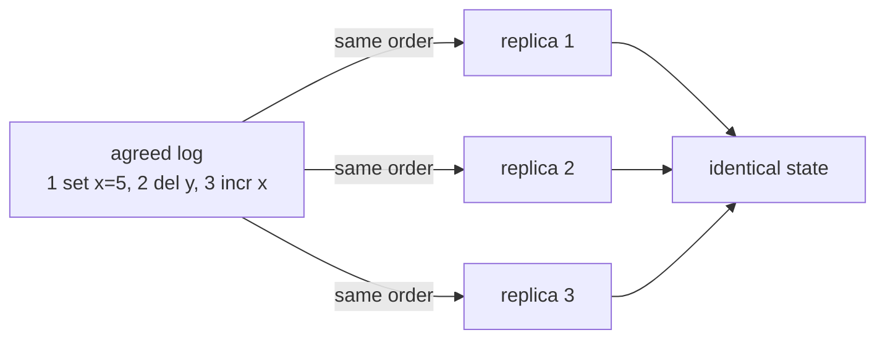
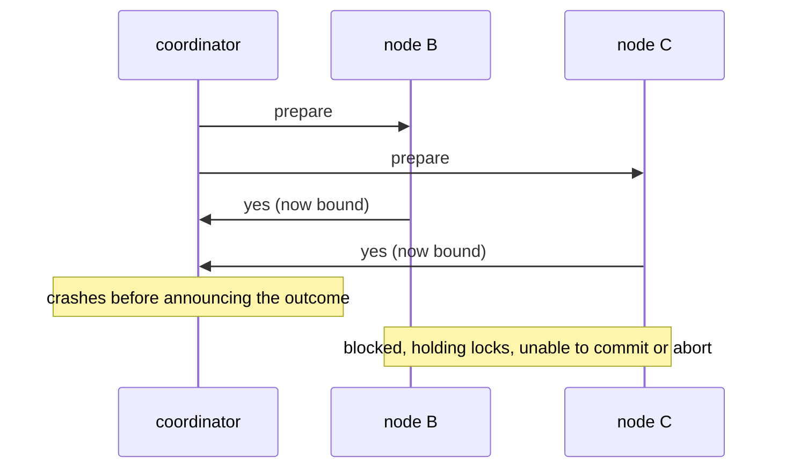
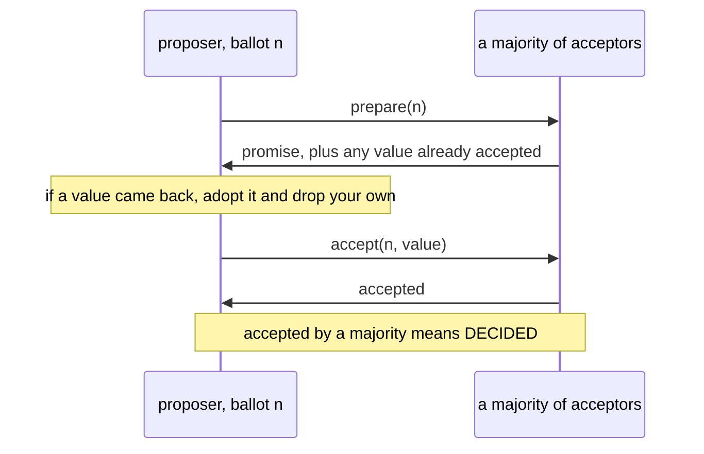

# The Consensus Problem

> **Goal of this chapter:** understand what consensus *is*, why so many
> practical problems secretly reduce to it, what the FLP theorem proves
> impossible (and why systems work anyway), why two-phase commit is not a
> consensus solution, and the core intuition of Paxos — majorities
> overlapping with majorities. This prepares you for Raft next chapter.

Every thread of this course has been quietly converging here.
[Failover](#/replication) needs the cluster to *agree* on one new leader.
[Split-brain](#/failure-models) happens when two sides *disagree* about
who's in charge. The [partition map](#/partitioning) must be *agreed* upon.
[Atomic commit](#/distributed-transactions) needs everyone to *agree* on
commit-or-abort.

**Consensus** is the abstract heart of all of these: getting a set of nodes
to agree on a value, despite crashes and an unreliable network.

## The problem, precisely

Several nodes each *propose* a value. A consensus protocol must make the
system *decide* on one, with three properties:

- **Agreement:** no two nodes decide different values.
- **Validity:** the decided value was actually proposed by someone (rules
  out "always decide 42").
- **Termination:** every non-crashed node eventually decides (rules out
  "wait forever").

Agreement and validity are **safety** properties (nothing bad happens);
termination is **liveness** (something good eventually does). Holding all
three at once, while nodes crash and messages vanish, is the difficulty.

It is worth naming why this isn't simply a locking problem. [Kernel
Synchronization](../#/kernel-sync) enforces the very same "exactly one
winner" requirement inside a single machine, and enforces it for a few
nanoseconds' worth of `cmpxchg`, because every core observes one
cache-coherent memory that the hardware arbitrates on their behalf.
Consensus is what the identical requirement costs once that shared memory is
gone and the arbiter has to be *built out of messages*: a round trip to a
majority, per decision, with a proof obligation attached. Same requirement,
six orders of magnitude apart in price — and that gap is why the rest of
this course spends so much effort keeping the set of facts that need it very
small.

### One decision is everything: state machine replication

Deciding a single value sounds small. The lever that makes it universal is
**state machine replication (SMR)**: run consensus repeatedly to agree on a
**log** — entry 1, entry 2, entry 3… — and have every replica apply the
agreed entries, in order, to a deterministic state machine.



Same start + same commands + same order + determinism = same state,
everywhere. Agree on a log, and you can replicate *anything*: a database, a
lock service, a configuration store, a leader roster. This is the design of
ZooKeeper, etcd, Spanner's groups and Kafka's controller quorum — all
dissected in [Real-World Architectures](#/real-world-architectures) — and
[Raft, Step by Step](#/raft) is precisely about agreeing on a log
efficiently.

## FLP: the impossibility at the bottom

The 1985 **FLP theorem** (Fischer, Lynch, Paterson): *in an asynchronous
system — no bound on message delays — no deterministic protocol can
guarantee consensus if even one node may crash.*

The intuition ties back to [Failure Models & Detection](#/failure-models):
with unbounded delays, **silence is ambiguous** — a protocol can never
distinguish "that node is dead, proceed without it" from "its message is
still coming". Any deterministic rule for proceeding can be foiled by an
adversarial schedule of delays, postponing the decision forever.

Read the fine print, though — FLP kills *guaranteed termination under
worst-case timing*, nothing more:

- Safety (never deciding two values) **is** achievable, unconditionally.
- Termination is achievable **whenever the network behaves reasonably**
  (delivers messages within some bound often enough) — which real networks
  do, most of the time.

So practical protocols make a principled trade: **safety always, liveness
when the network cooperates.** During a bad enough partition, etcd stops
answering rather than risk two answers; when the partition heals, progress
resumes. Recognize this as the [CP choice](#/consistency-models) from CAP —
CAP is FLP's practical echo.

## Why not just two-phase commit?

A common confusion: isn't atomic commit (2PC) already consensus? In 2PC the
coordinator asks "can you commit?", participants answer yes or no, and the
coordinator decides commit only if *all* said yes. Now watch it die:



The fatal scenario, drawn above: B and C vote *yes*, then the **coordinator
crashes** before sending the outcome. B and C are now **blocked** — they
promised to commit if told, so they can't unilaterally abort; the answer
might have been commit. They hold locks and wait… possibly until an operator
intervenes.

That's the difference in one line: **2PC requires unanimity and has a
single point of decision; consensus decides by majority and survives the
death of any minority — including whoever was leading.** (2PC also solves a
slightly different problem — everyone must respect "no" votes — and remains
genuinely useful; [Distributed Transactions](#/distributed-transactions)
gives it its due, including the modern fix: run the *coordinator itself* on
a consensus group.)

## Paxos: the core trick of majority overlap

**Paxos** (Lamport, 1998) was the first practical, proven consensus
protocol, and every modern one (Raft included) is built from its insight.
Skip the full protocol; internalize the mechanism.

**Majorities intersect.** Any two majorities of the same cluster share at
least one node. If a value was ever decided by majority M1, any later
majority M2 contains a witness from M1. A later proposer that is *required
to ask a majority first* cannot miss the decision.

Paxos turns this into two phases, with proposals carrying increasing
**ballot numbers** ([Lamport clocks](#/logical-clocks) doing exactly the job
they were built for — a counter that only moves forward and stamps who is
later):



The single load-bearing step is the note in the middle: a proposer that
learns of a possibly-decided value is *obliged* to re-propose it, which is
how a past decision survives every future proposer.

1. **Prepare:** a proposer picks ballot `n` and asks a majority: "promise to
   ignore anything older than `n` — and tell me any value you've already
   accepted." If any acceptor reports one, the proposer **must adopt that
   value** instead of its own. *(This is how past decisions are discovered
   and preserved.)*
2. **Accept:** the proposer asks the majority to accept `(n, value)`.
   Accepted by a majority ⇒ **decided** — and phase 1's rule guarantees
   every future proposer will rediscover and re-propose it.

Safety holds under any timing, any crashes, any message loss. Liveness has
the FLP-mandated hole: two proposers can *duel*, each preempting the
other's ballots forever. The standard cure: elect a single distinguished
proposer — a **leader** — and add randomized timeouts so a duel quickly
resolves. (Consensus to elect the consensus-leader? No — leadership here is
an *optimization*; safety never depends on having exactly one leader, only
liveness does. That's the escape from the chicken-and-egg.)

### From Paxos to the protocols you actually run

Single-decision Paxos is then run per log slot (**Multi-Paxos**), with the
stable leader skipping phase 1 in the steady state — one round trip per
entry. At that point the structure is: *elect a leader with a ballot/term;
leader appends entries; majority acknowledgment commits them.* This is
exactly the shape of [Raft](#/raft) (next, with every gap filled in) and of
**ZAB**, ZooKeeper's protocol. Paxos earned a reputation for being hard
to understand and harder to implement faithfully — Google's Chubby team
wrote a paper essentially saying so — which is *why* Raft was designed, as
"Paxos restructured for understandability".

> Numbers worth carrying: tolerating `f` crash faults requires **2f + 1**
> nodes (a majority must survive: 3 nodes ride out 1 failure, 5 ride out
> 2). That's also why consensus clusters have odd sizes — 4 nodes tolerate
> exactly as many failures as 3, with more coordination cost. And recall
> from [Failure Models & Detection](#/failure-models): Byzantine tolerance
> needs 3f + 1.

## Consensus in your stack

You rarely implement consensus; you *rent* it constantly — and [Real-World
Architectures](#/real-world-architectures) opens up each of these:

- **etcd** ([Raft](#/raft)) — Kubernetes stores every object in it; the
  entire cluster state is a replicated log.
- **ZooKeeper** (ZAB) — coordination for Kafka (historically), HBase,
  Hadoop.
- **Raft inside databases** — CockroachDB, TiDB, YugabyteDB run one Raft
  group *per data range*; MongoDB's replica-set elections are Raft-derived.
- **Kafka's KRaft mode** — the metadata controller is itself a Raft quorum,
  retiring the ZooKeeper dependency.
- **Cloud control planes** — region-spanning configuration and leases
  (Chubby at Google — Paxos — is the ancestor of them all).

The pattern from [Partitioning & Sharding](#/partitioning) completes: keep
the **small, critical facts** (who leads, where partitions live, what the
config is) in a consensus store, and let the big data flow through cheaper
machinery ([quorums, async replication](#/replication)) coordinated by those
facts. [CRDTs, Gossip & Anti-Entropy](#/crdts-and-gossip) is the other half
of that sentence — what the cheap machinery can guarantee on its own.

## Key takeaways

- Consensus = many propose, all agree on one: **agreement + validity
  (safety)** and **termination (liveness)**. Leader election, failover,
  atomic commit and membership are consensus in disguise.
- **State machine replication** turns repeated consensus on a log into
  replication of arbitrary services — the architecture of etcd, ZooKeeper
  and friends.
- **FLP:** with fully asynchronous timing, you can't guarantee termination.
  Practical systems keep safety unconditional and deliver liveness when
  the network is merely reasonable.
- **2PC is not consensus:** unanimity plus a single deciding coordinator =
  blocking on coordinator death. Consensus survives any minority's death,
  leader included.
- **Paxos's engine is majority overlap:** ask a majority, discover any past
  decision, adopt it; ballot numbers order proposers. Leaders and
  randomized timeouts fix liveness. **2f+1 nodes tolerate f faults** —
  hence 3- and 5-node clusters.

```quiz
[
  {
    "q": "What exactly does the FLP impossibility theorem rule out?",
    "choices": [
      "Any consensus among more than two nodes",
      "Deterministic consensus with GUARANTEED termination in a fully asynchronous system where one node may crash",
      "Safe consensus — protocols must sometimes decide two different values",
      "Consensus on networks that lose messages"
    ],
    "answer": 1,
    "explain": "FLP targets liveness under worst-case asynchrony only. Safety can be kept unconditionally, and termination is achieved in practice whenever the network delivers messages within reasonable bounds often enough."
  },
  {
    "q": "Why does two-phase commit block, where consensus protocols don't?",
    "choices": [
      "2PC uses too many messages per decision",
      "If the coordinator dies after collecting yes-votes, participants can neither commit nor abort — the decision lives in one place; consensus decides by majority and survives any minority's death",
      "2PC cannot handle more than two participants",
      "Consensus protocols never block under any circumstances"
    ],
    "answer": 1,
    "explain": "Participants that voted yes are bound by a possible commit they never saw. With majority-based consensus, the death of any minority — including the leader — leaves a majority able to reconstruct and continue. (Per FLP, consensus can still stall during bad partitions, but it never strands a decision in one node.)"
  },
  {
    "q": "In Paxos, a proposer's prepare phase reaches a majority and one acceptor reports an already-accepted value. What must the proposer do?",
    "choices": [
      "Propose its own value with a higher ballot",
      "Abort and let a new leader take over",
      "Adopt the reported value and propose THAT — preserving any possibly-decided value",
      "Ask the remaining minority to break the tie"
    ],
    "answer": 2,
    "explain": "Majority overlap means a decided value will be seen by any later majority. The adopt rule converts 'will be seen' into 'will be preserved': no future proposal can contradict a past decision. This is the safety core of Paxos."
  },
  {
    "q": "Why are consensus clusters typically 3 or 5 nodes, not 4?",
    "choices": [
      "Even numbers cause hash collisions",
      "Tolerating f faults needs 2f+1 nodes: 4 nodes still tolerate only 1 failure (majority = 3), the same as 3 nodes — extra cost, no extra resilience",
      "Four-node clusters cannot elect leaders",
      "Licensing is cheaper for odd numbers"
    ],
    "answer": 1,
    "explain": "A majority of 4 is 3, so a 4-node cluster survives one failure — exactly like a 3-node cluster, while paying more replication and coordination. Capacity steps come at odd sizes: 3→1 fault, 5→2, 7→3."
  }
]
```
