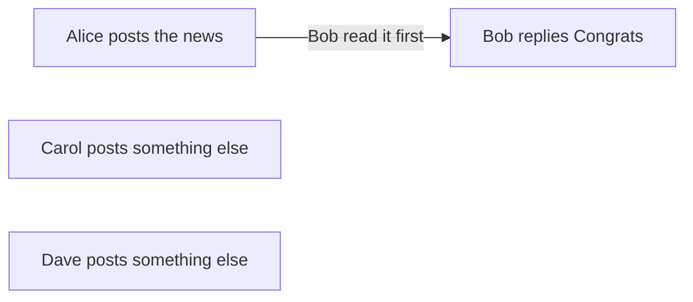
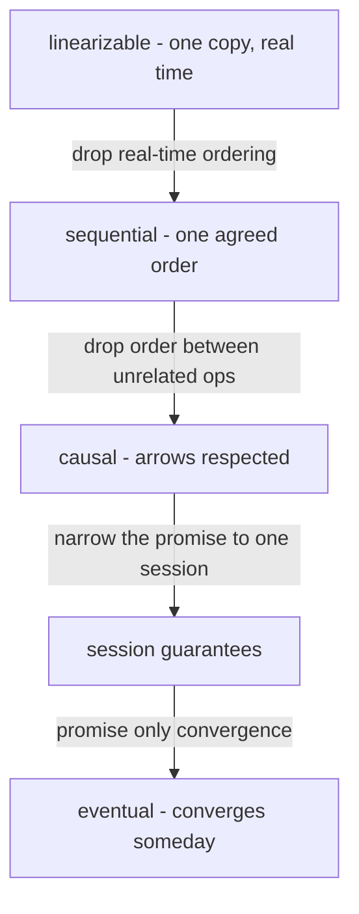
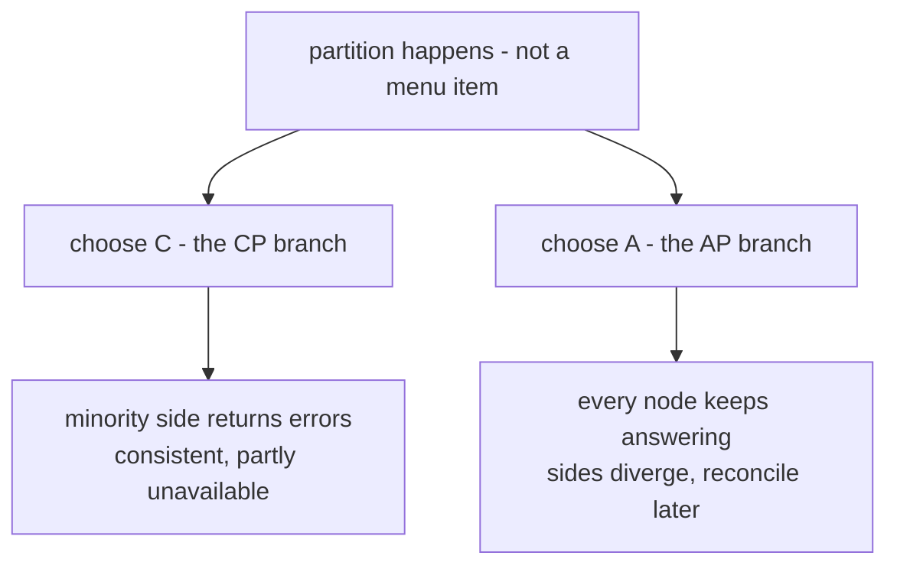

# Consistency Models & CAP

> **Goal of this chapter:** put precise names on the guarantees a replicated
> system gives its clients — from linearizability down to eventual
> consistency — and finally understand what the CAP theorem actually says
> (it's narrower than the famous slogan) and what PACELC adds.

[Replication](#/replication) showed copies drifting apart and reads
returning stale or vanishing data. A **consistency model** is the contract
that tames
this: a precise promise about *which values reads may return*, given the
reads and writes happening across the system.

Think of it as an API contract over time. The stronger the model, the fewer
surprises for programmers — and the more coordination (latency,
unavailability) the system must pay. This chapter is the menu; you'll order
from it for the rest of your career.

> Vocabulary guard-rail: this is **replication consistency** — not the "C"
> in ACID (integrity constraints), and not eventual *vs* strong marketing
> labels. Also: these models apply to single-object operations; multi-object
> transactions come in [Distributed
> Transactions](#/distributed-transactions).

## Linearizability: the gold standard

**Linearizability** (also "strong consistency", "atomic consistency") makes
a replicated object behave as if there were **one single copy**, with every
operation taking effect **atomically at some instant** between its start and
its end.

The operational test: once *any* read returns the new value, **every**
subsequent read (by anyone, anywhere) must also return it. The system never
"goes back" to the old value. Equivalently: the moment a write completes,
it is visible to all.

The forbidden pattern, drawn as three operations whose durations overlap in
real time — the one thing a message-passing diagram cannot show:

```text
                time ──────────────────────────────▶
  writer:   |── write x=1 ──|
  reader A:                    |─ read x → 1 ─|
  reader B:                            |─ read x → 0 ─|   ✗ FORBIDDEN
                                                  reader B began after A's
                                                  read returned 1: x cannot
                                                  regress to 0.
```

Linearizability is what intuition expects of "a register in the sky". You
*need* it when reads feed decisions that must not act on stale data:
uniqueness checks (two users claiming one username), [leader
election](#/consensus), [locks and leases](#/failure-models), account
balances at the moment of withdrawal.

What it costs: replicas must coordinate on every operation — typically a
round trip to a leader or quorum — so latency floors at network RTT, and
during partitions, some nodes must refuse to answer (CAP, below). Note
that even a [`w + r > n` quorum](#/replication) system is **not**
automatically linearizable: partially-propagated writes can let two reads
disagree about
"the moment" a write happened unless extra repair-before-return work is
done.

## Sequential consistency: one step down

**Sequential consistency** requires that all operations appear in *some*
single total order, consistent with each client's own program order — but
that order need not respect real time across clients. Everyone watches the
same movie; the movie may lag reality. It's mostly a theoretical waypoint
(and a memory-model term); the practically important step down is the next
one.

## Causal consistency: respect the arrows

**Causal consistency** promises only that **causally related** operations
(the happens-before relation from [Logical & Vector
Clocks](#/logical-clocks)) are seen in order by everyone. Concurrent
operations may be observed in different orders by different clients.

The canonical example — one arrow that must be respected, and two nodes with
no arrow at all:



Nobody may ever see W2 without W1: the reply cannot appear before the post.
Carol's and Dave's posts have no arrow between them, so Erin may see Carol
first while Frank sees Dave first, and both replicas are behaving correctly.

Causal consistency is the strongest model achievable **without
coordination** — replicas can keep accepting writes during partitions and
still honor it (tracking causality with the vector-clock-style metadata of
[Logical & Vector Clocks](#/logical-clocks)). That makes it the sweet spot
for geo-replicated and offline-capable systems.

### Client-centric session guarantees

Four smaller promises, often offered à la carte, that fix the replication-lag
anomalies you already met in [Replication](#/replication):

| Guarantee | The promise | Kills which anomaly |
|---|---|---|
| **Read your writes** | your reads see your own earlier writes | "my comment vanished after refresh" |
| **Monotonic reads** | your successive reads never go back in time | "comment appeared, then disappeared" |
| **Monotonic writes** | your writes apply in the order you issued them | edit #2 applied before edit #1 |
| **Writes follow reads** | your write lands after the data you'd read | replying to a post you saw, reply ordered after it |

All four together (per-session) essentially give you causal consistency
from that session's point of view. They're cheap — usually just session
stickiness or version tokens — and fix the most *visible* weirdness, which
is why "eventual consistency" in practice is usually "eventual + session
guarantees".

## Eventual consistency: the weakest useful promise

**Eventual consistency** says only: *stop writing, and all replicas will
eventually converge to the same value.* It says nothing about what reads
return meanwhile — stale, regressing, out-of-order: all allowed.

It's not as useless as it sounds: with the session guarantees above layered
on, plus convergent conflict handling (LWW with its known dangers, or
[CRDTs](#/crdts-and-gossip) done right), eventual consistency powers DNS,
CDNs, shopping carts, social feeds — workloads where availability and
latency outrank momentary precision. The key engineering question is never
"is it eventually consistent?" but "**what anomalies exactly can my users
observe, and do I have a story for each?**"

Read the ladder downward and each rung is a specific promise being dropped
in exchange for less coordination:



The important boundary is between sequential and causal: everything from
causal down can be served during a network partition, everything above it
cannot.

## The CAP theorem: what it actually says

The famous slogan — "Consistency, Availability, Partition tolerance: pick
two" — is misleading enough that we'll restate it properly.

Formally (Gilbert & Lynch, 2002): a system cannot simultaneously provide

- **C** — linearizability (the strong model above),
- **A** — every request to a non-failed node eventually gets a non-error
  response,
- **P** — correct behavior despite arbitrary message loss between nodes.

The honest reading: **partitions are not a choice.** [Networks *will*
partition](#/failure-models); P is reality, not a menu item. The actual
decision arrives only *during* a partition, and there are exactly two
branches:



- A **CP** system (etcd, ZooKeeper, Spanner — all in [Real-World
  Architectures](#/real-world-architectures)) keeps the single-copy
  illusion: the side of the partition without a quorum returns errors.
  Consistent, partially unavailable.
- An **AP** system (Dynamo-style stores, DNS) answers everywhere, accepting
  divergence and conflict resolution after healing. Available, not
  linearizable.

What CAP does **not** say: nothing about latency, nothing about normal
(partition-free) operation, nothing about weaker consistency models (causal
consistency is compatible with availability!), and "pick two" is wrong —
during a partition you pick **one of C or A**; the rest of the time you can
have both.

### PACELC: the missing half

Abadi's **PACELC** completes the picture: **if Partitioned, trade A vs C;
Else, trade Latency vs Consistency.** Even on a healthy network,
linearizability costs coordination round trips on every operation — which
is why systems offer relaxed reads (followers, bounded staleness) as a
*latency* optimization, not just a partition story.

| System | If partitioned | Else | Reading |
|---|---|---|---|
| etcd / ZooKeeper | C | C | correctness first, always |
| Spanner | C | C (pays [TrueTime](#/time-and-clocks) waits) | consistency with engineered latency |
| Cassandra (typical) | A | L | availability and speed |
| MongoDB (defaults) | C-ish | C | leader-based, consistent-leaning |

## Choosing in practice

A serviceable decision procedure:

1. Does a wrong/stale read cause irreversible damage (double-spend, double
   booking, security)? → **linearizable** for that operation. Pay the
   latency; accept refusing requests during partitions.
2. Do users need their own actions and conversations to make sense? →
   **causal / session guarantees** — cheap and usually sufficient.
3. Is it a feed, cache, counter, catalog where staleness is cosmetic? →
   **eventual**, with a conflict-convergence story.

Mixed answers are normal: one application typically runs different
consistency levels for different operations — many databases let you choose
per query. Strong where it matters, cheap where it doesn't.

## Key takeaways

- A consistency model is a **contract about what reads may return**.
  The ladder: linearizable → sequential → causal → session guarantees →
  eventual.
- **Linearizability** = single-copy illusion with real-time visibility;
  needed for uniqueness, locks, balances; costs coordination on every op.
- **Causal** is the strongest model that stays available under partitions;
  the four **session guarantees** are its cheap, per-user cousins that fix
  lag anomalies.
- **CAP, properly:** partitions happen; during one you choose
  consistent-but-refusing (CP) or available-but-diverging (AP). **PACELC** adds the
  everyday trade: latency vs consistency even without partitions.
- Real systems mix models per operation. The professional question is
  always: *which anomalies can occur, and who absorbs them?*

```quiz
[
  {
    "q": "Reader A reads x and gets the new value. Reader B starts a read after A's read completed and gets the OLD value. Which model has been violated?",
    "choices": [
      "Eventual consistency",
      "Linearizability",
      "Causal consistency",
      "None — this is always acceptable"
    ],
    "answer": 1,
    "explain": "Linearizability forbids regression: once any read returns the new value, all later reads must too — the 'single copy' may not travel back in time. Weaker models (causal, eventual) permit this anomaly."
  },
  {
    "q": "Which is the strongest consistency model that a system can provide while remaining fully available during network partitions?",
    "choices": [
      "Linearizability",
      "Sequential consistency",
      "Causal consistency",
      "No consistency model survives partitions"
    ],
    "answer": 2,
    "explain": "Causal consistency needs only causality metadata travelling with writes — no cross-replica coordination per operation — so replicas can keep serving during partitions. Linearizability provably cannot do this (CAP)."
  },
  {
    "q": "What is the most accurate statement of the CAP theorem's practical content?",
    "choices": [
      "Every system permanently picks exactly two of C, A and P",
      "Partitions are unavoidable; DURING one, a system must either sacrifice linearizability or refuse some requests",
      "Availability is impossible in distributed systems",
      "CP systems are always slower than AP systems"
    ],
    "answer": 1,
    "explain": "P isn't optional — networks partition. The real choice only materializes during a partition: stay consistent and turn some requests away (CP), or answer everywhere and reconcile divergence later (AP). PACELC adds the latency-vs-consistency trade during normal operation."
  },
  {
    "q": "You see your new comment after posting, but your friend doesn't see it for a few seconds. Which guarantee are YOU getting?",
    "choices": [
      "Linearizability",
      "Read-your-writes (a session guarantee)",
      "Monotonic writes",
      "Strong consistency for all users"
    ],
    "answer": 1,
    "explain": "Your session sees your own writes — read-your-writes — typically via session stickiness or version tokens. Global real-time visibility for everyone would be linearizability, which clearly isn't being provided (your friend lags)."
  }
]
```
