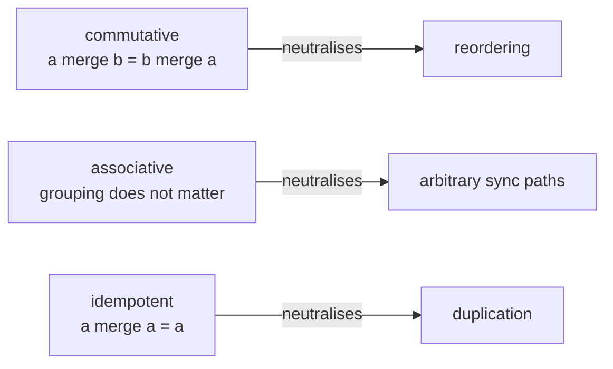
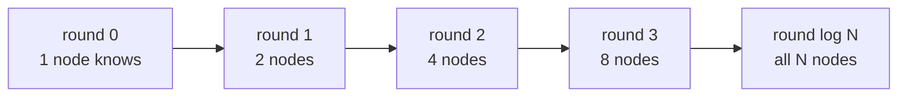
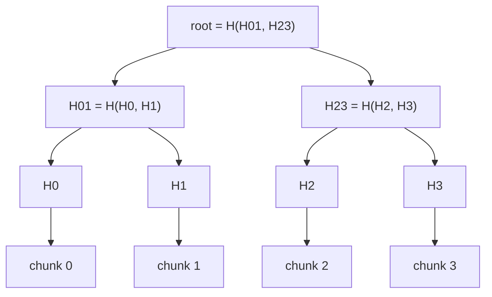

# CRDTs, Gossip & Anti-Entropy

> **Goal of this chapter:** the coordination-free school of distributed
> systems. [Consensus](#/consensus) pays latency to prevent divergence; this
> chapter's machinery *embraces* divergence and guarantees convergence
> afterward: CRDTs that merge mathematically, gossip protocols that spread
> facts like epidemics, and Merkle trees that find a needle of difference in
> a haystack of data.

[Consistency Models & CAP](#/consistency-models) left a door ajar: causal
and eventual consistency stay **available during partitions** — every
replica keeps accepting writes. [Replication](#/replication) showed the
price: concurrent conflicting writes. Dynamo's answer (keep siblings, let
the application merge) works but pushes a subtle burden onto every
developer. The question this chapter answers:
**can data types merge *themselves*, correctly, automatically?**

Yes — if the data type is designed for it. That's a **CRDT: Conflict-free
Replicated Data Type** (Shapiro et al., 2011).

## The mathematical heart: joins

Forget protocols for a second; the entire trick is algebra. Suppose every
replica's state lives in a set with a **merge** operation `⊔` (a *join*)
that is:

- **Commutative:** `a ⊔ b = b ⊔ a` — merge order between replicas doesn't
  matter.
- **Associative:** `(a ⊔ b) ⊔ c = a ⊔ (b ⊔ c)` — grouping doesn't matter.
- **Idempotent:** `a ⊔ a = a` — merging the same state twice is harmless.

Now recall what [the hostile network](#/the-network-is-hostile) does to
messages. The three algebraic properties are not a coincidence — they line
up one-to-one with the three things the network does wrong:



The three algebraic properties are point-for-point antidotes to the
three network pathologies — replicas can sync with anyone, in any order,
any number of times, and **provably converge** to the same state, no
coordinator, no consensus, no waiting. This is called **strong eventual
consistency**: same set of updates seen ⇒ same state, immediately, not just
"eventually".

The craft of CRDTs is designing data types whose merge has these
properties *and* whose behavior means something useful. A tour of the
classics:

## The CRDT bestiary

### G-Counter: a counter that only grows

Naive approach — each replica stores one number, merge = max — fails:
two replicas both increment 5→6, merge gives 6, an increment is lost.

The fix mirrors [vector clocks](#/logical-clocks) exactly: **one slot per
replica**. Replica `i` increments only `slot[i]`; the value is the **sum**
of slots; merge is **element-wise max**. The aligned slot arrays below are
the argument — read them column by column:

```text
  A: {A:3, B:1, C:0} = 4        increments at A and C, concurrently:
  C: {A:2, B:1, C:5} = 8
  merge (per-slot max): {A:3, B:1, C:5} = 9   — nothing lost, ever
```

Element-wise max is commutative, associative, idempotent — and because each
replica owns its slot, a max never erases anyone's increments.

### PN-Counter: increments and decrements

Two G-Counters: one for increments, one for decrements; value =
`P − N`. (A pattern you'll reuse: build richer CRDTs by *composing*
simpler ones.) This is how Riak counts, and how like-counters and
view-counters survive multi-datacenter replication.

### LWW-Register: a value with a timestamp

Keep `(value, timestamp)`; merge takes the higher timestamp. Simple,
converges — and inherits every lie of physical clocks from [Time, Clocks &
Why They Lie](#/time-and-clocks): concurrent writes are resolved by
whichever clock was faster, silently.
LWW is a *legitimate* CRDT with an *honest* flaw; use it where losing one
of two concurrent writes is acceptable (e.g. "user's last-seen status"),
never where it isn't (account balances).

### Sets: where the real subtlety lives

A grow-only set (**G-Set**, merge = union) is trivial. But *remove*
breaks naive designs: if state is just "the set", removal can't survive
merging with a replica that still has the element — it comes back.
Worse, what should happen when one replica **removes** an element while
another concurrently **re-adds** it?

The **OR-Set** (Observed-Remove Set) answers with a precise rule: *adds
win over concurrent removes, and a remove only kills the adds it has
seen.* Implementation: every add attaches a unique tag; remove records
the tags it observed (in a "tombstone" set); an element is present if it
has at least one un-removed tag. A concurrent re-add carries a *fresh*
tag the remove never saw — so it survives. Arbitrary-but-principled, like
the shopping-cart merge it generalizes.

> Tombstones reveal CRDTs' tax: **metadata grows** — per-replica slots,
> per-add tags, remembered removals. Production CRDT systems spend most of
> their engineering on garbage-collecting this metadata safely (which,
> deliciously, sometimes requires a little coordination after all).

### The frontier: collaborative text

Google Docs-style editing is the CRDT problem at its hardest: a sequence
where concurrent inserts at the same position must converge *and* preserve
intent. Modern sequence CRDTs (RGA, and the engineering in libraries like
**Yjs** and **Automerge**) give each character a stable identity plus
causal ordering metadata. This is also where CRDTs meet their classical
rival, **Operational Transformation** (OT — the original Google Docs
approach): OT rewrites concurrent operations against each other and
typically wants a central server; CRDTs pay metadata instead and go fully
peer-to-peer/offline-first. The local-first software movement runs on this
machinery.

## Gossip: spreading state like a rumor

CRDTs define *what* merging means; something must still carry states
between replicas. The robust classic is **gossip** (epidemic protocols):
every T milliseconds, each node picks `k` random peers, exchanges state and
merges. Nobody coordinates, and the rumour still reaches everyone fast,
because the number of infected nodes doubles every round:



Doubling per round is the finding: a thousand-node cluster is fully infected
in about ten rounds, and a ten-thousand-node cluster in about fourteen.

Why architects love it: **no coordinator, no topology, no single point** —
any node can die mid-rumor and the rumor survives; a node that was down
simply gets re-infected on return; load is uniform and tunable
(`k` × state size per round). Why it's not free: convergence is
*probabilistic* and takes those log-N rounds — gossip is the transport of
eventual consistency, never of linearizability.

Production gossip is everywhere you read "decentralized": Cassandra and
Riak share cluster membership and node health by gossip (the [phi-accrual
suspicion values](#/failure-models) ride on it); Consul and modern Cassandra
descendants use **SWIM**-family protocols — gossip specialized for
membership, where "is node X alive?" is itself the gossiped CRDT-ish state
(with indirect probes to avoid false accusations through one flaky link).

## Anti-entropy and Merkle trees: syncing efficiently

Gossiping *recent* updates is cheap. But replicas that diverged long ago
(a node down for a day) need **anti-entropy**: a full reconciliation. The
naive method — send everything, merge — is correct (idempotence!) and
absurdly expensive for terabytes that are 99.99% identical.

The tool that fixes it is the **Merkle tree**: hash the data in chunks,
then hash the hashes, up to a single root.



Equal roots prove the whole dataset is in sync after comparing exactly one
hash. Unequal roots are descended only along the branches that disagree, so
the divergent chunks are located in O(log n) comparisons and nothing else
crosses the network.

Two replicas compare roots; identical ⇒ provably in sync. Different ⇒
recurse only where hashes differ, transferring exactly the divergent
chunks. Cassandra repairs and Dynamo anti-entropy work this way — and the
same structure secures Git's object graph, BitTorrent piece verification
and blockchain block headers (there it's about *tamper-evidence*: the
root hash commits to every byte below).

## The coordination spectrum: placing this chapter

You now own both ends of the field's central trade-off:

| | [Consensus](#/consensus) world | CRDT/gossip world (this chapter) |
|---|---|---|
| During partition | minority side refuses ([CP](#/consistency-models)) | everyone keeps writing ([AP](#/consistency-models)) |
| Latency | round trips before acking | local write, sync later |
| Conflicts | prevented by ordering | absorbed by merge algebra |
| Guarantee | [linearizable](#/consistency-models) | strong eventual + causal |
| Cost | availability + latency | metadata + weaker reads |
| Use for | uniqueness, locks, money, config | counters, sets, presence, carts, collaborative docs, membership |

Real architectures use **both**: a consensus core for the small critical
facts, CRDT/gossip machinery for the high-volume convergent state.
[Real-World Architectures](#/real-world-architectures) shows exactly that
composition in the systems you run.

## Key takeaways

- A **CRDT** is a data type whose merge is commutative, associative and
  idempotent — algebra that exactly neutralizes reordering, multipath and
  duplication. Result: **strong eventual consistency** with zero
  coordination.
- The bestiary: **G-Counter** (per-replica slots, sum value, max merge),
  **PN-Counter** (two G-Counters), **LWW-Register** (honest about its
  clock-based data loss), **OR-Set** (adds-win via unique tags), sequence
  CRDTs for collaborative text (Yjs/Automerge vs classical OT).
- The tax is **metadata** (slots, tags, tombstones) and its garbage
  collection.
- **Gossip** spreads state epidemic-style: O(log N) rounds, no
  coordinator, used for membership and health (Cassandra, Consul, SWIM).
- **Merkle trees** make anti-entropy cheap: compare roots, descend into
  differences, sync only what diverged — the same trick behind Git and
  blockchains.
- Architecture lesson: consensus for the few facts that must never fork;
  CRDTs + gossip for the bulk that may flow freely and merge.

```quiz
[
  {
    "q": "Why must a CRDT's merge function be idempotent (a ⊔ a = a)?",
    "choices": [
      "To keep the merge fast on large states",
      "Because the network can deliver the same state twice — re-merging a duplicate must not change the result",
      "To guarantee linearizable reads",
      "Because tombstones would otherwise grow forever"
    ],
    "answer": 1,
    "explain": "Each algebraic property neutralizes one network pathology: commutativity absorbs reordering, associativity absorbs arbitrary sync paths, and idempotence absorbs duplication. Together they make convergence independent of how messages travel."
  },
  {
    "q": "Why does a G-Counter keep one slot per replica instead of a single number merged with max()?",
    "choices": [
      "A single number can overflow",
      "With one shared number, two concurrent increments (5→6 and 5→6) merge to 6 — an increment is lost; per-replica slots make max() safe because each replica only grows its own slot",
      "Per-replica slots enable decrements",
      "max() on one number isn't commutative"
    ],
    "answer": 1,
    "explain": "Slot ownership is the trick: max never destroys information because no two replicas ever race on the same slot. The counter's value is the sum of slots — the same per-participant structure as vector clocks."
  },
  {
    "q": "In an OR-Set, one replica removes element X while another concurrently re-adds it. After merging, is X in the set?",
    "choices": [
      "No — removes always win",
      "Yes — the re-add carries a fresh unique tag the remove never observed, and a remove only kills tags it saw",
      "It's random, depending on merge order",
      "The set rejects the merge as a conflict"
    ],
    "answer": 1,
    "explain": "'Observed-remove' is literal: removal tombstones only the add-tags it had seen. A concurrent add's new tag survives, so adds win. The rule is arbitrary but principled — and merge-order independence is preserved."
  },
  {
    "q": "Two replicas hold terabytes of mostly identical data. How do Merkle trees make reconciliation cheap?",
    "choices": [
      "By compressing the data before transfer",
      "By hashing chunks into a tree: equal roots prove sync with one comparison; unequal roots are descended only along differing branches, isolating divergent chunks in O(log n)",
      "By gossiping random chunks until convergence",
      "By recording every write in a shared log"
    ],
    "answer": 1,
    "explain": "The tree turns 'find the differences' into a logarithmic descent guided by hash mismatches — only genuinely divergent data crosses the network. Cassandra repair, Dynamo anti-entropy, Git and blockchains all lean on this structure."
  }
]
```
