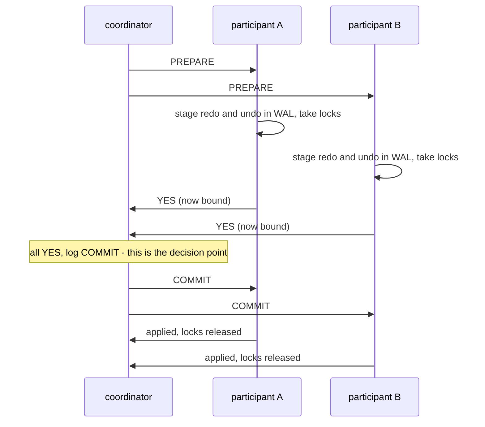
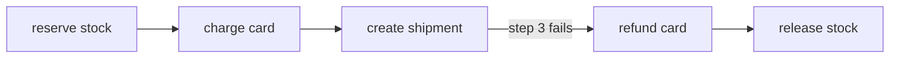
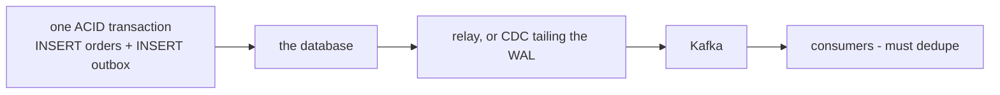

# Distributed Transactions

> **Goal of this chapter:** extend "all-or-nothing" across machines. We'll
> dissect two-phase commit honestly, see how modern systems de-fang its
> blocking problem, then study the patterns that *avoid* distributed
> transactions: sagas, the outbox pattern — and finally bury the
> "exactly-once delivery" myth with the precise truth that replaces it.

A transaction's superpower is **atomicity**: a group of writes either all
happen or none do — no torn intermediate states, even across crashes. One
database achieves this locally with a write-ahead log — the same trick a
journaling filesystem plays one layer beneath it, for the same reason
([Files, Filesystems & the VFS](../#/filesystems)). The moment the
writes span *two* systems — money out of bank A's database, into bank B's;
or "update orders DB *and* publish to Kafka" — no single WAL covers them,
and the in-between states (money gone from A, never arrived at B) become
reachable. **Atomic commit** is the problem of closing that gap.

## Two-phase commit, honestly

**2PC** is the classical answer, alive inside XA, and many distributed
databases. A **coordinator** drives; **participants** hold the data.



Any NO vote, or a timeout in phase 1, turns the middle note into ABORT and
the rest plays out the same way. Everything that can go badly wrong in 2PC
goes wrong at that one note.

The contract that makes it work: a participant that votes **yes** has
durably staged everything needed to commit *or* roll back, and **surrenders
the right to decide for itself**. From that instant it does whatever the
coordinator says — even after crashing and recovering (it finds the
prepared state in its WAL and asks the coordinator how the story ended).

The commit point is a single disk write on the coordinator. Which is
exactly the weakness [The Consensus Problem](#/consensus) previewed:

- **Coordinator dies after prepare, before broadcasting:** participants
  are **in doubt** — locked, bound, unable to commit or abort. They block
  until the coordinator (or its recovery log) returns. Locks held for
  minutes strangle a busy system.
- **Latency:** two round trips plus multiple forced disk flushes on the
  critical path.
- **The weakest link rule:** availability of the whole = product of all
  participants'. A transaction touching five systems fails if any one is
  down — the more you distribute, the more fragile the atomic group.

### The modern repair: replicate the coordinator

The blocking flaw isn't the protocol's phases — it's the coordinator's
*singularity*. So modern systems keep 2PC but make the decision itself
highly available: **run the coordinator state on a [consensus
group](#/consensus)**. Spanner does exactly this — 2PC across shards, where
each shard (and the coordinator's commit record) is a Paxos-replicated
group. The coordinator can no longer "die with the answer": the answer lives
on a majority. 2PC-over-consensus is the standard architecture of NewSQL
(Spanner, CockroachDB, TiDB) — [Real-World
Architectures](#/real-world-architectures) completes this picture with
[TrueTime](#/time-and-clocks) underneath it.

> Division of labor worth engraving: **consensus agrees on a value even if
> some nodes are down; atomic commit requires *every* participant's data
> to move together.** 2PC answers "did we all do it?"; consensus makes the
> answer itself durable and available. They compose; neither replaces the
> other.

## Sagas: atomicity for workflows, without the locks

Across *organizational* boundaries — order service, payment provider,
inventory, shipping — 2PC is usually impossible (nobody exposes prepare/
lock semantics to outsiders) and undesirable (locks held across someone
else's outage). The **saga** pattern (Garcia-Molina & Salem, 1987) trades
isolation for availability:

Break the transaction into a chain of **local** transactions, each atomic
in its own service. If step `k` fails, run **compensating transactions**
to semantically undo steps `k−1 … 1`.



Note which way the compensating arrows run: backwards through the chain,
one new transaction per undone step. Nothing is rolled back; things are
un-done, in order, by doing more work.

The two costs, stated plainly:

- **No isolation.** Between steps, the world *sees* the intermediate
  states (card charged, nothing shipped). Other transactions can act on
  them. Sagas are atomic-ish *eventually*, never isolated.
- **Compensations are semantic, not magical.** A refund is a new
  transaction, not an erasure — the customer still sees both lines on
  their statement. Some actions (a sent email, a fired missile) have no
  true compensation; design the order so the hardest-to-undo step goes
  **last**.

Orchestration (a central state machine drives the steps — clearer,
debuggable; this is what workflow engines like Temporal industrialize) vs
**choreography** (each service reacts to the previous one's events —
looser coupling, harder to follow). Either way, every step and
compensation **must be idempotent** — steps live in the retry-storm world of
[The Network Is Hostile](#/the-network-is-hostile), and a compensation that
runs twice is as dangerous as a step that does.

## The dual-write problem and the outbox pattern

The most common distributed-transaction-in-disguise, hiding in ordinary
services:

```python
db.commit(order)          # write 1: database
kafka.publish(order_event) # write 2: message broker
# crash between the two ⇒ order exists, event never sent
# (or: publish first ⇒ event for an order that doesn't exist)
```

Two systems, no shared WAL — this is atomic commit, encountered in the
wild. The standard cure is beautifully low-tech, the **transactional
outbox**:

1. In **one local transaction**, write the order *and* insert the event
   into an `outbox` table — same database, true ACID atomicity.
2. A relay process reads the outbox and publishes to the broker, marking
   rows as sent. Crash anywhere ⇒ retry ⇒ possibly duplicate publishes —
   but never a *lost* one.



The crash window has not been eliminated, it has been *moved*: the only
place it can now open is between the database and the relay, where a retry
produces a duplicate rather than a loss.

Atomicity is *borrowed* from the local database; the network leg downgrades
to at-least-once + idempotent consumers. Which brings us to the myth.

## "Exactly-once": the myth and the truth

Can a message be **delivered** exactly once? No — and you already own every
piece of the proof. The receiver processes a message, and the ack is lost —
[the ambiguity](#/the-network-is-hostile) that has been following you since
Module 1. The sender must choose: retry (⇒ possible second
delivery: *at-least-once*) or not (⇒ possible zero deliveries:
*at-most-once*). Exactly-once **delivery** is not an engineering gap; it's
the ambiguity theorem wearing a different hat.

What *is* achievable — and what vendors actually mean — is **exactly-once
processing** (effectively-once): deliveries may repeat, but **effects
don't**:

- **Idempotency keys / dedup tables:** consumer records processed message
  IDs (transactionally with its own state change!) and ignores repeats —
  the outbox pattern run in reverse.
- **Kafka's version:** idempotent producers (broker dedupes by sequence
  number) + transactions that atomically write output messages *and* the
  consumer's input offsets — so "consume, transform, produce" commits as a
  unit. Crash ⇒ replay from the last committed offsets, abandoned partial
  output invisible to (read-committed) readers. Exactly-once *within* the
  Kafka ecosystem; the moment effects leave it (an email, an HTTP call),
  you're back to idempotency-by-design.

> One sentence to retire the debate: **delivery is at-least-once or
> at-most-once — pick one; "exactly-once" is something you build at the
> processing layer, out of atomic local commits and deduplication.**

## Choosing your weapon

| Situation | Reach for | You accept |
|---|---|---|
| Multi-shard write inside one database | 2PC over [consensus groups](#/consensus) (NewSQL) | latency of 2 round trips + replication |
| Multi-service workflow, one org | saga (orchestrated), idempotent steps | no isolation; compensation design |
| Cross-organization process | saga + reconciliation jobs | eventual settlement (how banks actually work) |
| DB write + event publish | transactional outbox (or CDC) | at-least-once + consumer dedup |
| Stream pipeline | Kafka transactions / effectively-once | boundaries of the ecosystem |

The professional instinct: distributed transactions are a cost center —
**first try to re-draw boundaries so the transaction is local** (one
service owns the whole invariant; [partition](#/partitioning) by the key the
invariant lives on). The best 2PC is the one you didn't need.

## Key takeaways

- Atomic commit extends all-or-nothing across systems. **2PC**: prepare
  (vote + surrender autonomy, staged durably) then commit/abort; the
  decision is a single point — coordinator death leaves participants
  locked **in doubt**.
- Modern fix: **2PC with the coordinator on a consensus group** (Spanner
  and the NewSQL family) — blocking flaw removed, latency cost kept.
- **Sagas:** local transactions + compensations; available and lock-free,
  but **no isolation** and compensation is semantic. Orchestrate for
  clarity; make every step idempotent; hardest-to-undo step last.
- **Outbox pattern:** make "DB + broker" atomic by writing the event into
  the DB transaction, then relaying — converts dual-write into
  at-least-once + dedup.
- **Exactly-once delivery is impossible** (lost-ack ambiguity);
  **exactly-once processing** is real and built from idempotency, dedup
  tables, and transactional offset+output commits (Kafka).

```quiz
[
  {
    "q": "A 2PC participant votes YES, then the coordinator goes silent. Why can't the participant just abort?",
    "choices": [
      "The network protocol forbids unilateral messages",
      "The coordinator may have logged COMMIT and told others — aborting could tear the transaction apart; voting yes surrendered its right to decide",
      "Its locks prevent any further local action",
      "It can — 2PC participants can always safely abort"
    ],
    "answer": 1,
    "explain": "After yes, the global outcome may already be COMMIT (decided and possibly applied elsewhere). The participant is bound to whichever outcome the coordinator chose — that one-sided binding is precisely the blocking flaw, fixed in modern systems by replicating the coordinator's decision on a consensus group."
  },
  {
    "q": "What does a saga give up compared to a true ACID transaction?",
    "choices": [
      "Durability — saga steps may be lost on crash",
      "Isolation — intermediate states are visible to the world, and undo is semantic compensation, not erasure",
      "Atomicity of each individual step",
      "Nothing — sagas are equivalent if compensations are written correctly"
    ],
    "answer": 1,
    "explain": "Each step is locally atomic and durable, but between steps the partial state is exposed and other transactions can act on it. Compensation creates a new correcting action (a refund), not an undo — and some actions can't be compensated at all, so order them last."
  },
  {
    "q": "Why does the outbox pattern write the event into a database table instead of publishing to the broker directly?",
    "choices": [
      "Database inserts are faster than broker publishes",
      "It puts the state change and the event into ONE local ACID transaction, eliminating the crash window between two separate writes",
      "Brokers cannot store events durably",
      "It guarantees exactly-once delivery to consumers"
    ],
    "answer": 1,
    "explain": "The dual-write problem is two systems with no shared atomicity. The outbox borrows the database's WAL: order and event commit or vanish together. The relay then publishes at-least-once — consumers still need idempotency, which is the honest residue."
  },
  {
    "q": "What is true about 'exactly-once' in messaging systems?",
    "choices": [
      "Modern brokers achieve exactly-once delivery over TCP",
      "Exactly-once delivery is impossible (a lost ack forces the sender to choose redelivery or possible loss); what's achievable is exactly-once PROCESSING via dedup and atomic offset+output commits",
      "Exactly-once requires synchronized clocks on all consumers",
      "At-most-once delivery plus retries equals exactly-once"
    ],
    "answer": 1,
    "explain": "The chapter-2 ambiguity is inescapable at the delivery layer. Kafka-style 'exactly-once' is effectively-once processing: idempotent producers, transactions binding output messages to consumed offsets, and replay on crash — duplicates may travel, effects apply once."
  }
]
```
