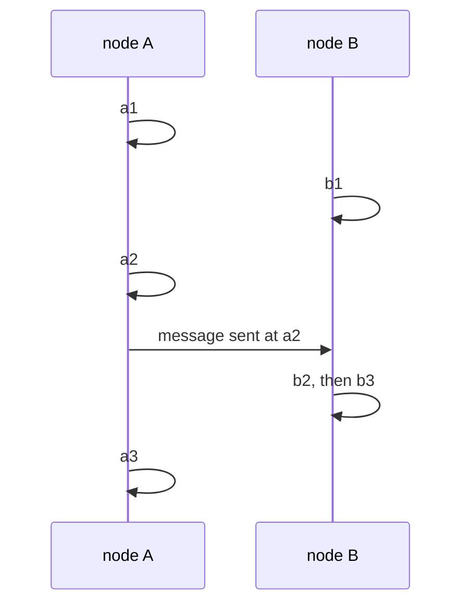
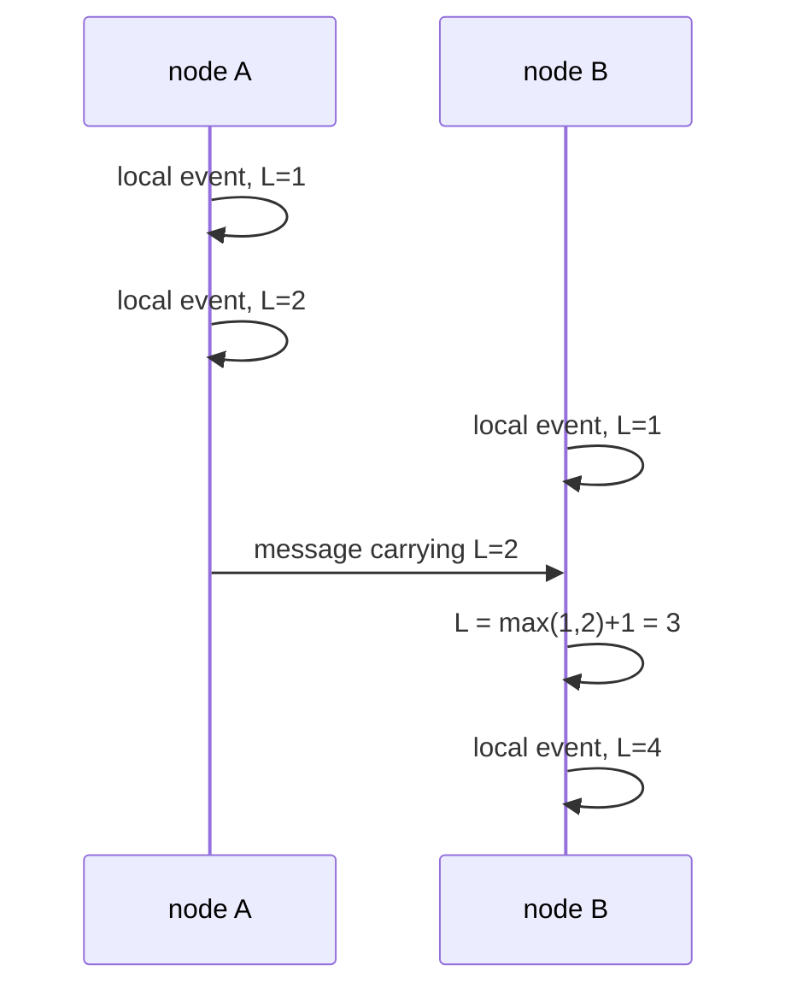
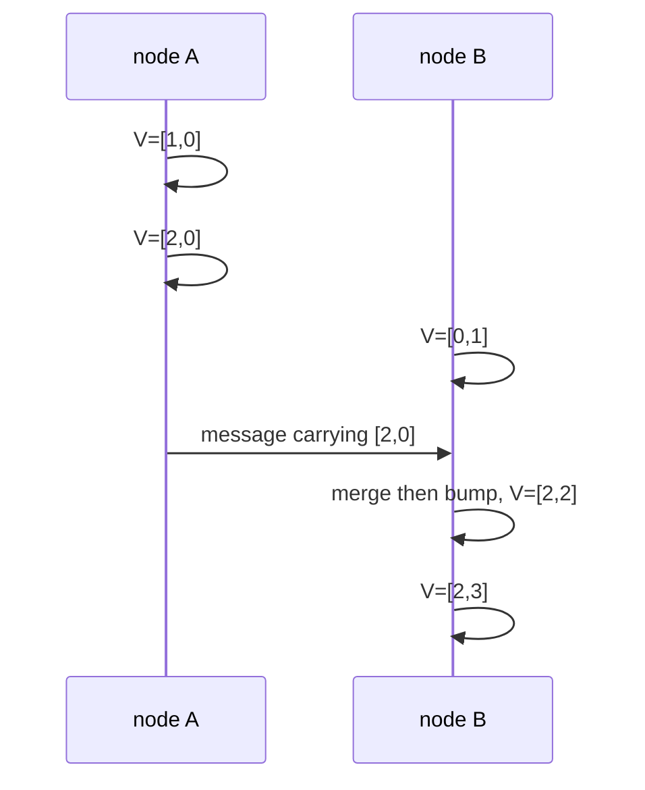

# Logical & Vector Clocks

> **Goal of this chapter:** learn how distributed systems order events
> *without* trusting physical clocks. We'll define the happens-before
> relation, build Lamport clocks (order with a single number), then vector
> clocks (which can also *detect* concurrency), and see where each is used in
> real systems.

[Time, Clocks & Why They Lie](#/time-and-clocks) ended with a problem:
physical timestamps can't safely order events across machines, and
last-write-wins turns that into silent data loss. Leslie Lamport's 1978
paper — *"Time, Clocks, and the Ordering of Events in a Distributed
System"*, perhaps the most cited in the field — offered a beautiful
reframing: for correctness, we usually don't need to know *when* events
happened. We need to know **what could have caused what**.

## Happens-before: order from causality

Define the **happens-before** relation, written `a → b`, by three rules:

1. If `a` and `b` occur on the **same node** and `a` comes first, then
   `a → b`.
2. If `a` is the **sending** of a message and `b` is its **receipt**, then
   `a → b`.
3. **Transitivity:** if `a → b` and `b → c`, then `a → c`.

That's it. `a → b` means information *could have flowed* from `a` to `b` —
so `a` could have influenced `b`.

The profound part is what's missing: two events with no happens-before path
between them, in either direction, are **concurrent** (written `a ∥ b`).
Not "simultaneous" — there may be minutes between them on a wall clock.
Concurrent means **neither could have known about the other**. Causally,
there is no fact of the matter about which came first.

One message is enough to order a whole chain of events — and enough to leave
the rest of them permanently unordered:



Reading the arrows: `a1 → a2 → b2 → b3` (program order, then the message,
then transitivity), and `a1 → a3` on A's own line. But `b1` has no path to
or from anything on A, so `b1 ∥ a1`; and `a3 ∥ b3` — concurrent, even though
`a3` sits lower on the page and may well have happened later on a wall
clock.

This relation is a **partial order**: some pairs are ordered, others aren't.
The two clock constructions below are ways of *encoding* it in numbers.

## Lamport clocks: causality in one integer

Each node keeps a single counter `L`, with three rules:

1. Before any local event: `L = L + 1`.
2. When sending a message, attach the current `L`.
3. On receiving a message with timestamp `Lm`: `L = max(L, Lm) + 1`.

Rule 3 is the heart: receiving a message *fast-forwards* your clock past the
sender's, so causes always carry smaller numbers than their effects. Watch
B's counter jump from 1 to 3 on receipt — it can never again claim a number
below its cause:



**Guarantee:** if `a → b` then `L(a) < L(b)`.

**Non-guarantee (the famous trap):** the converse fails. `L(a) < L(b)` does
**not** imply `a → b` — the events might be concurrent. In the diagram,
A's third event and B's first both relate as 1 < 3, but `b1` is concurrent
with everything on A. A Lamport timestamp can never *prove* causality, and
it cannot detect concurrency at all.

### What Lamport clocks are for

When you need *some* consistent total order that everyone agrees on — not
the "true" order, which doesn't exist for concurrent events — Lamport
timestamps are perfect. Break ties by node ID: order by `(L, node_id)`.
Every node sorts events identically, and the order respects causality.
Classic uses: totally-ordered multicast, fair distributed lock queues, and
as the conceptual ancestor of the **term numbers** in [Raft](#/raft), the
**ballot numbers** in Paxos ([The Consensus Problem](#/consensus)), and the
**epoch / fencing tokens** of [Failure Models & Detection](#/failure-models)
— all are counters that only move forward and stamp who's "later".

## Vector clocks: detecting concurrency

To also *detect* concurrency, we need more than one number. A **vector
clock** in a system of `n` nodes is an array `V[1..n]`: entry `V[i]` counts
the events node `i` is known to have performed.

Rules for node `i`:

1. Local event: `V[i] = V[i] + 1`.
2. Send: attach a copy of the whole vector.
3. Receive vector `Vm`: merge with `V[k] = max(V[k], Vm[k])` for every `k`,
   then `V[i] = V[i] + 1`.

Intuition: your vector summarizes *everything you've heard about everyone*.
Merging on receipt means knowledge flows with messages.

Comparison rules — and this is where the power is:

- `Va < Vb` (a happened-before b): every entry of `Va` ≤ the corresponding
  entry of `Vb`, and at least one is strictly smaller.
- Neither `Va < Vb` nor `Vb < Va` → **concurrent**, definitively.

Same exchange as before, now carrying vectors instead of one integer:



The two comparisons that matter, and the second is the one a single integer
could never make:

- `[1,0]` vs `[2,3]`: `1 ≤ 2` and `0 ≤ 3`, with at least one strictly
  smaller ⇒ **causally before**.
- `[0,1]` vs `[2,0]`: `0 < 2` but `1 > 0` — neither dominates ⇒
  **concurrent**, provably.

**Guarantee (both directions this time):** `Va < Vb` **iff** `a → b`.
Vector clocks capture the happens-before partial order *exactly*.

The cost: a vector entry per participant, carried on every message and
stored with data — painful when "participants" means thousands of clients.
Real systems prune old entries, cap vector size, or use server-side IDs
only; each shortcut slightly weakens the guarantees, a trade-off made
knowingly.

## Where you meet vector clocks in the wild

### Conflict detection in replicated stores

Amazon's Dynamo (and Riak after it — both dissected in [Real-World
Architectures](#/real-world-architectures)) stamped each stored value with a
version vector. This is the leaderless replication of
[Replication](#/replication) with its conflict detection made honest. When a
replica receives a write:

- New version **dominates** the stored one → safe overwrite (the writer had
  seen the current value).
- Versions are **concurrent** → two clients wrote independently — a genuine
  **conflict**. Dynamo keeps *both* as siblings and hands them to the
  application to merge (the famous shopping-cart union).

Compare with last-write-wins from [Time, Clocks & Why They
Lie](#/time-and-clocks), which would silently discard one of them based on
lying wall clocks. Vector clocks are how a store *knows* a conflict happened
instead of guessing — and [CRDTs, Gossip &
Anti-Entropy](#/crdts-and-gossip) turns that knowledge into merges that need
no application code at all.

> Terminology you'll meet in papers: **version vectors** — the same
> mechanism applied to *versions of a data item* rather than all events of
> a process. The comparison logic is identical; only what's being counted
> differs.

### Causal consistency

A session writes a comment, then a reply to it. With **causal consistency**
(placed properly on the ladder in [Consistency Models &
CAP](#/consistency-models)), every replica
must show the comment before the reply — and vector-clock-style metadata is
how replicas know to delay applying the reply until the comment has
arrived. Causality tracking is the engine room of "reads make sense"
guarantees in geo-replicated stores.

### Distributed tracing (the spirit, not the structure)

When a request fans out through thirty services, tracing systems propagate
context so the resulting spans can be assembled into a causal tree. It's
happens-before bookkeeping in production clothes: rule 2 (attach metadata to
every message) doing daily work.

## Choosing your clock

| You need | Use | Cost |
|---|---|---|
| Measure a duration on one machine | [monotonic clock](#/time-and-clocks) | free |
| Human-readable event times, logs | [wall clock](#/time-and-clocks) (NTP-synced) | ms-level lies |
| One total order all nodes agree on | Lamport clock (+ node ID tiebreak) | 1 integer |
| Know whether two updates conflict | vector / version clocks | 1 entry per actor |
| Order by real time, provably | [bounded-uncertainty clocks](#/time-and-clocks) (TrueTime) | special hardware + waiting |

## Key takeaways

- **Happens-before** (`a → b`) is potential causality, built from program
  order, message passing and transitivity. Events with no path either way
  are **concurrent** — neither "first" exists, even in principle.
- **Lamport clocks:** one counter; `a → b ⇒ L(a) < L(b)` — but not the
  converse. Great for agreed total orders; blind to concurrency. Their
  one-way counters echo through Raft terms and fencing tokens.
- **Vector clocks:** one counter per participant; capture happens-before
  *exactly*, so they can prove causality and **detect conflicts** — at the
  cost of vector-sized metadata.
- Real systems use them where it counts: Dynamo-style conflict detection,
  causal consistency in geo-replication, and (in spirit) distributed
  tracing.

```quiz
[
  {
    "q": "Two events a and b are 'concurrent' in the happens-before sense. What does that mean?",
    "choices": [
      "They occurred at exactly the same wall-clock instant",
      "There is no causal path between them in either direction — neither could have known about the other",
      "They occurred on the same node within one millisecond",
      "They conflict and one must be discarded"
    ],
    "answer": 1,
    "explain": "Concurrency is about information flow, not wall time: minutes can separate two concurrent events. Causally, there is simply no fact about which came 'first'."
  },
  {
    "q": "Event a has Lamport timestamp 4 and event b has Lamport timestamp 9. What do we know?",
    "choices": [
      "a happened-before b",
      "b happened-before a is impossible — but a and b may be concurrent",
      "a and b are definitely concurrent",
      "Nothing at all"
    ],
    "answer": 1,
    "explain": "Lamport clocks guarantee causes have smaller timestamps, so b → a would force 9 < 4 — impossible. But L(a) < L(b) does not prove a → b: the events may be concurrent. One integer cannot distinguish those cases; vector clocks can."
  },
  {
    "q": "Replica receives a write with vector [2,0] while storing a value with vector [0,1]. What should a Dynamo-style store do?",
    "choices": [
      "Overwrite — [2,0] is bigger in the first entry",
      "Reject the write as stale",
      "Keep both versions as siblings: neither vector dominates, so the writes are concurrent — a real conflict",
      "Compare the wall-clock timestamps to break the tie"
    ],
    "answer": 2,
    "explain": "[2,0] vs [0,1]: each is larger in one entry, so neither dominates — the writes happened independently. Honest stores surface both for merging; falling back to wall clocks would reintroduce silent data loss."
  },
  {
    "q": "Why do vector clocks need one entry per participant?",
    "choices": [
      "For checksumming against corruption",
      "To capture the happens-before partial order exactly — a single counter must flatten it into a total order, losing concurrency information",
      "Because networks deliver messages out of order",
      "To survive Byzantine nodes"
    ],
    "answer": 1,
    "explain": "Happens-before is a partial order; one number forces a total order onto it, making concurrent events look ordered. Per-participant entries preserve exactly what each node has seen of every other, enabling the 'neither dominates ⇒ concurrent' test."
  }
]
```
