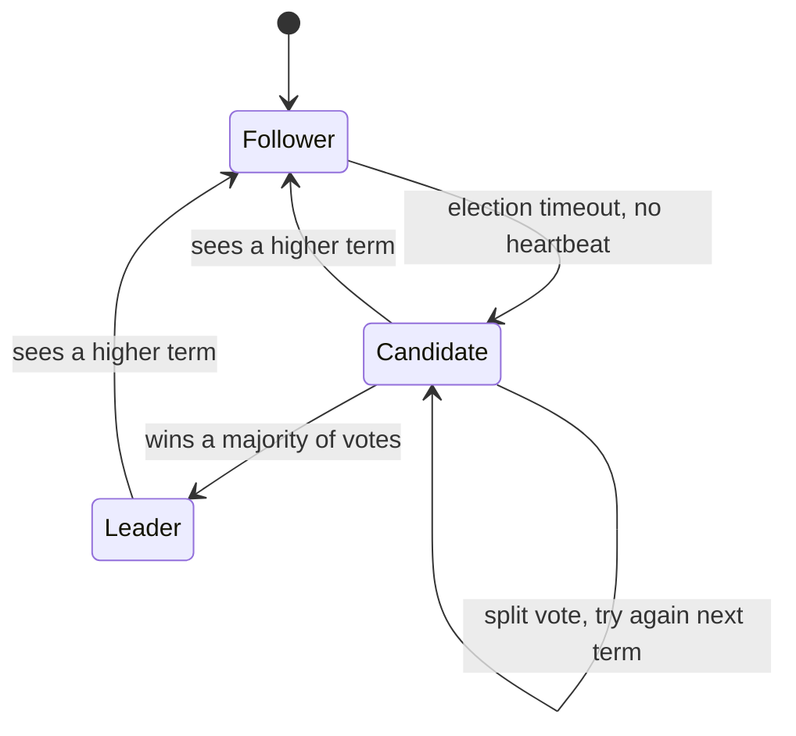
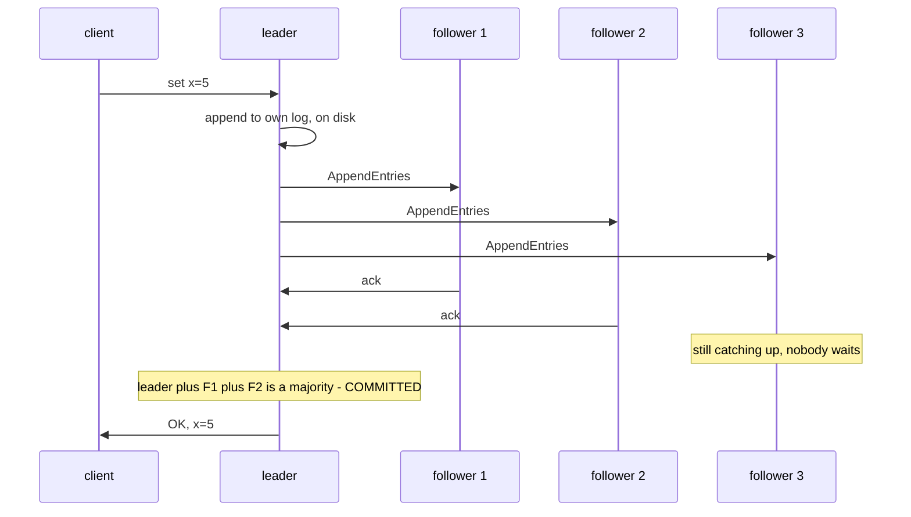
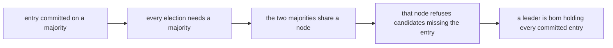

# Raft, Step by Step

> **Goal of this chapter:** walk through Raft completely — leader election,
> log replication, the commit rule, and the two safety mechanisms that make
> it correct (election restriction and the current-term commit rule) — plus
> the production layers: snapshots, membership changes, and read handling.
> After this chapter, etcd and friends stop being magic.

Raft (Ongaro & Ousterhout, 2014) is consensus engineered for human
comprehension. Same problem and guarantees as [Multi-Paxos](#/consensus) —
replicate a log across `2f+1` nodes, tolerating `f` crashes — but decomposed
into pieces you can hold in your head one at a time. It now runs inside
etcd, CockroachDB, TiDB, Consul, Kafka's KRaft and countless others;
[Real-World Architectures](#/real-world-architectures) takes several of them
apart.

## The cast: three roles and a clock that isn't

Every node is exactly one of three roles, and every transition between them
is triggered either by a timeout or by hearing a term greater than its own:



- **Leader** — handles all client writes, replicates them, the only node
  that commits.
- **Follower** — passive: applies what the leader sends, votes when asked.
- **Candidate** — a follower that stopped hearing from a leader and is
  trying to get elected.

Time is divided into **terms**, numbered monotonically. Each term has *at
most one* leader (maybe none, if an election fails). The term number is a
[Lamport clock](#/logical-clocks) for leadership: every message carries it,
and any node that sees a higher term than its own immediately adopts it and
steps down to follower. Terms make stale leaders harmless — their messages
carry an old term and are rejected on sight. (Recognize the [fencing-token
pattern](#/failure-models) — built into the protocol's bones, so that safety
never rests on a clock the way [Time, Clocks & Why They
Lie](#/time-and-clocks) warned.)

Laid out on a timeline, a term is an election followed by at most one
leadership — and term 3 below is an election that produced no leader at all:

```text
 term 1        term 2          term 3      term 4
 [election|leadership][election|leadership][election — failed][election|…]
```

## Part 1: leader election

The heartbeat machinery from [Failure Models & Detection](#/failure-models),
now with teeth:

1. The leader sends periodic heartbeats (empty `AppendEntries`) to all.
2. Each follower runs an **election timeout**, randomized per node
   (e.g. 150–300 ms), reset on every heartbeat.
3. A follower whose timeout fires assumes the leader is gone: it
   increments its term, becomes a **candidate**, votes for itself, and asks
   everyone for votes (`RequestVote`).
4. A node grants its vote if it hasn't voted in this term — **one vote per
   term per node**, persisted to disk before answering
   ([crash-recovery](#/failure-models) discipline: promise nothing you won't
   remember).
5. **Majority of votes ⇒ leader.** Start heartbeating immediately.

Why this is safe: one vote per node per term means **two candidates can't
both reach a majority in the same term** — majorities overlap, the shared
voter voted once. Why it terminates: *randomized* timeouts make split votes
(several simultaneous candidates dividing the vote) rare and self-healing —
if a term ends with no winner, candidates time out at different random
moments next term, and whoever wakes first usually wins alone. This
randomness is exactly the non-determinism that sidesteps
[FLP](#/consensus) — the theorem only binds *deterministic* protocols.

## Part 2: log replication

In steady state (a stable leader), Raft is simple — this simplicity is its
selling point:



The slowest follower never appears on the critical path: a majority is
enough, so one sick node costs latency to nobody.

Each log entry holds `(term, index, command)`. The leader tracks, per
follower, how far their log matches its own, and retries/repairs lagging
followers indefinitely. One round trip to a majority per batch of entries —
the same steady-state cost as [Multi-Paxos](#/consensus).

**Consistency check:** every `AppendEntries` carries the `(term, index)` of
the entry *preceding* the new ones. A follower accepts only if its own log
matches at that position; otherwise it rejects, and the leader backs up and
resends earlier entries until logs realign. This induction maintains the
**Log Matching property**: if two logs agree on an entry's term at an index,
they agree on *everything* up to it. Conflicting unreplicated entries on a
follower (from a dead leader's term) are simply overwritten — they were
never committed, so nothing promised is lost.

## Part 3: the two safety rules (the heart of Raft)

Elections + replication alone aren't safe. Two scenarios would corrupt
history, and Raft closes each with one rule.

### Rule 1: election restriction — only up-to-date nodes may lead

Scenario: an entry is committed via majority {A, B, C}. Node D, partitioned
and missing it, later starts an election and wins. New leader D doesn't have
a committed entry ⇒ it would overwrite history.

The fix: `RequestVote` carries the candidate's last log entry `(term,
index)`, and **a voter refuses any candidate whose log is less up-to-date
than its own** ("up-to-date" = higher last term, or same term and longer
log).

Why it works is [majority overlap](#/consensus) again, and the whole
argument is four steps:



**A leader can never be missing a committed entry**, so — elegant
consequence — Raft leaders never need to "learn" past decisions the way
Paxos proposers do in phase 1; the election itself guarantees the winner
already has everything. (This is the main structural simplification over
Paxos.)

### Rule 2: commit only entries from your own term

Subtler scenario (Figure 8 of the Raft paper, the famous one): a leader
replicating an *old term's* entry to a majority, then declaring it
committed — there's a corner case where that entry can *still* be
overwritten by a higher-term leader that won an election legitimately
without it.

The fix: **a leader only counts replication toward commitment for entries
of its *current* term.** Once a current-term entry is committed, the
election restriction protects everything before it (Log Matching ties the
prefix to it). Old-term entries thus get committed *indirectly*: the new
leader appends a current-term entry (many implementations append an empty
no-op on taking office for exactly this purpose), and its commitment seals
the whole log behind it.

These two rules give Raft's guarantee: **if an entry is committed, every
future leader contains it, and no other entry ever occupies its index.**
Safety under any crashes, any partitions, any message loss — liveness, per
FLP, whenever timing is reasonable.

## Part 4: what production adds

### Snapshots and log compaction

The log grows forever; replaying years of it on restart is absurd. Each
node periodically **snapshots** its state machine at some log index and
discards the log up to it. A follower so far behind that the needed entries
are discarded receives the snapshot itself (`InstallSnapshot`), then
resumes normal replication.

### Membership changes

Switching the cluster from {A,B,C} to {A,B,C,D,E} naively is dangerous:
during the transition, the old majority (2 of 3) and new majority (3 of 5)
might not overlap — two leaders, one per configuration. Raft's practical
answer: **change one node at a time** — any majority of a configuration
differing by one node necessarily overlaps any majority of the old one.
Configuration changes travel *through the log itself*, like any other
entry. (The paper's joint-consensus mechanism handles bulk changes;
single-node steps are what most implementations ship.)

### Reads: subtler than they look

A read served instantly from a leader's state machine might be **stale**:
the node may have been deposed during a partition and not know it (the
zombie-leader problem from [Time, Clocks & Why They
Lie](#/time-and-clocks) — clocks and pauses). Three production answers, in
decreasing cost:

- **Log the read:** run it through consensus like a write. Linearizable,
  expensive.
- **ReadIndex:** leader confirms leadership with one heartbeat round to a
  majority, then serves the read at its current commit index.
  Linearizable, no log write — etcd's default for linearizable reads.
- **Lease reads:** leader serves reads freely within a clock-bounded lease.
  Fastest — and reintroduces a clock assumption (bounded drift), the very
  thing Raft otherwise avoids. Used by etcd and CockroachDB as an opt-in.

[Consistency Models & CAP](#/consistency-models) lives here in miniature:
each option is a price point on the linearizability-vs-latency curve, and
PACELC's "else, latency vs consistency" is precisely the choice between
these three lines of config.

## Watching it in the wild

`etcdctl endpoint status` on any etcd cluster shows you the Raft term, the
leader's identity, and per-member commit indexes — every concept of this
chapter, running in production, one command away. Kill the leader and watch
a term increment and a sub-second election; partition a minority and watch
it stall harmlessly, then catch up on heal. [Real-World
Architectures](#/real-world-architectures) shows what Kubernetes then builds
on top of exactly this.

## Key takeaways

- Raft = Multi-Paxos's guarantees, restructured: **terms** (Lamport clocks
  for leadership, built-in fencing), strong leader, explicit log.
- **Election:** randomized timeouts; one persisted vote per term; majority
  wins — split votes self-heal, FLP dodged by randomness.
- **Replication:** leader appends → majority ack ⇒ committed; the
  AppendEntries consistency check inductively forces logs to match.
- **Safety = two rules:** voters reject less-up-to-date candidates (so
  leaders are born complete — no Paxos-style discovery phase), and leaders
  commit only own-term entries (old ones seal indirectly via a no-op).
- **Production Raft** adds snapshots, one-at-a-time membership changes
  through the log, and a menu of read modes (logged / ReadIndex / lease)
  trading latency against the strength of linearizability.

```quiz
[
  {
    "q": "Why are Raft election timeouts randomized?",
    "choices": [
      "To make elections cryptographically unpredictable",
      "So simultaneous candidacies (split votes) become rare and self-resolving — whoever times out first next round usually wins alone",
      "To spread CPU load across the cluster",
      "Because identical timeouts would violate the one-vote-per-term rule"
    ],
    "answer": 1,
    "explain": "If all followers timed out together, they'd perpetually split the vote. Randomization staggers candidacies, letting one node solicit votes before rivals wake — the dose of non-determinism that gets around FLP's bound on deterministic protocols."
  },
  {
    "q": "What prevents a node that's missing committed entries from becoming leader?",
    "choices": [
      "The old leader must explicitly bless its successor",
      "Voters compare logs and refuse candidates less up-to-date than themselves; any majority contains a holder of every committed entry",
      "Candidates must first download the full log from a majority",
      "Nothing — new leaders fetch missing entries after winning"
    ],
    "answer": 1,
    "explain": "The election restriction plus majority overlap: a committed entry sits on a majority, every election needs a majority, the intersection refuses incomplete candidates. Hence Raft leaders are born with the complete committed log — the key simplification over Paxos."
  },
  {
    "q": "A new leader has uncommitted entries from a previous term replicated on a majority. Per Raft's commit rule, how do they get committed?",
    "choices": [
      "Immediately — majority replication is the definition of committed",
      "They are deleted and must be resubmitted by clients",
      "Indirectly: the leader commits an entry of its own term (often a no-op), which seals the entire log prefix including them",
      "After a full election cycle confirms them"
    ],
    "answer": 2,
    "explain": "Counting replication for old-term entries directly has a corner case where they can still be overwritten (the paper's Figure 8). Committing a current-term entry is safe, and Log Matching extends that safety to everything before it."
  },
  {
    "q": "Why might a Raft leader serving reads directly from its state, with no checks, return stale data?",
    "choices": [
      "Followers may have newer data than the leader",
      "It may have been deposed during a partition without knowing it — a newer leader has since committed writes elsewhere",
      "The state machine lags the log by design",
      "It can't — leaders are always current"
    ],
    "answer": 1,
    "explain": "A partitioned or paused ex-leader can keep believing it leads. Linearizable reads need proof of current leadership: route the read through the log, confirm with a majority heartbeat (ReadIndex), or rely on a clock-bounded lease — each cheaper and slightly weaker in assumptions than the last."
  }
]
```
