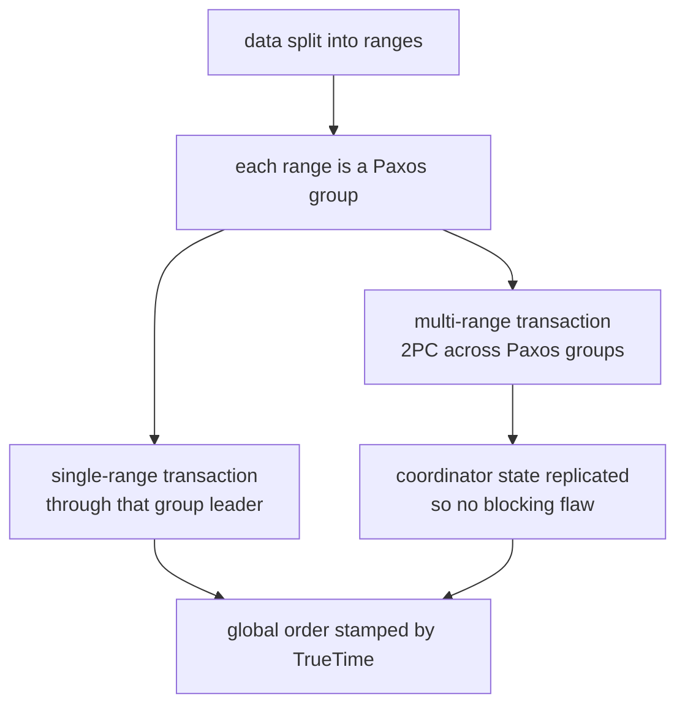
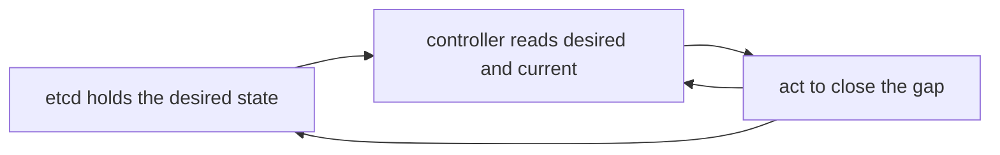

# Real-World Architectures

> **Goal of this chapter:** the victory lap. Five landmark systems —
> ZooKeeper/etcd, Kafka, Dynamo/Cassandra, Spanner, and Kubernetes — each
> dissected with the concepts you now own. No new theory: just the deep
> satisfaction of reading production architectures like open books, plus a
> map of where to go next.

Every chapter of this course introduced machinery because some problem
forced it. Real systems are *combinations* of that machinery, each
combination a different answer to the same exam questions: What's your
consistency model? Where does consensus sit? How do you partition,
replicate, detect failure, survive a partition? Let's grade five famous
answers.

## ZooKeeper & etcd: consensus as a service

The purest embodiment of [The Consensus Problem](#/consensus). Both are
small replicated key-value stores — ZooKeeper on **ZAB**, etcd on
[**Raft**](#/raft) — running on 3 or 5 nodes (2f+1, for the reason that
chapter gave), holding not your data but your **coordination facts**: who is
leader, what is the config, which nodes exist, who holds which lock.

The architecture is [state machine replication](#/consensus) verbatim: every
write flows through the leader into the consensus log; the replicated state
machine is a tree (ZooKeeper) or flat keyspace (etcd) of small entries. Two
primitives elevate them from "tiny database" to "coordination kernel":

- **Watches:** clients subscribe to a key and get notified on change — the
  push mechanism that turns a passive store into a control plane.
- **Ephemeral keys / leases:** a key bound to a client's session or lease
  vanishes when its owner stops renewing. Build leader election from it in
  one move: everyone tries to create the same ephemeral key; the one who
  succeeds is leader; if it dies, the key evaporates and watchers race
  again. Heartbeats and failure suspicion ([Failure Models &
  Detection](#/failure-models)) plus fencing by lease generation number
  ([Time, Clocks & Why They Lie](#/time-and-clocks)) — packaged behind one
  API.

Their [CAP](#/consistency-models) answer: hard **CP**. A partitioned
minority refuses even reads of dubious freshness (etcd's linearizable reads
use the [ReadIndex round](#/raft)). Their PACELC answer: consistency over
latency, always — which is precisely why you keep them small and put only
*facts that must never fork* inside.

## Kafka: the replicated log as a product

[Raft](#/raft)'s central object — an ordered, replicated log — sold as
infrastructure. Kafka's mapping onto the course:

- **[Partitioning](#/partitioning):** a topic is split into partitions by
  key hash; ordering is guaranteed *within* a partition only — a
  deliberately weakened, therefore scalable, promise.
- **[Replication](#/replication):** each partition has a leader and
  followers; producers write to the leader; the **ISR** (in-sync replica
  set) is a dynamic quorum-ish membership. `acks=all` +
  `min.insync.replicas=2` is synchronous-replication durability; `acks=1`
  is the async gamble that chapter warned about — your latency/durability
  dial, exposed as config.
- **[Consensus](#/consensus):** who leads each partition, and the cluster
  metadata itself, used to live in ZooKeeper; modern Kafka's **KRaft** mode
  moves it onto an internal Raft quorum. Note the architecture: consensus
  governs the *metadata*; the *data path* uses cheaper leader-follower
  replication coordinated by those facts. (The composition predicted in
  [CRDTs, Gossip & Anti-Entropy](#/crdts-and-gossip).)
- **Delivery semantics:** consumers track offsets; offset commits vs
  processing order gives at-least-once or at-most-once, and Kafka
  transactions (offsets + outputs atomically) give effectively-once within
  the ecosystem — [Distributed Transactions](#/distributed-transactions),
  productized.

## Dynamo & Cassandra: the AP school, complete

Amazon's 2007 Dynamo paper is Modules 3 and 5 of this course in one system,
built for one requirement: the shopping cart **must always accept writes**.

- **[Partitioning](#/partitioning):** consistent hashing on a ring, virtual
  nodes — originally popularized by this very paper.
- **[Replication](#/replication):** leaderless; each key written to N
  successors on the ring; **sloppy quorums + hinted handoff** keep accepting
  writes even when the proper home nodes are down (availability pushed to
  its limit).
- **Conflicts:** [version vectors](#/logical-clocks) detect concurrent
  writes; Dynamo surfaced siblings to the application, Cassandra chose
  per-cell LWW timestamps — knowingly accepting the [silent-loss
  trade](#/time-and-clocks) for operational simplicity. Tunable `R`/`W` per
  query: each request picks its own point on the consistency spectrum.
- **Membership & repair:** gossip for who's-alive (phi-accrual suspicion),
  read repair + Merkle-tree anti-entropy for divergence — [CRDTs, Gossip &
  Anti-Entropy](#/crdts-and-gossip) end to end.

[CAP](#/consistency-models) answer: **AP** with tunable edges. PACELC:
latency over consistency, with the application holding the merge burden.
The mirror image of etcd — and correctly so, because carts and counters are
not locks and leases.

## Spanner: buying back strong consistency at planet scale

Google's Spanner is the audacious synthesis: SQL, ACID transactions,
**linearizability (external consistency)** — across continents.

The stack, bottom to top, is this course in one diagram — every box is a
chapter you have already read:



Bottom layer: [Partitioning & Sharding](#/partitioning). The Paxos groups:
[The Consensus Problem](#/consensus) and [Raft](#/raft). The 2PC layer and
its replicated coordinator: [Distributed
Transactions](#/distributed-transactions). The ordering at the top: [Time,
Clocks & Why They Lie](#/time-and-clocks).

TrueTime is the famous ingredient: GPS + atomic clocks expose time as an
**interval** with bounded error, and Spanner **waits out the uncertainty**
(a few ms) before declaring a transaction committed — so timestamp order
provably matches real-time order, globally. The lesson isn't "buy atomic
clocks"; it's the shape of the trade: Google converted a coordination
problem into a (bounded) *waiting* problem, paying milliseconds of commit
latency to make reads coordination-free worldwide. CockroachDB plays the
same architecture without the exotic clocks — paying instead with
uncertainty windows and occasional transaction restarts.
[PACELC](#/consistency-models) made flesh: both are PC/EC, differing in how
they pay the latency bill.

## Kubernetes: a distributed system that manages your distributed systems

The least "database" of the five, and the most instructive architecture:

- **All state in etcd** — every pod, service, config object lives in the
  [consensus store](#/consensus). The API server is (to first
  approximation) stateless CRUD + watches in front of it.
- **Controllers are reconciliation loops:** each one watches desired state
  and current state and nudges reality toward the spec, forever.
  *Level-triggered, not edge-triggered*: a controller that misses an event
  (crash, partition — [lost messages](#/the-network-is-hostile)) simply
  reconverges on the next loop. The whole control plane is designed to be
  **safely restartable from observed state** — [failure-model
  thinking](#/failure-models) as architecture.
- **Optimistic concurrency:** every object carries a resourceVersion;
  conflicting controller writes fail and retry with fresh state — [versions
  as conflict detection](#/logical-clocks), server-side.
- **Leader election among controller replicas** uses leases in etcd — the
  ephemeral-key pattern above, [fencing](#/failure-models) included.
- The scheduler is a **placement** engine ([Partitioning &
  Sharding](#/partitioning)'s concerns: spreading, affinities, hot nodes),
  and kubelet heartbeats with the node controller replay the [timeout
  dilemmas](#/failure-models) — including the deliberately *patient*
  eviction timeouts that trade detection speed for fewer false evictions.

The loop is worth drawing, because what makes it robust is an arrow that
isn't there:



There is no "handle the event" arrow. A controller that crashes and misses
ten notifications simply reads the world again on its next pass and
converges — which is why the whole plane tolerates the message loss of
Module 1 without a single special case.

One layer down, every pod on a node is a set of Linux
[namespaces](../#/namespaces) and a [cgroup](../#/cgroups): the isolation
Kubernetes schedules is a kernel mechanism, not a Kubernetes one.

Kubernetes is what it looks like when an industry absorbs this course:
consensus kernel at the center, idempotent convergent loops everywhere
else, and every guarantee written down.

## The grand summary: one table

| | etcd/ZooKeeper | Kafka | Dynamo/Cassandra | Spanner | Kubernetes |
|---|---|---|---|---|---|
| Role | coordination facts | event log | always-on KV | global SQL | control plane |
| Consistency | linearizable | per-partition order | tunable/eventual | external (linearizable) | linearizable core + converging loops |
| Consensus | IS the system | metadata (KRaft) | none (gossip) | per-range Paxos | rented from etcd |
| Partitioning | none (small!) | topic partitions | hash ring | ranges | n/a |
| CAP stance | CP | CP-leaning data path | AP | CP | CP core |
| Signature idea | watches + ephemeral keys | the log as interface | sloppy quorums, merge later | wait out clock uncertainty | level-triggered reconciliation |

Read the columns and the design space snaps into focus: **there is no best
system, only positions on trade-off axes you can now name** — and the
architectures that win combine a small CP core with scalable,
weaker-consistency machinery around it.

## Where to go next

You have the map; here's where the territory deepens:

- **The book:** Kleppmann, *Designing Data-Intensive Applications* — the
  field's standard text; this course is a runway onto it.
- **Papers worth reading in full** (in this order): the Raft paper ("In
  Search of an Understandable Consensus Algorithm"), the Dynamo paper, the
  Spanner paper, Lamport's "Time, Clocks…", and the CRDT tech report
  (Shapiro et al.).
- **Hands-on:** run a 3-node etcd locally, kill leaders, partition it with
  iptables, watch terms climb. Build a tiny Raft (many language-specific
  labs exist — MIT 6.824's is the classic). Break things on purpose;
  Jepsen's analyses (jepsen.io) are masterclasses in how real systems fail
  their own guarantees.
- **This site:** [The Networking Stack](../#/networking) and [TCP
  Congestion Control & Tuning](../#/tcp-congestion) are the layer all of
  this runs on — the `iptables` rules you would use to induce a partition,
  and the retransmit behaviour underneath every timeout you tuned.
  [Namespaces](../#/namespaces) and [Control Groups](../#/cgroups) are the
  mechanisms Kubernetes actually drives. And if the machines you distribute
  are GPUs, the [Inference Engineering](../inference/#/what-is-inference)
  course is the same reasoning applied to a fleet where the replicated
  object is a cache: [The KV Fabric](../inference/#/the-kv-fabric) for
  placement and routing, [Operating It](../inference/#/operating-it) for
  which of your instincts survive the move.

## Key takeaways

- **etcd/ZooKeeper:** consensus as a rentable kernel — small CP store,
  watches and leases turn it into elections, locks and config.
- **Kafka:** the replicated log productized; consensus for metadata,
  leader-follower for the data path, delivery semantics as explicit dials.
- **Dynamo/Cassandra:** the complete AP toolkit — ring partitioning,
  sloppy quorums, version vectors or LWW, gossip and Merkle repair —
  bought with merge-time conflict handling.
- **Spanner:** partitions × Paxos × 2PC × TrueTime = planet-scale
  linearizable SQL; the deep move is converting coordination into bounded
  waiting.
- **Kubernetes:** a consensus core plus idempotent, level-triggered
  reconciliation — failure-tolerant by *shape*, not by heroics.
- The universal pattern: **strong consistency for the few facts that must
  not fork; cheap convergence for everything else.** You can now read any
  architecture through this lens.

```quiz
[
  {
    "q": "Why do architectures like Kafka keep consensus only on the metadata path, not the data path?",
    "choices": [
      "Consensus cannot store binary data",
      "Consensus costs majority round trips per write — affordable for small, critical facts; the bulk data path uses cheaper leader-follower replication coordinated BY those facts",
      "Regulations require separating metadata from data",
      "Raft logs cannot exceed a few megabytes"
    ],
    "answer": 1,
    "explain": "The recurring composition of the course: a small CP core (who leads which partition, cluster config) governs a high-throughput, weaker-guarantee data plane. Strong consistency where forking is fatal; cheap replication where volume lives."
  },
  {
    "q": "How does Spanner make its transaction timestamps match real-time order globally?",
    "choices": [
      "Perfect clock synchronization via GPS eliminates all error",
      "A single global sequencer node assigns timestamps",
      "TrueTime exposes bounded clock uncertainty as an interval, and Spanner waits out that uncertainty before reporting a commit",
      "Vector clocks attached to every row"
    ],
    "answer": 2,
    "explain": "The clocks are still imperfect — but their error is bounded and known. By waiting until the uncertainty interval has passed, Spanner ensures no later transaction anywhere can get an earlier timestamp: external consistency, bought with a few milliseconds of commit latency."
  },
  {
    "q": "A Kubernetes controller crashes and misses several change events. Why is the system still correct?",
    "choices": [
      "etcd replays all missed events on reconnect",
      "Controllers are level-triggered reconciliation loops: they compare desired vs current state and converge, so missed events are absorbed by the next loop",
      "The API server queues events for offline controllers indefinitely",
      "Other controllers take over its event stream"
    ],
    "answer": 1,
    "explain": "Reconciliation acts on observed state, not event history — making the control plane idempotent and restartable, exactly the design you'd derive from the lost-message and crash-recovery models of Modules 1 and 4."
  },
  {
    "q": "Which pairing correctly matches a system to its signature trade-off?",
    "choices": [
      "Dynamo: refuses writes during partitions to preserve linearizability",
      "etcd: maximizes write availability by accepting writes on both sides of a partition",
      "Cassandra: tunable per-query consistency, accepting conflict handling (LWW/merge) as the price of availability",
      "Spanner: eventual consistency to avoid clock dependencies"
    ],
    "answer": 2,
    "explain": "Cassandra (the Dynamo school) chooses availability and lets each query pick its R/W point on the consistency spectrum, paying with merge-time conflicts. etcd is the CP opposite; Spanner is linearizable BECAUSE of its clock engineering; Dynamo never refuses a cart."
  }
]
```
