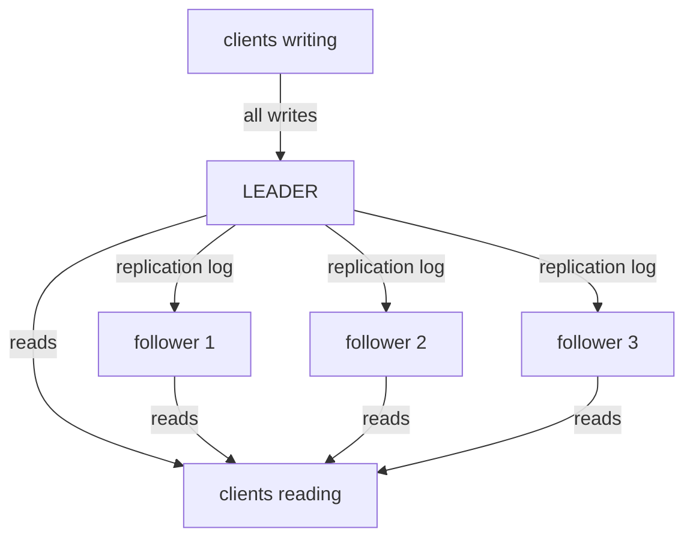
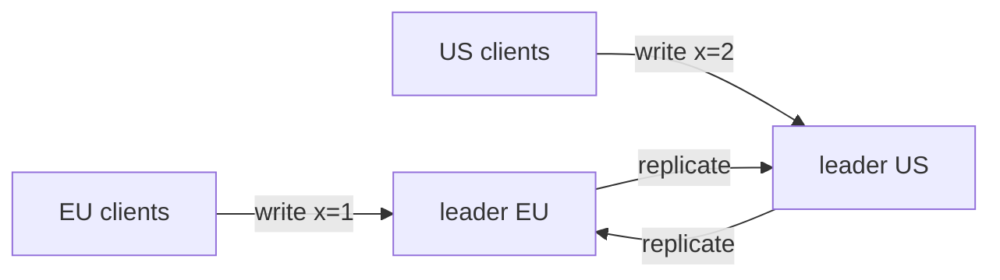
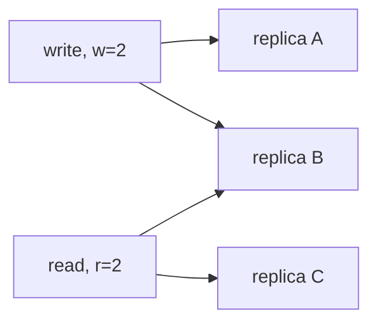

# Replication

> **Goal of this chapter:** understand the three great replication
> architectures — leader-follower, multi-leader, leaderless — what each
> buys you, and the failure modes each drags in. Replication lag and quorums
> introduced here are the launchpad for the consistency-models chapter.

**Replication** means keeping copies of the same data on several nodes. The
motivations are exactly the three founding reasons from [What Is a
Distributed System?](#/what-is-a-distributed-system): survive node failures
(fault tolerance), serve reads from many machines (scale), serve them near
users (latency).

If data never changed, replication would be a solved problem: copy the files,
done. **The entire difficulty is writes** — getting every change applied to
every copy, in the face of crashing nodes, lost messages and concurrent
writers.

> One modern variant is worth knowing because it breaks an assumption made
> everywhere in this chapter. In [The KV
> Fabric](../inference/#/the-kv-fabric), the replicated object is an LLM's
> attention cache — state that can always be *recomputed* from the prompt.
> A missing replica therefore costs GPU seconds, not correctness, and the
> whole design collapses into one arithmetic question: restore the block
> from a peer, or rebuild it locally? Every trade-off below gets easier when
> losing a copy is merely expensive.

## Architecture 1: leader-follower (single-leader)

The workhorse of the industry — PostgreSQL, MySQL, MongoDB, Redis, Kafka
all use it. One direction for writes, any direction for reads:



One node is the **leader**: all writes go to it. It records each write in a
**replication log** and streams it to **followers**, which apply the same
changes in the same order. Reads can go to any node.

Why it's loved: writes are serialized through one place, so there are **no
write conflicts** — the leader simply orders everything. Simple to reason
about, and reads scale by adding followers.

### Synchronous or asynchronous?

When does the leader confirm a write to the client?

- **Synchronous:** after at least one follower (or a quorum) has the write.
  Durability: the data survives the leader's death. Cost: every write pays
  follower latency, and a slow follower slows everyone.
- **Asynchronous:** immediately, with replication trailing behind.
  Fast — and if the leader dies before followers catch up, the
  unreplicated writes are **gone**, even though clients saw them
  acknowledged.

Most deployments choose a middle path (e.g. "one synchronous follower,
others async") — these are early shadows of **quorums**, formalized below.

### Replication lag and its haunted reads

Followers run behind the leader — milliseconds usually, seconds or minutes
under load. This **replication lag** creates famous anomalies for anyone
reading from followers:

- **Read-your-writes violation:** you post a comment (to the leader),
  refresh the page (read hits a lagging follower) — your comment is gone.
  You assume the save failed and post again.
- **Monotonic-reads violation:** two successive reads hit differently lagged
  followers; you see the comment, then it *vanishes*. Time appears to run
  backward.

These aren't bugs in the database; they're properties of asynchronous
replication that the application must handle — e.g. route a user's reads to
the leader right after their writes, or pin a session to one replica.
[Consistency Models & CAP](#/consistency-models) gives these two anomalies
proper names (*read-your-writes* and *monotonic reads*) and a framework to
price them.

### The hard part: failover

Followers crashing is easy (catch up on the log when back). The **leader**
crashing is the hard case:

1. *Detect* the failure — timeouts, with all the ambiguity of [Failure
   Models & Detection](#/failure-models).
2. *Choose* a new leader — ideally the most up-to-date follower… chosen
   how? By whom? (This is consensus knocking; [The Consensus
   Problem](#/consensus) answers, and [Raft](#/raft) makes "most up-to-date
   follower" an enforceable voting rule.)
3. *Reconfigure* — clients and followers must switch; the old leader, if it
   returns, must **step down**, not keep accepting writes.

Every step has teeth. Promote a lagging follower and the missing writes are
lost — or worse, conflict with history (GitHub's 2012 incident replayed
already-used auto-increment IDs, leaking private data across accounts). And
a paused-not-dead old leader plus a new leader equals **split-brain**: two
nodes accepting writes. The cure is the [fencing tokens](#/failure-models)
you already know, for the exact reason [Time, Clocks & Why They
Lie](#/time-and-clocks) gave: the old leader's clock cannot be trusted to
tell it that it has been deposed.

> Single-leader replication doesn't *eliminate* the hard problems — it
> concentrates them all into one rare event: failover. Systems like
> etcd/ZooKeeper ([The Consensus Problem](#/consensus), and in production
> form in [Real-World Architectures](#/real-world-architectures)) exist
> largely to do failover *correctly*.

## Architecture 2: multi-leader

Several nodes accept writes, each replicating to the others. The legitimate
use case is **multi-datacenter**: a leader per region, so local writes are
fast (no cross-ocean round trip per write) and each region survives the
others' outages.



Both leaders acknowledged their write before hearing about the other. `x` is
now 1 in Europe and 2 in America, and neither client can be told "no" after
the fact — that is the whole difficulty in one picture.

The price is steep: two leaders can accept **conflicting writes to the same
data simultaneously** — and both have already told their clients "OK", so
rejection is off the table. Conflicts must be *resolved* after the fact:

- **Last-write-wins** — convergent, but silently discards data on lying
  clocks ([Time, Clocks & Why They Lie](#/time-and-clocks) made real).
- **Keep all versions** and let the application merge ([vector
  clocks](#/logical-clocks)).
- **Avoid conflicts structurally:** route each record's writes to one home
  region — single-leader per record, multi-leader in aggregate. The most
  common production answer.
- **CRDTs** — data types that merge automatically and correctly ([CRDTs,
  Gossip & Anti-Entropy](#/crdts-and-gossip)).

If you can't articulate your conflict-resolution story, you're not ready
for multi-leader. (Same maths applies to offline-first apps: every device
is a "leader" while disconnected.)

## Architecture 3: leaderless replication & quorums

Dynamo-style systems (Cassandra, Riak, ScyllaDB) abolish the leader: clients
write to **many replicas directly**, read from many, and reconcile.

The coordination tool is the **quorum**. With `n` replicas, write to `w` of
them, read from `r` of them, choosing `w + r > n`:



With `n=3, w=2, r=2` the write lands on {A, B} and the read contacts
{B, C}. Replica B is in both sets — and it *had* to be, because two sets of
size 2 drawn from 3 cannot miss each other. The overlap is arithmetic, not
luck, and it is the entire guarantee.

Any write-set and read-set of those sizes **must intersect**, so every read
touches at least one replica with the latest value (version metadata tells
it which one). Tune the dials: `w=n, r=1` for read-heavy; `w=1` for fast,
risky writes; `w=2, r=2` with `n=3` as the balanced classic.

No failover is needed — no leader to fail; clients just need *any* `w`
replicas to respond. The cost: no ordering authority, so **concurrent
conflicting writes are routine** (vector clocks and merging again), and
replicas drift apart, healed in the background by:

- **Read repair:** a read that sees a stale replica writes the fresh value
  back to it.
- **Anti-entropy:** background processes diff replicas (via [Merkle
  trees](#/crdts-and-gossip)) and sync differences.

> Even `w + r > n` has fine print under failures and concurrency — "sloppy
> quorums", interrupted writes. Leaderless quorums give *probably very
> fresh* reads, not linearizability. The precise statement of what each
> system guarantees is exactly what [Consistency Models &
> CAP](#/consistency-models) is about.

## Choosing: the one-table summary

| | Single-leader | Multi-leader | Leaderless |
|---|---|---|---|
| Write conflicts | none | yes — must resolve | yes — must resolve |
| Write latency (multi-region) | one region pays the trip | local everywhere | tunable via `w` |
| On node failure | failover drama | other leaders carry on | nothing special |
| Complexity lives in | failover | conflict resolution | quorum tuning + repair |
| Canonical systems | Postgres, MySQL, Kafka | regional DB clusters | Cassandra, Riak, Dynamo |

## Key takeaways

- Replication serves fault tolerance, read scale and latency; **all
  difficulty concentrates in writes**.
- **Single-leader:** conflict-free ordering through one node; async
  replication brings **lag anomalies** (read-your-writes, monotonic reads)
  and **failover** is where the dragons live — lost writes, split-brain,
  fencing.
- **Multi-leader:** fast local writes per region, at the price of
  simultaneous conflicting writes; have a resolution story (homing, merge,
  CRDTs) or stay away.
- **Leaderless:** quorums (`w + r > n`) replace the leader with arithmetic
  overlap; no failover, but conflicts are routine and guarantees are
  subtler than they look.
- Running themes promoted to next chapters: naming the anomalies
  ([Consistency Models & CAP](#/consistency-models)), doing failover right
  ([The Consensus Problem](#/consensus)), merging conflicts ([CRDTs, Gossip
  & Anti-Entropy](#/crdts-and-gossip)).

```quiz
[
  {
    "q": "In single-leader replication with asynchronous followers, the leader crashes. What is the risk?",
    "choices": [
      "Followers refuse all reads until a leader exists",
      "Writes acknowledged to clients but not yet replicated are lost when a follower is promoted",
      "The replication log reverses direction",
      "Nothing — async replication is always safe"
    ],
    "answer": 1,
    "explain": "Async means the leader confirms writes before followers have them. Promote a follower and those trailing writes vanish — even though clients were told 'saved'. Synchronous replication (or quorum acks) closes this hole at a latency cost."
  },
  {
    "q": "You post a comment, refresh, and it's missing — then it reappears a second later. What most likely happened?",
    "choices": [
      "The database rolled back your transaction",
      "Your write went to the leader but your read hit a lagging follower — a read-your-writes violation from replication lag",
      "A network partition deleted the comment",
      "The browser cached an old page"
    ],
    "answer": 1,
    "explain": "Classic replication-lag anomaly: the follower serving your read hadn't applied your write yet. Fixes include reading recently-written data from the leader or pinning the session to a caught-up replica."
  },
  {
    "q": "With n=5 replicas, which (w, r) settings guarantee a read overlaps the latest write?",
    "choices": [
      "w=2, r=2",
      "w=3, r=3",
      "w=1, r=1",
      "w=5, r=0"
    ],
    "answer": 1,
    "explain": "The quorum condition is w + r > n. Only 3+3=6 > 5 qualifies: any 3 written replicas and any 3 read replicas must share at least one member, which holds the latest value."
  },
  {
    "q": "Why is multi-leader replication fundamentally harder than single-leader?",
    "choices": [
      "It requires more machines",
      "Replication logs become too large",
      "Two leaders can concurrently accept conflicting writes to the same data — and both have already acknowledged them, so conflicts must be resolved, not prevented",
      "Followers cannot subscribe to two leaders"
    ],
    "answer": 2,
    "explain": "A single leader orders all writes, preventing conflicts by construction. Multiple leaders mean concurrent writes are accepted independently; resolution (homing records, merging, CRDTs) becomes the application's problem."
  }
]
```
