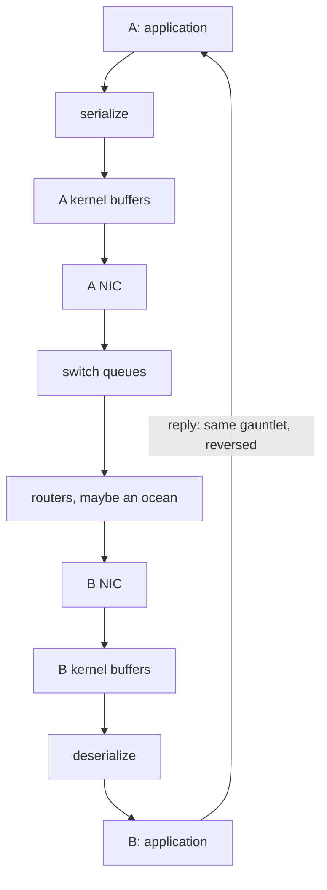
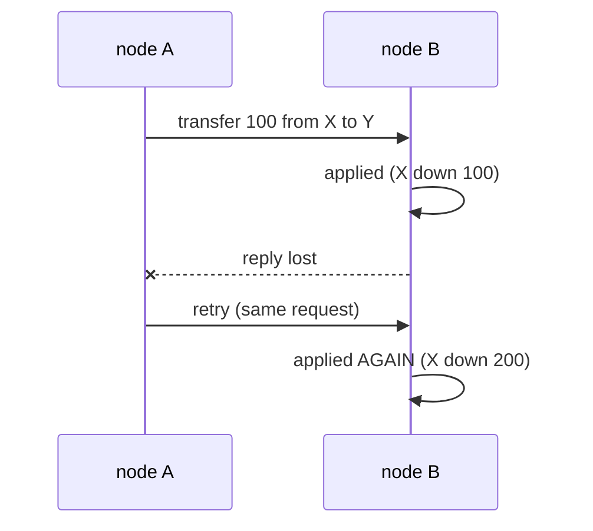
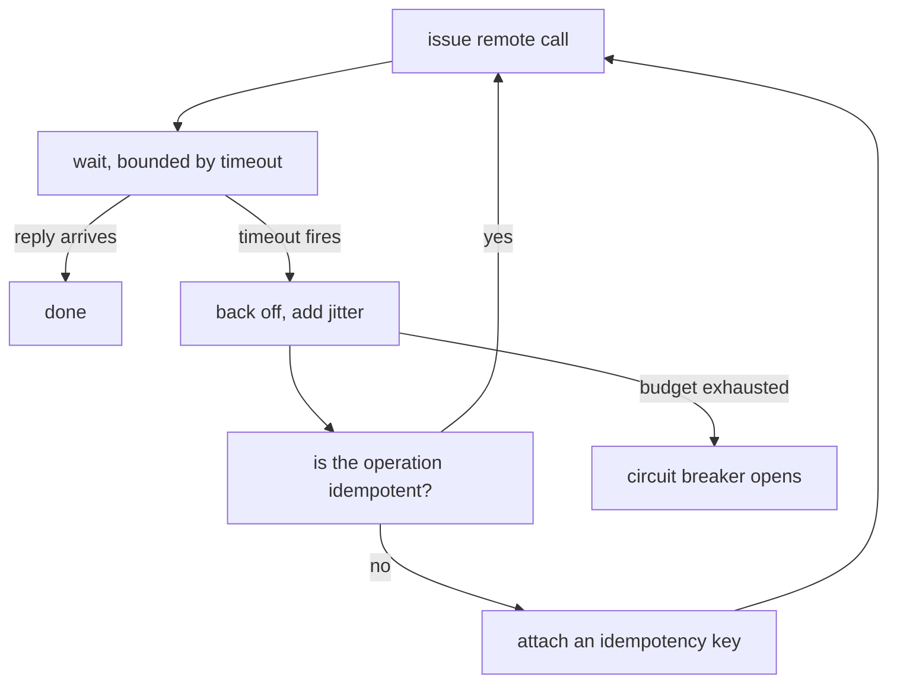

# The Network Is Hostile

> **Goal of this chapter:** understand what actually happens when one node
> talks to another — the latencies involved, the ways messages fail, and the
> three tools every practitioner must master: timeouts, retries and
> idempotency. This chapter is the foundation for everything that follows.

A distributed system is nodes plus messages. [What Is a Distributed
System?](#/what-is-a-distributed-system) covered nodes; now the messages —
and in particular the first two fallacies that chapter listed, which between
them cause more outages than the other six combined. The network is where
the optimism of fresh designs goes to die, so we'll study it with the
respect it deserves.

## A message's life is more fragile than it looks

When node A sends a message to node B, here is the gauntlet it runs — and
the reply runs the same one back:



Ten hops each way, none of which your code can see. At every one of them,
things can go wrong:

- **Loss** — a queue overflows, a link flaps, a packet is dropped.
- **Delay** — congestion, a slow garbage-collection pause on B, a router
  rerouting around a failure. Delay has *no upper bound* in practice.
- **Reordering** — two messages take different routes; the second sent
  arrives first.
- **Duplication** — retransmission logic (yours or TCP's) delivers a message
  twice.

"But TCP fixes this!" — partially. Within one connection, TCP gives you
in-order, non-duplicated delivery *of what arrives* — the sequencing,
retransmission and reordering machinery that [The Networking
Stack](../#/networking) and [TCP Congestion Control &
Tuning](../#/tcp-congestion) take apart hop by hop. It does not save you
when the connection breaks: you still don't know which of your in-flight
requests were processed. And the moment you retry on a *new* connection, you
can create duplicates at the application level. TCP narrows the problem; it
doesn't remove it.

## Latency: the numbers you must know by heart

Latency is the time for a message to make the round trip. These orders of
magnitude should be reflexes — the top rows are the machine-local numbers
from [The Machine Underneath](../#/prereq-hardware), and everything below
them is what the wire adds:

| Operation | Typical latency |
|---|---|
| L1 cache reference | ~1 ns |
| Main memory reference | ~100 ns |
| SSD random read | ~100 µs |
| Round trip inside one datacenter | ~0.5 ms |
| Round trip same continent | ~10–40 ms |
| Round trip across an ocean | ~80–150 ms |

Two consequences worth internalizing:

**1. A remote call is never "just a function call".** Calling a function in
memory: nanoseconds. Calling a service in the same datacenter: half a
millisecond — roughly **a million times slower**. Architectures that treat
remote calls as free (the classic "chatty" microservice making 50 sequential
calls per request) collapse under their own latency: 50 × 0.5 ms = 25 ms of
pure network time, before any work is done.

**2. Latency compounds at the tail.** If one call has a 99th-percentile
latency of 100 ms, a request that fans out to 100 such calls in parallel will
hit that 1% slow case almost every time (1 − 0.99¹⁰⁰ ≈ 63%). At scale, *your
users live at the tail*. This is why serious systems obsess over p99 and
p999, not averages. The reasoning travels intact into other fields:
[Operating It](../inference/#/operating-it) in the inference course opens by
saying tail-at-scale carries over verbatim to GPU fleets, and that what
*doesn't* carry over is utilisation as a load signal.

> **Latency vs bandwidth:** latency is how long one message takes; bandwidth
> is how many bytes per second you can push. You can buy more bandwidth.
> You cannot buy lower latency past a point — the speed of light is a hard
> floor. Designs that conflate the two (e.g. "the link is 10 Gb/s, so calls
> are fast") confuse a highway's width with its length.

## The fundamental ambiguity: no reply

Node A sends a request, and... nothing comes back. Exactly one of these
happened:

1. The request was lost before reaching B.
2. B crashed before processing it.
3. B processed it, then crashed before replying.
4. B processed it and replied, but the reply was lost.
5. Everything worked — it's just *slow*, and the answer is still coming.

**A cannot distinguish these cases.** This is not a technology gap that a
better protocol will fix; it is a logical impossibility. With one mechanism —
messages — you cannot tell "dead", "unreachable" and "slow" apart.

Notice what differs between the cases: in (1) and (2) the request had **no
effect** on B; in (3) and (4) it had **full effect**. Whatever A decides to
do next must be correct in *both* worlds. That single sentence generates
half the patterns in this field.

## Tool 1: timeouts

Since you can't wait forever, every remote call needs a **timeout**: a
maximum time after which you give up and treat the call as failed.

Choosing the value is an art with real consequences:

- **Too short:** you declare healthy-but-slow nodes dead, abandon requests
  that were about to succeed, and pile retries onto an already-struggling
  system (a classic way to turn a slowdown into an outage).
- **Too long:** users stare at spinners, threads and connections pile up
  waiting, and failures take ages to detect.

Good practice: derive timeouts from the *observed* latency distribution
(e.g. a multiple of p99), not from a number that felt nice. And make
timeouts shorter at the edges, longer in the core, so the system sheds load
at the boundary instead of clogging internally.

## Tool 2: retries — and the trouble they cause

A timeout fired. Now what? Usually: try again. But remember the ambiguity —
the original request may have been processed. Retrying then means
**executing it twice**.

For some operations that's fine. `GET /balance` twice — harmless. But:



A did everything right — waited, timed out, retried — and X is still down
€200. Correct retry logic plus a lost reply is enough to corrupt money.

Retries also have a macro-level danger: **retry storms**. A service slows
down → callers time out → callers retry → load doubles → service slows
further → more timeouts → more retries. The mitigation toolkit:

- **Exponential backoff:** wait 1s, 2s, 4s, 8s… between attempts, so retries
  spread out instead of hammering.
- **Jitter:** add randomness to backoff, so thousands of clients don't retry
  in synchronized waves.
- **Retry budgets / circuit breakers:** cap the fraction of traffic that can
  be retries; after enough failures, stop calling the sick service entirely
  for a cooling-off period.

## Tool 3: idempotency — the cure for duplicates

An operation is **idempotent** if performing it twice has the same effect as
performing it once. Idempotent operations can be retried *safely*, which
dissolves the duplicate problem.

Some operations are naturally idempotent:

- `x = 5` (set to an absolute value) — idempotent.
- `x = x + 1` (relative change) — **not** idempotent.
- "delete row 42" — idempotent (deleting twice = deleting once).
- "append row" — not idempotent.

Non-idempotent operations can be *made* idempotent with an **idempotency
key**: the client attaches a unique ID to the logical operation, and the
server remembers which IDs it has already executed:

```http
POST /transfers
Idempotency-Key: 7f9c2ba4-e1...

{ "from": "X", "to": "Y", "amount": 100 }
```

If the server sees a key it has already processed, it returns the stored
result of the first execution instead of executing again. The retry becomes
harmless. (Stripe's payment API made this pattern famous; it's now
everywhere.)

> The triad to memorize: **timeout** (decide when to give up) → **retry with
> backoff and jitter** (recover from transient failures) → **idempotency**
> (make retries safe). Most production-grade client libraries are
> implementations of exactly this triad.

Read the triad as one control loop, and notice where the arrow refuses to
close: a non-idempotent call cannot be retried until you have given it a
key.



## RPC: the convenient, leaky abstraction

Most systems wrap messaging in **RPC** (Remote Procedure Call): you call
`inventory.reserve(item, qty)` and a framework (gRPC, Thrift…) serializes
the arguments, sends them, and unmarshals the reply — so the remote call
*looks* like a local one.

Use RPC, but never forget what it hides. A local call cannot time out,
arrive twice, or leave you not knowing whether it ran. A remote one can do
all three. The 1994 paper *"A Note on Distributed Computing"* made the
case that papering over this difference is dangerous, and thirty years of
production incidents agree. Modern frameworks have mostly accepted this:
they surface deadlines, retries and status codes explicitly instead of
pretending the network isn't there.

The main alternative style is **asynchronous messaging**: instead of calling
B directly, A drops a message on a **queue** (Kafka, RabbitMQ, SQS) and
moves on; B consumes it whenever it can. You lose the immediate answer, but
gain decoupling: B can be down for ten minutes and nothing is lost — the
queue holds the messages. [Distributed
Transactions](#/distributed-transactions) revisits this trade-off, where
queues become a building block for reliability patterns — and where the
"no reply" ambiguity above resurfaces as the reason exactly-once delivery
cannot exist.

## Key takeaways

- Messages can be **lost, delayed (unboundedly), reordered and duplicated**.
  TCP narrows this inside one connection; it doesn't eliminate it.
- Know the latency ladder: memory ≈ 100 ns, same datacenter ≈ 0.5 ms,
  cross-ocean ≈ 100 ms. A remote call is ~10⁶× a local one. Tail latency
  (p99) is what your users actually feel.
- No reply is **fundamentally ambiguous**: the operation may have fully
  happened or not at all, and the caller cannot know.
- The survival triad: **timeouts** sized from real latency data, **retries**
  with exponential backoff + jitter (plus circuit breakers), and
  **idempotency** — naturally or via idempotency keys.
- RPC is convenient but leaky; queues trade immediacy for decoupling. Choose
  consciously.

```quiz
[
  {
    "q": "Your request to a remote service timed out. Which statement is true?",
    "choices": [
      "The operation definitely did not execute, so you can retry freely",
      "The operation definitely executed, so retrying would duplicate it",
      "The operation may or may not have executed — you cannot know",
      "TCP guarantees the operation executed exactly once"
    ],
    "answer": 2,
    "explain": "A timeout tells you only that no reply arrived in time. The request may have been lost (no effect) or processed with the reply lost (full effect). Any correct retry strategy must handle both worlds — which is why idempotency matters."
  },
  {
    "q": "Why is 'x = x + 1' dangerous to retry, while 'x = 5' is safe?",
    "choices": [
      "Addition is slower than assignment",
      "x = 5 is idempotent: applying it twice gives the same result as once",
      "x = x + 1 cannot be serialized over a network",
      "x = 5 is atomic while x = x + 1 is not"
    ],
    "answer": 1,
    "explain": "Idempotency is the property that makes retries safe. Setting an absolute value twice is the same as once; incrementing twice doubles the effect. Non-idempotent operations need an idempotency key to be retried safely."
  },
  {
    "q": "A service is slowing down under load. Its 1,000 clients all use a fixed 1-second timeout and retry immediately on failure. What happens next?",
    "choices": [
      "The system self-heals as failed requests are simply replayed",
      "A retry storm: timeouts trigger synchronized retries, multiplying load on the struggling service",
      "Clients automatically spread their retries out over time",
      "Nothing — retries don't add load because the originals failed"
    ],
    "answer": 1,
    "explain": "Immediate, synchronized retries multiply traffic exactly when the service can least afford it, often converting a slowdown into a full outage. The fixes: exponential backoff, jitter, retry budgets and circuit breakers."
  },
  {
    "q": "What is the key difference between latency and bandwidth?",
    "choices": [
      "They are two names for the same measurement",
      "Latency is how long one message takes; bandwidth is how much data per second can flow — and only bandwidth can be bought",
      "Bandwidth matters only on Wi-Fi networks",
      "Latency only matters for large payloads"
    ],
    "answer": 1,
    "explain": "You can add more or faster links to get bandwidth, but round-trip latency has a hard floor set by the speed of light. Many design mistakes come from assuming a 'fast' (high-bandwidth) link means fast (low-latency) calls."
  }
]
```
