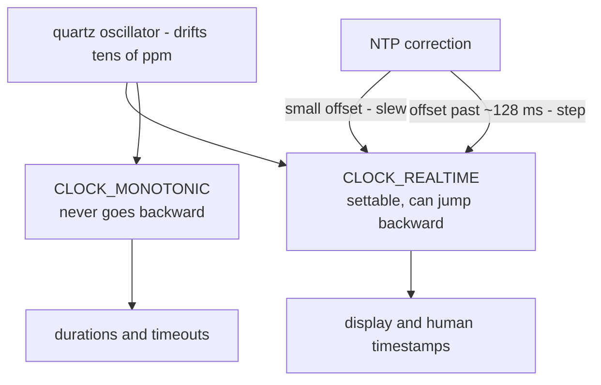
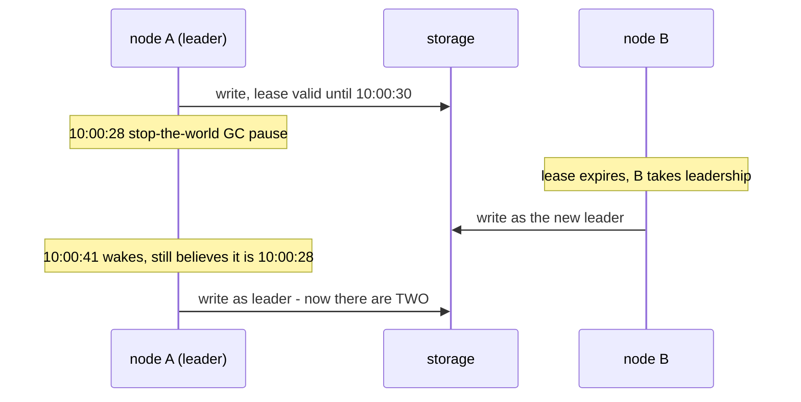

# Time, Clocks & Why They Lie

> **Goal of this chapter:** understand why "just look at the timestamp" is
> one of the most dangerous sentences in distributed systems. We'll cover how
> physical clocks actually work, how far they drift, what NTP can and cannot
> fix, the crucial difference between wall and monotonic clocks, and what
> happens when engineers trust clocks too much.

On one machine, time feels trustworthy: ask the kernel, get a number, numbers
go up. Across machines, time is a polite fiction. Each node has its own
clock, and **no two clocks agree** — the only questions are *by how much* and
*whether your design survives it*.

## How a computer keeps time

Inside every machine is a **quartz crystal oscillator** ticking at a nominal
frequency. The OS counts ticks to maintain two distinct clocks:

- the **wall clock** (`CLOCK_REALTIME`): "what time is it" — seconds since
  the Unix epoch. It can be **set**, forward or *backward*, by admins or
  sync daemons.
- the **monotonic clock** (`CLOCK_MONOTONIC`): a counter since boot that
  **never goes backward**. Meaningless across machines, perfect for
  measuring durations on one machine.

Two clocks, one crystal, and only one of them is safe for arithmetic:



How the kernel actually counts those ticks — jiffies, hrtimers, the tickless
idle path and the two clock IDs above — is [Timers & Time](../#/timers) in
the Linux course; everything below assumes you accept that the number it
hands you is local and imperfect.

Quartz is cheap and imperfect: typical **drift** is in the tens of parts per
million — tens of microseconds gained or lost per second, up to a couple of
seconds per day. Temperature changes make it worse. Left alone for a month, a
server's clock can wander off by a minute.

## NTP: herding the clocks

The **Network Time Protocol** keeps clocks roughly aligned by querying time
servers and estimating the offset — cleverly subtracting network round-trip
time from the measurement. Two correction modes matter:

- **Slewing:** for small offsets, NTP doesn't jump the clock; it makes it
  run slightly fast or slow until aligned. Time stays continuous.
- **Stepping:** past a threshold (~128 ms), NTP **jumps** the clock —
  including *backward*. Your wall clock can legally read 10:00:05 and then
  10:00:03.

What accuracy to expect: a few milliseconds on a good LAN; tens of
milliseconds over the internet; much worse during congestion, after reboots,
or on overloaded VMs. Cloud providers offer better options (dedicated time
services, GPS/atomic-backed, with PTP reaching microseconds) — but "better"
is still "not perfect", and **you rarely know how wrong a given clock is
right now**.

> The two-sentence summary of physical timekeeping: every clock is always
> wrong; NTP keeps it *less* wrong, with occasional backward jumps as part
> of the service.

## Bug class #1: using the wall clock for durations

```js
const start = Date.now();          // wall clock!
doSomething();
const elapsed = Date.now() - start; // can be NEGATIVE
```

If NTP steps the clock backward between the two reads, `elapsed` is negative
— or hugely inflated if it steps forward. Real incidents have come from
exactly this: timers firing instantly or never, TTLs computed as negative,
rate limiters releasing floods.

**Rule: durations and timeouts use the monotonic clock; the wall clock is
only for displaying time to humans and stamping events for humans.**
(`System.nanoTime()` in Java, `time.monotonic()` in Python,
`clock_gettime(CLOCK_MONOTONIC)` in C.)

A related trap at the system level: **leap seconds**, where UTC occasionally
gains a 61st second. Naive handling (repeating a second) has crashed major
sites; the now-standard fix, *leap smearing*, spreads the extra second over
many hours of slightly-slow ticking.

## Bug class #2: ordering events across machines by timestamp

This one is subtler and more damaging. Suppose two clients write to two
replicas, and replicas resolve conflicts with **last-write-wins (LWW)** by
comparing timestamps — the default conflict rule in multi-leader and
leaderless [replication](#/replication), and a legitimate
[CRDT](#/crdts-and-gossip) besides. The aligned columns below are the whole
argument: real order on the left, believed order on the right.

```text
  real order of events          what the timestamps say
  ─────────────────────         ───────────────────────
  10:00:00.000  client 1        node A stamps it 10:00:00.030
                writes x=1                    (clock 30ms fast)
  10:00:00.020  client 2        node B stamps it 10:00:00.015
                writes x=2                    (clock 5ms slow)

  x=2 happened LATER…           …but x=1 has the bigger timestamp.
                                LWW keeps x=1. The newer write
                                is silently discarded. Forever.
```

With clocks skewed by a few tens of milliseconds — entirely normal — any two
events closer together than the skew can be ordered *wrong*. No error is
raised; data just quietly loses.

The general principle: **a timestamp from another machine tells you what
that machine's clock read, not when the event happened relative to yours.**
Comparing timestamps from different machines as if they shared a clock is
the root bug; LWW is just its most famous victim.

## Bug class #3: trusting the clock for exclusivity

From [Failure Models & Detection](#/failure-models), recall **leases**: "I
am the leader until 10:00:30." A lease is a *clock-based* promise, and it
inherits every clock problem — plus one more: **pauses**. Watch the
timeline; nothing here is a bug in anyone's code:



A process cannot feel time passing while paused (GC, VM migration, swap,
SIGSTOP). Checking the clock *before* an operation doesn't help — the pause
can land between the check and the act. This is precisely why [Failure
Models & Detection](#/failure-models) introduced **fencing tokens**: the
storage layer rejects the stale leader's writes by token number, with no
clock involved. Safety must come from something other than the clock — and
[Raft](#/raft) will make that token, its *term*, a mandatory field on every
single message.

## Doing it right: bounded uncertainty (Spanner's TrueTime)

If clocks are always somewhat wrong, one honest path remains: **know your
maximum error**. Google's Spanner equips datacenters with GPS receivers and
atomic clocks, and its **TrueTime** API returns not a timestamp but an
**interval**: `[earliest, latest]` guaranteed to contain the true time
(typically a few milliseconds wide).

The elegant trick: to claim event 1 happened before event 2, Spanner ensures
their intervals don't overlap — when needed, it simply **waits out the
uncertainty** (if the interval is 7 ms wide, wait 7 ms) before committing.
The clock error doesn't vanish; it becomes a *known, bounded* quantity you
can engineer around. [Real-World Architectures](#/real-world-architectures)
shows the full picture, TrueTime sitting under Spanner's 2PC.

The other path — used by most systems, which lack atomic clocks — is to
stop relying on physical time for ordering altogether and derive order from
**causality**: which events *could have influenced* which. That is [Logical
& Vector Clocks](#/logical-clocks), next.

## Key takeaways

- Every machine's clock drifts; NTP reduces the error to milliseconds-ish
  and sometimes **steps clocks backward**. You never know the current error
  precisely.
- **Wall clock for humans, monotonic clock for durations.** Negative
  elapsed time is a bug you create, not a cosmic ray.
- Never order cross-machine events by timestamp: skew silently reorders
  close events, and **last-write-wins silently drops data** when it
  happens.
- Clock-based exclusivity (leases) breaks under pauses; pair it with
  **fencing tokens** so safety never rests on a clock.
- The two principled escapes: **bounded uncertainty** (TrueTime: wait out
  the error) or **logical time** (order by causality — next chapter).

```quiz
[
  {
    "q": "Why must durations (e.g. 'how long did this request take?') be measured with the monotonic clock?",
    "choices": [
      "The monotonic clock has higher resolution",
      "The wall clock can be stepped backward or forward by NTP, making elapsed-time calculations wrong or even negative",
      "The wall clock is too slow to read in a hot path",
      "Monotonic clocks are synchronized across machines"
    ],
    "answer": 1,
    "explain": "NTP corrections (and admins) can jump the wall clock in either direction. The monotonic clock never goes backward — though it's only meaningful within a single machine."
  },
  {
    "q": "Two replicas use last-write-wins based on wall-clock timestamps. Node A's clock runs 30 ms fast. What can happen?",
    "choices": [
      "Nothing — NTP guarantees ordering is preserved",
      "Writes will be rejected until the clocks resynchronize",
      "A genuinely older write stamped by A can beat a genuinely newer write stamped elsewhere, silently discarding the newer data",
      "The replicas will detect the skew and raise an error"
    ],
    "answer": 2,
    "explain": "Any two events closer together than the clock skew can be ordered incorrectly, and LWW resolves that misordering by silently deleting the true latest write. No error is ever raised."
  },
  {
    "q": "A leader holds a lease valid until 10:00:30 and checks the clock before every write. Why is it still unsafe?",
    "choices": [
      "Because lease timestamps overflow at midnight",
      "A process pause (GC, VM migration) can land between the clock check and the write, so the write executes after the lease expired",
      "Because NTP forbids leases shorter than one minute",
      "It is safe — checking the clock prevents the problem"
    ],
    "answer": 1,
    "explain": "A paused process can't feel time passing; it wakes believing its lease is still valid. That's why exclusive access needs fencing tokens checked by the resource itself, not clock checks by the client."
  },
  {
    "q": "What does Spanner's TrueTime API return, and why?",
    "choices": [
      "A perfectly accurate timestamp from atomic clocks",
      "An interval [earliest, latest] guaranteed to contain the true time, so the system can wait out the uncertainty when ordering matters",
      "A vector clock encoding causality",
      "The NTP server's best estimate, rounded to the second"
    ],
    "answer": 1,
    "explain": "Even GPS and atomic clocks have uncertainty. TrueTime makes the error explicit and bounded; Spanner waits out the interval before committing, turning imperfect clocks into a usable ordering primitive."
  }
]
```
